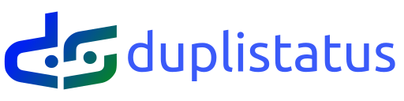
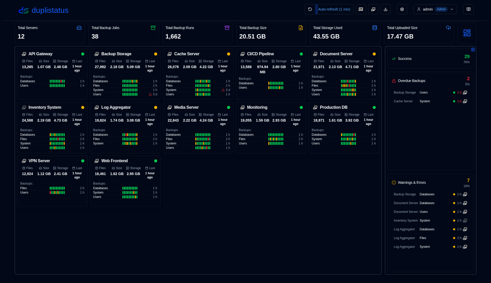
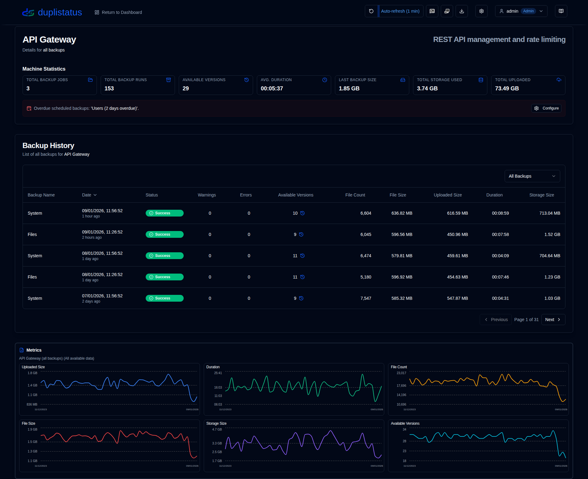
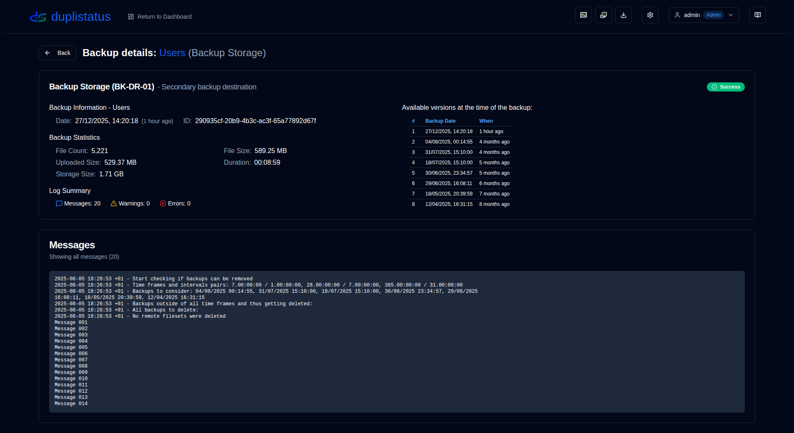

# **duplistatus** - Another [Duplicati](https://github.com/duplicati/duplicati) Dashboard

 

This web application monitors and visualises backup operations from [Duplicati](https://github.com/duplicati/duplicati). **duplistatus** provides a comprehensive dashboard to track backup statuses, execution, metrics, and performance across multiple servers.

It also provides API endpoints that can be integrated with third-party tools such as [Homepage](https://gethomepage.dev/).

 

<!-- START doctoc generated TOC please keep comment here to allow auto update -->
<!-- DON'T EDIT THIS SECTION, INSTEAD RE-RUN doctoc TO UPDATE -->
**Table of Contents**

- [Features](#features)
- [Installation](#installation)
- [Duplicati Servers Configuration (Required)](#duplicati-servers-configuration-required)
- [User Guide](#user-guide)
- [Screenshots](#screenshots)
  - [Dashboard](#dashboard)
  - [Backup History](#backup-history)
  - [Backup Details](#backup-details)
  - [Overdue Backups](#overdue-backups)
  - [Overdue notifications on your phone](#overdue-notifications-on-your-phone)
- [API Reference](#api-reference)
- [Development](#development)
- [Credits](#credits)
- [Migration Information](#migration-information)
- [License](#license)

<!-- END doctoc generated TOC please keep comment here to allow auto update -->

 

## Features

- **Quick Setup**: Simple containerised deployment, with images available on Docker Hub and GitHub.
- **Unified Dashboard**: View backup status, history, and details for all servers in one place.
- **Overdue Monitoring**: Automated checking and alerting for overdue scheduled backups.
- **Data Visualisation & Logs**: Interactive charts and automatic log collection from Duplicati servers.
- **Notifications & Alerts**: Integrated NTFY and SMTP email support for backup alerts, including overdue backup notifications.
- **User Access Control & Security**: Secure authentication system with role-based access control (Admin/User roles), password policies, account lockout protection, and comprehensive user management.
- **Audit Logging**: Complete audit trail of all system changes and user actions with advanced filtering, export capabilities, and configurable retention periods.

## Installation

The application can be deployed using Docker, Portainer Stacks, or Podman. 
See details in the [Installation Guide](https://wsj-br.github.io/duplistatus/installation).

- If you are upgrading from an earlier version, your database will be automatically 
[migrated](https://wsj-br.github.io/duplistatus/migration/version_upgrade) to the new schema during the upgrade process.

- When using Podman (either as a standalone container or within a pod), and if you require custom DNS settings 
(such as for Tailscale MagicDNS, corporate networks, or other custom DNS configurations), you can manually 
specify DNS servers and search domains. See the installation guide for further details.

## Duplicati Servers Configuration (Required)

Once your **duplistatus** server is up and running, you need to configure your **Duplicati** servers to 
send backup logs to **duplistatus**, as outlined in the [Duplicati Configuration](https://wsj-br.github.io/duplistatus/installation/duplicati-server-configuration) 
section of the Installation Guide. Without this configuration, the dashboard will not receive backup data from your Duplicati servers.

## User Guide

See the [User Guide](https://wsj-br.github.io/duplistatus/user-guide/overview) for detailed instructions on how to configure and use **duplistatus**, including initial setup, feature configuration, and troubleshooting.

## Screenshots

### Dashboard

### Backup History

### Backup Details

### Overdue Backups

### Overdue notifications on your phone

## API Reference

See the [API Endpoints Documentation](https://wsj-br.github.io/duplistatus/api-reference/overview) for details about available endpoints, request/response formats, and examples.

## Development

For instructions on downloading, changing, or running the code, see [Development Setup](https://wsj-br.github.io/duplistatus/development/setup).

This project was mainly built with AI help. To learn how, see [How I Built this Application using AI tools](https://wsj-br.github.io/duplistatus/development/how-i-build-with-ai).

## Credits

- First and foremost, thanks to Kenneth Skovhede for creating Duplicati—this amazing backup tool. Thanks also to all the contributors.

  💙 If you find [Duplicati](https://www.duplicati.com) useful, please consider supporting the developer. More details are available on their website or GitHub page.

- Duplicati SVG icon from https://dashboardicons.com/icons/duplicati
- Notify SVG icon from https://dashboardicons.com/icons/ntfy
- GitHub SVG icon from https://github.com/logos

>[!NOTE]
> All product names, trademarks, and registered trademarks are the property of their respective owners. Icons and names are used for identification purposes only and do not imply endorsement.

 

## Migration Information

If you are upgrading from an earlier version, your database will be automatically migrated to the new schema during the upgrade process.

For detailed migration information, including migration steps, monitoring, and rollback procedures, please refer to the [Migration Documentation](https://wsj-br.github.io/duplistatus/migration/version_upgrade) in the Docusaurus documentation.

 

## License

The project is licensed under the [Apache License 2.0](https://wsj-br.github.io/duplistatus/LICENSE).   

**Copyright © 2025 Waldemar Scudeller Jr.**

