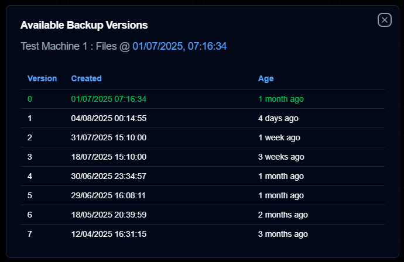
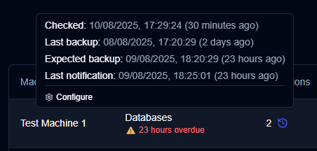

# **duplistatus** - Another [Duplicati](https://github.com/duplicati/duplicati) Dashboard


<br>


This web application monitors and visualizes backup operations from [Duplicati](https://github.com/duplicati/duplicati). **duplistatus** provides a comprehensive dashboard to track backup statuses, metrics, and performance across multiple machines. It also provides API endpoints that can be integrated with third-party tools such as [Homepage](https://gethomepage.dev/).

<br>

## Table of Contents

- [Features](#features)
- [Screenshots](#screenshots)
  - [Dashboard](#dashboard)
  - [Backup History](#backup-history)
  - [Backup Details](#backup-details)
  - [Available Backup Versions](#available-backup-versions)
  - [Overdue Backups](#overdue-backups)
- [Installation](#installation)
- [Duplicati Servers Configuration (Required)](#duplicati-servers-configuration-required)
- [User Guide](#user-guide)
- [API Reference](#api-reference)
- [Development](#development)
- [Migrating to Version 0.6.0](#migrating-to-version-060)
  - [The Migration Process](#the-migration-process)
  - [How to Monitor](#how-to-monitor)
  - [If You Need to Roll Back](#if-you-need-to-roll-back)
- [License](#license)

## Features

- **Easy Installation**: Run inside a container with images available on Docker Hub and GitHub Container Registry
- **Dashboard**: This displays the backup status for all monitored machines.
- **Backup history**: Detailed view of backup history for each machine
- **Data Visualization**: Interactive charts showing backup metrics over time and other statistical information.
- **Log Collection**: Collect backup logs directly from Duplicati servers via HTTP/HTTPS
- **Notification System**: [ntfy](https://github.com/binwiederhier/ntfy) integration for backup notifications and overdue backup alerts (NEW)
- **Overdue Backup Monitoring**: Automated checking and alerting for overdue scheduled backups (NEW)
- **Backup Version Display**: Show the list of backup versions available in the backend (NEW)
- **API Access**: RESTful API endpoints to expose backup status to [Homepage](https://gethomepage.dev/) or any other tool that supports RESTful APIs

<br>


>[!IMPORTANT]
> If you are upgrading from version 0.5.0 or earlier, your database will be automatically 
> [migrated](#migrating-to-version-060) to the new schema during the upgrade process.

<br>

## Screenshots

### Dashboard


### Backup History


### Backup Details


### Available Backup Versions




### Overdue Backups



<br>


## Installation

The application can be deployed using Docker, [Portainer Stacks](https://docs.portainer.io/user/docker/stacks), or Podman. See details in the [Installation Guide](INSTALL.md).

<br>

## Duplicati Servers Configuration (Required)

Once your **duplistatus** server is up and running, you must configure your **Duplicati** servers to send backup logs to **duplistatus**, as outlined in the [Duplicati Configuration](INSTALL.md#duplicati-configuration-required) section of the Installation Guide. Without this configuration, the dashboard will not function properly.

<br>

## User Guide

See the [User Guide](USER-GUIDE.md) for detailed instructions on how to configure and use **duplistatus**, including setup, features, and troubleshooting.

<br>

## API Reference

For detailed information about all available API endpoints, request/response formats, and integration examples, please refer to the [API Endpoints Documentation](API-ENDPOINTS.md).

<br>

## Development

Detailed instructions on how to download the source code, make changes, debug, and run in development mode can be found in the [DEVELOPMENT.md](DEVELOPMENT.md) file.
This application was developed almost entirely using AI tools. The step-by-step process and tools used are described in [HOW-I-BUILD-WITH-AI.md](docs/HOW-I-BUILD-WITH-AI.md).

<br>


## Migrating to Version 0.6.0

Your database will automatically be updated when you start the new version. The process is safe, and your data will be preserved.

<br>

### The Migration Process

The system performs these steps automatically:

  - **Creates a backup** of your existing database. The backup file is named `duplistatus-backup-YYYY-MM-DDTHH-MM-SS.db`.
  - **Runs the migration**, which adds new columns to the `backups` table, a `configurations` table for settings, and a table to track the database version.
  - **Keeps all your existing data** while enhancing the database structure.

<br>

### How to Monitor

Check the Docker logs for progress by running:

```bash
docker logs <container-name>
```

Look for these messages to confirm a successful migration:

  - `"Found 1 pending migrations"`
  - `"Running consolidated migration 2.0..."`
  - `"Migration 2.0 completed successfully"`
  - `"Database backup created: /path/to/backups-copy-YYYY-MM-DDTHH-MM-SS.db"`
  - `All migrations completed successfully`


<br>

### If You Need to Roll Back

In the rare event of an issue, you can restore your database by following these steps:

1.  Stop the `duplistatus` container.
2.  Replace the current database file with the backup file. 
    - usual location is `/var/lib/docker/volumes/duplistatus_data/_data/`
    - check your current configuration and installation to the correct path.
3.  Restart the container.

<br>

## License

**Copyright © 2025 Waldemar Scudeller Jr.**

The project is licensed under the [Apache License 2.0](LICENSE). 

