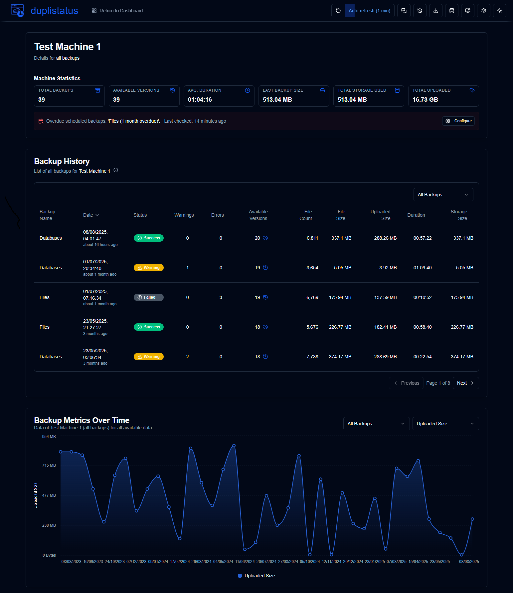
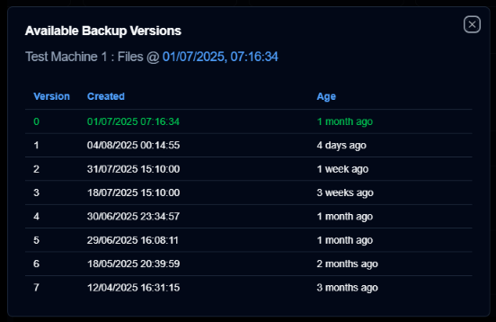

# **duplistatus** - Another [Duplicati](https://github.com/duplicati/duplicati) Dashboard


<br>


This web application monitors and visualizes backup operations from [Duplicati](https://github.com/duplicati/duplicati). **duplistatus** provides a comprehensive dashboard to track backup statuses, metrics, and performance across multiple servers. It also provides API endpoints that can be integrated with third-party tools such as [Homepage](https://gethomepage.dev/).

<br>

<!-- START doctoc generated TOC please keep comment here to allow auto update -->
<!-- DON'T EDIT THIS SECTION, INSTEAD RE-RUN doctoc TO UPDATE -->
**Table of Contents**

- [Features](#features)
- [Screenshots](#screenshots)
  - [Dashboard](#dashboard)
  - [Backup History](#backup-history)
  - [Backup Details](#backup-details)
  - [Available Backup Versions](#available-backup-versions)
  - [Overdue Backups](#overdue-backups)
- [Installation](#installation)
- [Duplicati Servers Configuration (Required)](#duplicati-servers-configuration-required)
- [User Guide](#user-guide)
- [API Reference](#api-reference)
- [Development](#development)
- [Migrating to Version 0.7.x](#migrating-to-version-07x)
  - [The Migration Process](#the-migration-process)
  - [Monitoring the Migration](#monitoring-the-migration)
  - [Rolling Back (If Needed)](#rolling-back-if-needed)
- [Credits](#credits)
- [License](#license)

<!-- END doctoc generated TOC please keep comment here to allow auto update -->

<br>

## Features

- **Easy Installation**: Run inside a container with images available on Docker Hub and GitHub Container Registry
- **Dashboard**: This displays the backup status for all monitored servers.
- **Backup history**: Detailed view of backup history for each server
- **Data Visualization**: Interactive charts showing backup metrics over time and other statistical information.
- **Log Collection**: Collect backup logs directly from Duplicati servers via HTTP/HTTPS
- **Notification System**: [ntfy](https://github.com/binwiederhier/ntfy) integration for backup notifications and overdue backup alerts (NEW)
- **Overdue Backup Monitoring**: Automated checking and alerting for overdue scheduled backups (NEW)
- **Backup Version Display**: Show the list of backup versions available in the backend (NEW)
- **API Access**: RESTful API endpoints to expose backup status to [Homepage](https://gethomepage.dev/) or any other tool that supports RESTful APIs

<br>


>[!IMPORTANT]
> If you are upgrading from version 0.5.0 or earlier, your database will be automatically 
> [migrated](#migrating-to-version-061) to the new schema during the upgrade process.

<br>

## Screenshots

### Dashboard


### Backup History



### Backup Details


### Available Backup Versions




### Overdue Backups


<br>


## Installation

The application can be deployed using Docker, [Portainer Stacks](https://docs.portainer.io/user/docker/stacks), or Podman. 
See details in the [Installation Guide](docs/INSTALL.md).

<br>

## Duplicati Servers Configuration (Required)

Once your **duplistatus** server is up and running, you must configure your **Duplicati** servers to 
send backup logs to **duplistatus**, as outlined in the [Duplicati Configuration](docs/INSTALL.md#duplicati-configuration-required) 
section of the Installation Guide. Without this configuration, the dashboard will not function properly.

<br>

## User Guide

See the [User Guide](docs/USER-GUIDE.md) for detailed instructions on how to configure and use **duplistatus**, including setup, features, and troubleshooting.

<br>

## API Reference

For detailed information about all available API endpoints, request/response formats, and integration examples, please refer to the [API Endpoints Documentation](docs/API-ENDPOINTS.md).

<br>

## Development

Detailed instructions on how to download the source code, make changes, debug, and run in development mode can be found in the [DEVELOPMENT.md](docs/DEVELOPMENT.md) file.
This application was developed almost entirely using AI tools. The step-by-step process and tools used are described in [HOW-I-BUILD-WITH-AI.md](docs/HOW-I-BUILD-WITH-AI.md).

<br>


## Migrating to Version 0.7.x

Your database will automatically update when you start the new version. This process is safe and preserves all your existing data.

<br>

### The Migration Process

The system automatically performs the following steps:

- **Creates a backup** of your current database. The backup file is named `duplistatus-backup-YYYY-MM-DDTHH-MM-SS.db`.
- **Runs the migration**, which adds new columns to the `backups` table, creates a `configurations` table for settings, and adds a table to track the database version.
- **Preserves all your existing data** while improving the database structure.

<br>

### Monitoring the Migration

To monitor progress, check the Docker logs by running:

```bash
docker logs <container-name>
```

Look for these messages to confirm a successful migration:

- `"Found X pending migrations"`
- `"Running consolidated migration X.0..."`
- `"Migration X.0 completed successfully"`
- `"Database backup created: /path/to/backups-copy-YYYY-MM-DDTHH-MM-SS.db"`
- `"All migrations completed successfully"`

<br>

### Rolling Back (If Needed)

If you encounter issues, you can restore your database by following these steps:

1. Stop the `duplistatus` container.
2. Replace the current database file `backups.db` with the backup file.
   - The default location is `/var/lib/docker/volumes/duplistatus_data/_data/`
   - Verify the correct path based on your current configuration and installation.
3. Install the previous version of `duplistatus` container image.
4. Restart the container.
5. Please report the issue in the [duplistatus project](https://github.com/wsj-br/duplistatus/issues) on GitHub, including the Docker logs.

<br>

## Credits

- Duplicati SVG icon from https://dashboardicons.com/icons/duplicati
- Notify SVG icon from https://dashboardicons.com/icons/ntfy
- Github SVG icon from https://github.com/logos

>[!NOTE]
> All product names, trademarks, and registered trademarks are the property of their respective owners. Icons are used for identification purposes only and do not imply endorsement.

<br>

## License

The project is licensed under the [Apache License 2.0](LICENSE).   

**Copyright © 2025 Waldemar Scudeller Jr.**

