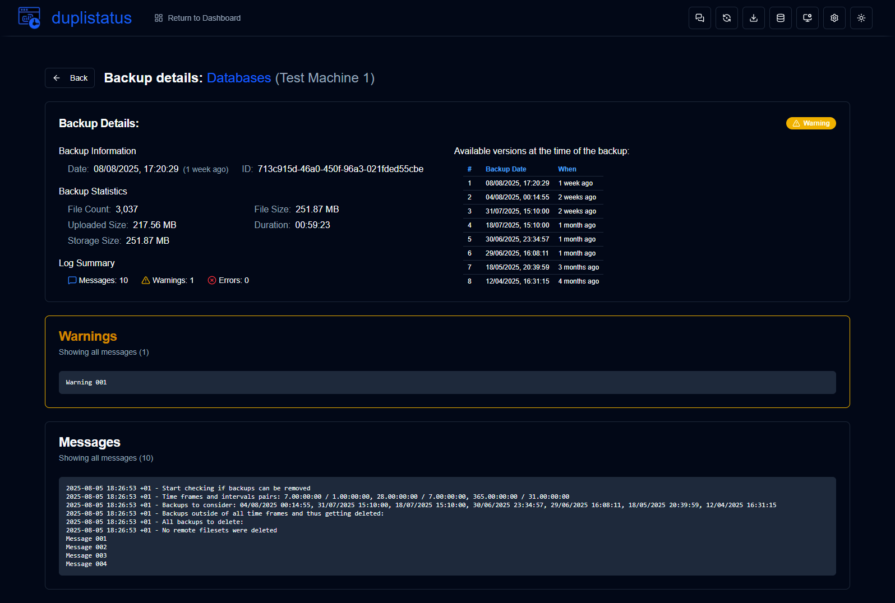

# **duplistatus** - Another [Duplicati](https://github.com/duplicati/duplicati) Dashboard

This web application is used to monitor and visualise backup operations from [Duplicati](https://github.com/duplicati/duplicati). **duplistatus** provides a comprehensive dashboard to track backup statuses, metrics, and performance across multiple machines. It also provides an API endpoint that can be integrated with third-party tools such as the [Homepage](https://gethomepage.dev/).

## Features 

- **Overview**: Real-time display of backup status for all machines
- **Machine details**: Detailed view of backup history for each machine
- **Data visualisation**: Interactive charts showing backup metrics over time
- **Collect logs**: Collect backup logs directly from the Duplicati servers (http/https).
- **Dark/light Theme**: Toggle between dark and light themes for comfortable viewing.
- **API access**: API endpoints to expose backup status to [Homepage](https://gethomepage.dev/) or any other tool that supports RESTful APIs.
- **Notification System**: Ntfy.sh integration for backup notifications and overdue backup alerts
- **Overdue Backup Monitoring**: Automated checking and alerting for overdue scheduled backups
- **Auto-refresh**: Configurable automatic refresh of dashboard and detail pages
- **Table Sorting**: Sortable tables in dashboard and detail views with persistent preferences
- **Enhanced Backup Version Display**: Improved visibility of backup versions with icons and click-to-view functionality
- **Easy to install**: Run inside a container (images in Docker Hub and GitHub Container Registry).

<br><br>

## Screenshots

### Dashboard


### Machine detail


### Backup detail


<br><br>

## Installation

The application can be deployed using Docker, [Portainer Stacks](https://docs.portainer.io/user/docker/stacks), or Podman. 


### Container images:

You can use the images from:
 - **Docker Hub**:  `wsjbr/duplistatus:latest`
 - **GitHub Container Registry**: `ghcr.io/wsj-br/duplistatus:latest`

<br>

### Option 1: Using Docker Compose

This is the recommended method for local deployments or when you want to customise the configuration. It uses a `docker compose` file to define and run the container with all its settings.

Create a file named `duplistatus.yml` with the following content:

```yaml
services:
  duplistatus:
    build:
      context: .
      dockerfile: Dockerfile
    image: wsjbr/duplistatus:latest
    container_name: duplistatus
    restart: unless-stopped
    ports:
      - "9666:9666"
    volumes:
      - duplistatus_data:/app/data
    networks:
      - duplistatus_network

networks:
  duplistatus_network:
    driver: bridge

volumes:
  duplistatus_data:
    name: duplistatus_data 
```

After creating the file, execute the `docker-compose` command to start the container in the background (`-d`):
```bash
docker-compose -f duplistatus.yml up -d
```

The application will be available at `http://localhost:9666`.

<br>

### Option 2: Using Portainer Stacks (Docker Compose)

1. Go to "Stacks" in your [Portainer](https://docs.portainer.io/user/docker/stacks) server and click "Add stack".
2. Name your stack (e.g., "duplistatus").
3. Choose "Build method" as "Web editor".
4. Copy and paste these lines below into the web editor:

```yaml
services:
  duplistatus:
    image: wsjbr/duplistatus:latest
    container_name: duplistatus
    restart: unless-stopped
    ports:
      - "9666:9666"
    volumes:
      - duplistatus_data:/app/data
    networks:
      - duplistatus_network

networks:
  duplistatus_network:
    driver: bridge

volumes:
  duplistatus_data:
    name: duplistatus_data 
```
5. Click "Deploy the stack".

<br>

### Option 3: Using Portainer Stacks (GitHub Repository)

1. In [Portainer](https://docs.portainer.io/user/docker/stacks), go to "Stacks" and click "Add stack".
2. Name your stack (e.g., "duplistatus").
3. Choose "Build method" as "Repository".
4. Enter the repository URL: <br>
`https://github.com/wsj-br/duplistatus.git`

5. In the "Compose path" field, enter: `docker-compose.yml`
6. Click "Deploy the stack".

<br>

### Option 4: Using Docker CLI

```bash
docker volume create duplistatus_data

docker run -d \
  --name duplistatus \
  -p 9666:9666 \
  -v duplistatus_data:/app/data \
  wsjbr/duplistatus:latest
```

- The application will be available at `http://localhost:9666`.
- The `duplistatus_data` volume is used for persistent storage.

<br>

### Option 5: Using Podman with Pod (CLI)

```bash
# Create a pod for the container
podman pod create --name Duplistatus --publish 9666:9666/tcp

# Create and start the container
podman create \
  --name duplistatus \
  --pod Duplistatus \
  --user root \
  -v /root/duplistatus_home/data:/app/data \
  ghcr.io/wsj-br/duplistatus:latest

# Start the pod (which starts the container)
podman pod start Duplistatus
``` 

<br>

### Option 6: Using Podman Compose (CLI)

Create the `docker-compose.yml` file as instructed in Option 1 above, and then run:

```bash
podman-compose -f docker-compose.yml up -d
``` 

<br><br>

# Duplicati Configuration


1. **Allow remote access:**  Log in to [Duplicati's UI](https://docs.duplicati.com/getting-started/set-up-a-backup-in-the-ui), select `Settings`, and allow remote access, including a list of hostnames (or use `*`). 


> [!WARNING]
>  Only enable remote access if your Duplicati server is protected by a secure network (e.g., VPN, private LAN, or firewall rules). Exposing the Duplicati interface to the public internet without proper security measures could lead to unauthorised access.


2. **Configure to send the backup results to duplistatus:** In the Duplicati configuration page, select `Settings` and in the `Default Options` section, include these options, adjusting the server name or IP address:


    | Advanced option                   | Value                                    |
    | --------------------------------- | ---------------------------------------- |
    | `send-http-url`                   | `http://my.local.server:9666/api/upload` |
    | `send-http-result-output-format`  | `Json`                                   |
    | `send-http-log-level`             | `Information`                            |
    | `send-http-max-log-lines`         | `0`                                      |


> [!TIP]
>  Click on `Edit as text` and copy the lines below, adjusting the server name or IP address.

```bash
--send-http-url=http://my.local.server:9666/api/upload
--send-http-result-output-format=Json
--send-http-log-level=Information
--send-http-max-log-lines=0
```

<br>


<br>

Important notes on the messages sent by Duplicati:
 - If you omit `--send-http-log-level`, no log messages will be sent to **duplistatus**, only the statistics. 
 - You can use `--send-http-max-log-lines` to limit the number of messages sent. 
   For example: `--send-http-max-log-lines=40` will only send the first 40 messages.
 - The recommended configuration is `--send-http-max-log-lines=0` for unlimited messages, as the Duplicati default is 100 messages.
 


> [!NOTE]
>    Alternatively, you can include this configuration in the `Advanced Options` of each backup. <br>

<br>

# Notification System

**duplistatus** includes a comprehensive notification system using [ntfy.sh](https://ntfy.sh/) for push notifications. The system supports:

## Features

- **Backup Notifications**: Receive notifications for successful, failed, or warning backup operations
- **Overdue Backup Alerts**: Automated monitoring and alerting for overdue scheduled backups
- **Customizable Templates**: Configurable message templates with variable substitution
- **Flexible Scheduling**: Configurable check intervals and notification frequencies
- **Test Notifications**: Built-in testing functionality to verify notification setup
- **Auto-refresh**: Configurable automatic refresh of dashboard and detail pages

## Configuration

### Ntfy.sh Setup

The system will generate a random topic (public) on instalation or in the configuration page. 

If you wish to use your own topic or use other ntfy functionalities (for instance emails):

1. **Create an ntfy.sh account** at [ntfy.sh](https://ntfy.sh/)
2. **Create a topic** for your notifications
3. **Configure the notification settings** in the duplistatus web interface:
   - Go to Settings → Notifications
   - Enter your ntfy.sh URL and topic
   - Configure notification templates and priorities

### Notification and Overdue Backup Monitoring

Configure per-backup monitoring settings:

- **Notification Events**: Choose when to send notifications (success, warnings, errors, or all)
- **Expected Interval**: Set how often each backup is expected to run (hours or days)
- **Check Frequency**: Configure how often to check for overdue backups
- **Notification Frequency**: Set how often to send overdue alerts (once, daily, weekly, monthly)

### Notification Templates

The system supports customizable templates with variables for three different notification types:

#### 1. Success Notifications
Sent when a backup completes successfully.

**Default Template:**
- **Title**: `✅ {status} - {backup_name} @ {machine_name}`
- **Message**: `Backup {backup_name} on {machine_name} completed with status '{status}' at {backup_date} in {duration}.\n\n💾 Store usage: {storage_size}\n🔃 Available versions: {available_versions}`
- **Priority**: `default`
- **Tags**: `duplicati, duplistatus, success`

**Available Variables:**
- `{machine_name}`: Name of the machine
- `{backup_name}`: Name of the backup operation
- `{status}`: Backup status (Success)
- `{backup_date}`: Date and time of the backup
- `{duration}`: Duration of the backup operation
- `{storage_size}`: Storage usage information (formatted)
- `{available_versions}`: Number of available backup versions
- `{file_count}`: Number of files processed
- `{file_size}`: Total size of files backed up
- `{uploaded_size}`: Amount of data uploaded
- `{warnings_count}`: Number of warnings (if any)
- `{errors_count}`: Number of errors (if any)

#### 2. Warning Notifications
Sent when a backup completes with warnings or errors.

**Default Template:**
- **Title**: `⚠️ {status} - {backup_name} @ {machine_name}`
- **Message**: `Backup {backup_name} on {machine_name} completed with status '{status}' at {backup_date}.\n\n🚨 {warnings_count} warnings\n🛑 {errors_count} errors.`
- **Priority**: `high`
- **Tags**: `duplicati, duplistatus, warning, error`

**Available Variables:**
- `{machine_name}`: Name of the machine
- `{backup_name}`: Name of the backup operation
- `{status}`: Backup status (Warning, Error, Fatal)
- `{backup_date}`: Date and time of the backup
- `{duration}`: Duration of the backup operation
- `{warnings_count}`: Number of warnings
- `{errors_count}`: Number of errors
- `{file_count}`: Number of files processed
- `{file_size}`: Total size of files backed up
- `{uploaded_size}`: Amount of data uploaded
- `{storage_size}`: Storage usage information (formatted)
- `{available_versions}`: Number of available backup versions

#### 3. Overdue Backup Notifications
Sent when a backup is overdue based on the configured interval.

**Default Template:**
- **Title**: `🕑 Overdue - {backup_name} @ {machine_name}`
- **Message**: `The backup {backup_name} is overdue on {machine_name}.\n\n🚨 The last backup was {last_backup_date} ({last_elapsed})\n⏰ Expected backup was {expected_date} ({expected_elapsed})\n🔍 Please check the duplicati server.`
- **Priority**: `default`
- **Tags**: `duplicati, duplistatus, overdue`

**Available Variables:**
- `{machine_name}`: Name of the machine
- `{backup_name}`: Name of the backup operation
- `{last_backup_date}`: Date and time of the last backup
- `{last_elapsed}`: Time elapsed since the last backup
- `{expected_date}`: Date and time when the backup was expected
- `{expected_elapsed}`: Time elapsed since the expected backup date
- `{backup_interval_type}`: Interval unit (hours/days)
- `{backup_interval_value}`: Expected interval value
- `{machine_id}`: Machine identifier

#### Template Configuration

You can customize these templates in the Settings → Notifications page:

1. **Edit Templates**: Modify the title, message, priority, and tags for each notification type
2. **Test Templates**: Send a notification to your topic to preview how your notification templates will appear.
3. **Variable Substitution**: All variables are automatically replaced with actual values when notifications are sent
4. **Priority Levels**: Choose from `min`, `low`, `default`, `high`, `urgent`, `emergency`
5. **Tags**: Add custom tags to help organize and filter notifications


> [!TIP]
> You can use any combination of variables in your templates. Variables not found in the data will be left as-is in the message.

<br>

# Auto-refresh System

**duplistatus** includes an auto-refresh system that automatically updates dashboard and detail pages:

## Features

- **Configurable Intervals**: Set refresh intervals from 1 to 60 minutes
- **Page-specific Refresh**: Different refresh behavior for dashboard and detail pages
- **Manual Refresh**: One-click manual refresh with visual feedback
- **Progress Indicators**: Visual progress bars showing time until next refresh
- **Persistent Settings**: Auto-refresh preferences are saved and restored
- **Smart Loading States**: Visual indicators during refresh operations

## Configuration

### Auto-refresh Settings

Configure auto-refresh in the Settings page:

1. **Enable/Disable**: Toggle auto-refresh on or off
2. **Refresh Interval**: Set how often pages should refresh (1-60 minutes)
3. **Global Controls**: Access refresh controls from the application header
4. **Page-specific Behavior**: 
   - Dashboard: Refreshes machine summaries, overall statistics, and chart data
   - Detail pages: Refreshes machine-specific data and charts

### Manual Refresh

- **Dashboard**: Click the refresh button in the header to manually refresh all dashboard data
- **Detail Pages**: Click the refresh button to update machine-specific information
- **Visual Feedback**: Loading spinners and progress indicators show refresh status

<br>

# Environment Variables

The application supports the following environment variables for configuration:

| Variable | Description | Default |
|----------|-------------|---------|
| `PORT` | Port for the main web application | `9666` |
| `CRON_PORT` | Port for the cron service. If not set, uses `PORT + 1` | `9667` |
| `NODE_ENV` | Node.js environment (`development` or `production`) | `production` |
| `NEXT_TELEMETRY_DISABLED` | Disable Next.js telemetry | `1` |
| `TZ` | Timezone for the application | `UTC` |

## Port Configuration Logic

The cron service port is determined by the following logic:

1. **If `CRON_PORT` is defined**: Use that value
2. **If `CRON_PORT` is not defined but `PORT` is defined**: Use `PORT + 1`
3. **If neither is defined**: Use `9667` as the default

The application automatically checks and updates the cron configuration in the database during startup to ensure the correct port is used.

<br>


# Homepage integration (optional)

To integrate **duplistatus** with [Homepage](https://gethomepage.dev/), you can add a widget to your `services.yaml` configuration file using the [Custom API widget](https://gethomepage.dev/widgets/services/customapi/) to fetch backup status information from **duplistatus**.

## Summary Widget

Shows the overall summary of the backup data stored in duplistatus's database. Below is an example showing how to configure this integration.

```yaml
    - Dashboard:
        icon: mdi-cloud-upload
        href: http://my.local.server:9666/
        widget:
          type: customapi
          url: http://my.local.server:9666/api/summary
          display: list
          refreshInterval: 60000
          mappings:
            - field: totalMachines
              label: Machines
            - field: totalBackups
              label: Backups received
            - field: secondsSinceLastBackup
              label: Last backup
              format: duration
            - field: totalBackupSize
              label: Backed up size
              format: number
              scale: 0.000000001
              suffix: GB     
            - field: totalStorageUsed
              label: Storage used
              format: number
              scale: 0.000000001
              suffix: GB     
            - field: totalUploadedSize
              label: Uploaded size
              format: number
              scale: 0.000000001
              suffix: GB     
```

This will show:

<div style="padding-left: 60px;">

  

</div>

> [!NOTE]
>    In version 0.5.0, the field `totalBackupedSize` was replaced by `totalBackupSize`.


## Last backup information Widget

Shows the latest backup information for a given machine or server. The example below shows how to configure this integration.

```yaml
   - Test Machine 1:
        icon: mdi-test-tube
        widget:
          type: customapi
          url: http://my.local.server:9666/api/lastbackup/Test%20Machine%201
          display: list
          refreshInterval: 60000
          mappings:
            - field: latest_backup.name
              label: Backup name
            - field: latest_backup.status
              label: Result
            - field: latest_backup.date
              label: Date
              format: relativeDate
            - field: latest_backup.duration
              label: Duration
            - field: latest_backup.uploadedSize
              label: Bytes Uploaded
              format: number
              scale: 0.000001
              suffix: MB        
            - field: latest_backup.backup_list_count
              label: Versions  
```

This will show:

<div style="padding-left: 60px;">

  

</div>

> [!TIP] 
> For a complete list of available fields, see the [Get Latest Backup](#get-latest-backup) section.

<br><br>

# API Reference

For detailed information about all available API endpoints, request/response formats, and integration examples, please refer to the [API Endpoints Documentation](API-ENDPOINTS.md).

The API provides endpoints for:
- **Data Management**: Upload backup data, retrieve machine and backup information
- **Configuration**: Manage notification settings and backup configurations
- **Monitoring**: Health checks and system status
- **Integration**: Homepage and third-party tool integration
- **Maintenance**: Backup collection and cleanup operations
- **Notification System**: Test and manage notification templates
- **Cron Service**: Configure and manage scheduled tasks

<br><br>

# Development

Detailed instructions on how to download the source code, make changes, debug, and run in development mode (debug) can be found in the file [DEVELOPMENT.md](DEVELOPMENT.md).

This application was developed almost entirely using AI tools. The step-by-step process and tools used are described in [HOW-I-BUILD-WITH_AI.md](docs/HOW-I-BUILD-WITH-AI.md).


