# duplistatus User Guide

Welcome to the **duplistatus** user guide. This document provides comprehensive instructions for using **duplistatus** to monitor and manage your Duplicati backup operations.

<br>

>[!IMPORTANT]
> If you are upgrading from version 0.5.0 or earlier, your database will be automatically 
> [migrated](README.md#migrating-to-version-060) to the new schema during the upgrade process.

<br>

## Table of Contents

1. [Getting Started](#getting-started)
2. [User Interface Tour](#user-interface-tour)
   - [Application Toolbar](#application-toolbar)
   - [Dashboard Summary](#dashboard-summary)
   - [Dashboard Overview](#dashboard-overview)
   - [Overdue Details](#overdue-details)
   - [Available Backup Versions](#available-backup-versions)
   - [Backup Metrics](#backup-metrics)
3. [Machine Details](#machine-details)
   - [Machine/Backup Statistics](#machinebackup-statistics)
   - [Backup History](#backup-history)
4. [Backup Details](#backup-details)
5. [Display Settings](#display-settings)
6. [Collect Backup Logs](#collect-backup-logs)
7. [Database Maintenance](#database-maintenance)
   - [Data Cleanup](#data-cleanup)
   - [Machine Deletion](#machine-deletion)
8. [Notification System](#notification-system)
   - [NTFY Configuration](#ntfy-configuration)
     - [Basic Settings](#basic-settings)
     - [Access Token Authentication](#access-token-authentication)
   - [Notification Configuration](#notification-configuration)
   - [Backup Notifications Configuration](#backup-notifications-configuration)
   - [Notification Templates](#notification-templates)
   - [Testing Notifications](#testing-notifications)
9. [Overdue Backup Monitoring](#overdue-backup-monitoring)
    - [Configuration](#configuration)
    - [Overdue Tolerance](#overdue-tolerance)
10. [Homepage Integration](#homepage-integration-optional)
    - [Summary Widget](#summary-widget)
    - [Last Backup Information Widget](#last-backup-information-widget)
    - [Configuration Notes](#configuration-notes)
11. [Troubleshooting](#troubleshooting)
    - [Common Issues and Solutions](#common-issues-and-solutions)
12. [Getting Help](#getting-help)
13. [Additional Resources](#additional-resources)


<br><br>

## Installation
See [INSTALL.md](INSTALL.md) for prerequisites and installation instructions.

<br><br>

## Getting Started

After installation, access the **duplistatus** web interface:

1. Open your web browser
2. Navigate to `http://your-server-ip:9666`
   - Replace `your-server-ip` with the actual IP address or hostname of the server where duplistatus is installed. The default port is 9666.

3. The dashboard will display automatically

<br>

> [!TIP]
> After starting **duplistatus**, collect backup logs from all your Duplicati servers to populate or initialise the database (see [Collect Backup Logs](#collect-backup-logs)).

<br><br>

## User Interface


**duplistatus** provides a comprehensive dashboard for monitoring Duplicati backup operations across multiple machines. 

<br>

<div style="padding-left: 60px;">

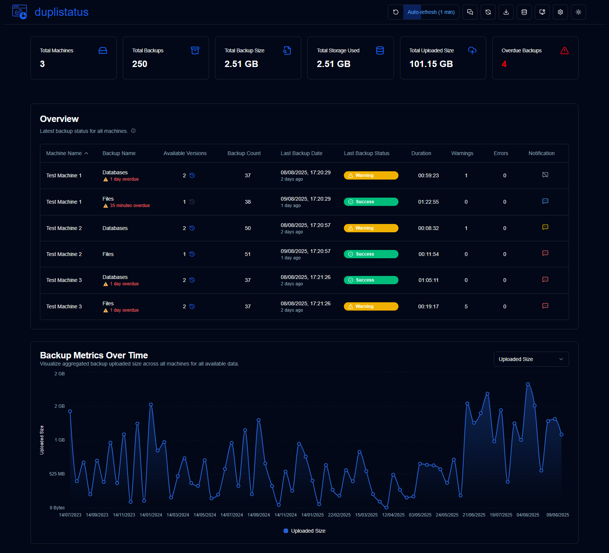

<br>

The user interface consists of several elements and views, organised into different sections to provide a clear and intuitive experience:

1. [Application toolbar](#application-toolbar): Toolbar with easy access to main functionalities and configurations
2. [Dashboard Summary](#dashboard-summary): Summary of monitored machines
3. [Dashboard Overview](#dashboard-overview): Table showing the latest status of all backups configured in monitored Duplicati servers
4. [Overdue details](#overdue-details): Visual warning for overdue backups with details on hover
5. [Available backup versions](#available-backup-versions): Click the blue icon in "Available Versions" to view backup versions in the backend
6. [Backup metrics chart](#backup-metrics): Chart displaying backup metrics over time
7. [Machine details](#machine-details): List of recorded backups for a specific machine with statistics
8. [Backup details](#backup-details): Detailed information for a specific backup, including log messages (execution, warnings, and errors) 

</div>

<br>

### Application Toolbar

Provides easy access to functions and configurations.

<div style="padding-left: 60px;">

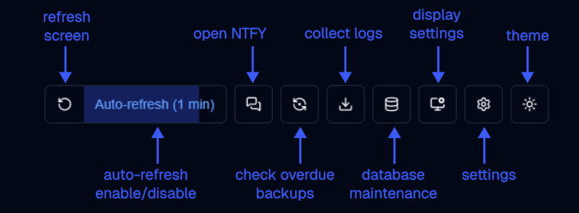


| Button                | Description                                                                          |
| --------------------- | ------------------------------------------------------------------------------------ |
| Refresh screen        | Execute a refresh immediately                                                        |
| Auto-refresh          | Enable/disable auto-refresh. Configure the interval in `Display Settings`            |
| Open NTFY             | Open the ntfy.sh website on the topic configured in `Settings → NTFY Settings`       |
| Check overdue backups | Execute the check for overdue backups now                                            |
| Collect  logs         | Connect to a Duplicati server to collect all backup logs from its database           |
| Database maintenance  | Clean the database, remove old backup logs, or delete data for a specific machine    |
| Settings              | Configure notifications for received backup logs and overdue backups                 |
| Theme                 | Toggle between dark (default) and light themes                                       |

</div>

<br><br>

##  **Dashboard Summary**

Display the aggregated statistics for all backups.

<div style="padding-left: 60px;">

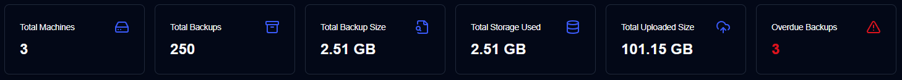


- **Total Machines**: Number of machines being monitored
- **Total Backups**: Total number of backup operations received or collected for all machines and backups.
- **Total Backup Size**: Combined size of all backed up data, based on the last backups received of all machines and backups.
- **Storage Used**: Total storage space used by backups, based on the last backups received (reported by the backend)
- **Uploaded Size**: Total amount of data uploaded/transmitted during backups from Duplicati server to the destination (local storage, ftp, cloud provider,... )
- **Overdue backups**: Number of backups that are overdue (see `Settings → Backup notifications`)

</div>

<br><br>

##  **Dashboard Overview**

Shows the list the last backup log received for all machines and backups, see below a description on how to use this table.

<div style="padding-left: 60px;">


- **Machine Name**: Name of the Duplicati server
- **Backup Name**: Name of the backup in the Duplicati server
- **Available Versions**: Indicates the number of available backup versions on the backend at the time of the backup. If the icon is greyed out, no detailed information was received in the message logs. See the [Duplicati Configuration](#duplicati-configuration-required) section in this manual for details.
- **Backup Count**: Number of backups reported by the Duplicati server
- **Last Backup Date**: The timestamp of the backup execution from the last log received and the elapsed time since the current time (last screen update)
- **Last Backup Status**: The status of the last backup received (Success, Warning, Error, Fatal)
- **Duration**: Duration of the backup in HH:MM:SS
- **Warnings/Errors**: Number of warnings/errors reported in the backup log
- **Notification**: Icon showing the configured notification when a new backup log is received

  
  |  Icon                                    | Notification Option | Description                                                                                         |
  | ---------------------------------------- | ------------------- | --------------------------------------------------------------------------------------------------- |
  |            | Off                 | No notifications will be sent when a new backup log is received                                     |
  |            | All                 | Notifications will be sent for every new backup log received, regardless of its status              |
  |  | Warnings            | Notifications will be sent only when a backup log has a status of Warning, Unknown, Error, or Fatal |
  |      | Errors              | Notifications will be sent only for backup logs with a status of Error or Fatal                     |

<br>

</div>

<div style="padding-left: 120px;">

>[!NOTE]
> The notification configuration is valid only when receiving a new backup log from the Duplicati server. <br>
> Overdue notifications will be sent regardless of this configuration.

</div>

<br>

### Overdue Details

Hovering over the overdue warning message displays details of the overdue backup:

<div style="padding-left: 60px;">

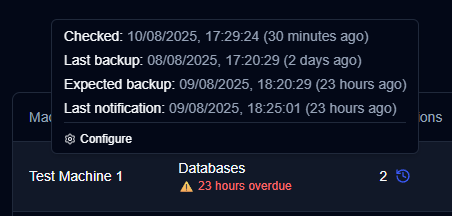


- **Checked**: When the last check was executed. Configure the frequency in `Settings → Backup Notifications`
- **Last Backup**: When the last backup was received
- **Expected Backup**: When the backup was expected plus the configured tolerance (grace period). Configure the expected interval and tolerance in Settings → Backup Notifications
- **Last Notification**: When the last notification was sent

</div>

<br>

### Available Backup Versions

Clicking the blue clock icon opens a list of available backup versions at the time of the backup, as reported by the Duplicati server.

<div style="padding-left: 60px;">

  

<br>

- **Backup details**:  machine name, backup name and when the backup was executed
- **Version Details**: version number, when it was created and the age from the current time.
 
 <br>
  
>[!NOTE] 
> If the icon is greyed out, it means that no detailed information was received in the message logs. <br>
> See the [Duplicati Configuration](#duplicati-configuration-required) section in this manual for details.

  
</div>


<br><br>

##  Backup Metrics

A chart of backup metrics over time is shown on both the dashboard and the backup details page.

-  [Dashboard](#overview): the total number of backups recorded in the **duplistatus** database is shown.

-  [Machine details](#machine-details): the metrics are shown for the selected machine (if 'All backups' are selected) or for the selected backup.


<div style="padding-left: 60px;">

  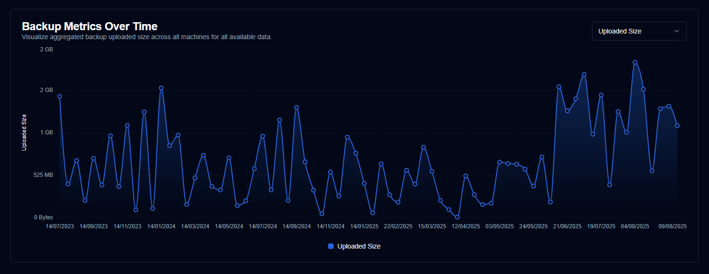


 - **Uploaded Size**: Total amount of data uploaded/transmitted during backups from Duplicati server to the destination (local storage, ftp, cloud provider,... ) per day.
 - **Duration**: The total duration of all backups received per day in HH:MM.
 - **File Count**: The sum of the file count counter received for all backups per day.
 - **File Size**: The sum of the file size reported by Duplicati server for all backups received per day.
 - **Storage Size**: the sum of the backend storage size used reported by Duplicati server per day.
 - **Available Versions**:  the sum of all available versions for all backup per day.
 
 
 <br>
  
>[!NOTE] 
> The user can use the [Display settings] (#display-settings) control to configure the time range to be displayed in the chart.

  
</div>

<br><br>

## Machine Details

When you click on the dashboard overview table, the application displays a page with the list of backups for a specific machine. It can show all backups or a specific backup if the machine has multiple backups configured in Duplicati. Below is an explanation of the page elements:


<div style="padding-left: 60px;">


</div>

<br>

### Machine/Backup Statistics

<div style="padding-left: 60px;">

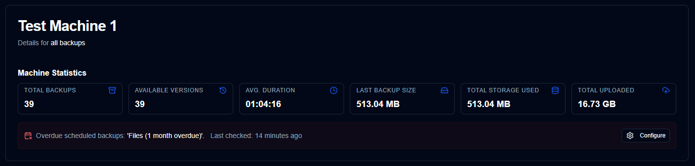


The statistics show the following for all or the selected backup:

- **TOTAL BACKUPS**: Total number of backups (reported by the Duplicati server)
- **AVAILABLE VERSIONS**: Number of available versions as reported by the Duplicati server
- **AVG DURATION**: Average duration of the backups in HH:MM:SS in the **duplistatus** database
- **LAST BACKUP SIZE**: Size of local files reported in the last backup log received
- **TOTAL STORAGE USED**: Storage used in the backend reported in the last backup log received
- **TOTAL UPLOADED**: Sum of all uploaded sizes reported in the backup logs in the **duplistatus** database
- **Overdue Scheduled Backups**: If the selected backup or any of the backups for the machine (if all selected) is overdue, a message appears below the summary. Click the Configure button to go to `Settings → Backup Notifications`

<br>

>[!TIP]
> Use the dropdown in the **Backup History** section to select all backups or any specific backup for this machine.


> [!NOTE]
> If you clean the database with Database Maintenance, it will change the average duration and total uploaded values as they are calculated from the **duplistatus** database records.


</div>

<br>

### Backup History

Shows the list of backup logs for the selected machine. You can select all backups or just one backup using the dropdown. 

<div style="padding-left: 60px;">

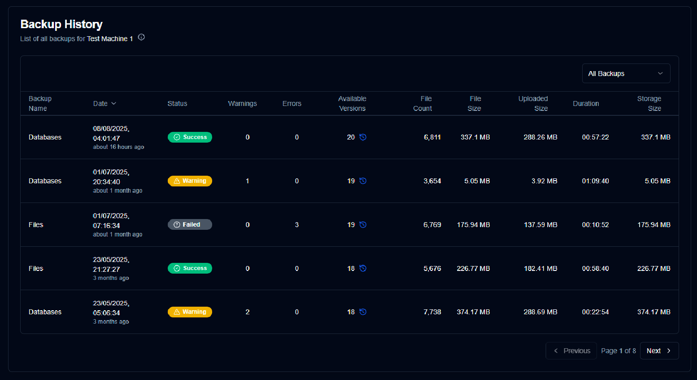


- **Backup Name**: Name of the backup in the Duplicati server
- **Date**: The timestamp of the backup execution and the elapsed time since the current time (last screen update)
- **Status**: The status of the last backup received (Success, Warning, Error, Fatal)
- **Warnings/Errors**: Number of warnings/errors reported in the backup log
- **Available Versions**: Indicates the number of available backup versions on the backend at the time of the backup. If the icon is greyed out, no detailed information was received in the message logs. See the [Duplicati Configuration](#duplicati-configuration-required) section in this manual for details.
- **File Count, File Size, Uploaded Size, Duration** and **Storage Size**: Values as reported by the Duplicati server

<br>

>[!TIP]
> • You can sort by any column by clicking on the column header. Click again to change the order (asc/desc) <br>
> • Click anywhere on a row to show the backup details.<br>
> • Click the blue icon in the "Available Versions" column to display the available versions at the time of the backup (if shown). 

>[!NOTE]
> Selecting `All Backups` shows all backups ordered from newest to oldest by default, regardless of the backup name. You can change the order by clicking on any column header.


</div>

## Backup Details

Clicking on the status badge in the dashboard overview table or any row in the backup history on the machine details page displays the backup details:


<div style="padding-left: 60px;">


</div>

- **Backup Information**: The timestamp of the backup execution with the elapsed time since the current time (last screen update) and the ID
- **Backup Statistics**: Summary of reported counters, size, and duration
- **Log Summary**: Number of reported messages
- **Available Versions**: List of available versions reported (only displayed if the information was received in the logs)
- **Messages/Warnings/Errors**: Complete logs of execution, as well as any warnings or error messages received. The subtitle indicates whether all messages are being displayed or if the log has been truncated by the Duplicati server. Refer to the [Duplicati Configuration](#duplicati-configuration-required) section in this manual for information on how to configure Duplicati to send all messages without truncating them.

<br><br>

## Display Settings

Configure user interface and display preferences:

<div style="padding-left: 60px;">

  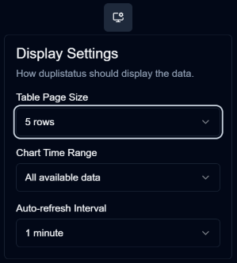
  

| Setting                  | Description                                        | Default Value      | 
| ------------------------ | -------------------------------------------------- | ------------------ | 
| Table Size               | Number of rows per page in the machine detail page | 5 rows             |
| Chart Time Range         | Time interval to show in the charts                | All available data |
| Auto-refresh Interval    | How often to refresh pages (dashboard/detail)      | 1 minute           |

</div>

<br><br>

## Collect Backup Logs

**duplistatus** can collect backup logs directly from Duplicati servers to initialise the database or retrieve any missing or deleted backup log data. During collection, the app skips any existing duplicate backup logs.


<div style="padding-left: 60px;">

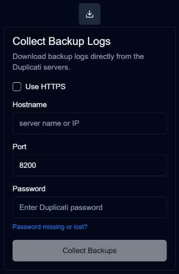


1. Click the `Collect Backup Logs` icon on the application toolbar
2. Enter the Duplicati server details:
   - **Hostname**: The Duplicati server hostname or IP address
   - **Port**: The Duplicati server port (default: 8200)
   - **Protocol**: HTTP or HTTPS
   - **Password**: Authentication password if required
   - **Allow Self-Signed**: Enable for self-signed certificates
3. Click `Collect Backups`

<br>

**Collection Process:**

- **duplistatus** connects to the Duplicati server
- Retrieves backup history and log information
- Skips any duplicated backup logs
- Processes and stores the data in the local database
- Updates the dashboard with new information

<br>

>[!NOTE] 
> Manual collection requires the Duplicati server to be accessible by **duplistatus** and properly configured for remote access.
> If it is not working, check the hostname or IP address and port number with your browser by accessing the [Duplicati's server UI](https://docs.duplicati.com/getting-started/set-up-a-backup-in-the-ui) at `http://hostname:port` or `https://hostname:port`, where hostname and port are the values you entered in this form. Also check if the password entered is working.

</div>


<br><br>


## Database Maintenance

Manage your backup data and maintain system performance through database maintenance operations.

<div style="padding-left: 60px;">

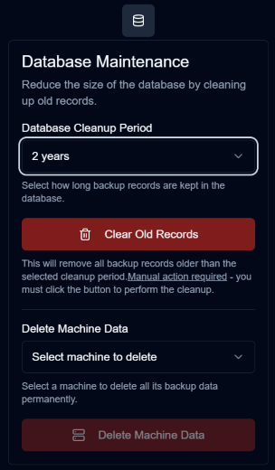

<br>

###  Data Cleanup Period

Remove old backup records to free up storage space and improve performance:

1. Click on `Database maintenance` icon on the application toolbar
2. Select a retention period:
   - **6 months**: Keep only the last 6 months of backup records
   - **1 year**: Keep only the last year of backup records
   - **2 years**: Keep only the last 2 years of backup records (default)
   - **Delete all data**: Remove all backup records and machines
3. Click `Clear Old Records`
4. Confirm the deletion in the dialog

<br>

**Cleanup Effects:**

- Removes backup records older than the selected period
- Maintains referential integrity with machine records
- Updates all related statistics and metrics
- Clears associated configuration settings (for "Delete all data" option)

<br>

###  Delete Machine Data

Delete specific machines and all their associated backup data:

1. Click on `Database maintenance` icon on the application toolbar
2. Select a machine from the dropdown list
3. Click `Delete Machine Data`
4. Confirm the deletion in the dialog

<br>

**Deletion Effects:**

- Permanently removes the selected machine
- Deletes all backup records for that machine
- Cleans up associated configuration settings
- Updates dashboard statistics

<br>

>[!NOTE] 
> All statistics displayed on the dashboard, in detail pages and in charts will only be calculated or plotted using data available in the **duplistatus** database. 
> Therefore, deleting old information will affect these calculations. <br> <br>
> If you accidentally clean up the data or delete a machine, collect the logs again using [Collect Backup Logs](#collect-backup-logs).


</div>

<br><br>

## Notification System

**duplistatus** features a comprehensive notification system that uses **ntfy** to send push notifications about backup events. You can [self-host ntfy](https://docs.ntfy.sh/install/#docker), use the free public **ntfy.sh** server, or subscribe to a paid plan.

This implementation of notifications using  **ntfy** is intended to provide a simple and 
effective notification system. The service is used for its reliable, free public server 
available at [ntfy.sh](https://ntfy.sh). As ntfy is [open source](https://github.com/binwiederhier/ntfy),
it can also be [self-hosted](https://docs.ntfy.sh/install/#docker) and is available on mobile phones.

If you enjoy using the [ntfy.sh](https://ntfy.sh) service, please consider supporting the developer. 
More details can be found on their main **ntfy.sh** or GitHub page. <br><br>


>[!IMPORTANT]
> For enhanced security, consider using an 
> [access token authentication](https://docs.ntfy.sh/config/#access-tokens) and
> [access control list](https://docs.ntfy.sh/config/#access-control-list-acl) to protect your topic.
>
> ⚠️ **Users are responsible for using and configuring ntfy. Use it at your own discretion.** 


<br>

<div style="padding-left: 60px;">

### NTFY Settings

The NTFY configuration section allows you to set up your notification server connection and authentication settings.


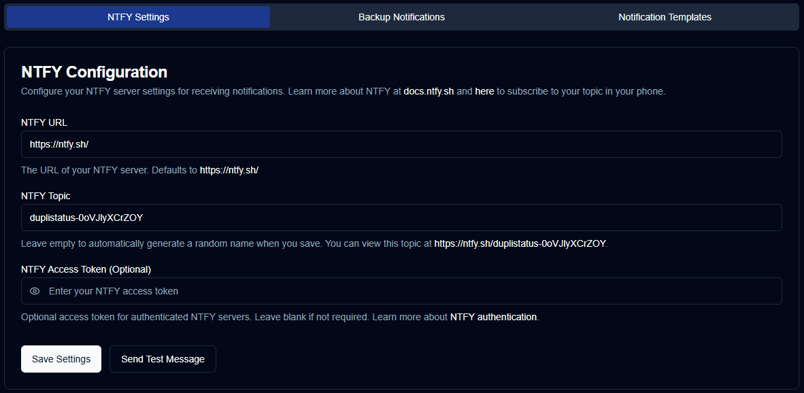


- **NTFY URL**: The URL of your NTFY server (defaults to public `https://ntfy.sh/`)
- **NTFY Topic**: A unique identifier for your notifications. The system will automatically generate a random topic if left empty, or you can specify your own custom topic.
- **NTFY Access Token**: An optional access token for authenticated NTFY servers. Leave this field blank if your server doesn't require authentication.


<br>

>[!CAUTION]
> If you do not [self-host ntfy](https://docs.ntfy.sh/install/#docker) or use an 
> [access token authentication](https://docs.ntfy.sh/config/#access-tokens) and
> [access control list](https://docs.ntfy.sh/config/#access-control-list-acl) configured, anyone can send, receive, and view notifications on your topic. 
>
> To make it difficult to guess and provide a certain degree of privacy, a random topic is
> generated using 12 characters from 62 possible options (`[a-zA-Z0-9]`), resulting in 
> $62^{12} = 3.2 \times 10^{21}$ possible combinations. <br><br>
>

<br>

</div>

<br>

### Backup Notifications Settings

<div style="padding-left: 60px;">

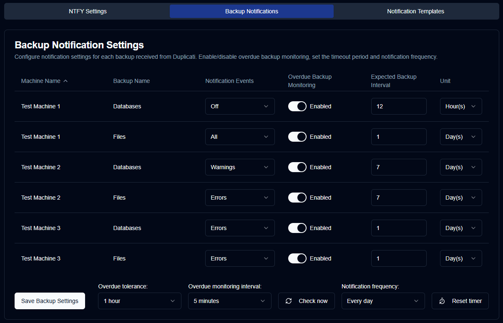

<br>

#### Configure Per-Backup Notification Settings


  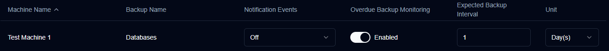
  

| Setting                   | Description                                                          | Default Value |
| ------------------------- | -------------------------------------------------------------------- | ------------- |
| Notification Events       | Configure how notifications are sent when a new backup log is received  | `Warnings`    |
| Overdue Backup Monitoring | Enable/disable the overdue backup monitoring on this backup          | `Enabled`     |
| Expected Backup Interval  | How often backups should run (in hours or days)                      | `1`           |
| Unit                      | Time unit for intervals (Hours/Days)                                 | `Day(s)`      |

**Notification Events Options:**
- `all`: Send notifications for all backup events received
- `warnings`: Send notifications for warnings and errors only
- `errors`: Send notifications for errors only
- `off`: Disable notifications for this backup

>[!NOTE]
> These options control notifications sent when 
> [a new backup log is received](INSTALL.md#duplicati-configuration-required) 
> from the Duplicati server. Overdue notifications will be sent regardless of these settings.


<br>

#### Global Configurations

These configurations apply to all backups:

  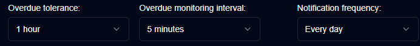
  

| Settings | Description |
| -------- | ----------- | 
| Overdue tolerance | The amount of time added to the expected backup time (grace period)<br>The default is `1 hour`. |
| Overdue monitoring interval | The time interval at which the periodic overdue check routine will be executed. <br> The default is `5 minutes`. |
| Notification frequency | Configure the frequency of new overdue notification messages: <br> - `One time`: Send notification once when overdue <br> - `Every day`: Send daily notifications while overdue (default)<br> - `Every week`: Send weekly notifications while overdue <br> - `Every month`: Send monthly notifications while overdue <br> |


#### Action Buttons

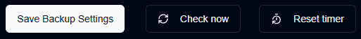

| Button        | Description                                                                                                                    |
| ----------    | ------------------------------------------------------------------------------------------------------------------------------ |
| `Save Backup Settings` | Save the settings to the database, clear notifications timer of disabled overdue monitoring, and run an overdue backup check |
| `Check now` | Run the overdue backup check immediately, useful when changing configurations. Same functionality as `Check overdue backups` on the [application toolbar](#application-toolbar) |
| `Reset timer` | Reset the last overdue notification sent, useful when changing configurations or resetting the status of all notifications |

<br>

### Overdue check process


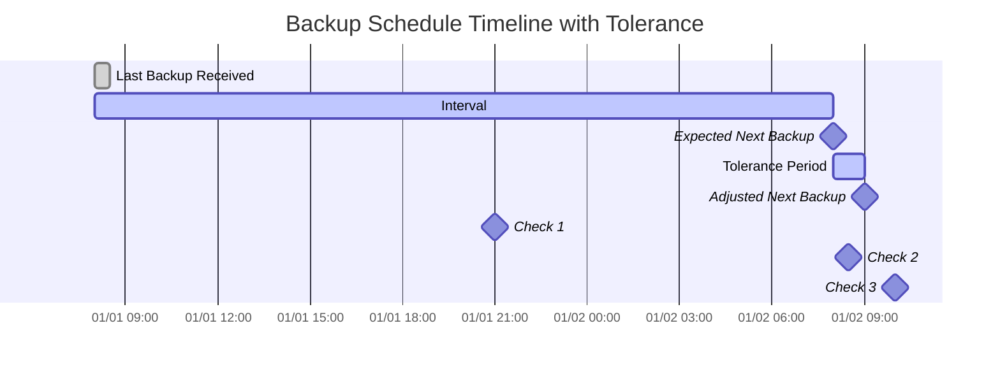


**How it works:**

| **Step** | **Value**            | **Description**                                              | **Example**           |
|:--------:|:---------------------|:-------------------------------------------------------------|:----------------------|
| 1        | Last Backup          | Get the timestamp when the last backup was executed (start)  | `2024-01-01 08:00`    |
| 2        | Expected Interval    | Get the configured backup frequency                          | `1 day`               |
| 3        | Expected Next Backup | Calculated using `Last Backup` + `Expected Interval`         | `2024-01-02 08:00`    |
| 4        | Tolerance            | Get the tolerance (grace period)                             | `1 hour`              |
| 5        | Adjusted Next Backup | Calculated using `Expected Next Backup` + `Tolerance`        | `2024-01-02 09:00`    |

A backup is considered overdue if the `Adjusted Next Backup` time is earlier than the current time shown on the dashboard or detail pages. This verification is also conducted periodically or manually, and in the event of an overdue backup, notifications are sent.

Based on the example above:

- If the current time is `2024-01-01 21:00` (`Check 1`), the backup is still considered "on time" because it is before the `Adjusted Next Backup`.
- If the current time is `2024-01-02 08:30` (`Check 2`), the backup is also considered "on time". Although this is after the expected next backup, it is still within the tolerance period and before the `Adjusted Next Backup`.
- If the current time is `2024-01-02 10:00` (`Check 3`), the backup is considered "overdue" because it is after the `Adjusted Next Backup`.


</div>


<br><br>

### Notification Templates


**duplistatus** has three types of templates for notification messages:

<div style="padding-left: 60px;">

| Template       | Description                                                        |
|--------------- | ------------------------------------------------------------------ |
| Success        | Used when backups complete successfully (only `Success` status)    |
| Warning/Error  | Used when backups complete with warnings or errors (not `Success`) |
| Overdue Backup | Used when backups are overdue based on configured intervals        |

<br>


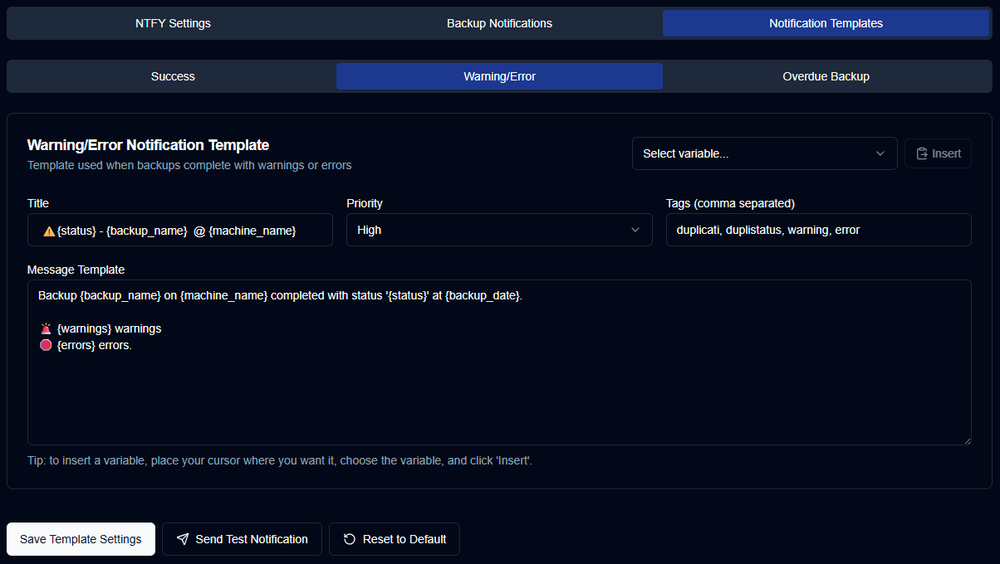

<br>

In all templates, you can include variables that will be populated during execution. The following table shows the variables that can be used in the notification templates:

| Variable                  | Description                                    | Available In     |
| ------------------------- | ---------------------------------------------- | ---------------- |
| `{machine_name}`          | Name of the machine                            | All templates    |
| `{backup_name}`           | Name of the backup operation                   | All templates    |
| `{status}`                | Backup status (Success, Warning, Error, Fatal) | Success, Warning |
| `{backup_date}`           | Date and time of the backup                    | Success, Warning |
| `{duration}`              | Duration of the backup operation               | Success, Warning |
| `{uploaded_size}`         | Amount of data uploaded                        | Success, Warning |
| `{storage_size}`          | Storage usage information                      | Success, Warning |
| `{available_versions}`    | Number of available backup versions            | Success, Warning |
| `{file_count}`            | Number of files processed                      | Success, Warning |
| `{file_size}`             | Total size of files backed up                  | Success, Warning |
| `{warnings_count}`        | Number of warnings                             | Success, Warning |
| `{errors_count}`          | Number of errors                               | Success, Warning |
| `{last_backup_date}`      | Date of the last backup                        | Overdue          |
| `{last_elapsed}`          | Time elapsed since last backup                 | Overdue          |
| `{expected_date}`         | Expected backup date                           | Overdue          |
| `{expected_elapsed}`      | Time elapsed since expected date               | Overdue          |
| `{backup_interval_type}`  | Interval unit (hours/days)                     | Overdue          |
| `{backup_interval_value}` | Expected interval value                        | Overdue          |
| `{overdue_tolerance}`     | Overdue tolerance setting                      | Overdue          |

<br> 

Test your notification configuration:

1. Navigate to `Settings → Notifications`
2. Click `Test Notification` to send a test message
3. Verify the notification appears on your configured topic
4. All variables will be replaced by their respective names

</div>

<br><br>

## Homepage Integration (Optional)

To integrate **duplistatus** with [Homepage](https://gethomepage.dev/), add a widget to your `services.yaml` configuration file using the [Custom API widget](https://gethomepage.dev/widgets/services/customapi/) to fetch backup status information from **duplistatus**. 

<br>

### Summary Widget

Display overall backup statistics on your Homepage dashboard:

```yaml
- Dashboard:
    icon: mdi-cloud-upload
    href: http://your-server:9666/
    widget:
      type: customapi
      url: http://your-server:9666/api/summary
      display: list
      refreshInterval: 60000
      mappings:
        - field: totalMachines
          label: Machines
        - field: totalBackups
          label: Backups received
        - field: secondsSinceLastBackup
          label: Last backup
          format: duration
        - field: totalBackupSize
          label: Backed up size
          format: number
          scale: 0.000000001
          suffix: GB     
        - field: totalStorageUsed
          label: Storage used
          format: number
          scale: 0.000000001
          suffix: GB     
        - field: totalUploadedSize
          label: Uploaded size
          format: number
          scale: 0.000000001
          suffix: GB     
```

**Widget Display:**
<div style="padding-left: 60px;">


</div>
<br>

### Last Backup Information Widget

Display the latest backup information for a specific machine:

```yaml
- Test Machine 1:
    icon: mdi-test-tube
    widget:
      type: customapi
      url: http://your-server:9666/api/lastbackup/Test%20Machine%201
      display: list
      refreshInterval: 60000
      mappings:
        - field: latest_backup.name
          label: Backup name
        - field: latest_backup.status
          label: Result
        - field: latest_backup.date
          label: Date
          format: relativeDate
        - field: latest_backup.duration
          label: Duration
        - field: latest_backup.uploadedSize
          label: Bytes Uploaded
          format: number
          scale: 0.000001
          suffix: MB        
        - field: latest_backup.backup_list_count
          label: Versions  
```

**Widget Display:**
<div style="padding-left: 60px;">


</div>

<br>

### Configuration Notes

- Replace `your-server` with your actual server IP or hostname
- Adjust the refresh interval as needed (60000ms = 1 minute)
- URL encode machine names with spaces (e.g., `Test%20Machine%201`)
- The scale values convert bytes to appropriate units (GB, MB, etc.)

<br><br>

## Troubleshooting

### Common Issues and Solutions

| Issue                                 | Problem Description                              | Solutions                  |
| ------------------------------------- | ------------------------------------------------ | -------------------------- |
| **Notifications Not Working**         | Notifications are not being sent or received.    | **Check ntfy.sh Configuration**:<br>• Verify the ntfy.sh URL is correct (`https://ntfy.sh`)<br>• Ensure the topic is properly configured<br>• Test the notification using the `Send Test Message` button<br><br>**Check Network Connectivity**:<br>• Ensure **duplistatus** can reach ntfy.sh<br>• Check firewall settings if applicable<br>• Verify DNS resolution<br><br>**Check Notification Settings**:<br>• Ensure notifications are enabled for the specific backup<br>• Verify notification events are configured correctly<br>• Check that the backup has overdue monitoring enabled |
| **Backup Data Not Appearing**         | Backups are not showing up in the dashboard.     | **Check Duplicati Configuration**:<br>• Verify Duplicati is configured to send data to **duplistatus**<br>• Check the HTTP URL configuration in Duplicati settings<br>• Ensure `send-http-log-level=Information` is set<br><br>**Check Network Connectivity**:<br>• Verify Duplicati can reach the **duplistatus** server<br>• Check the port configuration (default 9666)<br>• Test connectivity between Duplicati and **duplistatus**<br><br>**Check Duplicati Logs**:<br>• Review Duplicati logs for HTTP request errors<br>• Verify the backup completed successfully<br>• Check for authentication issues |
| **Overdue Backup Alerts Not Working** | Overdue backup notifications are not being sent. | **Check Overdue Configuration**:<br>• Verify overdue backup check is enabled for the backup<br>• Check the expected interval and unit settings<br>• Ensure the backup has been configured for monitoring<br><br>**Check Notification Frequency**:<br>• Verify notification frequency is not set to "onetime" if already sent<br>• Check that notifications are enabled for the backup<br>• Review the overdue tolerance setting<br><br>**Check Cron Service**:<br>• Verify the cron service is running<br>• Check cron service logs for errors<br>• Ensure the service port is accessible |
| **Dashboard Not Updating**            | Dashboard data is not refreshing automatically.  | **Check Auto-refresh Settings**:<br>• Verify auto-refresh is enabled in display settings<br>• Check the refresh interval configuration (15 seconds to 10 minutes)<br>• Try manual refresh using the refresh button<br>• Check for progress indicators showing refresh countdown<br><br>**Check Browser Settings**:<br>• Ensure JavaScript is enabled<br>• Check for browser extensions blocking updates<br>• Try a different browser or incognito mode<br>• Clear browser cache and localStorage<br><br>**Check Network Issues**:<br>• Verify connectivity to the **duplistatus** server<br>• Check for proxy or firewall issues<br>• Review browser console for errors<br>• Check if the page is on dashboard or detail views (auto-refresh only works on these pages)                          |
| **Manual Backup Collection Failing**  | Manual backup collection is not working.         | **Check Duplicati Server Access**:<br>• Verify the Duplicati server hostname and port are correct<br>• Check that remote access is enabled in Duplicati settings<br>• Ensure authentication password is correct<br>• Verify the protocol (HTTP/HTTPS) is correct<br><br>**Check Network Connectivity**:<br>• Test connectivity from **duplistatus** to Duplicati server<br>• Verify the Duplicati server port is accessible (default: 8200)<br>• Check firewall settings<br>• Test with ping or telnet to the server<br><br>**Check Duplicati Configuration**:<br>• Ensure Duplicati is configured for remote access<br>• Verify the API endpoints are accessible<br>• Check Duplicati logs for access errors<br>• Enable "Allow self-signed certificates" if using HTTPS with self-signed certs |

<br><br>

## Getting Help

If you continue to experience issues:

1. **Check Application Logs**: Review the application logs for detailed error information
2. **Verify Configuration**: Double-check all configuration settings
3. **Test Connectivity**: Ensure all network connections are working properly
4. **Review Documentation**: Check the README.md and API documentation for additional information
5. **Submit an issue report**: Send an issue, bug report, or feature request on the [duplistatus GitHub repository](https://github.com/wsj-br/duplistatus/issues)


<br><br>

## Additional Resources

- **GitHub Repository**: [wsj-br/duplistatus](https://github.com/wsj-br/duplistatus)
- **API Documentation**: See [API-ENDPOINTS.md](API-ENDPOINTS.md) for detailed API reference
- **Development Guide**: See [DEVELOPMENT.md](DEVELOPMENT.md) for development information
- **Installation**: See [README.md](README.md) for installation instructions
- **Duplicati Documentation**: [docs.duplicati.com](https://docs.duplicati.com)

<br><br>

## Licence

**Copyright © 2025 Waldemar Scudeller Jr.**

The project is licensed under the [Apache License 2.0](LICENSE). 

