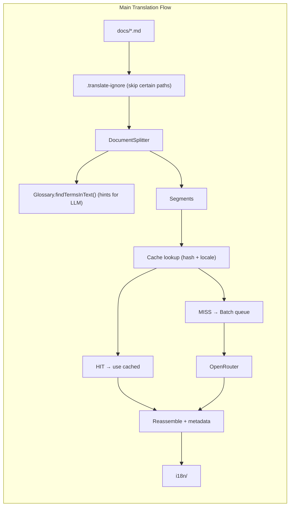

# Translation Script – Technical Description

This document provides a detailed technical explanation of the documentation translation system used in the duplistatus project. The system translates Docusaurus markdown documentation and SVG assets into multiple locales using an LLM API (OpenRouter) with a segment-level caching strategy.

---

## Table of Contents

1. [Overview](#overview)
2. [Translation Flow](#translation-flow)
3. [Configuration](#configuration)
4. [Main Translation Flow](#main-translation-flow)
5. [Document Splitting](#document-splitting)
6. [Placeholder Protection](#placeholder-protection)
7. [Translation API](#translation-api)
8. [Caching System](#caching-system)
9. [SVG Translation](#svg-translation)
10. [Glossary Generation](#glossary-generation)
11. [Supporting Scripts](#supporting-scripts)
12. [File Structure](#file-structure)

---

## Overview

The translation system consists of several TypeScript scripts under `documentation/scripts/translate/`. The main entry point is `index.ts`, which:

- Reads source markdown (`.md`/`.mdx`) from `docs/`
- Splits documents into translatable segments
- Translates segments via OpenRouter LLM API (batch mode by default, or single-segment with `--no-batch`)
- Writes translated output to `i18n/<locale>/docusaurus-plugin-content-docs/current/`
- Optionally translates SVG files in `static/img/` (files prefixed with `duplistatus`)

**Key design decisions:**

- **Batch translation**: Multiple segments are sent in a single API call (configurable via `batchSize` and `maxBatchChars`). On batch failure, falls back to single-segment mode.
- **Segment-level caching**: Each translatable segment is cached by content hash. Unchanged segments are reused across runs.
- **File-level skip**: If a file's content hash matches the cache and the output file exists, the entire file is skipped.
- **Placeholder protection**: URLs and admonition syntax are replaced with placeholders before translation to prevent the LLM from modifying them.
- **Glossary support**: CSV glossaries provide preferred translations. `glossary-ui.csv` is generated from intlayer dictionaries; `glossary-user.csv` (en, locale, translation) supplies optional overrides that take precedence.

---

## Translation Flow



---

## Configuration

Configuration is loaded from `translate.config.json` (or a custom path via `-c`). Defaults are merged with user overrides.

**Paths** (`config.paths`):

| Key            | Default                | Description                                         |
|----------------|------------------------|-----------------------------------------------------|
| `docs`         | `./docs`               | Source markdown directory                           |
| `i18n`         | `./i18n`               | Output directory for translated content             |
| `cache`        | `./.translation-cache` | SQLite cache and logs                               |
| `glossary`     | `./glossary-ui.csv`    | CSV file with term translations (UI, from intlayer) |
| `glossaryUser` | `./glossary-user.csv`  | Optional: user overrides (en, locale, translation)  |
| `staticImg`    | `./static/img`         | SVG source directory (optional)                     |

**Locales** (`config.locales`):

- `source`: Source language (default `en`)
- `targets`: Array of target locales (e.g. `["fr", "de", "es", "pt-BR"]`)

**Batch** (`config`):

- `batchSize`: Max segments per batch (default `20`)
- `maxBatchChars`: Max total character count per batch (default `5000`)

**OpenRouter** (`config.openrouter`):

- `baseUrl`: API endpoint (default `https://openrouter.ai/api/v1`)
- `defaultModel`: Primary model (e.g. `anthropic/claude-haiku-4.5`, `deepseek/deepseek-chat`)
- `fallbackModel`: Fallback if primary fails
- `maxTokens`, `temperature`: Generation parameters

**Cache** (`config.cache`):

- `enabled`: Enable caching (default `true`)
- `segmentLevel`: Use segment-level cache (default `true`)

**Environment**: `OPENROUTER_API_KEY` must be set for translation.

---

## Main Translation Flow

### Entry Point: `index.ts`

1. **Setup**
   - Load config, glossary, ignore rules
   - Initialize `TranslationCache`, `DocumentSplitter`, `Translator`
   - All console output is automatically written to log files: `.translation-cache/translate_<timestamp>.log` for markdown translation and `.translation-cache/translate-svg_<timestamp>.log` for SVG translation, via the `log-output.ts` utility.

2. **Copy ignored files**
   - Files matching `.translate-ignore` are copied verbatim into each locale's `current/` folder (no translation). All files under ignored paths are copied (including `.json`, images, etc.), not just `.md`/`.mdx`.

3. **File discovery**
   - Recursively find all `.md` and `.mdx` in `docs/`
   - Exclude paths matching `.translate-ignore`
   - Optionally filter by `-p <path>` (file or directory) or `-l <locale>`
   - Locale codes are normalized (e.g. `pt-br` → `pt-BR`)

4. **Per-file processing** (`translateFile`)
   - Compute file content hash (SHA-256, normalized whitespace, 16 chars)
   - **File-level cache check**: If `file_tracking` has matching hash and output exists → skip
   - **Force mode** (`--force`): Clear file cache, re-translate
   - Split content into segments via `DocumentSplitter`
   - For each translatable segment:
     - **Segment cache check**: `cache.getSegment(hash, locale, filepath, startLine)`
     - If hit: use cached translation, update `last_hit_at`
     - If miss: add to batch queue (or translate immediately with `--no-batch`)
     - **Batch mode**: Accumulate cache-miss segments into a batch queue. When the queue reaches `batchSize` (default 20) segments or `maxBatchChars` (default 5000) total characters, flush by calling `Translator.translateBatch()`. On `BatchTranslationError`, fall back to single-segment `translate()` for each item in the batch.
   - Reassemble segments, add translation metadata to frontmatter (`translation_last_updated`, `source_file_mtime`, `source_file_hash`, `translation_language`, `source_file_path`)
   - Write to `i18n/<locale>/docusaurus-plugin-content-docs/current/<relativePath>`
   - Update `file_tracking` with new hash
   - Progress display: segment count, number cached vs translated, percentage, elapsed time, cost per file and cumulative total

5. **SVG translation** (unless `--no-svg`)
   - Process SVGs in `static/img/` (see [SVG Translation](#svg-translation))
   - Skipped when `-p` targets a docs path with no SVG files

6. **Post-run**
   - `cache.resetLastHitAtForUnhitMarkdown(segmentHitKeys)`: Set `last_hit_at = NULL` for markdown segments not hit this run (enables cleanup to remove stale entries later). Segments from files that were skipped (file-level cache hit) are considered hit and are not reset.
   - Summary: files processed/skipped, segments cached/translated, total tokens, total cost (from OpenRouter API), total time

---

## Document Splitting

The `DocumentSplitter` (`splitter.ts`) parses markdown and produces a list of `Segment` objects.

### Segment Types

| Type          | Translatable | Description                                                              |
|---------------|--------------|--------------------------------------------------------------------------|
| `frontmatter` | Yes          | YAML front matter (only `title` and `description` translated per prompt) |
| `heading`     | Yes          | `#` to `######` headings                                                 |
| `paragraph`   | Yes          | Regular text blocks                                                      |
| `admonition`  | Yes          | `:::note`, `:::warning`, etc. blocks                                     |
| `code`        | No           | Fenced code blocks (```...```)                                           |
| `other`       | No           | HTML, horizontal rules, imports, images                                  |

### Splitting Logic

1. **Front matter**: Extracted with `gray-matter`, emitted as a single segment
2. **Body**: Line-by-line parsing with state for:
   - Code blocks: Lines between ` ``` ` fences → `type: "code"`, `translatable: false`
   - Admonitions: Lines between `:::note` and `:::` → `type: "admonition"`, `translatable: true`
   - Empty lines: Flush current segment, start new one
   - Other lines: Accumulate until separator, then classify
3. **Classification** (`classifySegment`):
   - Headings: `^#{1,6}\s`
   - Images: `` → not translatable
   - Imports / JSX: `import `, `<Component`, `</Tag>` → not translatable
   - Single-line non-text (punctuation only): not translatable
   - Default: `paragraph`, translatable

### Hash Computation

Each segment's `hash` is computed via `TranslationCache.computeHash(content)`:

- Normalize whitespace: `content.replace(/\s+/g, " ").trim()`
- SHA-256 digest, first 16 hex chars

This hash is the cache key for segment-level lookups.

**Note**: For frontmatter segments, the hash is computed from the actual frontmatter string (`frontMatterStr`), not from `JSON.stringify(frontMatter)`. This ensures consistent hashing regardless of key ordering in the YAML/JSON object.

---

## Placeholder Protection

To prevent the LLM from translating or modifying structural elements, two placeholder systems are used.

### URL Placeholders (`url-placeholders.ts`)

- **Before translation**: Replace `](url)` in markdown links with `]({{URL_PLACEHOLDER_N}})`
- **After translation**: Restore original URLs from the `urlMap`
- **Purpose**: Avoid translating URL paths (e.g. `overview#anchor` → `resumen#anchor`) when glossary terms appear in URLs

### Admonition Placeholders (`admonition-placeholders.ts`)

- **Before translation**: Replace `:::note`, `:::warning`, etc. and closing `:::` with `{{ADM_OPEN_N}}` and `{{ADM_END_N}}`
- **After translation**: Restore original admonition syntax
- **Purpose**: Keep Docusaurus admonition directive names in English

**Order of operations** (in `translateFile`):

1. `protectMarkdownUrls(segment.content)`
2. `protectAdmonitionSyntax(urlProtected)`
3. Send to API
4. `restoreAdmonitionSyntax(result.content, openMap, endMap)`
5. `restoreMarkdownUrls(admonitionRestored, urlMap)`

---

## Translation API

The `Translator` class (`translator.ts`) calls the OpenRouter Chat Completions API.

### Request

- **Endpoint**: `POST {baseUrl}/chat/completions`
- **Headers**: `Authorization: Bearer {OPENROUTER_API_KEY}`, `Content-Type: application/json`, `HTTP-Referer`, `X-Title`
- **Body**: `{ model, max_tokens, temperature, messages }`
- **Context caching**: System prompt uses `cache_control: { type: "ephemeral" }` for OpenRouter context caching

### Single-Segment Prompt

Used when `--no-batch` or when batch falls back after `BatchTranslationError`:

- **User content**: `<translate>content</translate>`
- **System prompt**: Translate from English (UK) to target language; preserve headers, code, placeholders; translate only title/description in front matter; prefer glossary terms
- **Output**: Raw translated text (no `<translate>` tags)

### Batch Prompt

Used by default for multiple segments in one API call:

- **User content**: `<segments><seg id="0">content0</seg><seg id="1">content1</seg>...</segments>`
- **System prompt**: Same rules; reply with `<t id="N">translation</t>` blocks, one per segment, in order
- **Parsing**: Regex extracts `<t id="N">...</t>`; throws `BatchTranslationError` if count mismatches
- **XML escaping**: Content is escaped (`&`, `<`, `>`, `"`) before sending; unescaped on parse

**Fallback**: If `translateBatch()` throws `BatchTranslationError`, the translator falls back to single-segment `translate()` for each item in the failed batch, ensuring translation continues without data loss.

### Glossary Hints

- CSV columns: `en`, `fr`, `de`, `pt-BR`, `es` (locale headers only)
- `Glossary.findTermsInText(text, locale)` returns lines like `- "backup" → "sauvegarde"` for inclusion in prompt
- Omitted when no terms found in segment

### Response Handling

- Extracts `choices[0].message.content` as translated text
- Tracks `usage.total_tokens` and `usage.cost` (from OpenRouter API)
- On primary model failure: retries with `fallbackModel`

### Debug Traffic

`--debug-traffic` is enabled by default. Request and response payloads (without the API key) are appended to a log file in `.translation-cache/` for inspection. Use `--debug-traffic <path>` for a custom log filename, or `--no-debug-traffic` to disable.

---

## Caching System

The cache is a SQLite database at `.translation-cache/cache.db`.

### Schema

**`translations`** (segment-level cache):

| Column            | Type    | Description                                |
|-------------------|---------|--------------------------------------------|
| `source_hash`     | TEXT    | Content hash (PK with locale)              |
| `locale`          | TEXT    | Target locale (PK with source_hash)        |
| `source_text`     | TEXT    | Original segment text                      |
| `translated_text` | TEXT    | Cached translation                         |
| `model`           | TEXT    | Model used                                 |
| `filepath`        | TEXT    | File path (for cleanup/orphan detection)   |
| `created_at`      | TEXT    | When cached                                |
| `last_hit_at`     | TEXT    | Last time this row was used (NULL = stale) |
| `start_line`      | INTEGER | Line number in source file                 |

**`file_tracking`** (file-level skip):

| Column            | Type | Description                      |
|-------------------|------|----------------------------------|
| `filepath`        | TEXT | Relative path (PK with locale)   |
| `locale`          | TEXT | Target locale (PK with filepath) |
| `source_hash`     | TEXT | Hash of full file content        |
| `last_translated` | TEXT | When last translated             |

### Cache Lifecycle

1. **Read**: `getSegment(hash, locale, filepath?, startLine?)` – returns `translated_text` or null; on hit, updates `last_hit_at`, backfills `filepath`/`start_line` if null. Filepaths are normalized to POSIX format (forward slashes) to ensure consistent cache lookups across platforms (Windows backslash vs Unix forward slash).
2. **Write**: `setSegment(...)` – INSERT or UPDATE on conflict using `ON CONFLICT DO UPDATE` to preserve `created_at` when updating existing rows
3. **File status**: `getFileStatus(filepath, locale)` / `setFileStatus(...)` for file-level skip
4. **Cleanup**: `cache-cleanup.ts` removes orphaned and stale entries (see [Supporting Scripts](#supporting-scripts))

### Stale Detection

- **Orphaned**: `filepath` points to a file that no longer exists in `docs/` or `static/img/`
- **Stale**: `last_hit_at IS NULL` or `filepath IS NULL`
- After each translate run, `resetLastHitAtForUnhitMarkdown(segmentHitKeys)` sets `last_hit_at = NULL` for markdown segments that were *not* hit, so cleanup can later remove them

---

## SVG Translation

SVG translation is handled by `translate-svg.ts` and `svg-splitter.ts`.

### Scope

- Only files in `static/img/` whose basename starts with `duplistatus`
- Can be excluded via `.translate-ignore` (gitignore-style patterns)

### Splitting (`SvgSplitter`)

- Extracts `<text>` and `<title>` elements via regex
- Inner content (including nested `<tspan>`) is concatenated and treated as translatable
- Each segment stores `fullMatch` (original XML) and `openingTag` for reassembly

### Reassembly

- For `<text>`: Replace inner content with `<tspan>translation</tspan>`
- For `<title>`: Replace inner content directly
- XML special chars escaped (`&`, `<`, `>`, `"`, `'`)

### Output

- Translated SVGs written to `i18n/<locale>/docusaurus-plugin-content-docs/current/assets/<filename>`
- Optional Inkscape PNG export: `inkscape --export-type=png` for each translated SVG

### Cache

- Same SQLite cache as markdown; `filepath` is `static/img/<filename>`
- `resetLastHitAtForSvg()` clears `last_hit_at` for SVG rows at the start of an SVG run so only hit segments retain timestamps

### Lowercase Transformation

Translated text in SVG files is forced to lowercase. This ensures consistency in SVG text rendering and is applied to both newly translated segments and cached translations (when retrieved from cache).

---

## Glossary Generation

The glossary can be generated from intlayer dictionaries to ensure consistency between the application UI and documentation translations.

### `extract-glossary-from-intlayer.js`

- **Input**: `.intlayer/dictionary/*.json` (from `pnpm intlayer build`)
- **Output**: `glossary-ui.csv`
- **Process**: Extracts terminology from nested translation objects; filters by technical keywords, common sections (navigation, status, UI actions, time terms); cleans placeholders, parentheses, trailing colons; deduplicates; outputs CSV with locale columns only (`en`, `fr`, `de`, `pt-BR`, `es`)

### `generate-glossary.sh`

- Runs `pnpm intlayer build` to generate dictionaries
- Calls `extract-glossary-from-intlayer.js` to produce `glossary-ui.csv`

**Usage**: Run `pnpm translate:glossary-ui` from the `documentation/` directory.

**User overrides**: Entries in `glossary-user.csv` (columns: en, locale, translation) take precedence over `glossary-ui.csv`.

### `update-glossary-markdown.js`

- Regenerates glossary-ui.csv using `pnpm run translate:glossary-ui` instead of the old shell script.
- This script is the recommended way to update the glossary after intlayer changes.
- Run from the `documentation/` directory: `pnpm exec node scripts/update-glossary-markdown.js`

### `remove-code-block-anchors.ts`

- Removes incorrectly added Docusaurus heading anchors (`{#anchor-id}`) from lines inside fenced code blocks in Markdown files under `documentation/docs/`.
- Headings outside code blocks are preserved.
- Supports `--dry-run` to preview changes.
- Run with `pnpm exec tsx scripts/remove-code-block-anchors.ts` from the `documentation/` directory.

### `fix-i18n-asset-paths.js`

- Fixes image paths in Markdown files for proper localized asset resolution.
- Converts absolute paths (`/assets/...`) to relative paths (`assets/`, `../assets/`, `../../assets/`) so Docusaurus resolves them per locale.
- Run without arguments to process translated docs in `i18n/`; use `--docs` to process source docs in `docs/`.
- Run with `pnpm exec node scripts/fix-i18n-asset-paths.js [--docs]` from the `documentation/` directory.

---

## Supporting Scripts

All translate commands are run from the `documentation/` directory.

### `check-status.ts` (`pnpm translate:status`)

- Scans `docs/` and `i18n/<locale>/`
- For each source file: compares `source_file_hash` in translation frontmatter with current source hash
- Status symbols: ✓ up-to-date, - not translated, ● outdated, □ orphaned, i ignored
- Prints a table and summary counts

### `cache-cleanup.ts` (`pnpm translate:cleanup` or `pnpm translate:clean`)

**Phases:**

1. **Orphaned cache entries**: Remove `translations` rows whose `filepath` no longer exists in docs/SVGs; update `filepath` if the same hash exists elsewhere
2. **Stale entries**: Delete rows where `last_hit_at IS NULL` or `filepath IS NULL`
3. **Orphaned translation files**: Delete `.md`/`.mdx` in `i18n/<locale>/` that have no corresponding source in `docs/`

**Important**: Run `pnpm translate --force` before cleanup to refresh `last_hit_at`; otherwise valid entries may be deleted.

**Pre-run alert**: The script displays an alert reminding you to run `pnpm translate --force` first. When run without `--dry-run`, it prompts for confirmation before proceeding with deletions.

**Options**: `-c <config>`, `--dry-run`

**Log**: Writes `cleanup_YYYY-MM-DD_HH-MM-SS.log` in `.translation-cache/`

### `translate-svg.ts` (`pnpm translate:svg`)

- Standalone SVG-only translation (also runs as part of main `pnpm translate` unless `--no-svg`)

### `TRANSLATION-HELP.md` (`pnpm translate:help`)

- Displays command summary via `batcat` (or equivalent pager)

### `edit-cache-server.ts` (`pnpm translate:edit-cache`)

- Express server (default port 4000)
- Serves a static SPA from `edit-cache-app/`
- **API**:
  - `GET /api/translations` – list with filters (filename, locale, model, source_hash, source_text, translated_text, last_hit_at_null)
  - `PATCH /api/translations` – update `translated_text`
  - `DELETE /api/translations/:sourceHash/:locale` – delete single row
  - `DELETE /api/translations/by-filters` – delete by filters
  - `DELETE /api/translations/by-filepath` – delete all for a filepath
  - `GET /api/locales`, `GET /api/models`, `GET /api/filepaths` – dropdown data
  - `POST /api/log-links` – log file URLs for terminal clickable links

---

## File Structure

```
documentation/
├── translate.config.json       # User config (optional)
├── .translate-ignore           # Gitignore-style patterns for docs and SVGs
├── glossary-ui.csv             # Locale columns: en, fr, de, pt-BR, es (from intlayer)
├── glossary-user.csv           # Optional overrides: en, locale, translation
├── docs/                       # Source markdown
├── i18n/                       # Translated output
│   └── <locale>/
│       └── docusaurus-plugin-content-docs/
│           └── current/        # Mirrors docs/ structure
│               └── assets/     # Translated SVGs
├── static/img/                 # Source SVGs (duplistatus*.svg)
└── .translation-cache/
    ├── cache.db                # SQLite cache
    ├── translate_*.log         # Main script logs
    ├── translate-svg_*.log     # SVG script logs
    ├── debug-traffic-*.log     # API traffic (when enabled)
    └── cleanup_*.log           # Cleanup run logs

documentation/scripts/
├── extract-glossary-from-intlayer.js  # Extract terms from .intlayer/dictionary
├── generate-glossary.sh               # Build intlayer, extract to glossary-ui.csv
├── update-glossary-markdown.js        # Update glossary-ui.csv via pnpm translate:glossary-ui
├── remove-code-block-anchors.ts       # Remove heading anchors from code blocks
├── fix-i18n-asset-paths.js            # Fix image paths for i18n assets
└── translate/
    ├── index.ts                       # Main entry
    ├── config.ts                      # Config loading
    ├── types.ts                       # Shared types
    ├── cache.ts                       # TranslationCache (SQLite)
    ├── splitter.ts                    # DocumentSplitter
    ├── svg-splitter.ts                # SvgSplitter
    ├── translator.ts                  # OpenRouter API client (batch + single)
    ├── glossary.ts                    # Glossary loader
    ├── ignore.ts                      # .translate-ignore parsing
    ├── file-utils.ts                  # File discovery, snapshot
    ├── url-placeholders.ts            # URL protection
    ├── admonition-placeholders.ts     # Admonition protection
    ├── validator.ts                   # Post-translation validation
    ├── log-output.ts                  # Write console output to timestamped log files
    ├── cache-cleanup.ts               # Cleanup script
    ├── check-status.ts                # Status script
    ├── edit-cache-server.ts           # Web UI server
    ├── translate-svg.ts               # SVG translation
    ├── edit-cache-app/                # Static SPA for cache editor
    │   ├── index.html
    │   ├── app.js
    │   └── styles.css
    └── TRANSLATION-HELP.md            # User-facing command summary
```

---

## Validation

After reassembly, `validateTranslation(sourceSegments, translatedSegments)` checks:

- Segment count match
- Code blocks unchanged
- URL count preserved (warning if mismatch)
- Heading levels preserved
- Length ratio (warning if >3x or <0.2x)
- Front matter structure preserved
- Line count preserved (warning if source and translated segment line counts differ)

Issues are logged; translation is not aborted. Use `--no-cache` to re-translate segments with validation problems.

---

## CLI Options Summary

| Option                   | Description                                                                      |
|--------------------------|----------------------------------------------------------------------------------|
| `-l, --locale <locale>`  | Translate to one locale only                                                     |
| `-p, --path <path>`      | Limit to file or directory (recursively processes .md/.mdx)                      |
| `--dry-run`              | No writes, no API calls                                                          |
| `--no-cache`             | Skip cache reads; always translate fresh (still write new translations to cache) |
| `--force`                | Clear file cache (file_tracking), re-translate all files                         |
| `-v, --verbose`          | More output; when validation issues occur, prints segment content                |
| `--stats`                | Show cache stats and exit                                                        |
| `--clear-cache [locale]` | Clear cache (optionally per locale)                                              |
| `--debug-traffic [path]` | Log API traffic (on by default; pass path for custom filename)                   |
| `--no-debug-traffic`     | Disable traffic logging                                                          |
| `--no-svg`               | Skip SVG translation                                                             |
| `--no-export-png`        | Skip Inkscape PNG export after SVG translation                                   |
| `--no-batch`             | Use single-segment translation (one API call per segment)                        |
| `-c, --config <path>`    | Config file path                                                                 |
