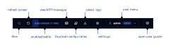
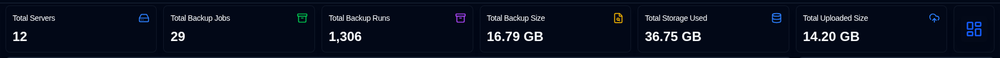

# ai-i18n-tools — agent context

Standalone reference for assistants working **in a consumer repo** that depends on `ai-i18n-tools` (CLI, config, extract/translate behavior, runtime imports). Developing the package itself: see `dev/package-context.md` in the upstream repo.

---

## What it is

- **CLI:** `npx ai-i18n-tools <command>` (or `pnpm exec ai-i18n-tools`).
- **Runtime:** `import … from 'ai-i18n-tools/runtime'` — i18next helpers (`defaultI18nInitOptions`, `setupKeyAsDefaultT`, `makeLoadLocale`, `makeLocaleLoadersFromManifest`, `applyDirection`, language labels, plural helpers, etc.).
- **Config:** root `ai-i18n-tools.config.json`, or `-c <path>`.

Optional: set `openrouter.requestTimeoutMs` if the default **30000** ms per OpenRouter request is wrong for your network.

---

## Invariant: `sourceLocale` === `SOURCE_LOCALE`

`sourceLocale` in config must **exactly match** the `SOURCE_LOCALE` constant your app exports from its i18n bootstrap. If they differ, extract and translation targets are wrong.

---

## Code patterns

Extract only sees string literals in `t` / `i18n.t` (and names in `ui.reactExtractor.funcNames`). Variables as keys are not extracted.

```js
t("Save");
t("Hello {{name}}", { name: userName });
```

For dropdowns and option lists, call `t()` at definition time (for example inside `useMemo(..., [t])`), not with a dynamic key.

Plurals and catalog shape: see **Extract and `strings.json`** below.

---

## Runtime wiring (sketch)

Full runnable example: [README.md](../README.md) (Workflow 1 — UI strings). Prefer `setupKeyAsDefaultT` over lower-level `wrapI18nWithKeyTrim` for app wiring.

```js
import aiI18n from "ai-i18n-tools/runtime";
// stringsJson, uiLanguages, SOURCE_LOCALE, sourcePluralFlat from your app

void i18n.use(initReactI18next).init(aiI18n.defaultI18nInitOptions(SOURCE_LOCALE));
aiI18n.setupKeyAsDefaultT(i18n, {
  stringsJson,
  sourcePluralFlatBundle: { lng: SOURCE_LOCALE, bundle: sourcePluralFlat },
});
i18n.on("languageChanged", aiI18n.applyDirection);
aiI18n.applyDirection(i18n.language);

const localeLoaders = aiI18n.makeLocaleLoadersFromManifest(
  uiLanguages,
  SOURCE_LOCALE,
  (code) => () => import(`./locales/${code}.json`),
);
export const loadLocale = aiI18n.makeLoadLocale(i18n, localeLoaders, SOURCE_LOCALE);
```

### Changing the language at runtime

After building `loadLocale` with `makeLoadLocale`, switch with `await loadLocale(code)` then `await i18n.changeLanguage(code)`. Where you persist the chosen locale is app-specific.

### RTL

Use `getTextDirection` for layout decisions, `applyDirection` on `languageChanged` (and once at init), and `flipUiArrowsForRtl` when arrow glyphs in copy should mirror for RTL.

---

## `ui-languages.json` (generated manifest)

Each row: `code` (BCP-47), `label`, `englishName`, `direction` (`ltr` | `rtl`). `targetLocales` in config is a BCP-47 array. Generate with:

`npx ai-i18n-tools generate-ui-languages`

Writes `ui-languages.json` to root `uiLanguagesPath` if set, otherwise `{ui.flatOutputDir}/ui-languages.json`. Unknown locales get TODO placeholders and a warning; customised `label`/`englishName` may be overwritten by the bundled master list — review after generate. At runtime, `makeLoadLocale` maps should align bundle keys with `targetLocales` (omit `sourceLocale` from dynamic import maps).

---

## Extract and `strings.json`

- **Keys:** MD5 of trimmed **source string**, first **8** hex chars (same id in per-locale flat JSON).
- **Sources:** string literals to `t` / `i18n.t` (and names in `ui.reactExtractor.funcNames`) under `ui.sourceRoots`; optionally `package.json` `description` and manifest `englishName` rows when the matching extractor flags are on. **Literal keys only** — variables are not extracted.
- **Re-runs:** existing `translated` / `models` for surviving keys are kept.
- **Plurals:** `t('…', { plurals: true, … })` → catalog row with `"plural": true` and per-locale CLDR-shaped objects; `translate-ui` expands flat bundles with suffix keys as needed. Use `setupKeyAsDefaultT` from `ai-i18n-tools/runtime` with `strings.json` and optional `sourcePluralFlatBundle` so the source locale resolves plural suffixes.

---

## Source locale JSON generation

The `translate-ui` command **only generates a source locale JSON file** (e.g., `en-GB.json`) **if there are plural strings** in `strings.json`. This file contains plural form keys (e.g., `key_original`, `key_zero`, `key_one`, `key_other`, etc.) needed for i18next plural resolution.

If your source code contains **no plural strings** (no `t()` calls with `{ plurals: true }`), **no source locale JSON file is generated**. In this case:

- The `t()` function returns the source string key directly (e.g., `t("Save")` → `"Save"`).
- You do not need a source locale flat JSON bundle.
- Omit the `sourcePluralFlatBundle` parameter in `setupKeyAsDefaultT`.

The source locale JSON file is purely for plural handling — it is never required for plain string localization since the source string itself is already the correct value in the source locale.

---

## Generated files (typical)

Paths depend on your config; common artifacts:

- `strings.json` — master catalog (hash key → `source`, `translated`, optional `models`).
- Per-locale flat JSON — for example `de.json`, `pt-BR.json` under your configured UI output (often next to `strings.json`).
- **Source locale JSON** — only if plurals exist (e.g., `en-GB.json` with plural suffix keys).
- `ui-languages.json` — manifest rows (`code`, `label`, `englishName`, `direction`).
- `cacheDir` — SQLite cache for documentation translation (`translate-docs`).
- Optional CSV at `glossary.userGlossary` — influences `translate-ui` and `lint-source` when present.

Full config field reference: [GETTING_STARTED.md](./GETTING_STARTED.md).

---

## Commands (common)

When set, `glossary.userGlossary` points at an optional CSV used by `translate-ui` and `lint-source`.

- **Scaffold config:** `npx ai-i18n-tools init`
- **Validate OpenRouter model ids:** `npx ai-i18n-tools check-models` (`OPENROUTER_API_KEY`)
- **Build `ui-languages.json`:** `npx ai-i18n-tools generate-ui-languages`
- **Refresh UI catalog:** `npx ai-i18n-tools extract`
- **Translate UI:** `npx ai-i18n-tools translate-ui` (`OPENROUTER_API_KEY`)
- **Translate documentation:** `npx ai-i18n-tools translate-docs` (`OPENROUTER_API_KEY` when calling the API)
- **Lint source-locale copy (advisory):** `npx ai-i18n-tools lint-source` (runs extract first)
- **Markdown static checks:** `npx ai-i18n-tools check-markdown` (no API; exit 1 on issues; updates `markdown_source_issues` in `cacheDir` unless `--no-cache`). Same rules run during `translate-docs` when `warnMarkdownSourceIssues` is enabled, including `STRONG_OUTSIDE_INLINE_CODE` / `STRONG_OUTSIDE_LINK` for the patterns in **Documentation (Markdown)** below.
- **Status tables:** `npx ai-i18n-tools status` (UI strings per locale; markdown per file × locale)
- **Cache aggregates:** `npx ai-i18n-tools statistics` (documentation cache + `strings.json` aggregates; same idea as the editor Statistics view)
- **Web editor:** `npx ai-i18n-tools editor`
- **Cleanup:** `npx ai-i18n-tools cleanup` (runs `sync --force-update`, then prunes stale cache rows; backs up SQLite by default)
- **Extract + translate per config:** `npx ai-i18n-tools sync`

Exhaustive CLI list and global flags: [README.md](../README.md#cli-commands). Use `-c <path>` when the config file is not the default. Flags and env vars: `npx ai-i18n-tools --help` and per-command `--help`.

The `ai-i18n-tools editor` UI includes a **Markdown issues** tab (same `markdown_source_issues` data as `check-markdown`), separate from translation failures.

---

## Documentation (Markdown)

- Do **not** use bold formatting around inline code—avoid putting asterisks outside a backtick span. Use plain `` `code` `` spans, or apply emphasis and code styling separately; never nest both on the same element.
- Do **not** use bold formatting around links—avoid putting asterisks outside a link. Use plain `` [link text](url) `` spans, or apply emphasis and link styling separately; never nest both on the same element. If needed a bold use it inside the link text.


---

## Troubleshooting

- **String not extracted** — only string-literal keys; add manual catalog entries or merge if you use dynamic keys.
- **Language picker names not translated** — ensure `englishName` (or equivalent) is covered by extract flags or manual rows, then `translate-ui`.
- `generate-ui-languages` fails — set `uiLanguagesPath` (manifest output) in config.

---

## More detail in-repo

- `README.md` — install, quick start, runtime helper overview.
- `docs/PACKAGE_OVERVIEW.md` — how extract and translation pipelines fit together.

---

## Locale assets — Patterns C and E (Docusaurus colocated)

This project uses the colocated asset approach for both raster screenshots and translated SVGs. No `regexAdjustments` is needed for any asset type.

### Directory layout

```
documentation/
├── static/
│   ├── img/                    ← third-party icons (docker.svg, github.svg, etc.)
│   └── assets/
│       ├── duplistatus_dash-cards.svg   ← SVG source (translate-svg reads this)
│       ├── duplistatus_toolbar.svg
│       └── screen-*.png (35 files)     ← en-GB screenshots
├── docs/
│   └── assets → ../static/assets       ← symlink; webpack follows it for en-GB build
└── i18n/
    └── {locale}/docusaurus-plugin-content-docs/current/assets/
        ├── duplistatus_dash-cards.svg   ← translate-svg output (per locale)
        ├── duplistatus_toolbar.svg
        └── screen-*.png (35 files)     ← locale screenshots from take-screenshots.ts
```

All docs in all locales use the same relative path:

```markdown


```

For `en-GB`: `../assets/` resolves via the symlink `docs/assets → ../static/assets`.
For translated locales: `../assets/` resolves directly to `i18n/<locale>/.../current/assets/`.

### Screenshot script: `getScreenshotDir(locale)`

`scripts/take-screenshots.ts` uses this split to write screenshots to the correct location:

```ts
function getScreenshotDir(locale: Locale): string {
  if (locale === 'en-GB') {
    return 'documentation/static/assets';
  }
  return `documentation/i18n/${locale}/docusaurus-plugin-content-docs/current/assets`;
}
```

### SVG translation: `ai-i18n-tools.config.json`

```json
"svg": {
  "sourcePath": [
    "documentation/static/assets/duplistatus_dash-cards.svg",
    "documentation/static/assets/duplistatus_toolbar.svg"
  ],
  "outputDir": "documentation/i18n",
  "style": "nested",
  "pathTemplate": "{outputDir}/{locale}/docusaurus-plugin-content-docs/current/assets/{basename}",
  "forceLowercase": true
}
```

No `regexAdjustments` needed — English source docs and translated output docs use identical `../assets/` relative paths.

See the [ai-i18n-tools locale assets guide](https://github.com/wsj-br/ai-i18n-tools/blob/main/docs/locale-assets.md) for full pattern documentation (Pattern C for rasters, Pattern E for translated SVGs).
