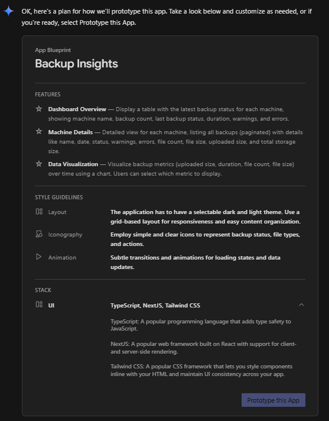
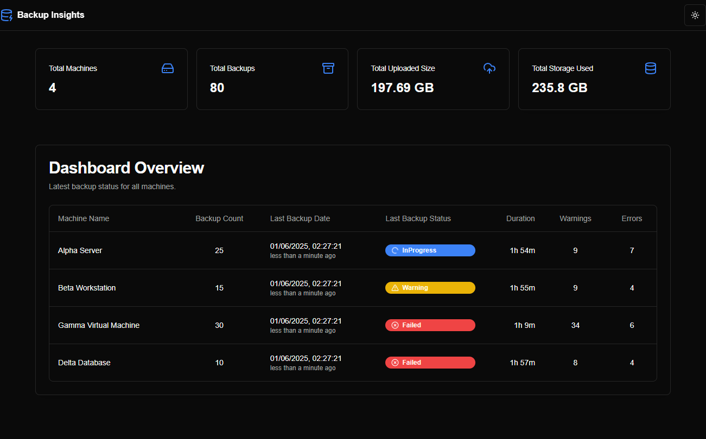
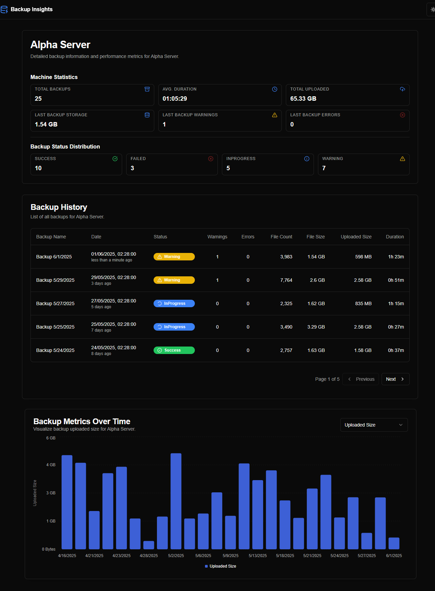

# How I Build this Application using AI tools

<!-- START doctoc generated TOC please keep comment here to allow auto update -->
<!-- DON'T EDIT THIS SECTION, INSTEAD RE-RUN doctoc TO UPDATE -->
**Table of Contents**  

- [Motivation](#motivation)
- [Tools used](#tools-used)
- [UI](#ui)
- [Backend](#backend)
  - [Setup](#setup)
  - [Implementation](#implementation)
    - [Using AI to generate the prompt](#using-ai-to-generate-the-prompt)
    - [Start the implementation journey](#start-the-implementation-journey)
- [Notes](#notes)
- [License](#license)

<!-- END doctoc generated TOC please keep comment here to allow auto update -->

# Motivation

I started using Duplicati as a backup tool for my home servers. I tried the official [Duplicati dashboard](https://app.duplicati.com/) and [Duplicati Monitoring](https://www.duplicati-monitoring.com/), but I had two main requirements: (1) self-hosted; and (2) an API exposed for integration with [Homepage](https://gethomepage.dev/), as I use it for my home lab's homepage.

I also tried connecting directly to each Duplicati server on the network, but the authentication method was not compatible with Homepage (or I was not able to configure it properly).

Since I was also experimenting with AI code tools, I decided to try using AI to build this tool. Here is the process I used...

<br/>

# Tools used

1. For the UI: [Google's Firebase Studio](https://firebase.studio/)
2. For the implementation: Cursor (https://www.cursor.com/)

<br/>

> [!NOTE]
> I used Firebase for the UI, but you can also use [v0.app](https://v0.app/) or any other tool to generate the prototype. I used Cursor to generate the implementation, but you can use other tools, like VS Code/Copilot, Windsurf, ...

<br/>

# UI

I created a new project in [Firebase Studio](https://studio.firebase.google.com/) and used this prompt in the "Prototype an app with AI" feature:


<br/>

> A web dashboard application using tailwind/react to consolidate in a sqllite3 database the backup result sent by the duplicati backup solution using the option --send-http-url (json format) of several machines, keep tracking of the status of the backup, size, upload sizes.
> 
> The dashboard first page should have a table with the last backup of each machine in the first page, including the machine name, number of backups stored in the database, the last backup status, duration (hh:mm:ss), number of warnings and errors.
> 
> When clicking a machine line, show a detail page of the select machine with a list of the stored backups (paginated), including the backup name, date and time of the backup, including how long it was ago, the status, number of warnings and errors, number of files, the size of the files, size uploaded and the total size of the storage. Also include in the detail page a chart using Tremor with the evolution of the fields: uploaded size; duration in minutes, number of files examined, size of the files examined. The chart should plot one field at time, with a dropbox to select the desired field to plot. Also the chart has to present all the backups stored in the database, not only the ones showing in the paginated table.
> 
> The application has to expose a api endpoint to receive the post from the duplicati server and other api endpoint to retrieve all the details of the last backup of a machine as a json.
> 
> The design should be modern, responsive and include icons and other visual aids to make it easy to read. The code has to be clean, concise and easy to maintain. Use modern tools like pnpm to deal with dependencies.
> 
> The application has to have a selectable dark and light theme.
> 
> The database should store these fields received by the duplicati json:
```json
"{ "Data": { "DeletedFiles": 0, "DeletedFolders": 0, "ModifiedFiles": 0, "ExaminedFiles": 15399, "OpenedFiles": 1861, "AddedFiles": 1861, "SizeOfModifiedFiles": 0, "SizeOfAddedFiles": 13450481, "SizeOfExaminedFiles": 11086692615, "SizeOfOpenedFiles": 13450481, "NotProcessedFiles": 0, "AddedFolders": 419, "TooLargeFiles": 0, "FilesWithError": 0, "ModifiedFolders": 0, "ModifiedSymlinks": 0, "AddedSymlinks": 0, "DeletedSymlinks": 0, "PartialBackup": false, "Dryrun": false, "MainOperation": "Backup", "ParsedResult": "Success", "Interrupted": false, "Version": "2.1.0.5 (2.1.0.5_stable_2025-03-04)", "EndTime": "2025-04-21T23:46:38.3568274Z", "BeginTime": "2025-04-21T23:45:46.9712217Z", "Duration": "00:00:51.3856057", "WarningsActualLength": 0, "ErrorsActualLength": 0, "BackendStatistics": { "BytesUploaded": 8290314, "BytesDownloaded": 53550393, "KnownFileSize": 9920312634, "LastBackupDate": "2025-04-22T00:45:46+01:00", "BackupListCount": 6, "ReportedQuotaError": false, "ReportedQuotaWarning": false, "MainOperation": "Backup", "ParsedResult": "Success", "Interrupted": false, "Version": "2.1.0.5 (2.1.0.5_stable_2025-03-04)", "BeginTime": "2025-04-21T23:45:46.9712252Z", "Duration": "00:00:00", "WarningsActualLength": 0, "ErrorsActualLength": 0 } }, "Extra": { "OperationName": "Backup", "machine-id": "66f5ffc7ff474a73a3c9cba4ac7bfb65", "machine-name": "WSJ-SER5", "backup-name": "WSJ-SER5 Local files", "backup-id": "DB-2" } } "
```

<br/>


this generated an App Blueprint, which I then modified slightly (as below) before clicking `Prototype this App`:




I later used these prompts to adjust and refine the design and behavior:

<br/>

> remove the button "view details" from the dashboard overview page and the link on the machine name, if the user click anywhere on the row, it will show the detail page.

> when presenting sizes in bytes, use a automatic scale (KB, MB, GB, TB).

> in the detail page, move the chart after the table. Change the color of the barchart to some other color compatible with light and dark themes.

> in the detail page, reduce the number of rows to present 5 backups per page.

> in the dashboard overview, put a summary on top with the number of machines in the database, total number of backups of all machines, the total uploaded size of all backups and total storage used by all machines. Include icons to facilitate the visualization.


> please persist the theme select by the user. also, add some lateral margins and make the UI use 90% of the available width.

> in the machine detail header card, include a sumary with the total of backups stored for this machine, a statistic of the backup status, the number of warnings and errors of the last backup, the average duration in hh:mm:ss, the total uploaded size of all backups and the storage size used based on the last backup information received.

> make the summary smaller and more compact to reduce the footprint used.

> when presenting the last backup date, show in the same cell, in a small gray font, the time ago the backup happened (for instance, x minute ago, x hours ago, x days ago, x weeks ago, x months ago, x years ago).

> in the dashboard overview put last backup date before last backup status


<br/>

After iterating through these prompts, Firebase generated the prototype as shown in the screenshots below:





> [!NOTE]
> One interesting point was that, since the first interaction, Firebase Studio generated random data to populate the pages/charts, making the prototype function like a live application.

After completing the initial prototype, I accessed the source code by clicking the `</>` button in the interface. I then used the Git extension to export the code and push it to a private repository on [GitHub](https://www.github.com).


<br/><br/>

# Backend

<br/>

## Setup

I downloaded the code from GitHub (using the `git clone` command) to a local folder (in my case, a Raspberry Pi 5 running Linux) and installed the dependencies Node.js, npm, and pnpm. See more details in [DEVELOPMENT.md](DEVELOPMENT.md).

I set up Cursor to access the code folder from my Windows machine using an SSH connection.

I copied a sample of the JSON sent by Duplicati into a file called [`database_values.json`](database_values.json), clearing some unwanted fields.

<br/>

## Implementation

I used an initial prompt to begin the implementation, focusing on persistence, fixes, and new features. It was a long but very interesting process.

### Using AI to generate the prompt


I created a detailed prompt using Cursor Chat (`Manual` mode, `Auto` model):

> improve this text as a prompt to cursor ai tool to generate the implementation of an applicaiton prototype:
> 
> please create a plan generate the full implementation of a Next.js application prototype from this codebase. Your implementation should thoroughly analyze the provided codebase to maintain the exact visual aesthetics, user experience, and navigation flow. For data storage, utilize SQLite3. Generate the database and populate it using the structure and content found in the @database_values.json file, ensuring every field from the JSON is fully integrated and persisted.

The AI generated the following prompt:


>Create a comprehensive implementation plan for a Next.js application prototype with the following requirements:
>
>1. Technical Stack:
>   - Next.js 14+ with App Router
>   - TypeScript for type safety
>   - SQLite3 for data persistence
>   - TailwindCSS for styling
>   - React Server Components where appropriate
>   - Client components for interactive elements
>
>2. Database Design:
>   - Analyze database_values.json to create an optimal SQLite schema
>   - Design tables to efficiently store all backup data
>   - Include indexes for common queries
>   - Implement data validation and type safety
>
>3. Application Structure:
>   - Implement the exact UI/UX from the provided codebase
>   - Create reusable components for common elements
>   - Set up proper routing using App Router
>   - Implement responsive layouts
>   - Add dark/light theme support
>
>4. Core Features:
>   - Dashboard overview with machine status table
>   - Detailed machine view with backup history
>   - Data visualization using charts
>   - Real-time backup status updates
>   - Proper error handling and loading states
>
>5. Data Management:
>   - Create API routes for data operations
>   - Implement efficient data fetching strategies
>   - Add proper data validation
>   - Include error handling for database operations
>
>Please provide a detailed implementation plan that covers all these aspects while maintaining the existing visual design and user experience.

I copied the generated prompt to the clipboard.

### Start the implementation journey

I created a new chat by clicking the `+` button, switched to `Agent` mode, and pasted the prompt using Ctrl+Shift+V (as text).

After the plan was generated, I typed `please, implement this plan` in the chat to begin the implementation.

> [!NOTE]
> I only included the starting point since I didn't record all the prompts used. There were many of them.

<br/><br/>

# Notes

- Some models can get stuck when fixing bugs. "claude-3.5" and "claude-4" are usually better, but sometimes you have to try another model (GPT, Gemini, etc.).
For complex bugs or errors, use a prompt to analyze possible causes of the error instead of simply asking to fix it.
- When making complex modifications, use a prompt to create a plan and then ask the AI agent to implement it. This always works better.
- Be specific when changing the source code. If possible, select the relevant part of the code in the editor and press Ctrl+L to include it in the chat as context.
- Also include a reference to the file you are mentioning in the chat to help the AI agent focus on the relevant part of the code and avoid making changes in other parts of the code.
- I have the tendency to anthropomorphize the AI agent given that it persistently uses 'we', 'our code' and 'would you like me to...'. This is also to improve my odds of survival in case (or [when](https://ai-2027.com/)) Skynet becomes sentient and the Terminator is invented.
- Sometimes, use [Gemini](https://gemini.google.com/app), [Deepseek](https://chat.deepseek.com/), [ChatGPT](https://chat.openai.com/), [Manus](https://manus.im/app),... to generate prompts with better instructions for the AI agent. 


<br/><br/>

# License

The project is licensed under the [Apache License 2.0](../LICENSE).   

**Copyright © 2025 Waldemar Scudeller Jr.**
