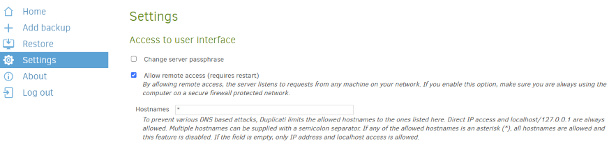
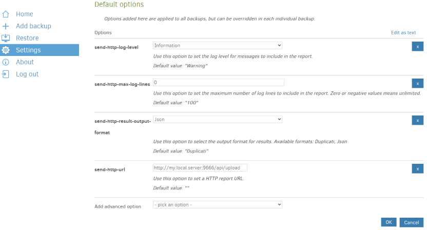

# Installation Guide


This document describes how to install and configure the **duplistatus** server. It also describes an important configuration that needs to be performed on **Duplicati** servers.

<br>

<!-- START doctoc generated TOC please keep comment here to allow auto update -->
<!-- DON'T EDIT THIS SECTION, INSTEAD RE-RUN doctoc TO UPDATE -->
**Table of Contents**  

- [Prerequisites](#prerequisites)
- [Container Images](#container-images)
- [Installation](#installation)
  - [Container Images](#container-images-1)
  - [Option 1: Using Docker Compose](#option-1-using-docker-compose)
  - [Option 2: Using Portainer Stacks (Docker Compose)](#option-2-using-portainer-stacks-docker-compose)
  - [Option 3: Using Portainer Stacks (GitHub Repository)](#option-3-using-portainer-stacks-github-repository)
  - [Option 4: Using Docker CLI](#option-4-using-docker-cli)
  - [Option 5: Using Podman with Pod (CLI)](#option-5-using-podman-with-pod-cli)
  - [Option 6: Using Podman Compose (CLI)](#option-6-using-podman-compose-cli)
- [Configuring the locale and timezone](#configuring-the-locale-and-timezone)
  - [Using your Linux Configuration](#using-your-linux-configuration)
  - [List of available Locales and Timezones](#list-of-available-locales-and-timezones)
- [Environment Variables](#environment-variables)
- [Duplicati Server Configuration (Required)](#duplicati-server-configuration-required)
- [Next Steps](#next-steps)
- [License](#license)

<!-- END doctoc generated TOC please keep comment here to allow auto update -->

<br>

## Prerequisites

Ensure you have the following installed:
- Docker Engine - [Debian installation guide](https://docs.docker.com/engine/install/debian/)
- Docker Compose -  [Linux installation guide](https://docs.docker.com/compose/install/linux/)
- Portainer (optional) - [Docker installation guide](https://docs.portainer.io/start/install-ce/server/docker/linux)
- Podman(optional) -  [Installation guide](http://podman.io/docs/installation#debian) 

<br>

## Container Images

You can use the images from:
- **Docker Hub**: `wsjbr/duplistatus:latest`
- **GitHub Container Registry**: `ghcr.io/wsj-br/duplistatus:latest`

<br>

## Installation

The application can be deployed using Docker, [Portainer Stacks](https://docs.portainer.io/user/docker/stacks), or Podman.

<br>

### Container Images

You can use the images from:

- **Docker Hub**: `wsjbr/duplistatus:latest`
- **GitHub Container Registry**: `ghcr.io/wsj-br/duplistatus:latest`

<br>

### Option 1: Using Docker Compose

This is the recommended method for local deployments or when you want to customize the configuration. It uses a `docker-compose` file to define and run the container with all its settings.

Create a file called `duplistatus.yml` containing the following:

```yaml
services:
  duplistatus:
    image: wsjbr/duplistatus:latest
    container_name: duplistatus
    restart: unless-stopped
    ports:
      - "9666:9666"
    volumes:
      - duplistatus_data:/app/data
    networks:
      - duplistatus_network

networks:
  duplistatus_network:
    driver: bridge

volumes:
  duplistatus_data:
    name: duplistatus_data 
```

After creating the file, execute the `docker-compose` command to start the container in the background (`-d`):

```bash
docker-compose -f duplistatus.yml up -d
```

<br>

### Option 2: Using Portainer Stacks (Docker Compose)

1. Go to "Stacks" in your [Portainer](https://docs.portainer.io/user/docker/stacks) server and click "Add stack".
2. Name your stack (e.g., "duplistatus").
3. Choose "Build method" as "Web editor".
4. Copy and paste content of `duplistatus.yml` on "Option 1"
5. Click "Deploy the stack".

<br>

### Option 3: Using Portainer Stacks (GitHub Repository)

1. In [Portainer](https://docs.portainer.io/user/docker/stacks), go to "Stacks" and click "Add stack".
2. Name your stack (e.g., "duplistatus").
3. Choose "Build method" as "Repository".
4. Enter the repository URL: `https://github.com/wsj-br/duplistatus.git`
5. In the "Compose path" field, enter: `docker-compose.yml`
6. Click "Deploy the stack".

<br>

### Option 4: Using Docker CLI

```bash
# Create the volume
docker volume create duplistatus_data

# Start the container
docker run -d \
  --name duplistatus \
  -p 9666:9666 \
  -v duplistatus_data:/app/data \
  wsjbr/duplistatus:latest
```

- The `duplistatus_data` volume is used for persistent storage.

<br>

### Option 5: Using Podman with Pod (CLI)

```bash
# Create a pod for the container
podman pod create --name Duplistatus --publish 9666:9666/tcp

# Create and start the container
podman create \
  --name duplistatus \
  --pod Duplistatus \
  --user root \
  -v /root/duplistatus_home/data:/app/data \
  ghcr.io/wsj-br/duplistatus:latest

# Start the pod (which starts the container)
podman pod start Duplistatus
```

<br>

### Option 6: Using Podman Compose (CLI)

Create the `duplistatus.yml` file as instructed in Option 1 above, and then run:

```bash
podman-compose -f duplistatus.yml up -d
```

<br><br>

## Configuring the locale and timezone

The application's user interface will be displayed according to the browser's locale settings. However, for logging and notification purposes, the application will use the values defined in the `LANG` and `TZ` environment variables to format values and time zones. 

<br>

>[!NOTE]
> Changing the locale setting (`LANG`) from the default `en.GB.UTF-8` to a different value 
> will only affect the formatting of numbers and dates. 
> The language used by the application will remain English.

<br>

For example, to change the locale/timezone to Brazilian Portuguese/São Paulo, add these lines to the `duplistatus.yml`:

```yaml
    environment:
      - LANG="pt-BR.UTF-8"
      - TZ="America/Sao_Paulo"
```

or pass these variables in the command line

```bash
  --env  LANG="pt-BR.UTF-8" --env TZ="America/Sao_Paulo" 
``` 
<br>

### Using your Linux Configuration

To obtain your Linux host's configuration, you can use execute:

```bash
echo LANG=\"$LANG\"; echo TZ=\"$(</etc/timezone)\"
```

<br>

### List of Locales and Timezones


| Configuration |  List                                                                                      |
| ----          | ------------------------------------------------------------------------------------------ |
| TZ            |  [Wikipedia: List of tz database time zones](https://en.wikipedia.org/wiki/List_of_tz_database_time_zones#List) |
| LANG          | execute `ls -c /usr/share/i18n/locales`                                                    |

When selecting a locale, remember to append the `.UTF-8` encoding to ensure proper functionality.

<br><br>

## Environment Variables

The application supports the following environment variables for configuration:

| Variable                  | Description                                            | Default         |
| ------------------------- | ------------------------------------------------------ | :------------   |
| `PORT`                    | Port for the main web application                      | `9666`          |
| `CRON_PORT`               | Port for the cron service. If not set, uses `PORT + 1` | `9667`          |
| `NODE_ENV`                | Node.js environment (`development` or `production`)    | `production`    |
| `NEXT_TELEMETRY_DISABLED` | Disable Next.js telemetry                              | `1`             |
| `LANG`                    | Language and locale setting for the application        | `en_GB.UTF-8`   |
| `TZ`                      | Timezone for the application                           | `Europe/London` |

<br><br>

## Duplicati Server Configuration (Required)

In order for this application to work properly, the Duplicati server needs to be configured to send HTTP reports for each backup run to **duplistatus** server.

Apply this configuration to all your Duplicati servers:


1. **Allow remote access:**  Log in to [Duplicati's UI](https://docs.duplicati.com/getting-started/set-up-a-backup-in-the-ui), select `Settings`, and allow remote access, including a list of hostnames (or use `*`). 

<div style="padding-left: 60px;">



<br>

> [!CAUTION]
>  Only enable remote access if your Duplicati server is protected by a secure network (e.g., VPN, private LAN, or firewall rules). Exposing the Duplicati interface to the public internet without proper security measures could lead to unauthorized access.


</div>

<br>

2. **Configure backup result reporting:** On the Duplicati configuration page, select `Settings` and, in the `Default Options` section, include the following options. Replace 'my.local.server' with your server name or IP address where **duplistatus** is running.

<div style="padding-left: 60px;">

   | Advanced option                  | Value                                    |
   | -------------------------------- | ---------------------------------------- |
   | `send-http-url`                  | `http://my.local.server:9666/api/upload` |
   | `send-http-result-output-format` | `Json`                                   |
   | `send-http-log-level`            | `Information`                            |
   | `send-http-max-log-lines`        | `0`                                      |

> [!TIP]
>  Click on `Edit as text` and copy the lines below, replacing `my.local.server` with your actual server address.

```bash
--send-http-url=http://my.local.server:9666/api/upload
--send-http-result-output-format=Json
--send-http-log-level=Information
--send-http-max-log-lines=0
```

<br>





<br>

**Important notes on messages sent by Duplicati:**

- If you omit `--send-http-log-level=Information`, no log messages will be sent to **duplistatus**, only statistics. This will prevent the available versions feature from working.
- The recommended configuration is `--send-http-max-log-lines=0` for unlimited messages, since the Duplicati default of 100 messages may prevent the available versions from being received in the log.
- If you limit the number of messages, the log messages required to obtain the available backup versions may not be received. This will prevent those versions from being displayed for that backup run.

<br>

 > [!TIP]
> After configuring the **duplistatus** server, collect the backup logs for all your Duplicati servers using [Collect Backup Logs](USER-GUIDE.md#collect-backup-logs).

</div>

<br><br>

## Next Steps

Check the [User Guide](USER-GUIDE.md) on how to use **duplistatus**.


## License

The project is licensed under the [Apache License 2.0](../LICENSE).   

**Copyright © 2025 Waldemar Scudeller Jr.**