# duplistatus User Guide


Welcome to the **duplistatus** user guide. This document provides comprehensive instructions for using **duplistatus** to monitor and manage your Duplicati backup operations.

<br/>

>[!IMPORTANT]
> If you are upgrading from version 0.6.1 or earlier, check the [Releases notes](RELEASE-NOTES-0.7.27.md) about all changes in this version.

<br/>

<!-- START doctoc generated TOC please keep comment here to allow auto update -->
<!-- DON'T EDIT THIS SECTION, INSTEAD RE-RUN doctoc TO UPDATE -->

- [Installation](#installation)
- [Getting Started](#getting-started)
- [User Interface](#user-interface)
- [Application Toolbar](#application-toolbar)
- [Dashboard Summary](#dashboard-summary)
- [Cards Layout](#cards-layout)
  - [Backup Details](#backup-details)
- [Table Layout](#table-layout)
  - [Notifications Icons](#notifications-icons)
  - [Overdue Details](#overdue-details)
  - [Available Backup Versions](#available-backup-versions)
- [Backup Metrics](#backup-metrics)
- [Server Details](#server-details)
  - [Server/Backup Statistics](#serverbackup-statistics)
  - [Backup History](#backup-history)
- [Backup Details](#backup-details-1)
- [Duplicati Configuration](#duplicati-configuration)
- [Display Settings](#display-settings)
- [Collect Backup Logs](#collect-backup-logs)
  - [Steps to Collect Backup Logs](#steps-to-collect-backup-logs)
  - [How the Collection Process Works](#how-the-collection-process-works)
- [Database Maintenance](#database-maintenance)
  - [Data Cleanup Period](#data-cleanup-period)
  - [Delete Backup Job Data](#delete-backup-job-data)
  - [Delete Server Data](#delete-server-data)
- [Settings](#settings)
  - [Backup Notifications Settings](#backup-notifications-settings)
    - [Configure Per-Backup Notification Settings](#configure-per-backup-notification-settings)
    - [Global Configurations](#global-configurations)
    - [Action Buttons](#action-buttons)
  - [Overdue Check Process](#overdue-check-process)
  - [Server Settings](#server-settings)
  - [NTFY Settings](#ntfy-settings)
    - [About NTFY](#about-ntfy)
  - [Notification Templates](#notification-templates)
- [Homepage Integration (Optional)](#homepage-integration-optional)
  - [Summary Widget](#summary-widget)
  - [Last Backup Information Widget](#last-backup-information-widget)
  - [Configuration Notes](#configuration-notes)
- [Troubleshooting](#troubleshooting)
- [Additional Resources](#additional-resources)
- [Licence](#licence)

<!-- END doctoc generated TOC please keep comment here to allow auto update -->

<br/><br/>

## Installation
See [INSTALL.md](INSTALL.md) for prerequisites and installation instructions.

<br/><br/>

## Getting Started

After installation, access the **duplistatus** web interface:

1.  Open your web browser.

2.  Navigate to `http://your-server-ip:9666`.

      - Replace `your-server-ip` with the actual IP address or hostname of the server where **duplistatus** is installed. The default port is `9666`.

3.  The dashboard displays automatically.

<br/>

> [!TIP]
> On the first use, you should collect backup logs from all your Duplicati servers
>  to populate the database. Please refer to the [Collect Backup Logs](#collect-backup-logs) 
> section for guidance.

<br/><br/>

## User Interface


**duplistatus** provides a comprehensive dashboard for monitoring Duplicati backup operations across multiple servers. 

<br/>

<div style="padding-left: 60px;">

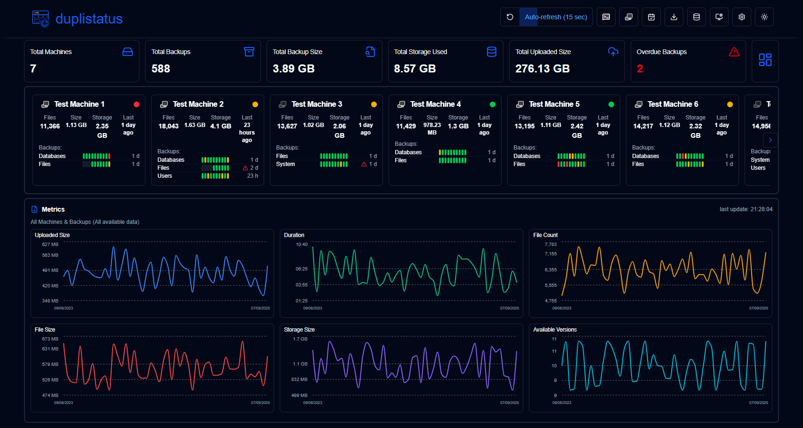

<br/>

The user interface consists of several elements, organised into different sections to provide a clear and intuitive experience:

1.  [**Application Toolbar**](#application-toolbar): Provides easy access to main functions and configurations.
2.  [**Dashboard Summary**](#dashboard-summary): A summary of all monitored servers.
3.  **Servers Overview**: [Cards](#cards-layout) or a [table](#table-layout) showing the latest status of all backups from monitored Duplicati servers.
4.  [**Overdue Details**](#overdue-details): A visual warning for overdue backups with details on hover.
5.  [**Available Backup Versions**](#available-backup-versions): Click the blue icon to view backup versions available on the backup destination.
6.  [**Backup Metrics**](#backup-metrics): Charts displaying backup metrics over time.
7.  [**Server Details**](#server-details): A list of recorded backups for a specific server, including statistics.
8.  [**Backup Details**](#backup-details): Detailed information for a specific backup, including log messages (execution, warnings, and errors).

</div>

<br/>

## Application Toolbar

The toolbar provides easy access to key functions and settings.

<div style="padding-left: 60px;">

 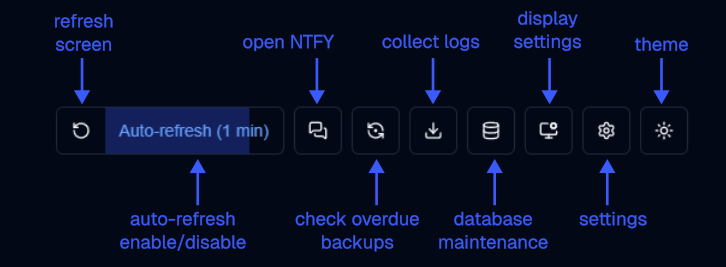

| Button                                              | Description                                                                                      |
|-----------------------------------------------------|--------------------------------------------------------------------------------------------------|
| Refresh screen                                      | Execute a refresh immediately                                                                    |
| Auto-refresh                                        | Enable/disable auto-refresh. Configure the interval in [`Display Settings`](#display-settings)   |
| Open NTFY                                           | Open the ntfy.sh website on the topic configured in [`Settings → NTFY Settings`](#ntfy-settings) |
| [Duplicati configuration](#duplicati-configuration) | Open the Duplicati server configuration (web interface)                                          |
| [Check overdue backups](#overdue-check-process)     | Execute the check for overdue backups now                                                        |
| [Collect  logs](#collect-backup-logs)               | Connect to a Duplicati server to collect all backup logs from its database                       |
| [Database maintenance](#database-maintenance)       | Clean the database, remove old backup logs, or delete data for a specific server                 |
| [Display Settings](#display-settings)               | Configure how **duplistatus** will display data                                                    |
| [Settings](#settings)                               | Configure notifications, overdue monitoring, server details and templates                        |
| Theme                                               | Toggle between dark (default) and light themes                                                   |

</div>

<br/><br/>

##  Dashboard Summary

This section displays aggregated statistics for all backups.

<div style="padding-left: 60px;">

  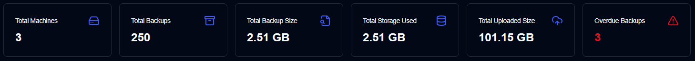
  


  - **Total Servers**: The number of servers being monitored.
  - **Total Backups Jobs**: The total number of backup jobs (types) configured for all servers.
  - **Total Backups Runs**: The total number of backup logs from runs received or collected for all servers.
  - **Total Backup Size**: The combined size of all source data, based on the latest backup logs received.
  - **Storage Used**: The total storage space used by backups on the backup destination (e.g., cloud storage, FTP server, local drive), based on the latest backup logs.
  - **Uploaded Size**: The total amount of data uploaded from the Duplicati server to the destination (e.g., local storage, FTP, cloud provider).
  - **Overdue Backups** (table) : The number of backups that are overdue. See [Backup Notifications Settings](#backup-notifications-settings)
  - **Layout Toggle**: Switches between the Cards layout (default) and the Table layout.

</div>

<br/><br/>

##  Cards Layout

The cards layout shows the status of the most recent backup log received for each backup.

<div style="padding-left: 60px;">


  - **Server Name**: Name of the Duplicati server (or the alias)
    - Hovering over the **Server Name** will show the server name and note 
- **Overall Status**: The status of the server. Overdue backups will show as a `Warning` status
- **Summary information**: The consolidated number of files, size and storage used for all backups of this server. Also shows the elapsed time of the most recent backup received (hover over to show the timestamp)
- **Backups list**: A table with all the backups configured for this server, with 3 columns:
   - **Backup Name**: Name of the backup in the Duplicati server
   - **Status history**: Status of the last 10 backups received. 
   - **Last backup received**: The elapsed time since the current time of the last log received. It will show a warning icon if the backup is overdue. 
      - Time is shown in abbreviated format: `m` for minutes, `h` for hours, `d` for days, `w` for weeks, `mo` for months, `y` for year.

> [!NOTE]
> You can use the [Display Settings](#display-settings) to configure the card sort order. The available options are `Server name (a-z)`, `Status (error > warning > success)`, and `Last backup received (new > old)`.

<br/>

The user can toggle the top right button on the side panel to toggle the panel view: 
  - Status: Show statistics of the backup jobs per status, with a list of overdue backups and backup jobs with warnings/errors status. 

<div style="padding-left: 100px;">


  
</div>

  - Metrics: Show charts with duration, file size and storage size over time for the aggregated or selected server.

<div style="padding-left: 100px;">

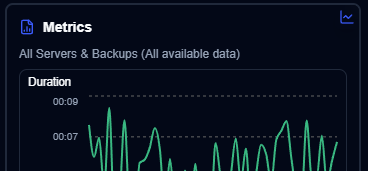
  
</div>

</div>

<br/>

### Backup Details 

Hovering over a backup in the list displays details of the last backup log received and any overdue information.

<div style="padding-left: 60px;">


  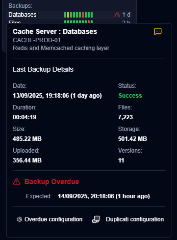


  - **Server Name : Backup**: The name or alias of the Duplicati server and backup, will also show the server name and note.
    - The alias and note can be configured at `Settings → Server Settings`.
  - **Notification**: An icon showing the [configured notification](#notifications-icons) setting for new backup logs.
  - **Date**: The timestamp of the backup and the elapsed time since the last screen refresh.
  - **Status**: The status of the last backup received (Success, Warning, Error, Fatal).
  - **Duration, File Count, File Size, Storage Size, Uploaded Size**: Values as reported by the Duplicati server.
  - **Available Versions**: The number of backup versions stored on the backup destination at the time of the backup.

If this backup is overdue, the tooltip also shows:

  - **Expected Backup**: The time the backup was expected, including the configured grace period (extra time allowed before marking as overdue).

You can also click the buttons at the bottom to open `Settings → Backup Notifications` to configure overdue settings or open the Duplicati server's web interface.

</div>

<br/>

## Table Layout

The table layout lists the most recent backup logs received for all servers and backups.

<div style="padding-left: 60px;">

  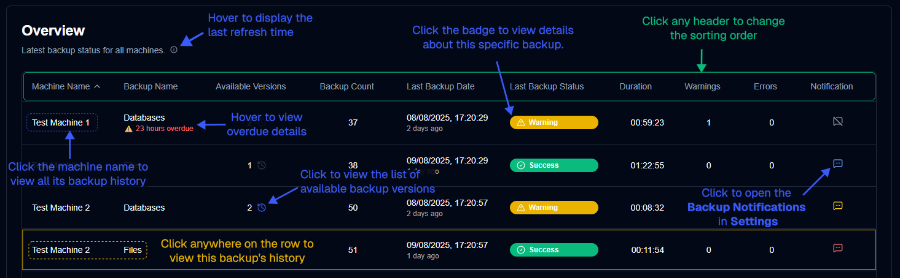

  - **Server Name**: The name of the Duplicati server (or alias)
     - Under the name the server note
  - **Backup Name**: The name of the backup in the Duplicati server.
  - **Available Versions**: The number of backup versions stored on the backup destination. If the icon is greyed out, detailed information was not received in the log. See the [Duplicati Configuration instructions](INSTALL.md#duplicati-server-configuration-required) for details.
  - **Backup Count**: The number of backups reported by the Duplicati server.
  - **Last Backup Date**: The timestamp of the last backup log received and the elapsed time since the last screen refresh.
  - **Last Backup Status**: The status of the last backup received (Success, Warning, Error, Fatal).
  - **Duration**: The duration of the backup in HH:MM:SS.
  - **Warnings/Errors**: The number of warnings/errors reported in the backup log.
  - **Settings**: 
       - **Notification**: An icon showing the configured notification setting for new backup logs.
       - **Duplicati configuration**: A button to open the Duplicati server's web interface

<br/>

### Notifications Icons
  
  | Icon                                    | Notification Option | Description                                                                                         |
  |-----------------------------------------|---------------------|-----------------------------------------------------------------------------------------------------|
  |            | Off                 | No notifications will be sent when a new backup log is received                                     |
  |            | All                 | Notifications will be sent for every new backup log, regardless of its status.                      |
  |  | Warnings            | Notifications will be sent only for backup logs with a status of Warning, Unknown, Error, or Fatal. |
  |      | Errors              | Notifications will be sent only for backup logs with a status of Error or Fatal.                    |

<br/>

</div>

> [!NOTE]
> This notification setting only applies when **duplistatus** receives a new backup log from a Duplicati server. Overdue notifications are configured separately and will be sent regardless of this setting.

<br/>

### Overdue Details

Hovering over the overdue warning icon displays details about the overdue backup.

<div style="padding-left: 60px;">

  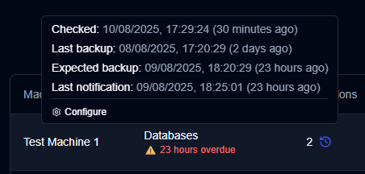

  - **Checked**: When the last overdue check was performed. Configure the frequency in [Backup Notifications Settings](#backup-notifications-settings).
  - **Last Backup**: When the last backup log was received.
  - **Expected Backup**: The time the backup was expected, including the configured grace period (extra time allowed before marking as overdue).
  - **Last Notification**: When the last overdue notification was sent.

</div>

<br/>

### Available Backup Versions

Clicking the blue clock icon opens a list of available backup versions at the time of the backup, as reported by the Duplicati server.

<div style="padding-left: 60px;">

  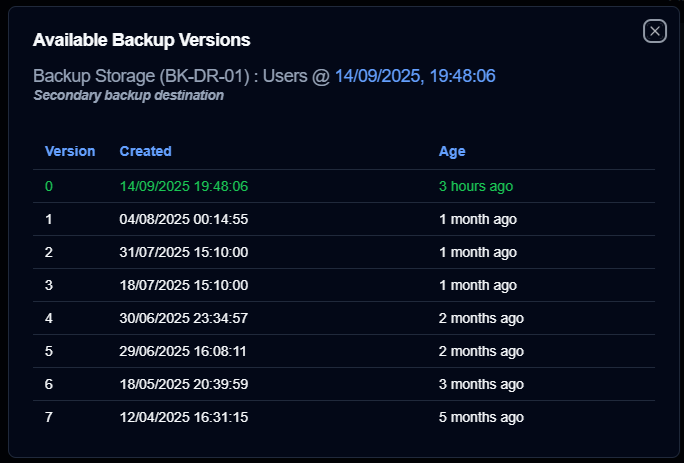

  - **Backup Details**: Shows the server name and alias, server note, backup name, and when the backup was executed.
  - **Version Details**: Shows the version number, creation date, and age.

<br/>

</div>

> [!NOTE]
> If the icon is greyed out, it means that no detailed information was received in the message logs. 
> See the [Duplicati Configuration instructions](INSTALL.md#duplicati-server-configuration-required) for details.

<br/><br/>

##  Backup Metrics

A chart of backup metrics over time is shown on both the dashboard and the server details page.

  - **Dashboard**, the chart shows the total number of backups recorded in the **duplistatus** database. If you use the Cards layout, you can select a server to see its consolidated metrics (when side panel is showing metrics).
  - **Server Details** page, the chart shows metrics for the selected server (for all its backups) or for a single, specific backup.

<div style="padding-left: 60px;">

  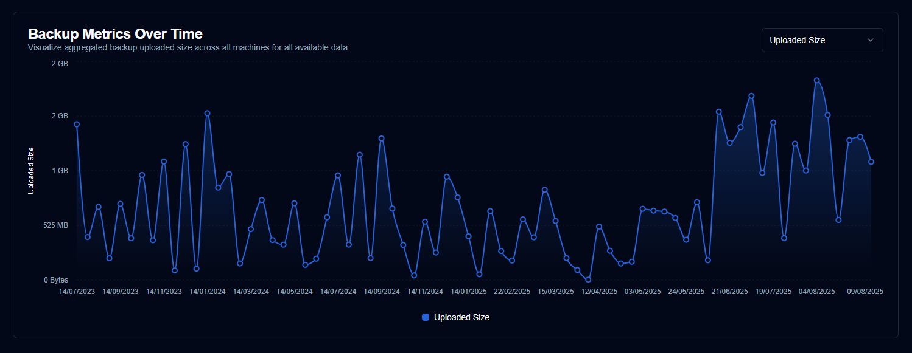

  - **Uploaded Size**: Total amount of data uploaded/transmitted during backups from Duplicati server to the destination (local storage, FTP, cloud provider, ...) per day.
 - **Duration**: The total duration of all backups received per day in HH:MM.
 - **File Count**: The sum of the file count counter received for all backups per day.
 - **File Size**: The sum of the file size reported by Duplicati server for all backups received per day.
 - **Storage Size**: The sum of the storage size used on the backup destination reported by the Duplicati server per day.
 - **Available Versions**: The sum of all available versions for all backups per day.
  
 <br/>
   
</div>

> [!NOTE]
> You can use the [Display Settings](#display-settings) control to configure the time range for the chart.

<br/><br/>

## Server Details

Clicking on a server from the dashboard opens a page with a list of backups for that server. You can view all backups or select a specific one if the server has multiple backups configured.

<div style="padding-left: 60px;">

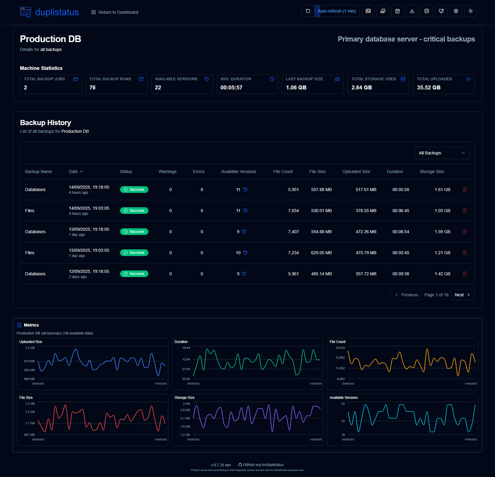

</div>

<br/>

### Server/Backup Statistics

This section shows statistics for either all backups on the server or a single selected backup.

<div style="padding-left: 60px;">

  - **TOTAL BACKUP JOBS**: Total number of backup jobs configured on this server.
  - **TOTAL BACKUP RUNS**: Total number of backup runs executed (as reported by the Duplicati server).
  - **AVAILABLE VERSIONS**: Number of available versions (as reported by the Duplicati server).
  - **AVG DURATION**: Average (mean) duration of backups recorded in the **duplistatus** database.
  - **LAST BACKUP SIZE**: Size of the source files from the last backup log received.
  - **TOTAL STORAGE USED**: Storage used on the backup destination, as reported in the last backup log.
  - **TOTAL UPLOADED**: Sum of all uploaded data recorded in the **duplistatus** database.
  - **Overdue Scheduled Backups**: If a backup is overdue, a message appears below the summary. Click the **Configure** button to go to `Settings → Backup Notifications`.

<br/>


</div>

> [!TIP]
> Use the dropdown menu in the **Backup History** section to select all backups or a specific backup for this server.

> [!NOTE]
> Cleaning the database via [Database Maintenance](#database-maintenance) will affect the **AVG DURATION** (average) and **TOTAL UPLOADED** values, as they are calculated from the records stored in the **duplistatus** database.

<br/>

### Backup History

This table lists the backup logs for the selected server.

<div style="padding-left: 60px;">

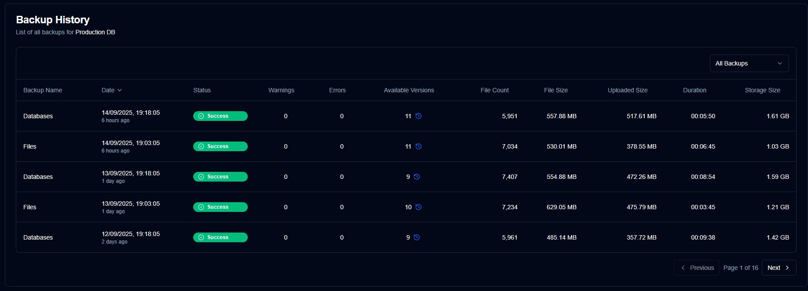

  - **Backup Name**: The name of the backup in the Duplicati server.
  - **Date**: The timestamp of the backup and the elapsed time since the last screen refresh.
  - **Status**: The status of the backup (Success, Warning, Error, Fatal).
  - **Warnings/Errors**: The number of warnings/errors reported in the backup log.
  - **Available Versions**: The number of available backup versions on the backup destination. If the icon is greyed out, detailed information was not received.
  - **File Count, File Size, Uploaded Size, Duration, Storage Size**: Values as reported by the Duplicati server.

<br/>

</div>

> [!TIP]
> • You can sort any column by clicking its header. Click again to change the sort order (ascending/descending). <br/>
> • Click anywhere on a row to view the [Backup Details](#backup-details).<br/>
> • Click the blue icon in the "Available Versions" column to display the versions available at the time of the backup.

> [!NOTE]
> When `All Backups` is selected, the list shows all backups ordered from newest to oldest by default.

<br/><br/>

## Backup Details

Clicking on a status badge in the dashboard (table view) or any row in the backup history table displays the detailed backup information.

<div style="padding-left: 60px;">

  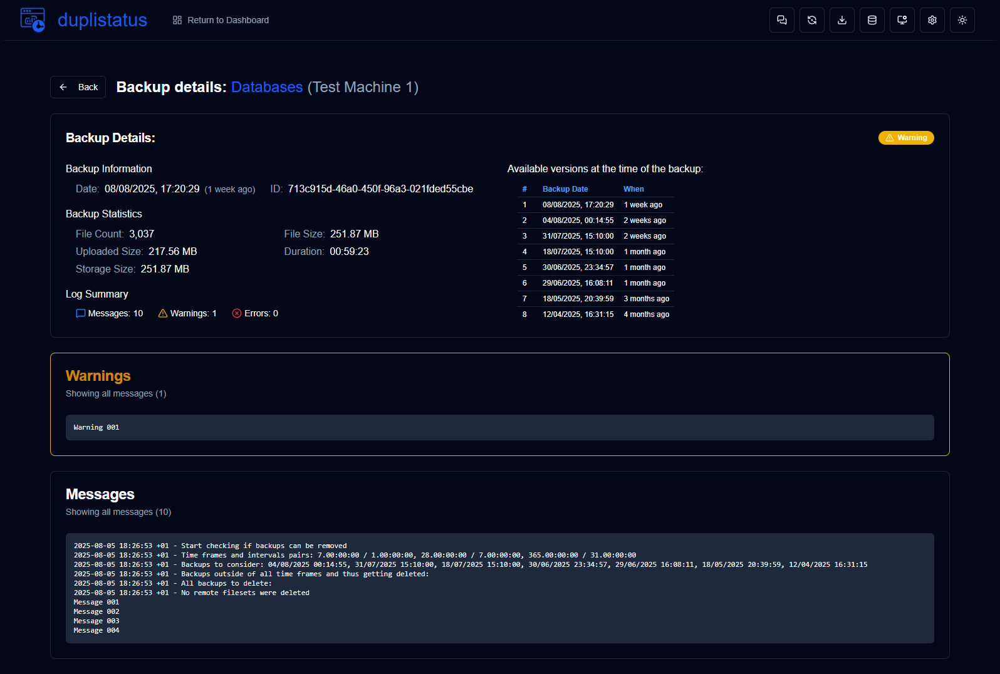

  - **Server details**: server name, alias and note.
  - **Backup Information**: The timestamp of the backup and its ID.
  - **Backup Statistics**: A summary of reported counters, sizes, and duration.
  - **Log Summary**: The number of reported messages.
  - **Available Versions**: A list of available versions (only displayed if the information was received in the logs).
  - **Messages/Warnings/Errors**: The complete execution logs. The subtitle indicates if the log was truncated by the Duplicati server. Refer to the [Duplicati Configuration instructions](INSTALL.md#duplicati-server-configuration-required) to learn how to configure Duplicati to send complete logs.

</div>

<br/><br/>

## Duplicati Configuration

The `Duplicati configuration` button on the [Application Toolbar](#application-toolbar) opens that server's web interface in a new tab.

You can select a server from the dropdown list. If you have already selected a server (by clicking its card) or are viewing its details, the button will open that specific server's Duplicati configuration directly.

<div style="padding-left: 60px;">

  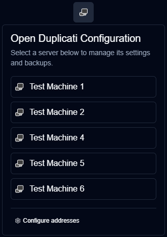

- The list of server will show the `server name` or `server alias (server name)`.
- Server addresses are configured in `Settings → Server Addresses`. 
- The application automatically saves a server's URL when you use the `Collect Backup Logs` feature.
- Server will not appear in the server list if its address has not been configured, and the `Duplicati configuration` buttons for that server will be disabled.

</div>

<br/><br/>


## Display Settings

Configure user interface and display preferences.

<div style="padding-left: 60px;">

  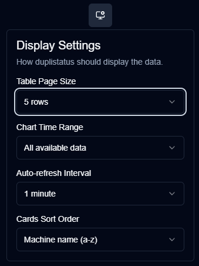

| Setting                   | Description                                         | Default Value       |
|:--------------------------|:----------------------------------------------------|:--------------------|
| **Table Size**            | Number of rows per page on the server details page. | 5 rows              |
| **Chart Time Range**      | Time interval shown in the charts.                  | All available data  |
| **Auto-refresh Interval** | How often pages refresh automatically.              | 1 minute            |
| **Cards Sort Order**      | How cards are sorted on the dashboard.              | `Server name (a-z)` |

</div>

<br/><br/>

## Collect Backup Logs

**duplistatus** can retrieve backup logs directly from Duplicati servers to populate the database or restore missing log data. The application automatically skips any duplicate logs that already exist in the database.

<div style="padding-left: 60px;">

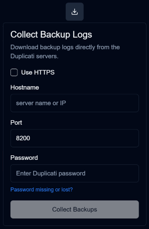

### Steps to Collect Backup Logs

1.  Click the `Collect Backup Logs` icon on the [Application Toolbar](#application-toolbar).
2.  Enter the Duplicati server details:
      - **Use HTTPS**: Select if your Duplicati server supports it, defaults to HTTP
         - **Allow Self-Signed**: Enable this option if the server uses a self-signed SSL certificate (a security certificate not issued by a trusted authority). Only shown for HTTPS.
      - **Hostname**: The hostname or IP address of the Duplicati server.
      - **Port**: The port number used by the Duplicati server (default: `8200`).
      - **Password**: Enter the authentication password if required.
      - **Download collected JSON data**: Enable this option to download the data collected by duplistatus.
3.  Click `Collect Backups`.

<br/>

### How the Collection Process Works

  - **duplistatus** connects to the specified Duplicati server.
  - It retrieves backup history and log information.
  - Any logs already present in the **duplistatus** database are skipped.
  - New data is processed and stored in the local database.
  - The URL used will be stored or updated in the local database.
  - If selected, will download the JSON data collected. The file name will be in this format: `[serverName]_collected_[Timestamp].json`. The timestamp uses the ISO 8601 date format (YYYY-MM-DDTHH:MM:SS).
  - The dashboard updates to reflect the new information.

<br/>

</div>

> [!NOTE]
> Manual collection requires the Duplicati server to be accessible from the **duplistatus** installation. If you encounter issues, please verify the following:
>
>   - Confirm that the hostname (or IP address) and port number are correct. You can test this by accessing the Duplicati server UI in your browser (e.g., `http://hostname:port`).
>   - Check that **duplistatus** can connect to the Duplicati server. A common problem is DNS name resolution (the system cannot find the server by its hostname).
>   - Ensure the password you provided is correct.

<br/><br/>


## Database Maintenance 

Manage your backup data and optimise performance through database maintenance operations.

<div style="padding-left: 60px;">

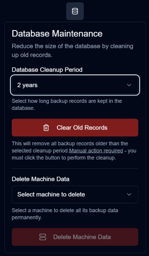

<br/>

### Data Cleanup Period

Remove outdated backup records to free up storage space and improve system performance.

1.  Click the `Database maintenance` icon on the [Application Toolbar](#application-toolbar).
2.  Choose a retention period:
      - **6 months**: Retain records from the last 6 months.
      - **1 year**: Retain records from the last year.
      - **2 years**: Retain records from the last 2 years (default).
      - **Delete all data**: Remove all backup records and servers.
3.  Click `Clear Old Records`.
4.  Confirm the action in the dialogue box.

<br/>

**Cleanup Effects:**

  - Deletes backup records older than the selected period.
  - Updates all related statistics and metrics.
  - The "Delete all data" option also clears all associated configuration settings.

<br/>

### Delete Backup Job Data

Remove a specific Backup Job (type)  data.

1.  Click the `Database maintenance` icon on the [Application Toolbar](#application-toolbar).
2.  Select a Backup Job from the dropdown list.
     - the backups will be ordered by server alias or name then the backup name.
3.  Click `Delete Server Data`.
4.  Confirm the action in the dialogue box.

<br/>

**Deletion Effects:**

  - Permanently deletes all associated to this Backup Job / Server.
  - Cleans up associated configuration settings.
  - Updates dashboard statistics accordingly.

<br/>

### Delete Server Data

Remove a specific server and all its associated backup data.

1.  Click the `Database maintenance` icon on the [Application Toolbar](#application-toolbar).
2.  Select a server from the dropdown list.
3.  Click `Delete Server Data`.
4.  Confirm the action in the dialogue box.

<br/>

**Deletion Effects:**

  - Permanently deletes the selected server and all its backup records.
  - Cleans up associated configuration settings.
  - Updates dashboard statistics accordingly.

<br/>

</div>

> [!NOTE]
> All statistics on the dashboard, detail pages, and charts are calculated using data from the **duplistatus** database. Deleting old information will impact these calculations.
> <br/><br/>
> If you accidentally delete data, you can restore it using the [Collect Backup Logs](#collect-backup-logs) feature.

<br/><br/>

## Settings

This section explains how to configure **duplistatus**. The settings available are:

- **Backup Alerts**: Configure the notification to be sent when a backup log is received and the overdue monitoring parameters.
- **Server Settings**: Configure the server alias, a note (usually to describe the function of the server), and the web addresses of your Duplicati servers
- **NTFY Settings**: Configure the NTFY (notification service) server URL and topic to send push notifications to your phone or desktop
- **Notifications Templates**: Configure the content of the notifications, when backups are successful, with warnings or errors and for overdue backups.


<br/>

### Backup Notifications Settings

<div style="padding-left: 60px;">

  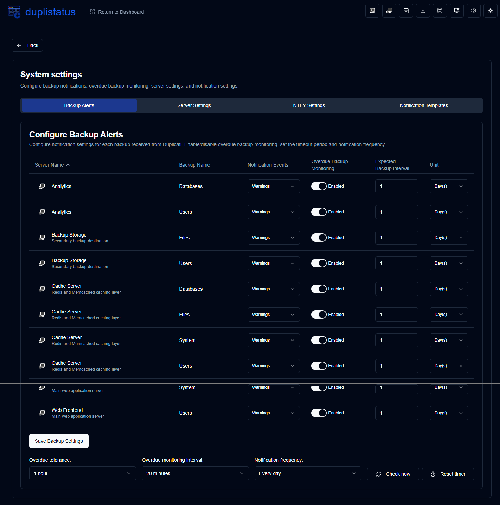

<br/>

#### Configure Per-Backup Notification Settings

  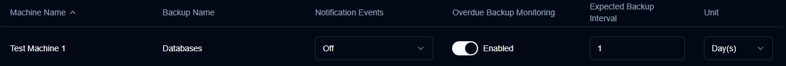

| Setting                       | Description                                               | Default Value |
|:------------------------------|:----------------------------------------------------------|:--------------|
| **Notification Events**       | Configure when to send notifications for new backup logs. | `Warnings`    |
| **Overdue Backup Monitoring** | Enable or disable overdue monitoring for this backup.     | `Enabled`     |
| **Expected Backup Interval**  | How often backups are expected to run.                    | `1`           |
| **Unit**                      | The time unit for the interval (Hours/Days).              | `Day(s)`      |

**Notification Events Options:**

  - `all`: Send notifications for all backup events.
  - `warnings`: Send notifications for warnings and errors only.
  - `errors`: Send notifications for errors only.
  - `off`: Disable notifications for new backup logs for this backup.

</div>
<div style="padding-left: 60px;">

> [!NOTE]
> These options only control notifications sent when a [new backup log is received](INSTALL.md#duplicati-server-configuration-required). Overdue notifications will be sent regardless of these settings.

</div>
<div style="padding-left: 60px;">

<br/>

#### Global Configurations

These settings apply to all backups:

  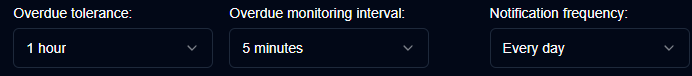

| Setting                         | Description                                                                                                                                                                                                                                                                                                           |
|:--------------------------------|:----------------------------------------------------------------------------------------------------------------------------------------------------------------------------------------------------------------------------------------------------------------------------------------------------------------------|
| **Overdue Tolerance**           | The grace period (extra time allowed) added to the expected backup time before marking as overdue. The default is `1 hour`.                                                                                                                                                                                                                                          |
| **Overdue Monitoring Interval** | How often the system checks for overdue backups. The default is `5 minutes`.                                                                                                                                                                                                                                          |
| **Notification Frequency**      | How often to send overdue notifications: <br/> - `One time`: Send one notification when the backup becomes overdue. <br/> - `Every day`: Send daily notifications while overdue (default).<br/> - `Every week`: Send weekly notifications while overdue. <br/> - `Every month`: Send monthly notifications while overdue. |

<br/>

#### Action Buttons

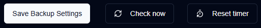

| Button                 | Description                                                                              |
|:-----------------------|:-----------------------------------------------------------------------------------------|
| `Save Backup Settings` | Saves the settings, clears timers for any disabled backups, and runs an overdue check.   |
| `Check now`            | Runs the overdue backup check immediately. This is useful after changing configurations. |
| `Reset timer`          | Resets the last overdue notification sent for all backups.                               |

<br/>

### Overdue Check Process

**How it works:**

| **Step** | **Value**                  | **Description**                              | **Example**        |
|:--------:|:---------------------------|:---------------------------------------------|:-------------------|
|    1     | **Last Backup**            | The timestamp of the last successful backup. | `2024-01-01 08:00` |
|    2     | **Expected Interval**      | The configured backup frequency.             | `1 day`            |
|    3     | **Calculated Next Backup** | `Last Backup` + `Expected Interval`          | `2024-01-02 08:00` |
|    4     | **Tolerance**              | The configured grace period (extra time allowed).                 | `1 hour`           |
|    5     | **Expected Next Backup**   | `Calculated Next Backup` + `Tolerance`       | `2024-01-02 09:00` |

A backup is considered **overdue** if the current time is later than the `Expected Next Backup` time.

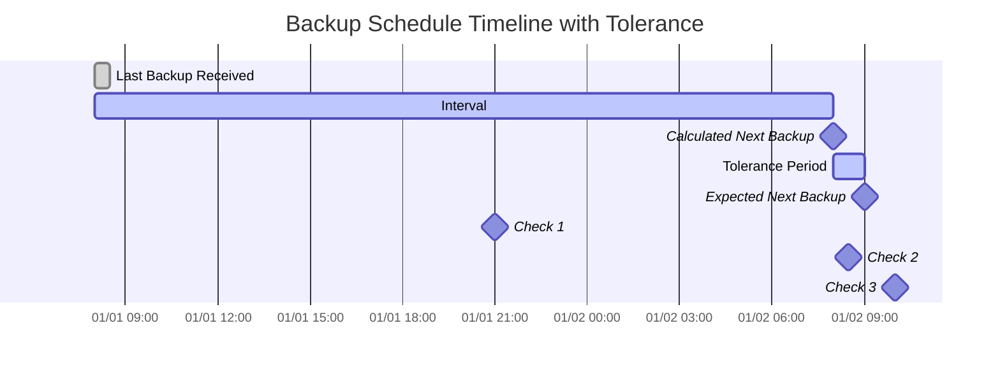

**Examples based on the timeline above:**

  - At `2024-01-01 21:00` (🔹Check 1), the backup is **on time**.
  - At `2024-01-02 08:30` (🔹Check 2), the backup is **on time**, as it is still within the tolerance period.
  - At `2024-01-02 10:00` (🔹Check 3), the backup is **overdue**, as this is after the `Expected Next Backup` time.

</div>

<br/><br/>

### Server Settings

You can configure an alternative name (alias) for your servers, a note to describe its function and the web addresses of your Duplicati Servers here. 

<br/>


<div style="padding-left: 60px;">


- **Server Name**: Server name configured in the Duplicati server
- **Alias**: A nickname or human-readable name of your server. When hovering over an alias it will show its name; in some cases to make it clear it will display the alias and the name between brackets. 
- **Note**: Free text to describe the server functionality, installation place, or any other information. When configured, it will be displayed next to the name or alias of the server. 
- **Web Interface Address (URL)**: Configure the URL to access the Duplicati Server's UI. Both `HTTP` and `HTTPS` URLs are supported. If not configured, the Duplicati button will be disabled and the name of this server will not be shown in the `Duplicati configuration` button list.
- **Status**: Display the test results when you click `▷ Test` or `Test All` buttons.
- **Actions**: You can test the connection and open the URL configured in a new browser tab.

<br/>

> [!TIP]
> After entering an address, test it using the `Test` or `Test All` button.
</div>


<br/><br/>

<div style="padding-left: 60px;">

### NTFY Settings

NTFY is a simple notification service that can send push notifications to your phone or desktop. This section allows you to set up your notification server connection and authentication.

  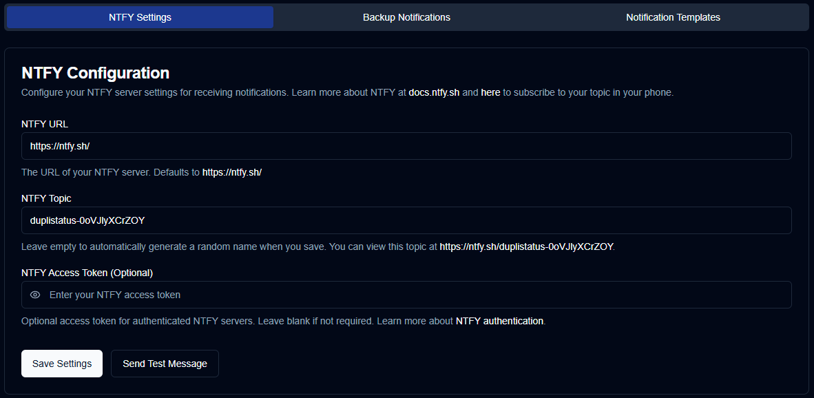

  - **NTFY URL**: The URL of your NTFY server (defaults to the public `https://ntfy.sh/`).
  - **NTFY Topic**: A unique identifier for your notifications. The system will automatically generate a random topic if left empty, or you can specify your own.
  - **NTFY Access Token**: An optional access token for authenticated NTFY servers. Leave this field blank if your server does not require authentication.

<br/>

> [!CAUTION]
> If you use the public `ntfy.sh` server without an access token, anyone with your topic name can view your
>notifications. To provide a degree of privacy, a random 12-character topic is generated, offering over 
> 3 sextillion (3,000,000,000,000,000,000,000) possible combinations, making it difficult to guess. 
>
> For improved security, consider using [access token authentication](https://docs.ntfy.sh/config/#access-tokens) and [access control lists](https://docs.ntfy.sh/config/#access-control-list-acl) to protect your topics, or [self-host NTFY](https://docs.ntfy.sh/install/#docker) for total control.
>
> ⚠️ **You are responsible for securing your NTFY topics. Please use this service at your own discretion.**

<br/>

#### About NTFY

NTFY is an [open-source](https://github.com/binwiederhier/ntfy) notification service that **duplistatus** uses to send push notifications about backup events to your phone or desktop.

**Options:**
- Use the free public server at [ntfy.sh](https://ntfy.sh)
- [Self-host](https://docs.ntfy.sh/install/#docker) for complete privacy
- Subscribe to a paid plan for additional features

💙 If you find ntfy.sh useful, please consider [supporting the developer](https://github.com/sponsors/binwiederhier).

<br/>

</div>

<br/><br/>

### Notification Templates

**duplistatus** uses three templates for notification messages:

<div style="padding-left: 60px;">

| Template           | Description                                         |
|:-------------------|:----------------------------------------------------|
| **Success**        | Used when backups complete successfully.            |
| **Warning/Error**  | Used when backups complete with warnings or errors. |
| **Overdue Backup** | Used when backups are overdue.                      |

<br/>


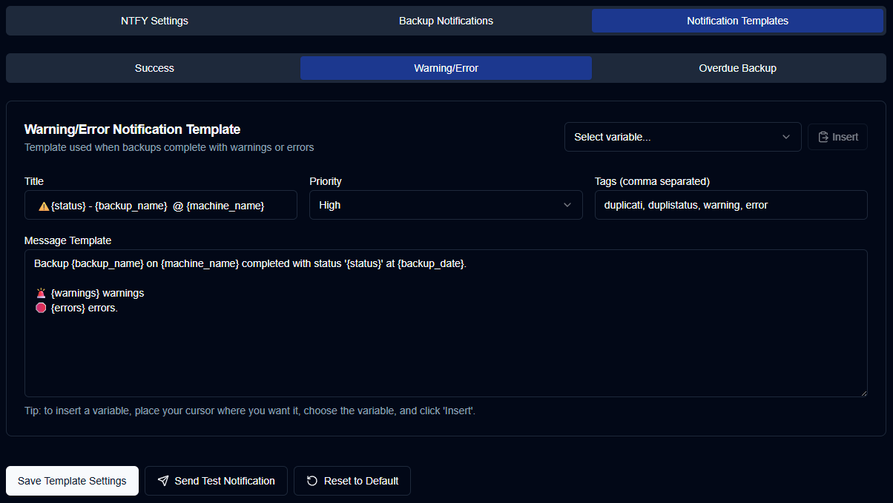

<br/>

All templates support variables that will be replaced with actual values. The following table shows the available variables:

| Variable                  | Description                                     | Available In     |
|:--------------------------|:------------------------------------------------|:-----------------|
| `{server_name}`           | Name of the server.                             | All templates    |
| `{server_alias}`          | Alias of the server.                            | All templates    |
| `{server_note}`           | Note for the server.                            | All templates    |
| `{server_url}`            | URL of the Duplicati Server web configuration   | All templates    |
| `{backup_name}`           | Name of the backup.                             | All templates    |
| `{status}`                | Backup status (Success, Warning, Error, Fatal). | Success, Warning |
| `{backup_date}`           | Date and time of the backup.                    | Success, Warning |
| `{duration}`              | Duration of the backup.                         | Success, Warning |
| `{uploaded_size}`         | Amount of data uploaded.                        | Success, Warning |
| `{storage_size}`          | Storage usage information.                      | Success, Warning |
| `{available_versions}`    | Number of available backup versions.            | Success, Warning |
| `{file_count}`            | Number of files processed.                      | Success, Warning |
| `{file_size}`             | Total size of files backed up.                  | Success, Warning |
| `{warnings_count}`        | Number of warnings.                             | Success, Warning |
| `{errors_count}`          | Number of errors.                               | Success, Warning |
| `{last_backup_date}`      | Date of the last backup.                        | Overdue          |
| `{last_elapsed}`          | Time elapsed since the last backup.             | Overdue          |
| `{expected_date}`         | Expected backup date.                           | Overdue          |
| `{expected_elapsed}`      | Time elapsed since the expected date.           | Overdue          |
| `{backup_interval_type}`  | Interval unit (hours/days).                     | Overdue          |
| `{backup_interval_value}` | Expected interval value.                        | Overdue          |
| `{overdue_tolerance}`     | Overdue tolerance setting.                      | Overdue          |

<br/> 

</div>

> [!TIP]
> After updating a template, use the `Send Test Notification` button to check it. The variables will be replaced with their names for the test.

<br/><br/>

## Homepage Integration (Optional)

[Homepage](https://gethomepage.dev/) is a customisable dashboard application. To integrate **duplistatus** with Homepage, add a widget to your `services.yaml` file using the [Custom API widget type](https://gethomepage.dev/widgets/services/customapi/).

<br/>

### Summary Widget

This widget displays overall backup statistics on your Homepage dashboard.

```yaml
- Dashboard:
    icon: mdi-cloud-upload
    href: http://your-server:9666/
    widget:
      type: customapi
      url: http://your-server:9666/api/summary
      display: list
      refreshInterval: 60000
      mappings:
        - field: totalServers
          label: Servers
        - field: totalBackups
          label: Backups received
        - field: secondsSinceLastBackup
          label: Last backup
          format: duration
        - field: totalBackupSize
          label: Backed up size
          format: number
          scale: 0.000000001
          suffix: GB     
        - field: totalStorageUsed
          label: Storage used
          format: number
          scale: 0.000000001
          suffix: GB     
        - field: totalUploadedSize
          label: Uploaded size
          format: number
          scale: 0.000000001
          suffix: GB     
```

**Widget Display:**
<div style="padding-left: 60px;">

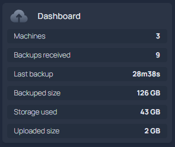

</div>

<br/>

### Last Backup Information Widget

This widget displays the latest backup information for a specific machine.

```yaml
- Test Machine 1:
    icon: mdi-test-tube
    widget:
      type: customapi
      url: http://your-server:9666/api/lastbackup/Test%20Machine%201
      display: list
      refreshInterval: 60000
      mappings:
        - field: latest_backup.name
          label: Backup name
        - field: latest_backup.status
          label: Result
        - field: latest_backup.date
          label: Date
          format: relativeDate
        - field: latest_backup.duration
          label: Duration
        - field: latest_backup.uploadedSize
          label: Bytes Uploaded
          format: number
          scale: 0.000001
          suffix: MB        
        - field: latest_backup.backup_list_count
          label: Versions  
```

**Widget Display:**
<div style="padding-left: 60px;">

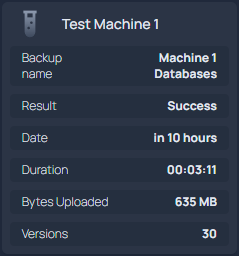

</div>

<br/>

### Configuration Notes

  - Replace `your-server` with your server's IP address or hostname.
  - Adjust the `refreshInterval` as needed (in milliseconds).
  - Replace spaces in machine names with `%20` in the URL (e.g., `Test Machine 1` becomes `Test%20Machine%201`).
  - The `scale` values convert bytes to more readable units (GB, MB).

<br/><br/>

## Troubleshooting

Here are solutions to some common issues.

| Issue | Problem Description | Solutions |
| :--- | :--- | :--- |
| **New backups are not showing**<br/><br/>Duplicati server warnings:<br/>`HTTP Response request failed for:` and `Failed to send message: System.Net.Http.HttpRequestException:` | New backups do not appear in the dashboard or backup history. | **Check Duplicati Configuration**:<br/>• Confirm that Duplicati is configured correctly to send data to **duplistatus**.<br/>• Verify the HTTP URL settings in Duplicati.<br/><br/>**Check Network Connectivity**:<br/>• Ensure the Duplicati server can connect to the **duplistatus** server.<br/>• Confirm the port is correct (default: `9666`).<br/><br/>**Review Duplicati Logs**:<br/>• Check for HTTP request errors in the Duplicati logs. |
| **Notifications Not Working** | Notifications are not being sent or received. | **Check NTFY Configuration**:<br/>• Ensure the NTFY URL and topic are correct.<br/>• Use the `Send Test Notification` button to test.<br/><br/>**Check Network Connectivity**:<br/>• Verify that **duplistatus** can reach your NTFY server.<br/>• Review firewall settings if applicable.<br/><br/>**Check Notification Settings**:<br/>• Confirm that notifications are enabled for the relevant backups. |
| **Available versions not appearing** | Backup versions are not shown on the dashboard or details page. | **Check Duplicati Configuration**:<br/>• Ensure `send-http-log-level=Information` and `send-http-max-log-lines=0` are configured in Duplicati's advanced options. |
| **Overdue Backup Alerts Not Working** | Overdue backup notifications are not being sent. | **Check Overdue Configuration**:<br/>• Confirm that overdue monitoring is enabled for the backup.<br/>• Verify the expected interval and tolerance settings.<br/><br/>**Check Notification Frequency**:<br/>• If set to `One time`, alerts are only sent once per overdue event.<br/><br/>**Check Scheduler Service**:<br/>• Ensure the internal background process that monitors for overdue backups is running correctly. Check the application logs for errors. |
| **Collect Backup Logs not working** | The manual backup log collection fails. | **Check Duplicati Server Access**:<br/>• Verify the Duplicati server hostname and port are correct.<br/>• Confirm remote access is enabled in Duplicati.<br/>• Ensure the authentication password and protocol (HTTP/HTTPS) are correct.<br/><br/>**Check Network Connectivity**:<br/>• Test connectivity from **duplistatus** to the Duplicati server.<br/>• Confirm the Duplicati server port is accessible (default: `8200`). |

<br/>

If you still experience issues, try the following steps:

1.  **Inspect Application Logs**: If using Docker, run `docker logs <container-name>` to review detailed error information.
2.  **Validate Configuration**: Double-check all configuration settings in your container management tool (Docker, Portainer, Podman, etc.) including ports, network, and permissions.
3.  **Verify Network Connectivity**: Confirm all network connections are stable. If using Docker, you can use `docker exec -it <container-name> /bin/sh` to access the container's command line and run network tools like `ping` and `curl`.
4.  **Consult Documentation**: Refer to the Installation Guide and README for more information.
5.  **Report Issues**: If the problem persists, please submit a detailed issue on the [duplistatus GitHub repository](https://github.com/wsj-br/duplistatus/issues).

<br/><br/>

## Additional Resources

  - **Installation Guide**: [INSTALL.md](INSTALL.md)
  - **Duplicati Documentation**: [docs.duplicati.com](https://docs.duplicati.com)
  - **API Documentation**: [API-ENDPOINTS.md](https://www.google.com/search?q=API-ENDPOINTS.md)
  - **GitHub Repository**: [wsj-br/duplistatus](https://github.com/wsj-br/duplistatus)
  - **Development Guide**: [DEVELOPMENT.md](DEVELOPMENT.md)
  - **Database Schema**: [DATABASE.md](DATABASE.md)

<br/><br/>

## Licence

The project is licensed under the [Apache License 2.0](../LICENSE).   

**Copyright © 2025 Waldemar Scudeller Jr.**
