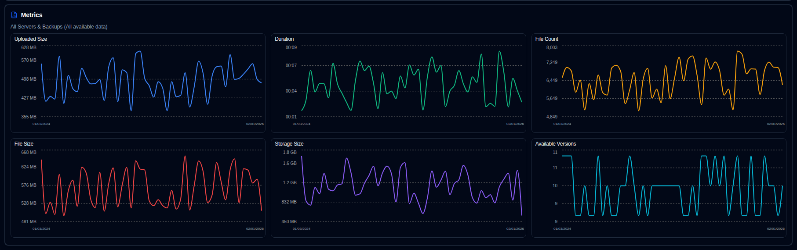

# Backup Metrics {#backup-metrics}

A chart of backup metrics over time is shown on both the dashboard (table view) and the server details page.

- **Dashboard**, the chart shows the total number of backups recorded in the **duplistatus** database. If you use the Cards layout, you can select a server to see its consolidated metrics (when side panel is showing metrics).
- **Server Details** page, the chart shows metrics for the selected server (for all its backups) or for a single, specific backup.

## Inline Chart Controls {#inline-chart-controls}

Quick access controls are available directly on chart panel headers for easy configuration without navigating to Display Settings:

### Time Range Selector {#time-range-selector}

Pill buttons appear in the chart header for quick time range selection: **1W | 2W | 1M | 3M**

- **1W**: Last 7 days (rolling window)
- **2W**: Last 14 days (rolling window)
- **1M**: Last 30 days (rolling window, default)
- **3M**: Last 90 days (rolling window)

Changes made here sync with your Display Settings, so your preference is remembered across page refreshes.

### Chart Style Toggle {#chart-style-toggle}

A toggle button in the chart header allows you to switch between:

- **Smooth Lines**: Display data points connected with smooth curves
- **Bar Chart**: Display data as discrete bars for each time period

Both modes use time-bucket aggregation for optimal display. Empty periods in bar mode render no bar. Your preference persists across page refreshes and is synced with Display Settings.

## Chart Data Consolidation {#chart-data-consolidation}

When multiple backups occur on the same day, **duplistatus** consolidates the data before displaying it on charts:

- **SUM**: Used for cumulative metrics (Duration, File Count, File Size, Uploaded Size)
- **LAST**: Used for Storage Size (the most recent value of the day)
- **MAX**: Used for Available Versions (the highest count of the day)

This consolidation happens before time bucketing is applied, ensuring accurate aggregated metrics. For example, two backups on 5/12/26 will produce one consolidated data point on the chart.

## Metric Definitions {#metric-definitions}

- **Uploaded Size**: Total amount of data uploaded/transmitted during backups from Duplicati server to the destination (local storage, FTP, cloud provider, ...) per day.
- **Duration**: The total duration of all backups received per day in HH:MM.
- **File Count**: The sum of the file count counter received for all backups per day.
- **File Size**: The sum of the file size reported by Duplicati server for all backups received per day.
- **Storage Size**: The sum of the storage size used on the backup destination reported by the Duplicati server per day.
- **Available Versions**: The sum of all available versions for all backups per day.

 
   

:::note
You can use the [Display Settings](settings/display-settings.md) control to configure the time range for the chart.
:::

