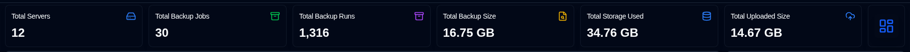
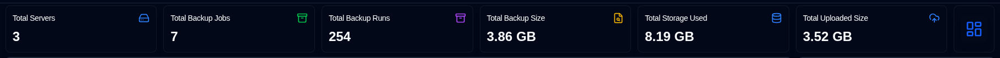
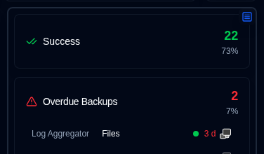
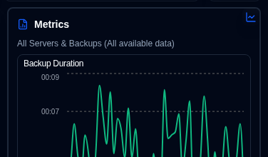
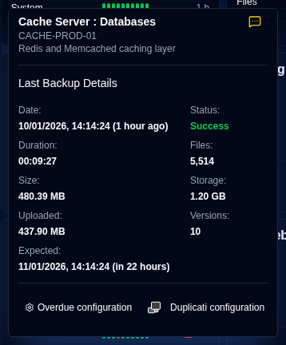
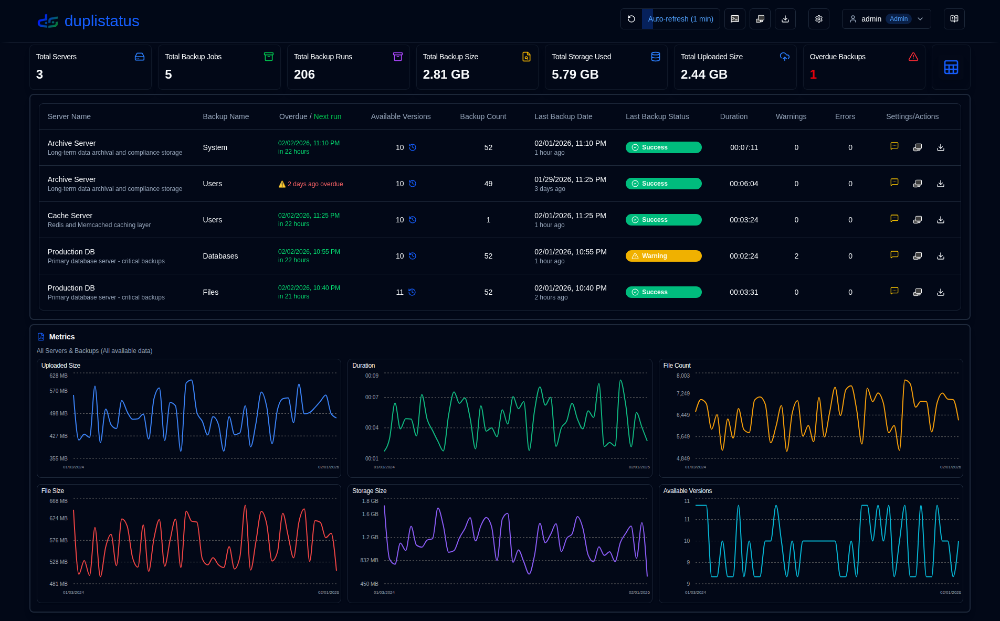
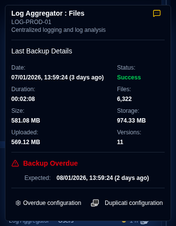
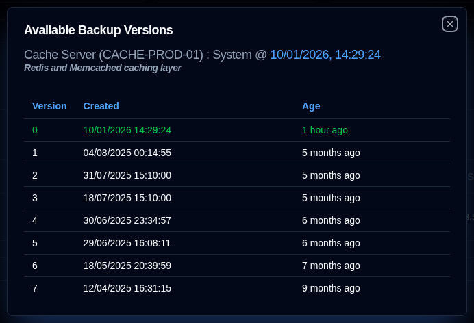

# Dashboard {#dashboard}

## Dashboard Summary {#dashboard-summary}

This section displays aggregated statistics for all backups.

- **Total Servers**: The number of servers being monitored.                                                                                                             
- **Total Backup Jobs**: The total number of backup jobs (types) configured for all servers.                                                                                
- **Total Backup Runs**: The total number of backup logs from runs received or collected for all servers.                                                                   
- **Total Backup Size**: The combined size of all source data, based on the latest backup logs received.                                                                    
- **Total Storage Used**: The total storage space used by backups on the backup destination (e.g., cloud storage, FTP server, local drive), based on the latest backup logs.                
- **Total Uploaded Size**: The total amount of data uploaded from the Duplicati server to the destination (e.g., local storage, FTP, cloud provider).                                       
- **Overdue Backups** (table): The number of backups that are overdue. See [Backup Notifications Settings](settings/backup-notifications-settings.md)                          
- **Layout Toggle**: Switches between the Cards layout (default) and the Table layout.                                                                                                  

:::tip Seeing duplicated servers?
If the same server appears more than once on the dashboard, use [Settings → Database Maintenance → Merge Duplicate Servers](settings/database-maintenance.md#merge-duplicate-servers) to consolidate them. Duplicates can occur when you reinstall or upgrade Duplicati, because the server's `machine_id` may change and **duplistatus** then treats it as a new server.
:::

## Server Filtering {#server-filtering}

You can filter the servers and backups displayed on the dashboard using the search field in the application toolbar. Click the filter icon <IconButton icon="lucide:search" /> to reveal the search field.

**Filter Matches:**
- Server ID
- Server URL
- Backup job names

**Scope:**
- Filters both card and table views on the dashboard
- Session state is maintained via the Dashboard Server Filter Provider
- Clears when you refresh or leave the dashboard

This makes it easy to quickly locate specific servers or backups among many monitored systems.

## Cards Layout {#cards-layout}

The cards layout shows the status of the most recent backup log received for each backup.

- **Server Name**: Name of the Duplicati server (or the alias)
  - Hovering over the **Server Name** will show the server name and note
- **Overall Status**: The status of the server. Overdue backups will show as a **Warning** status
- **Version**: The Duplicati version from the latest backup log, shown to the left of the status indicator. See [Duplicati Server Version](#duplicati-server-version).
- **Summary information**: The consolidated number of files, size and storage used for all backups of this server. Also shows the elapsed time of the most recent backup received (hover over to show the timestamp)
- **Backups list**: A table with all the backups configured for this server, with 3 columns:
  - **Backup Name**: Name of the backup in the Duplicati server
  - **Status history**: Status of the last 10 backups received.
  - **Last backup received**: The elapsed time since the current time of the last log received. It will show a warning icon if the backup is overdue.
    - Time is shown in abbreviated format: `m` for minutes, `h` for hours, `d` for days, `w` for weeks, `mo` for months, `y` for years.

The card sort order and other configurations can be set in the [Display Settings](settings/display-settings.md).

The panel view offers two informational displays, accessible by clicking the top right button on the side panel:

- Status: Show statistics of the backup jobs per status, with a list of overdue backups and backup jobs with warnings/errors status.

- Metrics: Show charts with duration, file size and storage size over time for the aggregated or selected server.

### Backup Details {#backup-details}

Hovering over a backup in the list displays details of the last backup log received and any overdue information.

- **Server Name : Backup**: The name or alias of the Duplicati server and backup, will also show the server name and note.
  - The alias and note can be configured at [Settings → Server Settings](settings/server-settings.md).
- **Notification**: An icon showing the [configured notification](#notifications-icons) setting for new backup logs.
- **Date**: The timestamp of the backup and the elapsed time since the last screen refresh.
- **Status**: The status of the last backup received (Success, Warning, Error, Fatal).
- **Duration, File Count, File Size, Storage Size, Uploaded Size**: Values as reported by the Duplicati server.
- **Available Versions**: The number of backup versions stored on the backup destination at the time of the backup.

If this backup is overdue, the tooltip also shows:

- **Expected Backup**: The time the backup was expected, including the configured grace period (extra time allowed before marking as overdue).

You can also click the buttons at the bottom to open [Settings → Backup Notifications](settings/backup-notifications-settings.md) to configure monitoring settings or open the Duplicati server's web interface.

## Table Layout {#table-layout}

The table layout lists the most recent backup logs received for all servers and backups.

- **Server Name**: The name of the Duplicati server (or alias)
  - Under the name is the server note
- **Backup Name**: The name of the backup in the Duplicati server.
- **Version**: The Duplicati version from the latest backup log for that backup job. See [Duplicati Server Version](#duplicati-server-version).
- **Available Versions**: The number of backup versions stored on the backup destination. If the icon is greyed out, detailed information was not received in the log. See the [Duplicati Configuration instructions](../installation/duplicati-server-configuration.md) for details.
- **Backup Count**: The number of backups reported by the Duplicati server.
- **Last Backup Date**: The timestamp of the last backup log received and the elapsed time since the last screen refresh.
- **Last Backup Status**: The status of the last backup received (Success, Warning, Error, Fatal).
- **Duration**: The duration of the backup in HH:MM:SS.
- **Warnings/Errors**: The number of warnings and errors reported in the backup log, shown as `warnings/errors` (for example `0/0`).
- **Settings**:
  - **Notification**: An icon showing the configured notification setting for new backup logs.
  - **Duplicati configuration**: A button to open the Duplicati server's web interface

You can use the [Display Settings](settings/display-settings.md) to configure the table size and other configurations.

### Notifications Icons {#notifications-icons}

| Icon                                                                                                                               | Notification Option | Description                                                                                         |
|------------------------------------------------------------------------------------------------------------------------------------|---------------------|-----------------------------------------------------------------------------------------------------|
| <IconButton icon="lucide:message-square-off" style={{border: 'none', padding: 0, color: '#9ca3af', background: 'transparent'}} />  | Off                 | No notifications will be sent when a new backup log is received                                     |
| <IconButton icon="lucide:message-square-more" style={{border: 'none', padding: 0, color: '#60a5fa', background: 'transparent'}} /> | All                 | Notifications will be sent for every new backup log, regardless of its status.                      |
| <IconButton icon="lucide:message-square-more" style={{border: 'none', padding: 0, color: '#fbbf24', background: 'transparent'}} /> | Warnings            | Notifications will be sent only for backup logs with a status of Warning, Unknown, Error, or Fatal. |
| <IconButton icon="lucide:message-square-more" style={{border: 'none', padding: 0, color: '#f87171', background: 'transparent'}} /> | Errors              | Notifications will be sent only for backup logs with a status of Error or Fatal.                    |

:::note
This notification setting only applies when **duplistatus** receives a new backup log from a Duplicati server. Overdue notifications are configured separately and will be sent regardless of this setting.
:::

### Overdue Details {#overdue-details}

Hovering over the overdue warning icon displays details about the overdue backup.

- **Checked**: When the last overdue check was performed. Configure the frequency in [Backup Notifications Settings](settings/backup-notifications-settings.md).
- **Last Backup**: When the last backup log was received.
- **Expected Backup**: The time the backup was expected, including the configured grace period (extra time allowed before marking as overdue).
- **Last Notification**: When the last overdue notification was sent.

## Duplicati Server Version {#duplicati-server-version}

The dashboard shows the Duplicati version reported in the latest backup log for each server (card view) or backup job (table view).

- **Where it appears**: To the left of the status indicator on cards, and in the **Version** column on the table (after **Overdue / Next run**). You can hide the card badge from [Display Settings](settings/display-settings.md) or [Duplicati Versions](settings/duplicati-versions.md). The table column always remains visible.
- **Colour**: Muted text means the version matches the latest release for that channel (or the comparison is unavailable). Warning yellow means the version is older than the latest release for that channel.
- **Tooltip**: Hover or click the version number to see the update channel (`stable`, `beta`, `experimental`, or `canary`), the server version, and the latest available version for that channel.

**duplistatus** compares the version from the backup log against the latest Duplicati releases published on GitHub. Administrators can view the cached channel versions and configure the check interval and start time in [Settings → Duplicati Versions](settings/duplicati-versions.md). The cache is also refreshed on startup when it is older than the selected interval. Successful and failed GitHub updates are recorded in the [audit log](settings/audit-logs-viewer.md) as `duplicati_version_refresh` (started by `startup`, `cron`, or `manual`).

:::important
**duplistatus** does not query the Duplicati server for the version that is currently running. It uses the version stored in the last backup log that was received or [collected](collect-backup-logs.md). After you upgrade Duplicati, the dashboard keeps showing the previous version until a new backup log arrives.
:::

### Available Backup Versions {#available-backup-versions}

Clicking the blue clock icon opens a list of available backup versions at the time of the backup, as reported by the Duplicati server.

- **Backup Details**: Shows the server name and alias, server note, backup name, and when the backup was executed.
- **Version Details**: Shows the version number, creation date, and age.

:::note
If the icon is greyed out, it means that no detailed information was received in the message logs.
See the [Duplicati Configuration instructions](../installation/duplicati-server-configuration.md) for details.
:::

