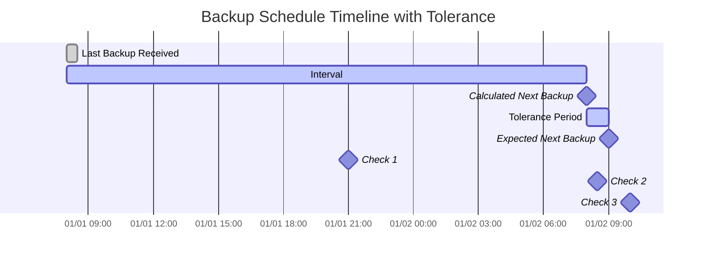

import { ZoomMermaid } from '@site/src/components/ZoomMermaid';

# Overdue Monitoring

The overdue monitoring feature allows you to track and alert on backups that are overdue. The notifications can be via NTFY or Email.

In the user interface, the overdue backups are displayed with a warning icon . Hovering over the icon displays the details of the overdue backup, including the last backup time, the expected backup time, the tolerance period and the expected next backup time.

## Overdue Check Process

**How it works:**

| **Step** | **Value**                  | **Description**                                   | **Example**        |
|:--------:|:---------------------------|:--------------------------------------------------|:-------------------|
|    1     | **Last Backup**            | The timestamp of the last successful backup.      | `2024-01-01 08:00` |
|    2     | **Expected Interval**      | The configured backup frequency.                  | `1 day`            |
|    3     | **Calculated Next Backup** | `Last Backup` + `Expected Interval`               | `2024-01-02 08:00` |
|    4     | **Tolerance**              | The configured grace period (extra time allowed). | `1 hour`           |
|    5     | **Expected Next Backup**   | `Calculated Next Backup` + `Tolerance`            | `2024-01-02 09:00` |

A backup is considered **overdue** if the current time is later than the `Expected Next Backup` time.

<ZoomMermaid>

</ZoomMermaid>

**Examples based on the timeline above:**

- At `2024-01-01 21:00` (🔹Check 1), the backup is **on time**.
- At `2024-01-02 08:30` (🔹Check 2), the backup is **on time**, as it is still within the tolerance period.
- At `2024-01-02 10:00` (🔹Check 3), the backup is **overdue**, as this is after the `Expected Next Backup` time.

## Periodic Checks

**duplistatus** performs periodic checks for overdue backups at configurable intervals. The default interval is 20 minutes, but you can configure it in [Settings → Overdue Monitoring](settings/overdue-settings.md).

## Automatic Configuration

When you collect backup logs from a Duplicati server, **duplistatus** automatically:

- Extracts the backup schedule from the Duplicati configuration
- Updates the overdue monitoring intervals to match exactly
- Synchronises allowed weekdays and scheduled times
- Preserves your notification preferences

:::tip
For best results, collect backup logs after changing backup job intervals in your Duplicati server. This ensures **duplistatus** stays synchronised with your current configuration.
:::

Review the [Overdue Settings](settings/overdue-settings.md) section for detailed configuration options.

