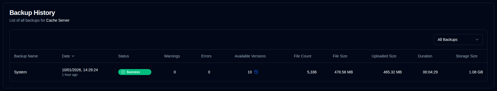

# Server Details {#server-details}

Clicking on a server from the dashboard opens a page with a list of backups for that server. You can view all backups or select a specific one if the server has multiple backups configured.

## Server/Backup Statistics {#serverbackup-statistics}

This section shows statistics for either all backups on the server or a single selected backup.

- **TOTAL BACKUP JOBS**: Total number of backup jobs configured on this server.
- **TOTAL BACKUP RUNS**: Total number of backup runs executed (as reported by the Duplicati server).
- **AVAILABLE VERSIONS**: Number of available versions (as reported by the Duplicati server).
- **AVG DURATION**: Average (mean) duration of backups recorded in the **duplistatus** database.
- **LAST BACKUP SIZE**: Size of the source files from the last backup log received.
- **TOTAL STORAGE USED**: Storage used on the backup destination, as reported in the last backup log.
- **TOTAL UPLOADED**: Sum of all uploaded data recorded in the **duplistatus** database.

If this backup or any of the backups on the server (when `All Backups` is selected) is overdue, a message appears below the summary. 

Click the <IconButton icon="lucide:settings" href="settings/overdue-settings" label="Configure"/> to go to [`Settings → Overdue Monitoring`](settings/overdue-settings.md). Or click the <SvgButton SvgButton svgFilename="duplicati_logo.svg" href="duplicati-configuration" /> on the toolbar to open the Duplicati server's web interface and check the logs.

 

## Backup History {#backup-history}

This table lists the backup logs for the selected server.

- **Backup Name**: The name of the backup in the Duplicati server.
- **Date**: The timestamp of the backup and the elapsed time since the last screen refresh.
- **Status**: The status of the backup (Success, Warning, Error, Fatal).
- **Warnings/Errors**: The number of warnings/errors reported in the backup log.
- **Available Versions**: The number of available backup versions on the backup destination. If the icon is greyed out, detailed information was not received.
- **File Count, File Size, Uploaded Size, Duration, Storage Size**: Values as reported by the Duplicati server.

:::tip Tips
• Use the dropdown menu in the **Backup History** section to select `All Backups` or a specific backup for this server.

• You can sort any column by clicking its header, click again to reverse the sort order.
 
• Click anywhere on a row to view the [Backup Details](#backup-details).

::: 

:::note
When `All Backups` is selected, the list shows all backups ordered from newest to oldest by default.
:::

 

## Backup Details {#backup-details}

Clicking on a status badge in the dashboard (table view) or any row in the backup history table displays the detailed backup information.

- **Server details**: server name, alias and note.
- **Backup Information**: The timestamp of the backup and its ID.
- **Backup Statistics**: A summary of reported counters, sizes, and duration.
- **Log Summary**: The number of reported messages.
- **Available Versions**: A list of available versions (only displayed if the information was received in the logs).
- **Messages/Warnings/Errors**: The complete execution logs. The subtitle indicates if the log was truncated by the Duplicati server. 

 

:::note
Refer to the [Duplicati Configuration instructions](../installation/duplicati-server-configuration.md) to learn how to configure Duplicati server to send complete execution logs and avoid truncation.
:::
