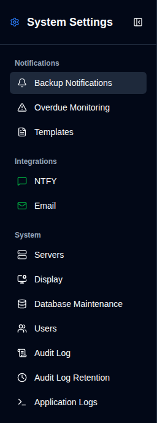

# Daily Summary {#daily-summary}

Daily Summary is an optional notification mode that sends **one** localized snapshot of every known backup job at an exact local time. While it is enabled, individual backup and overdue **email** messages are paused, including additional per-job email destinations. Per-job NTFY notifications continue. Those settings stay stored and become active again as soon as Daily Summary is turned off.

The snapshot is the **current** status at send time (the latest result for each job). It is not a history of the previous day’s runs.

## Requirements {#requirements}

- SMTP must be configured. Email is always sent once to the SMTP recipient.
- Scheduled delivery requires the cron service. The dispatcher checks every minute in UTC when it is running.

## What is included {#what-is-included}

Known jobs are the union of:

- the latest observed backup for each server and backup name
- explicit per-job settings whose server still exists

A configured job that has never sent a report is labelled **No report received**. Status buckets (Success, Warning, Error, Fatal, Unknown, No report received) are mutually exclusive and add up to the job count. **Overdue** is counted separately: an overdue successful job is still Success and also overdue.

## Schedule {#schedule}

Choose an exact `HH:mm` time in your **browser timezone**. duplistatus stores the schedule as UTC and shows both values on the page (same pattern as **Duplicati Versions**). Changes on this page are saved automatically.

- Enabling or changing the schedule starts at the **next future** occurrence, never an immediate surprise send.
- Restarting later on the same local day still catches up after the configured time.
- Fully missed earlier days are not replayed.
- Spring-forward missing times run at the first valid minute after the gap. Repeated autumn hours send once.

## Public dashboard URL {#public-dashboard-url}

Optional **Public dashboard URL** on this page feeds the `{duplistatus_link}` placeholder in Daily Summary emails. Use an `http://` or `https://` URL with no trailing slash. Leave it empty to omit the link.

When `DUPLISTATUS_PUBLIC_URL` is set in the environment, it overrides the saved setting (see [Environment Variables](/installation/environment-variables)).

## Replacement behaviour {#replacement-behaviour}

When Daily Summary is on:

- upload and overdue email are not sent
- per-job NTFY notifications continue
- overdue timestamps are not advanced, so overdue alerts can resume immediately when the mode is turned off
- template preview, transport tests, and **Send summary now** still work

**Send summary now** is an extra delivery. It does not consume the next scheduled occurrence.

## Templates {#templates}

Edit the Daily Summary email template (Markdown) under [Settings → Templates](/user-guide/settings/notification-templates). Email bodies for Success, Warning/Error, Overdue, and Daily Summary all use Markdown. The default template includes `{duplistatus_link}` at the end when a public dashboard URL is configured on this page or via `DUPLISTATUS_PUBLIC_URL`.

**Generate preview** on this page opens a dialog with the current snapshot. Email HTML follows the current light or dark theme.
