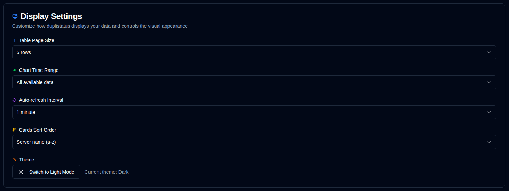

# Display {#display}

Configure user interface and display preferences.

 

| Setting                   | Description                                         | Default Value      |
|:--------------------------|:----------------------------------------------------|:-------------------|
| **Table Size**            | Number of rows per page on the server details page. | 5 rows             |
| **Theme**                 | Choose light, dark, or match your operating system appearance (prefers light/dark mode). | Follow OS when unset |
| **Chart Time Range**      | Time interval shown in the charts. Available options: **1W** (last 7 days), **2W** (last 14 days), **1M** (last 30 days), **3M** (last 90 days). You can also toggle time range directly from chart headers. | 1 month            |
| **Chart Style**           | Choose between smooth line charts or bar chart visualization. Both modes use time-bucket aggregation for optimal display. You can also toggle directly from chart headers. | Smooth lines       |
| **Format Locale**         | Select a formatting locale independent of your UI language (416 locales supported). This affects how dates, times, and numbers are displayed. A live preview is shown with your selection. Example: UI language = German, Format locale = English (UK) → German UI with UK date formats. | Based on UI language |
| **Auto-refresh Interval** | How often pages refresh automatically.              | 1 minute           |
| **Cards Sort Order**      | How cards are sorted on the dashboard.              | Server name (a-z)  |
| **Start of Week**         | Configure when the week starts.                     | Based on locale    |

 

:::tip
**Quick Access**: You can quickly access this page by right-clicking on the auto-refresh button in the application toolbar.
:::

