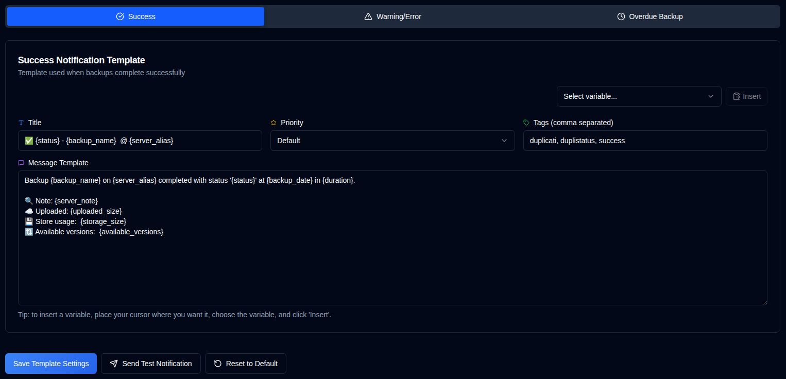

# Templates {#templates}

**duplistatus** uses four templates for notification messages. Email bodies are Markdown (headings, lists, links, and tables). NTFY for Success, Warning/Error, and Overdue is derived from the same content; Daily Summary has a separate compact NTFY template.

The page includes a **Template Language** selector that sets the locale for default templates. Changing the language updates the locale for new defaults, but it does **not** change the text of existing templates. To apply a new language to your templates, either edit them manually or use **Reset this template to default** (for the current tab) or **Reset all to default** (for all templates).

| Template           | Description                                         |
| :----------------- | :-------------------------------------------------- |
| **Success**        | Used when backups complete successfully.            |
| **Warning/Error**  | Used when backups complete with warnings or errors. |
| **Overdue Backup** | Used when backups are overdue.                      |
| **Daily Summary**  | Email and compact NTFY templates for the optional daily snapshot. |

 

## Template Language {#template-language}

A **Template Language** selector at the top of the page lets you choose the language for default templates (English, German, French, Spanish, Portuguese, Hindi (Roman), and Simplified Chinese). Changing the language updates the locale for defaults, but existing customized templates keep their current text until you update them or use one of the reset buttons.

 

## Available Actions {#available-actions}

| Button                                                              | Description                                                                                         |
|:--------------------------------------------------------------------|:----------------------------------------------------------------------------------------------------|
| <IconButton label="Save Template Settings" />                      | Saves the settings when changing the template. The button saves the template being displayed (Success, Warning/Error, Overdue Backup, or Daily Summary). |
| <IconButton icon="lucide:send" label="Send Test Notification"/>     | Checks the template after updating it. The variables will be replaced with their names for the test. For email notifications, the template title becomes the email subject line. |
| <IconButton icon="lucide:rotate-ccw" label="Reset this template to default"/> | Restores the default template for the **selected template** (the current tab). Remember to save after resetting. |
| <IconButton icon="lucide:rotate-ccw" label="Reset all to default"/> | Restores all templates (Success, Warning/Error, Overdue Backup, and Daily Summary) to the defaults for the selected Template Language. Remember to save after resetting. |

 

## Variables {#variables}

Email bodies are Markdown. Headings, lists, links, and tables are supported. Placeholder values are inserted as escaped text and cannot introduce Markdown or HTML. Previously embedded raw HTML in customized templates is now escaped.

All Success, Warning/Error, and Overdue templates support variables that will be replaced with actual values. The following table shows the available variables:

| Variable               | Description                                     | Available In     |
|:-----------------------|:------------------------------------------------|:-----------------|
| `{server_name}`        | Name of the server.                             | Success, Warning, Overdue |
| `{server_alias}`       | Alias of the server.                            | Success, Warning, Overdue |
| `{server_note}`        | Note for the server.                            | Success, Warning, Overdue |
| `{server_url}`         | URL of the Duplicati Server web configuration   | Success, Warning, Overdue |
| `{backup_name}`        | Name of the backup.                             | Success, Warning, Overdue |
| `{status}`             | Backup status (Success, Warning, Error, Fatal). | Success, Warning |
| `{backup_date}`        | Date and time of the backup.                    | Success, Warning |
| `{duration}`           | Duration of the backup.                         | Success, Warning |
| `{uploaded_size}`      | Amount of data uploaded.                        | Success, Warning |
| `{storage_size}`       | Storage usage information.                      | Success, Warning |
| `{available_versions}` | Number of available backup versions.            | Success, Warning |
| `{file_count}`         | Number of files processed.                      | Success, Warning |
| `{file_size}`          | Total size of files backed up.                  | Success, Warning |
| `{messages_count}`     | Number of messages.                             | Success, Warning |
| `{warnings_count}`     | Number of warnings.                             | Success, Warning |
| `{errors_count}`       | Number of errors.                               | Success, Warning |
| `{log_text}`           | Log messages (warnings and errors)              | Success, Warning |
| `{last_backup_date}`   | Date of the last backup.                        | Overdue          |
| `{last_elapsed}`       | Time elapsed since the last backup.             | Overdue          |
| `{expected_date}`      | Expected backup date.                           | Overdue          |
| `{expected_elapsed}`   | Time elapsed since the expected date.           | Overdue          |
| `{backup_interval}`    | Interval string (e.g., "1D", "2W", "1M").       | Overdue          |
| `{overdue_tolerance}`  | Overdue tolerance setting.                      | Overdue          |

Daily Summary templates use a different set of variables for the current-status snapshot:

| Variable | Description |
|:---------|:------------|
| `{summary_date}` | Local calendar date of the snapshot |
| `{generated_at}` | Date and time the snapshot was generated |
| `{time_zone}` | Saved IANA timezone |
| `{server_count}` / `{job_count}` | Servers and known jobs |
| `{success_count}` / `{warning_count}` / `{error_count}` / `{fatal_count}` / `{unknown_count}` / `{no_report_count}` | Mutually exclusive status buckets |
| `{overdue_count}` | Overdue jobs (orthogonal to status) |
| `{problem_table}` / `{all_jobs_table}` | Generated tables of attention-required and all jobs. Columns: Server, Backup, Overdue, Last status, Last result, Duration, Warnings, Errors, Uploaded. |
| `{latest_uploaded_size}` / `{latest_source_size}` / `{latest_storage_size}` / `{latest_file_count}` / `{total_warnings}` / `{total_errors}` | Latest-result totals |

Use **Preview** to render Email HTML, plain text, and NTFY without sending. The preview opens in a dialog. Email HTML follows the current light or dark theme.

