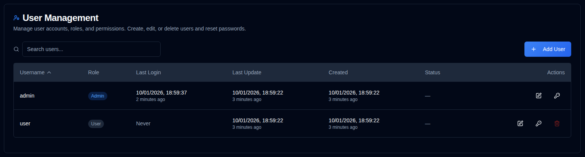

# Users {/* #users */}

Manage user accounts, permissions, and access control for **duplistatus**. This section allows administrators to create, modify, and delete user accounts.

>[!TIP] 
>The default `admin` account can be deleted. To do so, first create a new admin user, log in with that account, 
> and then delete the `admin` account.
>
> The default password for the `admin` account is `Duplistatus09`. You will be required to change it upon first login.

## Accessing User Management {/* #accessing-user-management */}

You can access the User Management section in two ways:

1. **From the User Menu**: Click the <IconButton icon="lucide:user" label="username" />   in the [Application Toolbar](../overview.md#application-toolbar) and select "Admin Users".

2. **From Settings**: Click on <IconButton icon="lucide:settings"/> and **Users** in the settings sidebar

## Creating a New User {/* #creating-a-new-user */}

1. Click the <IconButton icon="lucide:plus" label="Add User"/> button
2. Enter the user details:
   - **Username**: Must be 3-50 characters, unique, case-insensitive
   - **Admin**: Check to grant administrator privileges
   - **Require Password Change**: Check to force password change on first login
   - **Password**: 
     - Option 1: Check "Auto-generate password" to create a secure temporary password
     - Option 2: Uncheck and enter a custom password
3. Click <IconButton icon="lucide:user-plus" label="Create User" />.

## Editing a User {/* #editing-a-user */}

1. Click the <IconButton icon="lucide:edit" /> edit icon next to the user
2. Modify any of the following:
   - **Username**: Change the username (must be unique)
   - **Admin**: Toggle administrator privileges. Turning this on gives access to every server and clears a custom server list. Turning it off starts again at all servers
   - **Require Password Change**: Toggle password change requirement
3. Click <IconButton icon="lucide:check" label="Save Changes" />.

## Resetting a User Password {/* #resetting-a-user-password */}

1. Click the <IconButton icon="lucide:key-round" /> key icon next to the user
2. A suggested password is already filled in and visible. Editing it hides the password; use the view icon to show it again, then copy it
3. **Require password change on next login** is checked by default. Uncheck it if the user should keep this password
4. Click **Reset password**. The password is not shown again

## Deleting a User {/* #deleting-a-user */}

1. Click the <IconButton icon="lucide:trash-2" /> delete icon next to the user
2. Confirm the deletion in the dialog box.  **User deletion is permanent and cannot be undone.**

## Server visibility {/* #server-visibility */}

Administrators always see every server. In the user list, **All servers** is a switch. Leave it on for every current and future server. Turn it off to expand a row and choose servers. The header checkbox selects or clears the visible rows. Save shows each selected server as alias (name), with an edit icon to change the list. A new server stays hidden until it is checked. Checking none means the user sees no servers. The dashboard, server detail, backup history, charts, and settings lists then include only those servers. A direct link or API request for another server is treated as not found. External API keys are not limited by this grant.

## Account Lockout {/* #account-lockout */}

Accounts are automatically locked after multiple failed login attempts:
- **Lockout Threshold**: 5 failed attempts
- **Lockout Duration**: 15 minutes
- Locked accounts cannot log in until the lockout period expires

## Recovering Admin Access {/* #recovering-admin-access */}

If you've lost your admin password or been locked out of your account, you can recover access using the admin recovery script. See the [Admin Account Recovery](../admin-recovery.md) guide for detailed instructions on recovering administrator access in Docker environments.

If the browser shows **Access denied** (HTTP 403) before the login form, recover with [Locked Out by IP Allowlist](../troubleshooting.md#locked-out-by-ip-allowlist) instead.

