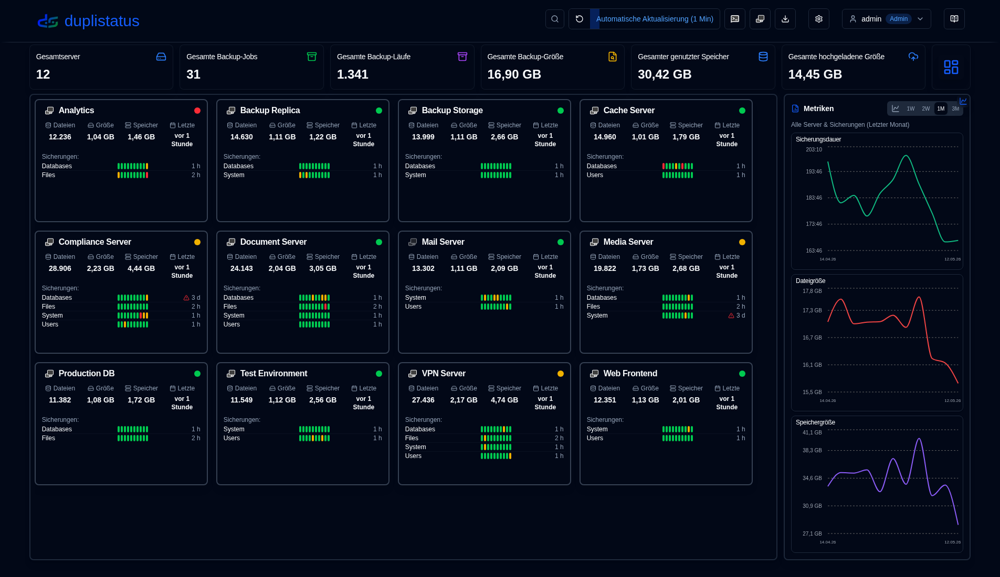
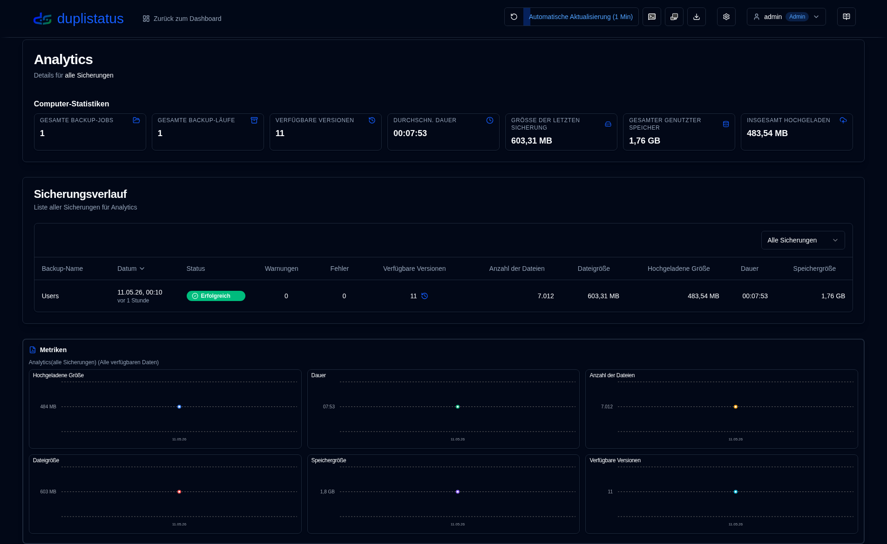
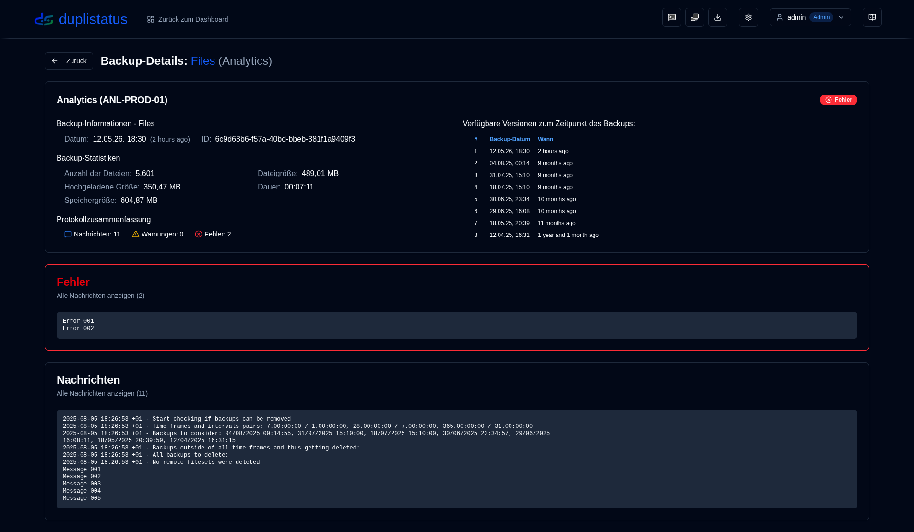

# Willkommen bei duplistatus {#welcome-to-duplistatus}

**duplistatus** - Überwache mehrere [Duplicati's](https://github.com/duplicati/duplicati) Server von einem einzigen Dashboard aus

## Funktionen {#features}

- **Schnelleinrichtung**: Einfache containerbasierte Bereitstellung mit verfügbaren Images auf Docker Hub und GitHub.
- **Einheitliches Dashboard**: Anzeige des Sicherungsstatus, Verlaufs und Details für alle Server an einem Ort.
- **Backup-Überwachung**: Automatische Überprüfung und Warnungen bei überfälligen geplanten Sicherungen.
- **Datenvisualisierung & Protokolle**: Interaktive Diagramme und automatische Protokollsammlung von Duplicati-Servern.
- **Benachrichtigungen & Warnungen**: Integrierte NTFY- und SMTP-E-Mail-Unterstützung für Sicherungswarnungen, einschließlich Hinweisen zu überfälligen Sicherungen.
- **Benutzerzugriffskontrolle & Sicherheit**: Sicheres Authentifizierungssystem mit rollenbasierter Zugriffskontrolle (Administrator/Benutzer-Rollen), konfigurierbaren Passwortrichtlinien, Schutz vor Kontosperrung und umfassender Benutzerverwaltung.
- **Audit-Protokollierung**: Vollständige Nachverfolgung aller Systemänderungen und Benutzeraktionen mit erweiterter Filterung, Exportfunktionen und konfigurierbaren Aufbewahrungszeiträumen.
- **Anwendung-Protokollbetrachter**: Nur für Administratoren zugängliche Schnittstelle zum Anzeigen, Suchen und Exportieren von Anwendungsprotokollen direkt über die Weboberfläche mit Echtzeitüberwachung.
- **Mehrsprachige Unterstützung**: Oberfläche und Dokumentation verfügbar in Englisch, Französisch, Deutsch, Spanisch und Brasilianisch-Portugiesisch.

## Installation {#installation}

Die Anwendung kann mit Docker, Portainer Stacks oder Podman bereitgestellt werden. Weitere Details finden Sie in der [Installationsanleitung](installation/installation.md).

- Bei einem Upgrade von einer älteren Version wird Ihre Datenbank automatisch [auf das neue Schema migriert](migration/version_upgrade.md) während des Upgrade-Prozesses.

- Bei Verwendung von Podman (entweder als eigenständiger Container oder innerhalb eines Pods) und bei Bedarf für benutzerdefinierte DNS-Einstellungen (z. B. für Tailscale MagicDNS, Unternehmensnetze oder andere benutzerdefinierte DNS-Konfigurationen), können Sie manuell DNS-Server und Suchdomänen angeben. Weitere Details finden Sie in der Installationsanleitung.

## Duplicati-Server-Konfiguration (erforderlich) {#duplicati-servers-configuration-required}

Sobald Ihr **duplistatus** Server gestartet ist, müssen Sie Ihre **Duplicati** Server so konfigurieren, dass sie Backup-Protokolle an **duplistatus** senden, wie in der [Duplicati-Konfigurations](installation/duplicati-server-configuration.md)-Abschnitt der Installationsanleitung beschrieben. Ohne diese Konfiguration erhält die Oberfläche keine Backup-Daten von Ihren Duplicati-Servern.

## Benutzerhandbuch {#user-guide}

Siehe die [Benutzeranleitung](user-guide/overview.md) für detaillierte Anweisungen zur Konfiguration und Nutzung von **duplistatus**, einschließlich der ersten Einrichtung, Funktionskonfiguration und Problembehebung.

## Screenshots {#screenshots}

### Dashboard {#dashboard}

### Sicherungsverlauf {#backup-history}

### Sicherungsdetails {#backup-details}

### Überfällige Sicherungen {#overdue-backups}

### Überfällige Benachrichtigungen auf Ihrem Handy {#overdue-notifications-on-your-phone}

## API-Referenz {#api-reference}

Siehe die [API-Endpunktsdokumentation](api-reference/overview.md) für Details zu verfügbaren Endpunkten, Anfrage/Antwortformaten und Beispielen.

## Entwicklung {#entwicklung}

Für Anweisungen zum Herunterladen, Ändern oder Ausführen des Codes, siehe [Entwicklungseinrichtung](development/setup.md).

Dieses Projekt wurde hauptsächlich mit KI-Unterstützung erstellt. Um zu erfahren wie, lesen Sie [Wie ich diese Anwendung mit KI-Tools entwickelt habe](development/how-i-build-with-ai).

## Credits {#credits}

- Zunächst und vor allem möchte ich Kenneth Skovhede für die Erstellung von Duplicati—diesem beeindruckenden Backup-Tool—danken. Auch möchte ich allen Mitwirkenden danken.

💙 Wenn Sie [Duplicati](https://www.duplicati.com) nützlich finden, bitten wir Sie, den Entwickler zu unterstützen. Weitere Details sind auf ihrer Website oder GitHub-Seite verfügbar.

- Duplicati SVG-Icon von https://dashboardicons.com/icons/duplicati
- ntfy SVG-Icon von https://dashboardicons.com/icons/ntfy
- GitHub SVG-Icon von https://github.com/logos

:::note
 Alle Produktnamen, Logos und Markenzeichen sind Eigentum ihrer jeweiligen Inhaber. Symbole und Namen werden nur zu Identifikationszwecken verwendet und implizieren keine Billigung.
:::

## Lizenz {#license}

Das Projekt ist unter der [Apache License 2.0](LICENSE.md) lizenziert.   

**Copyright © 2026 Waldemar Scudeller Jr.**
