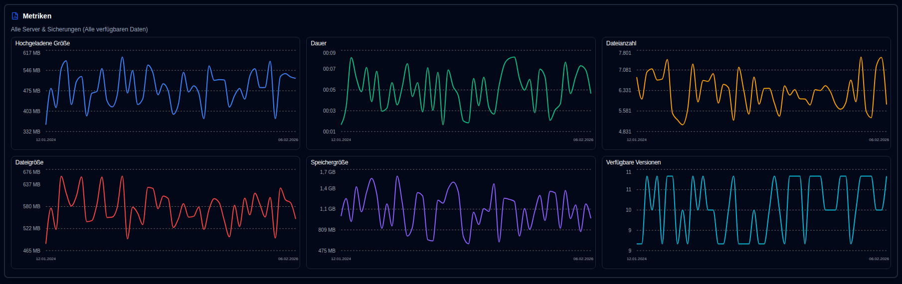

# Sicherungs-Metriken {#backup-metrics}

Ein Diagramm von Sicherungsmetriken im Zeitverlauf wird sowohl auf dem Dashboard (Tabellenansicht) als auch auf der Serverdetailseite angezeigt.

- **Dashboard**, das Diagramm zeigt die Gesamtanzahl der Sicherungen, die in der **duplistatus**-Datenbank aufgezeichnet wurden. Wenn Sie das Cards-Layout verwenden, können Sie einen Server auswählen, um seine konsolidierten Metriken anzuzeigen (wenn das Seitenpanel Metriken anzeigt).
- **Server Details**-Seite, das Diagramm zeigt Metriken für den ausgewählten Server (für alle seine Sicherungen) oder für eine einzelne, spezifische Sicherung.

- **Hochgeladene Größe**: Gesamtmenge der während Sicherungen vom Duplicati-Server zum Ziel (lokaler Speicherplatz, FTP, Cloud-Anbieter, ...) pro Tag hochgeladenen/übertragenen Daten.
- **Dauer**: Die Gesamtdauer aller pro Tag empfangenen Sicherungen in HH:MM.
- **Dateianzahl**: Die Summe der Dateianzahl-Zähler, die für alle pro Tag empfangenen Sicherungen ermittelt wurde.
- **Dateigröße**: Die Summe der vom Duplicati-Server für alle pro Tag empfangenen Sicherungen gemeldeten Dateigröße.
- **Speichergröße**: Die Summe der vom Duplicati-Server pro Tag gemeldeten, am Sicherungsziel verwendeten Speichergröße.
- **Verfügbare Versionen**: Die Summe aller verfügbaren Versionen für alle Sicherungen pro Tag.

:::note
Sie können die [Anzeigeeinstellungen](settings/display-settings.md) verwenden, um den Zeitbereich für das Diagramm zu konfigurieren.
:::
