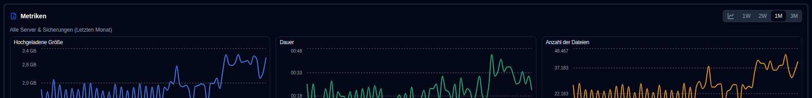

# Sicherungsmetriken {/* #backup-metrics */}

Ein Diagramm der Sicherungsmetriken im zeitlichen Verlauf wird sowohl auf dem Dashboard (Tabellenansicht) als auch auf der Serverdetails-Seite angezeigt.

- **Dashboard**: Das Diagramm zeigt die Gesamtanzahl der Sicherungen, die in der **duplistatus**-Datenbank erfasst wurden. Wenn Sie das Kartenlayout verwenden, können Sie einen Server auswählen, um seine zusammengefassten Metriken anzuzeigen (wenn das Seitenpanel Metriken anzeigt).
- **Serverdetails**-Seite: Das Diagramm zeigt Metriken für den ausgewählten Server (für alle seine Sicherungen) oder für eine einzelne, spezifische Sicherung.

## Integrierte Diagrammsteuerung {/* #inline-chart-controls */}

Schnellzugriffssteuerelemente sind direkt in den Diagrammpanel-Headern verfügbar, um eine einfache Konfiguration ohne Navigation zu den Anzeigeeinstellungen zu ermöglichen:

### Zeitauswahl {/* #time-range-selector */}

Kapsel-Schaltflächen erscheinen im Diagrammkopf zur schnellen Auswahl des Zeitbereichs: **1W | 2W | 1M | 3M**

- **1W**: Letzte 7 Tage (laufendes Fenster)
- **2W**: Letzte 14 Tage (laufendes Fenster)
- **1M**: Letzte 30 Tage (laufendes Fenster, Standard)
- **3M**: Letzte 90 Tage (laufendes Fenster)

Änderungen hier werden mit Ihren Anzeigeeinstellungen synchronisiert, sodass Ihre Einstellung über Seitenauffrischungen hinweg beibehalten wird.

### Diagrammstil-Umschalter {/* #chart-style-toggle */}

Eine Umschaltfläche im Diagrammkopf ermöglicht es Ihnen zwischen folgenden Optionen zu wechseln:

- **Weiche Linien**: Datenpunkte werden mit sanften Kurven verbunden dargestellt
- **Balkendiagramm**: Daten werden als diskrete Balken für jeden Zeitraum dargestellt

Beide Modi verwenden Zeit-Bucket-Aggregation für optimale Darstellung. Leere Perioden im Balkenmodus erzeugen keinen Balken. Ihre Einstellung bleibt über Seitenauffrischungen hinweg erhalten und wird mit den Anzeigeeinstellungen synchronisiert.

## Diagrammdatengruppierung {/* #chart-data-consolidation */}

Wenn mehrere Sicherungen am gleichen Tag erfolgen, fasst **duplistatus** die Daten zusammen, bevor sie in Diagrammen angezeigt werden:

- **SUM**: Wird für kumulative Metriken verwendet (Dauer, Anzahl der Dateien, Dateigröße, Hochgeladene Größe)
- **LAST**: Wird für Speichergröße verwendet (der aktuellste Wert des Tages)
- **MAX**: Wird für verfügbare Versionen verwendet (die höchste Anzahl des Tages)

Diese Zusammenfassung erfolgt, bevor die Zeit-Bucket-Einteilung angewendet wird, um genaue aggregierte Metriken sicherzustellen. Zum Beispiel erzeugen zwei Sicherungen am 12.05.26 einen einzigen zusammengefassten Datenpunkt im Diagramm.

## Metrikdefinitionen {/* #metric-definitions */}

- **Hochgeladene Größe**: Gesamtbetrag an Daten, die während der Sicherungen vom Duplicati-Server zum Ziel (lokaler Speicher, FTP, Cloud-Anbieter, ...) pro Tag hochgeladen/übertragen wurden.
- **Dauer**: Die Gesamtdauer aller pro Tag empfangenen Sicherungen in HH:MM.
- **Anzahl der Dateien**: Die Summe des Dateianzahl-Zählers, der für alle pro Tag empfangenen Sicherungen empfangen wurde.
- **Dateigröße**: Die Summe der von Duplicati-Server für alle pro Tag empfangenen Sicherungen gemeldeten Dateigröße.
- **Speichergröße**: Die Summe der von dem Duplicati-Server pro Tag gemeldeten verwendeten Speichergröße am Sicherungsziel.
- **Verfügbare Versionen**: Die Summe aller verfügbaren Versionen für alle Sicherungen pro Tag.

:::note
Sie können das Steuerelement [Anzeigeeinstellungen](settings/display-settings.md) verwenden, um den Zeitbereich für das Diagramm zu konfigurieren.
:::
