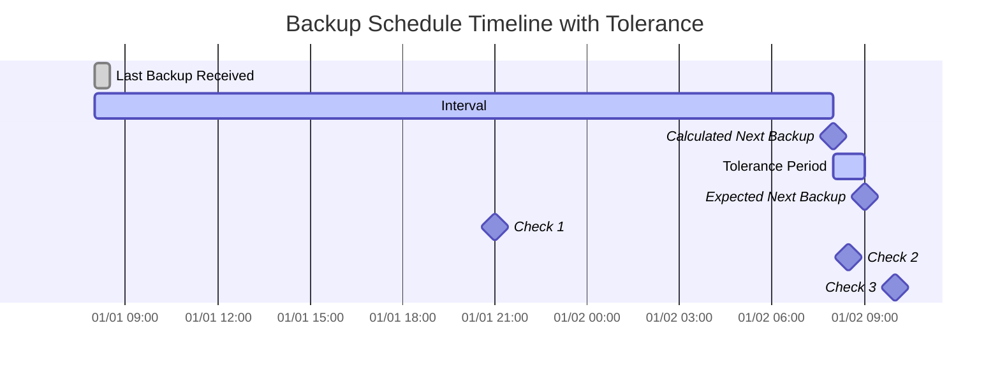

import { ZoomMermaid } from '@site/src/components/ZoomMermaid';

# Backup-Überwachung {/* #backup-monitoring */}

Die Funktion zur Backup-Überwachung ermöglicht es Ihnen, überfällige Backups zu verfolgen und Warnungen dafür zu erhalten. Die Benachrichtigungen können über NTFY oder E-Mail erfolgen.

In der Benutzeroberfläche werden überfällige Backups mit einem Warndreieck angezeigt. Beim Überfahren des Symbols mit der Maus werden die Details des überfälligen Backups angezeigt, einschließlich der Zeitpunkt der letzten Sicherung, der erwarteten Sicherungszeit, der Toleranzperiode und der erwarteten nächsten Sicherungszeit.

## Überprüfungsprozess für überfällige Backups {/* #overdue-check-process */}

**So funktioniert's:**

| **Schritt** | **Wert**                   | **Beschreibung**                                  | **Beispiel**       |
|:------------:|:---------------------------|:--------------------------------------------------|:-------------------|
|      1       | **Letzte Sicherung**       | Der Zeitstempel der letzten erfolgreichen Sicherung. | `2024-01-01 08:00` |
|      2       | **Erwartetes Intervall**   | Die konfigurierte Backup-Häufigkeit.              | `1 day`            |
|      3       | **Berechnete nächste Sicherung** | `Last Backup` + `Expected Interval`               | `2024-01-02 08:00` |
|      4       | **Toleranz**               | Die konfigurierte Karenzzeit (zusätzliche erlaubte Zeit). | `1 hour`           |
|      5       | **Erwartete nächste Sicherung** | `Calculated Next Backup` + `Tolerance`            | `2024-01-02 09:00` |

Ein Backup wird als **überfällig** betrachtet, wenn die aktuelle Zeit später ist als die `Expected Next Backup` Zeit.

<ZoomMermaid>

```mermaid
gantt
    title Backup Schedule Timeline with Tolerance
    dateFormat  YYYY-MM-DD HH:mm
    axisFormat %m/%d %H:%M

    Last Backup Received    :done, last-backup, 2024-01-01 08:00, 0.5h

    Interval                :active, interval, 2024-01-01 08:00, 24h
    Calculated Next Backup                :milestone, expected, 2024-01-02 08:00, 0h
    Tolerance Period        :active, tolerance period, 2024-01-02 08:00, 1h

    Expected Next Backup               :milestone, adjusted, 2024-01-02 09:00, 0h

    Check 1 : milestone, deadline, 2024-01-01 21:00, 0h
    Check 2 : milestone, deadline, 2024-01-02 08:30, 0h
    Check 3 : milestone, deadline, 2024-01-02 10:00, 0h

```

</ZoomMermaid>

**Beispiele basierend auf der obigen Zeitleiste:**

- Um `2024-01-01 21:00` (🔹Prüfung 1) ist das Backup **pünktlich**.
- Um `2024-01-02 08:30` (🔹Prüfung 2) ist das Backup **pünktlich**, da es sich immer noch innerhalb der Toleranzperiode befindet.
- Um `2024-01-02 10:00` (🔹Prüfung 3) ist das Backup **überfällig**, da dies nach der `Expected Next Backup` Zeit ist.

## Regelmäßige Prüfungen {/* #periodic-checks */}

**duplistatus** führt regelmäßig Prüfungen auf überfällige Backups in konfigurierbaren Intervallen durch. Das Standardintervall beträgt 20 Minuten, Sie können es jedoch unter [Einstellungen → Backup-Überwachung](settings/backup-monitoring-settings.md) konfigurieren.

## Automatische Konfiguration {/* #automatic-configuration */}

Wenn Sie Backup-Protokolle von einem Duplicati-Server sammeln, führt **duplistatus** automatisch Folgendes aus:

- Extrahiert den Backup-Zeitplan aus der Duplicati-Konfiguration
- Aktualisiert die Backup-Überwachungsintervalle exakt passend
- Synchronisiert erlaubte Wochentage und geplante Zeiten
- Behält Ihre Benachrichtigungseinstellungen bei

:::tip
Für optimale Ergebnisse sollten Sie die Backup-Protokolle sammeln, nachdem Sie die Intervalle der Sicherungsaufträge in Ihrem Duplicati-Server geändert haben. Dadurch wird sichergestellt, dass **duplistatus** mit Ihrer aktuellen Konfiguration synchron bleibt.
:::

Lesen Sie den Abschnitt [Einstellungen zur Backup-Überwachung](settings/backup-monitoring-settings.md) für detaillierte Konfigurationsoptionen.
