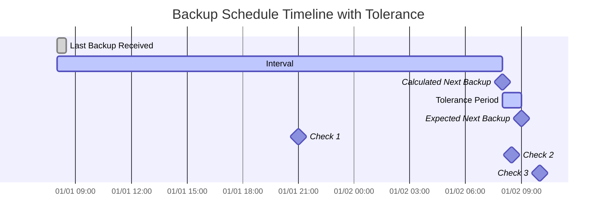

import { ZoomMermaid } from '@site/src/components/ZoomMermaid';

# Backup-Überwachung {/* #backup-monitoring */}

Die Backup-Überwachungsfunktion ermöglicht es Ihnen, überfällige Backups zu verfolgen und zu benachrichtigen. Die Benachrichtigungen können per NTFY oder E-Mail erfolgen.

In der Benutzeroberfläche werden überfällige Backups mit einem Warnungssymbol angezeigt. Bei der Überfahrt über das Symbol werden die Details der überfälligen Sicherung angezeigt, einschließlich der letzten Sicherungszeit, der erwarteten Sicherungszeit, der Toleranzzeit und der erwarteten nächsten Sicherungszeit.

## Überprüfungsprozess für überfällige Backups {/* #overdue-check-process */}

**So funktioniert es:**

| **Schritt** | **Wert**                  | **Beschreibung**                                   | **Beispiel**        |
|:--------:|:---------------------------|:--------------------------------------------------|:-------------------|
|    1     | **Letzte Sicherung**            | Der Zeitstempel der letzten erfolgreichen Sicherung.      | `2024-01-01 08:00` |
|    2     | **Erwartetes Intervall**      | Die konfigurierte Sicherungsfrequenz.                  | `1 day`            |
|    3     | **Berechnete nächste Sicherung** | `Last Backup` + `Expected Interval`               | `2024-01-02 08:00` |
|    4     | **Toleranz**              | Der konfigurierte Gnadenzuschlag (zusätzliche Zeit). | `1 hour`           |
|    5     | **Erwartete nächste Sicherung**   | `Calculated Next Backup` + `Tolerance`            | `2024-01-02 09:00` |

Eine Sicherung gilt als **überfällig**, wenn die aktuelle Zeit später als die `Expected Next Backup` Zeit ist.

<ZoomMermaid>

```mermaid
gantt
    title Backup Schedule Timeline with Tolerance
    dateFormat  YYYY-MM-DD HH:mm
    axisFormat %m/%d %H:%M

    Last Backup Received    :done, last-backup, 2024-01-01 08:00, 0.5h

    Interval                :active, interval, 2024-01-01 08:00, 24h
    Calculated Next Backup                :milestone, expected, 2024-01-02 08:00, 0h
    Tolerance Period        :active, tolerance period, 2024-01-02 08:00, 1h

    Expected Next Backup               :milestone, adjusted, 2024-01-02 09:00, 0h

    Check 1 : milestone, deadline, 2024-01-01 21:00, 0h
    Check 2 : milestone, deadline, 2024-01-02 08:30, 0h
    Check 3 : milestone, deadline, 2024-01-02 10:00, 0h

```

</ZoomMermaid>

**Beispiele basierend auf der obigen Zeitachse:**

- Bei `2024-01-01 21:00` (🔹Check 1) ist die Sicherung **pünktlich**.
- Bei `2024-01-02 08:30` (🔹Check 2) ist die Sicherung **pünktlich**, da sie noch innerhalb des Toleranzzeitraums liegt.
- Bei `2024-01-02 10:00` (🔹Check 3) ist die Sicherung **überfällig**, da dies nach der `Expected Next Backup` Zeit liegt.

## Periodische Überprüfungen {/* #periodic-checks */}

**duplistatus** führt periodische Überprüfungen auf überfällige Backups in konfigurierbaren Intervallen durch. Das Standardintervall beträgt 20 Minuten, kann aber in [Einstellungen → Backup-Überwachung](settings/backup-monitoring-settings.md) konfiguriert werden.

## Automatische Konfiguration {/* #automatic-configuration */}

Wenn Sie Backup-Protokolle von einem Duplicati-Server sammeln, konfiguriert **duplistatus** automatisch:

- Extrahiert den Backup-Zeitplan aus der Duplicati-Konfiguration
- Aktualisiert die Backup-Überwachungsintervalle entsprechend
- Synchronisiert die erlaubten Wochentage und geplanten Zeiten
- Behält Ihre Benachrichtigungseinstellungen bei

:::tip
Für die besten Ergebnisse sollten Sie nach der Änderung der Backup-Job-Intervalle in Ihrem Duplicati-Server die Backup-Protokolle sammeln. Dies stellt sicher, dass **duplistatus** mit Ihrer aktuellen Konfiguration synchronisiert bleibt.
:::

Überprüfen Sie den Abschnitt [Einstellungen für die Backup-Überwachung](settings/backup-monitoring-settings.md) für detaillierte Konfigurationsoptionen.
