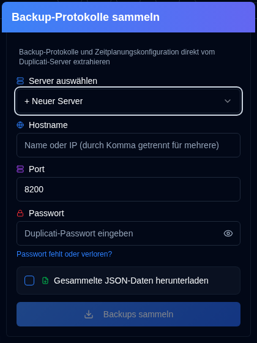
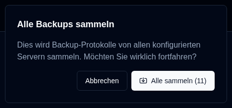

# Backup-Protokolle sammeln {#collect-backup-logs}

**duplistatus** kann Sicherungsprotokolle direkt von Duplicati-Servern abrufen, um die Datenbank zu füllen oder fehlende Protokolldaten wiederherzustellen. Die Anwendung überspringt automatisch alle doppelten Protokolle, die bereits in der Datenbank vorhanden sind.

## Schritte zum Sammeln von Sicherungsprotokollen {#steps-to-collect-backup-logs}

### Manuelle Erfassung {#manual-collection}

1.  Klicken Sie auf das <IconButton icon="lucide:download" /> **Backup-Logs sammeln**-Symbol in der [Anwendungsleiste](overview.md#application-toolbar).

2.  Server auswählen

Wenn Sie Server-Adressen in [Einstellungen → Server-Einstellungen](settings/server-settings.md) konfiguriert haben, wählen Sie eine aus der Dropdown-Liste für sofortige Erfassung aus. Wenn Sie keine Server konfiguriert haben, können Sie die Duplicati-Server-Details manuell eingeben.

3.  Geben Sie die Duplicati-Server-Details ein:
    - **Hostname**: Der Hostname oder die IP-Adresse des Duplicati-Servers. Sie können mehrere Hostnamen durch Kommas getrennt eingeben, z. B. `192.168.1.23,someserver.local,192.168.1.89`
    - **Port**: Die vom Duplicati-Server verwendete Portnummer (Standard: `8200`).
    - **Passwort**: Geben Sie das Authentifizierungspasswort ein, falls erforderlich.
    - **Gesammelte JSON-Daten herunterladen**: Aktivieren Sie diese Option, um die von duplistatus gesammelten Daten herunterzuladen.
4.  Klicken Sie auf **Backups sammeln**.

***Hinweise:***
- Wenn Sie mehrere Hostnamen eingeben, wird die Erfassung mit demselben Port und Passwort für alle Server durchgeführt.
- **duplistatus** erkennt automatisch das beste Verbindungsprotokoll (HTTPS oder HTTP). Es versucht zuerst HTTPS (mit ordnungsgemäßer SSL-Validierung), dann HTTPS mit selbstsigniertem Zertifikat und schließlich HTTP als Fallback.

:::tip
<IconButton icon="lucide:download" /> Schaltflächen sind in [Einstellungen → Sicherungsüberwachung](settings/backup-monitoring-settings.md) und [Einstellungen → Server-Einstellungen](settings/server-settings.md) für die Erfassung einzelner Server verfügbar.
:::

 

### Massenerfassung {#bulk-collection}

_Klicken Sie mit der rechten Maustaste_ auf die Schaltfläche <IconButton icon="lucide:download" /> **Backup-Protokolle sammeln** in der Anwendungssymbolleiste, um von allen konfigurierten Servern zu sammeln.

:::tip
Sie können auch die Schaltfläche <IconButton icon="lucide:import" label="Alle sammeln"/> auf den Seiten [Einstellungen → Sicherungsüberwachung](settings/backup-monitoring-settings.md) und [Einstellungen → Server-Einstellungen](settings/server-settings.md) verwenden, um von allen konfigurierten Servern zu sammeln.
:::

## Wie der Erfassungsprozess funktioniert {#how-the-collection-process-works}

- **duplistatus** erkennt automatisch das beste Verbindungsprotokoll und stellt eine Verbindung zum angegebenen Duplicati-Server her.
- Es ruft den Sicherungsverlauf, Protokollinformationen und Sicherungseinstellungen (für die Backup-Überwachung) ab.
- Protokolle, die bereits in der **duplistatus**-Datenbank vorhanden sind, werden übersprungen.
- Neue Daten werden verarbeitet und in der lokalen Datenbank gespeichert.
- Die verwendete URL (mit dem erkannten Protokoll) wird in der lokalen Datenbank gespeichert oder aktualisiert.
- Falls die Download-Option ausgewählt ist, werden die gesammelten JSON-Daten heruntergeladen. Der Dateiname hat folgendes Format: `[serverName]_collected_[Timestamp].json`. Der Zeitstempel verwendet das ISO 8601-Datumsformat (JJJJ-MM-TTTT:MM:SS).
- Das Dashboard wird aktualisiert, um die neuen Informationen anzuzeigen.

## Fehlerbehebung bei Sammlungsproblemen {#troubleshooting-collection-issues}

Die Erfassung von Sicherungsprotokollen erfordert, dass der Duplicati-Server von der **duplistatus**-Installation aus erreichbar ist. Falls Sie auf Probleme stoßen, bestätigen Sie bitte Folgendes:

- Bestätigen Sie, dass der Hostname (oder die IP-Adresse) und die Portnummer korrekt sind. Sie können dies testen, indem Sie die Duplicati-Server-Benutzeroberfläche in Ihrem Browser aufrufen (z. B. `http://hostname:port`).
- Prüfen Sie, dass **duplistatus** sich mit dem Duplicati-Server verbinden kann. Ein häufiges Problem ist die DNS-Namensauflösung (das System kann den Server anhand seines Hostnamens nicht finden). Weitere Informationen finden Sie im [Abschnitt zur Fehlerbehebung](troubleshooting.md#collect-backup-logs-not-working).
- Stellen Sie sicher, dass das von Ihnen angegebene Passwort korrekt ist.
