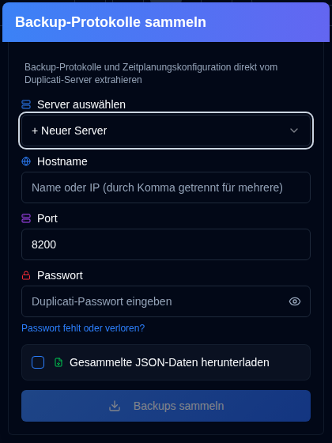
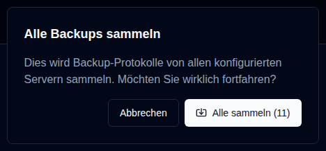

# Backup-Protokolle sammeln {#collect-backup-logs}

**duplistatus** kann Sicherungsprotokolle direkt von Duplicati-Servern abrufen, um die Datenbank zu füllen oder fehlende Protokolldaten wiederherzustellen. Die Anwendung überspringt automatisch alle doppelten Protokolle, die bereits in der Datenbank vorhanden sind.

## Schritte zum Sammeln von Sicherungsprotokollen {#steps-to-collect-backup-logs}

### Manuelle Erfassung {#manual-collection}

1.  Klicken Sie auf das <IconButton icon="lucide:download" /> **Backup-Logs sammeln**-Symbol in der [Anwendungsleiste](overview.md#application-toolbar).

2.  Server auswählen

Wenn Sie Server-Adressen in [Einstellungen → Server-Einstellungen](settings/server-settings.md) konfiguriert haben, wählen Sie eine aus der Dropdown-Liste für sofortige Erfassung aus. Wenn Sie keine Server konfiguriert haben, können Sie die Duplicati-Server-Details manuell eingeben.

3.  Geben Sie die Duplicati-Server-Details ein:
    - **Hostname**: Der Hostname oder die IP-Adresse des Duplicati-Servers. Sie können mehrere Hostnamen durch Kommas getrennt eingeben, z. B. `192.168.1.23,someserver.local,192.168.1.89`
    - **Port**: Die vom Duplicati-Server verwendete Portnummer (Standard: `8200`).
    - **Passwort**: Geben Sie das Authentifizierungspasswort ein, falls erforderlich.
    - **Gesammelte JSON-Daten herunterladen**: Aktivieren Sie diese Option, um die von duplistatus gesammelten Daten herunterzuladen.
4.  Klicken Sie auf **Backups sammeln**.

***Hinweise:***
- Wenn Sie mehrere Hostnamen eingeben, wird die Erfassung mit demselben Port und Passwort für alle Server durchgeführt.
- **duplistatus** erkennt automatisch das beste Verbindungsprotokoll (HTTPS oder HTTP). Es versucht zuerst HTTPS (mit ordnungsgemäßer SSL-Validierung), dann HTTPS mit selbstsigniertem Zertifikat und schließlich HTTP als Fallback.

:::tip
<IconButton icon="lucide:download" /> Schaltflächen sind in [Einstellungen → Sicherungsüberwachung](settings/backup-monitoring-settings.md) und [Einstellungen → Server-Einstellungen](settings/server-settings.md) für die Erfassung einzelner Server verfügbar.
:::

 

### Massenerfassung {#bulk-collection}

_Klicken Sie mit der rechten Maustaste_ auf die Schaltfläche <IconButton icon="lucide:download" /> **Backup-Protokolle sammeln** in der Anwendungssymbolleiste, um von allen konfigurierten Servern zu sammeln.

:::tip
Sie können auch die Schaltfläche <IconButton icon="lucide:import" label="Alle sammeln"/> auf den Seiten [Einstellungen → Sicherungsüberwachung](settings/backup-monitoring-settings.md) und [Einstellungen → Server-Einstellungen](settings/server-settings.md) verwenden, um von allen konfigurierten Servern zu sammeln.
:::

## Wie der Erfassungsprozess funktioniert {#how-the-collection-process-works}

- **duplistatus** erkennt automatisch das beste Verbindungsprotokoll und verbindet sich mit dem angegebenen Duplicati-Server.
- Es ruft den Sicherungsverlauf, Protokollinformationen und Sicherungseinstellungen ab (für die Backup-Überwachung).
- Protokolle, die bereits in der **duplistatus**-Datenbank vorhanden sind, werden übersprungen.
- Neue Daten werden verarbeitet und in der lokalen Datenbank gespeichert, einschließlich der in jedem Backup-Protokoll gemeldeten Duplicati-Version. Die [Dashboard-Version](dashboard.md#duplicati-server-version) wird aus dem neuesten gespeicherten Protokoll entnommen — **duplistatus** liest nicht die Version, die derzeit auf dem Server ausgeführt wird. Nach einem Duplicati-Upgrade sammeln Sie die Protokolle oder warten Sie auf ein neues Backup, damit das Dashboard die neue Version anzeigen kann.
- Die verwendete URL (mit dem erkannten Protokoll) wird in der lokalen Datenbank gespeichert oder aktualisiert.
- Wenn die Download-Option ausgewählt ist, wird die JSON-Daten heruntergeladen, die gesammelt wurden, sobald Daten vom Duplicati-Server empfangen werden — auch wenn die Protokolle die Validierung scheitern oder nicht in die Datenbank importiert werden können. Der Dateiname hat das folgende Format: `[serverName]_collected_[Timestamp].json`. Der Zeitstempel verwendet das ISO 8601-Datumsformat (JJJJ-MM-TTTHH:MM:SS).
- Das Dashboard wird aktualisiert, um die neuen Informationen zu widerspiegeln.

:::note Werden nach dem Sammeln doppelte Server angezeigt?
Wenn derselbe Server nach dem Sammeln von Backup-Protokollen mehrmals angezeigt wird (oder nach einer Neuinstallation oder einem Upgrade von Duplicati), wird dies meist durch eine geänderte `machine_id` oder einen Duplicati-API-Fehler verursacht, der die `identity`-ID und die `machine_id` vermischt. Die Lösung besteht darin, die IDs auf dem Duplicati-Server anzugleichen (bearbeiten Sie `identity.txt`/`machineid.txt` oder setzen Sie **Duplicati → Einstellungen → Erweiterte Optionen → Machine-id**), Duplicati neu zu starten und dann die Einträge in **duplistatus** über [Einstellungen → Datenbankverwaltung → Doppelte Server zusammenführen](settings/database-maintenance.md#merge-duplicate-servers) zusammenzuführen. Vollständige Schritte finden Sie unter [Doppelte Server auf dem Dashboard](troubleshooting.md#duplicate-servers-on-the-dashboard).
:::

## Fehlerbehebung bei Sammlungsproblemen {#troubleshooting-collection-issues}

Die Erfassung von Sicherungsprotokollen erfordert, dass der Duplicati-Server von der **duplistatus**-Installation aus erreichbar ist. Falls Sie auf Probleme stoßen, bestätigen Sie bitte Folgendes:

- Stellen Sie sicher, dass der Hostname (oder die IP-Adresse) und die Portnummer korrekt sind. Sie können dies testen, indem Sie auf die Duplicati-Server-UI in Ihrem Browser zugreifen (z. B. `http://hostname:port`).
- Überprüfen Sie, ob **duplistatus** eine Verbindung zum Duplicati-Server herstellen kann. Ein häufiges Problem ist die DNS-Namensauflösung (das System kann den Server nicht über seinen Hostnamen finden). Weitere Informationen finden Sie im [Abschnitt zur Fehlerbehebung](troubleshooting.md#collect-backup-logs-not-working).
- Stellen Sie sicher, dass das von Ihnen angegebene Passwort korrekt ist.
- Bei Duplicati 2.4+ liest die Sammlung die machine-id aus den Duplicati-Servereinstellungen, wenn die systeminfo-Option standardmäßig leer ist.
