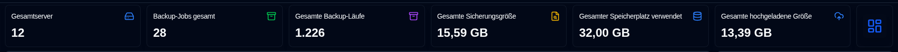
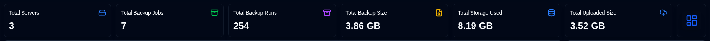
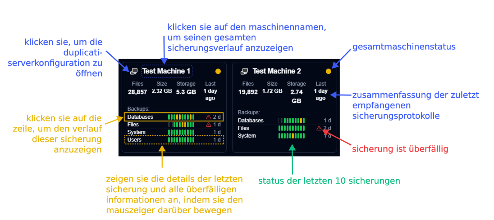
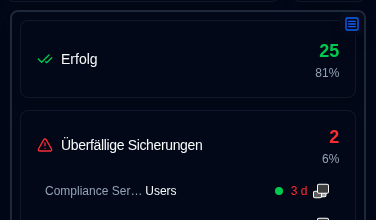
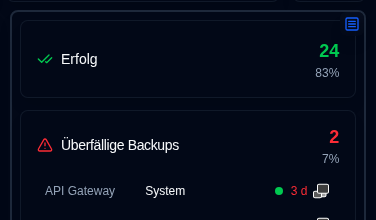
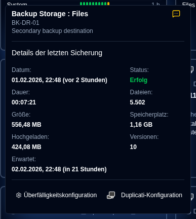
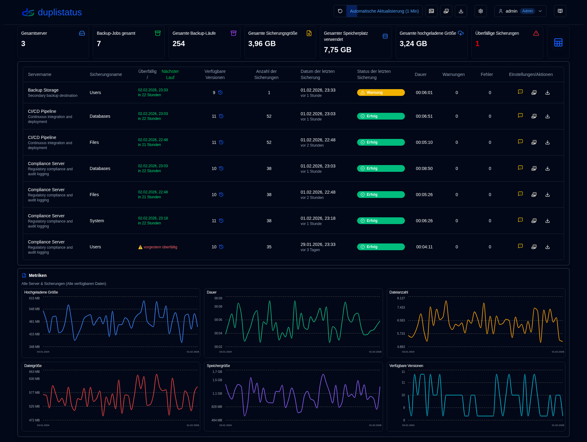
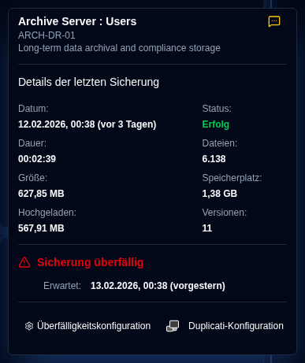
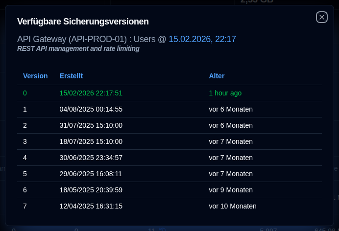

# Dashboard {#dashboard}

:::tip
**Schnellzugriff auf Anzeigeeinstellungen**: Klicken Sie mit der rechten Maustaste auf die Schaltfläche zum automatischen Aktualisieren in der Anwendungssymbolleiste, um die Seite [Anzeigeeinstellungen](settings/display-settings.md) schnell zu öffnen.
:::

## Dashboard-Zusammenfassung {#dashboard-summary}

Dieser Abschnitt zeigt aggregierte Statistiken für alle Sicherungen an.

- **Gesamtserver**: Die Anzahl der überwachten Server.
- **Backup-Jobs gesamt**: Die Gesamtanzahl der für alle Server konfigurierten Sicherungsaufträge (Typen).
- **Gesamte Backup-Läufe**: Die Gesamtanzahl der Sicherungsprotokolle von Läufen, die für alle Server empfangen oder gesammelt wurden.
- **Gesamte Sicherungsgröße**: Die kombinierte Größe aller Quelldaten basierend auf den neuesten empfangenen Sicherungsprotokollen.
- **Gesamter Speicherplatz verwendet**: Der Gesamtspeicherplatz, der von Sicherungen am Sicherungsziel (z. B. Cloud-Speicher, FTP-Server, lokales Laufwerk) verwendet wird, basierend auf den neuesten Sicherungsprotokollen.
- **Gesamte hochgeladene Größe**: Die Gesamtmenge der vom Duplicati-Server zum Ziel hochgeladenen Daten (z. B. lokaler Speicher, FTP, Cloud-Anbieter).
- **Überfällige Sicherungen** (Tabelle): Die Anzahl der überfälligen Sicherungen. Siehe [Backup-Benachrichtigungen Einstellungen](settings/backup-notifications-settings.md)
- **Layout-Umschalter**: Wechselt zwischen dem Cards-Layout (Standard) und dem Table-Layout.

## Kartenlayout {#cards-layout}

Das Kartenlayout zeigt den Status des zuletzt empfangenen Sicherungsprotokolls für jede Sicherung.

- **Servername**: Name des Duplicati-Servers (oder der Alias)
  - Wenn Sie den Mauszeiger über den **Servernamen** bewegen, werden der Servername und der Hinweis angezeigt
- **Gesamtstatus**: Der Status des Servers. Überfällige Sicherungen werden als `Warnung`-Status angezeigt
- **Zusammenfassende Informationen**: Die konsolidierte Anzahl von Dateien, Größe und Speicherplatz, der für alle Sicherungen dieses Servers verwendet wird. Zeigt auch die verstrichene Zeit der zuletzt empfangenen Sicherung an (Mauszeiger darüber bewegen, um den Zeitstempel anzuzeigen)
- **Sicherungsliste**: Eine Tabelle mit allen für diesen Server konfigurierten Sicherungen mit 3 Spalten:
  - **Sicherungsname**: Name der Sicherung auf dem Duplicati-Server
  - **Statusverlauf**: Status der letzten 10 empfangenen Sicherungen.
  - **Letzte empfangene Sicherung**: Die verstrichene Zeit seit der aktuellen Zeit des zuletzt empfangenen Protokolls. Es wird ein Warnsymbol angezeigt, wenn die Sicherung überfällig ist.
    - Die Zeit wird in Kurzform angezeigt: `m` für Minuten, `h` für Stunden, `d` für Tage, `w` für Wochen, `mo` für Monate, `y` für Jahre.

:::note
Sie können die [Anzeigeeinstellungen](settings/display-settings.md) verwenden, um die Kartensortierreihenfolge zu konfigurieren. Die verfügbaren Optionen sind `Server name (a-z)`, `Status (error > warning > success)` und `Last backup received (new > old)`.
:::

Sie können die Schaltfläche oben rechts im Seitenpanel umschalten, um die Panelansicht zu ändern:

- Status: Einblenden von Statistiken der Sicherungsaufträge pro Status, mit einer Liste von überfälligen Sicherungen und Sicherungsaufträgen mit Warnungen/Fehler-Status.

- Metriken: Einblenden von Diagrammen mit Dauer, Dateigröße und Speichergröße über die Zeit für den aggregierten oder ausgewählten Server.

### Sicherungsdetails {#backup-details}

Wenn Sie den Mauszeiger über eine Sicherung in der Liste bewegen, werden Details des zuletzt empfangenen Sicherungsprotokolls und alle überfälligen Informationen angezeigt.

- **Servername : Sicherung**: Der Name oder Alias des Duplicati-Servers und der Sicherung, zeigt auch den Servernamen und den Hinweis an.
  - Der Alias und der Hinweis können unter `Settings → Server Settings` konfiguriert werden.
- **Benachrichtigungen**: Ein Symbol, das die [konfigurierte Benachrichtigungseinstellung](#notifications-icons) für neue Sicherungsprotokolle anzeigt.
- **Datum**: Der Zeitstempel der Sicherung und die verstrichene Zeit seit der letzten Bildschirmaktualisierung.
- **Status**: Der Status der zuletzt empfangenen Sicherung (Erfolg, Warnung, Fehler, Kritisch).
- **Dauer, Dateianzahl, Dateigröße, Speichergröße, Hochgeladene Größe**: Werte wie vom Duplicati-Server gemeldet.
- **Verfügbare Versionen**: Die Anzahl der Sicherungsversionen, die zum Zeitpunkt der Sicherung am Sicherungsziel gespeichert sind.

Wenn diese Sicherung überfällig ist, zeigt der Tooltip auch:

- **Erwartete Sicherung**: Der Zeitpunkt, zu dem die Sicherung erwartet wurde, einschließlich der konfigurierten Kulanzfrist (zusätzliche Zeit, bevor sie als überfällig markiert wird).

Sie können auch auf die Schaltflächen am unteren Rand klicken, um `Einstellungen → Sicherungsmitteilungen` zu öffnen und die Einstellungen für überfällige Sicherungen zu konfigurieren, oder öffnen Sie die Weboberfläche des Duplicati-Servers.

## Tabellenlayout {#table-layout}

Die Tabellenlayout listet die neuesten empfangenen Sicherungsprotokolle für alle Server und Sicherungen auf.

- **Servername**: Der Name des Duplicati-Servers (oder Alias)
  - Unter dem Namen befindet sich der Serverhinweis
- **Sicherungsname**: Der Name der Sicherung auf dem Duplicati-Server.
- **Verfügbare Versionen**: Die Anzahl der auf dem Sicherungsziel gespeicherten Sicherungsversionen. Wenn das Symbol ausgegraut ist, wurden detaillierte Informationen nicht im Protokoll empfangen. Weitere Informationen finden Sie in der [Duplicati-Konfigurationsanleitung](../installation/duplicati-server-configuration.md).
- **Anzahl der Sicherungen**: Die Anzahl der vom Duplicati-Server gemeldeten Sicherungen.
- **Datum der letzten Sicherung**: Der Zeitstempel des zuletzt empfangenen Sicherungsprotokolls und die verstrichene Zeit seit der letzten Bildschirmaktualisierung.
- **Status der letzten Sicherung**: Der Status der zuletzt empfangenen Sicherung (Erfolg, Warnung, Fehler, Kritisch).
- **Dauer**: Die Dauer der Sicherung in HH:MM:SS.
- **Warnungen/Fehler**: Die Anzahl der im Sicherungsprotokoll gemeldeten Warnungen/Fehler.
- **Einstellungen**:
  - **Benachrichtigung**: Ein Symbol, das die konfigurierte Benachrichtigungseinstellung für neue Sicherungsprotokolle anzeigt.
  - **Duplicati-Konfiguration**: Eine Schaltfläche zum Öffnen der Weboberfläche des Duplicati-Servers

### Benachrichtigungssymbole {#notifications-icons}

| Icon                                                                                                                                    | Benachrichtigungsoption | Beschreibung                                                                                         |
| --------------------------------------------------------------------------------------------------------------------------------------- | ------------------- | --------------------------------------------------------------------------------------------------- |
| <IconButton icon="lucide:message-square-off" style={{border: 'none', padding: 0, color: '#9ca3af', background: 'transparent'}} />     | Aus                 | Nein Benachrichtigungen werden gesendet, wenn ein neues Sicherungsprotokoll empfangen wird                                     |
| <IconButton icon="lucide:message-square-more" style={{border: 'none', padding: 0, color: '#60a5fa', background: 'transparent'}} />     | Alle                 | Benachrichtigungen werden für jedes neue Sicherungsprotokoll gesendet, unabhängig von seinem Status.                      |
| <IconButton icon="lucide:message-square-more" style={{border: 'none', padding: 0, color: '#fbbf24', background: 'transparent'}} />    | Warnungen            | Benachrichtigungen werden nur für Sicherungsprotokolle mit dem Status Warnung, Unbekannt, Fehler oder Kritisch gesendet. |
| <IconButton icon="lucide:message-square-more" style={{border: 'none', padding: 0, color: '#f87171', background: 'transparent'}} />    | Fehler              | Benachrichtigungen werden nur für Sicherungsprotokolle mit dem Status Fehler oder Kritisch gesendet.                    |

:::note
Diese Benachrichtigungseinstellung gilt nur, wenn **duplistatus** ein neues Sicherungsprotokoll von einem Duplicati-Server erhält. Benachrichtigungen für überfällige Sicherungen werden separat konfiguriert und werden unabhängig von dieser Einstellung gesendet.
:::

### Überfälligkeitsdetails {#overdue-details}

Wenn Sie den Mauszeiger über das Symbol für die Überfällige-Sicherungs-Warnung bewegen, werden Details zur überfälligen Sicherung angezeigt.

- **Geprüft**: Wann die letzte überfällige Prüfung durchgeführt wurde. Konfigurieren Sie die Häufigkeit in [Backup-Benachrichtigungen Einstellungen](settings/backup-notifications-settings.md).
- **Letzte Sicherung**: Wann das letzte Sicherungsprotokoll empfangen wurde.
- **Erwartete Sicherung**: Der Zeitpunkt, zu dem die Sicherung erwartet wurde, einschließlich der konfigurierten Kulanzfrist (zusätzliche Zeit, bevor sie als überfällig markiert wird).
- **Letzte Benachrichtigung**: Wann die letzte überfällige Benachrichtigung gesendet wurde.

### Verfügbare Sicherungsversionen {#available-backup-versions}

Wenn Sie auf das blaue Uhrsymbol klicken, wird eine Liste der verfügbaren Sicherungsversionen zum Zeitpunkt der Sicherung angezeigt, wie vom Duplicati-Server gemeldet.

- **Sicherungsdetails**: Zeigt den Servernamen und Alias, Serverhinweis, Sicherungsnamen und an, wann die Sicherung ausgeführt wurde.
- **Versionsdetails**: Zeigt die Versionsnummer, das Erstellungsdatum und das Alter an.

:::note
Wenn das Symbol ausgegraut ist, bedeutet dies, dass keine detaillierten Informationen in den Nachrichtenprotokollen empfangen wurden.
Weitere Informationen finden Sie in der [Duplicati-Konfigurationsanleitung](../installation/duplicati-server-configuration.md).
:::
