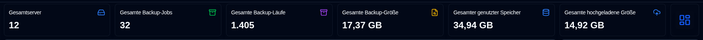
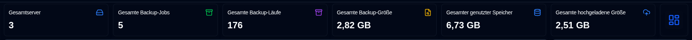
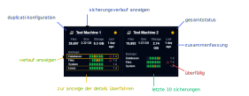
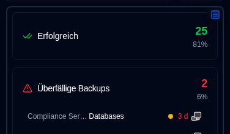
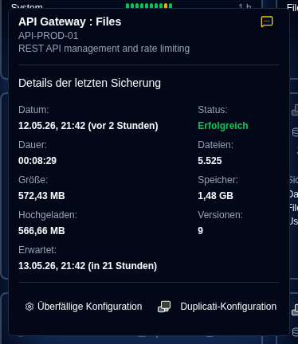
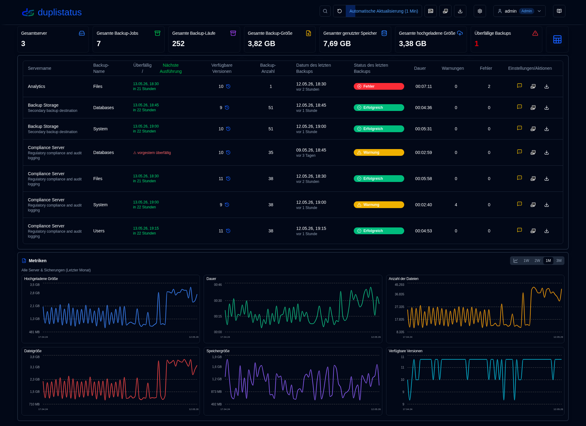
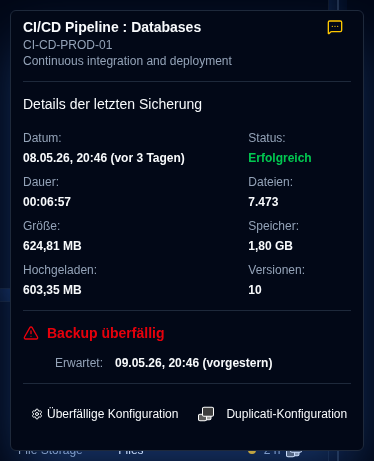
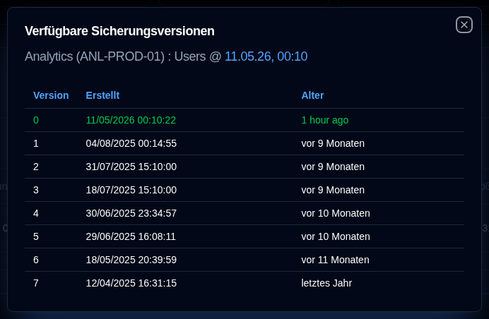

# Dashboard {#dashboard}

## Dashboard-Zusammenfassung {#dashboard-summary}

Dieser Abschnitt zeigt aggregierte Statistiken für alle Sicherungen an.

- **Gesamtanzahl Server**: Die Anzahl der überwachten Server.                                                                                                             
- **Gesamtanzahl Sicherungsaufträge**: Die Gesamtanzahl konfigurierter Sicherungsaufträge (Typen) für alle Server.                                                                                
- **Gesamtanzahl Sicherungsläufe**: Die Gesamtanzahl empfangener oder gesammelter Sicherungsprotokolle für alle Server.                                                                   
- **Gesamte Sicherungsgröße**: Die kombinierte Größe aller Quelldaten basierend auf den zuletzt empfangenen Sicherungsprotokollen.                                                                    
- **Gesamter genutzter Speicher**: Der gesamte Speicherplatz, der von Sicherungen am Sicherungsziel (z. B. Cloud-Speicher, FTP-Server, lokales Laufwerk) genutzt wird, basierend auf den letzten empfangenen Sicherungsprotokollen. 
- **Gesamte hochgeladene Größe**: Die gesamte Datenmenge, die vom Duplicati-Server zum Ziel (z. B. lokaler Speicher, FTP, Cloud-Anbieter) hochgeladen wurde.                       
- **Überfällige Sicherungen** (Tabelle): Die Anzahl der überfälligen Sicherungen. Siehe [Einstellungen für Sicherungshinweise](settings/backup-notifications-settings.md)                          
- **Layout-Umschaltung**: Wechselt zwischen der Kartenansicht (Standard) und der Tabellenansicht.

## Server-Filterung {#server-filtering}

Sie können die auf dem Dashboard angezeigten Server und Backups mithilfe des Suchfelds in der Anwendungssymbolleiste filtern. Klicken Sie auf das Filtersymbol (<IconButton icon="lucide:search" />), um das Suchfeld einzublenden.

**Filterergebnisse:**
- Server-ID
- Server-URL
- Namen von Backup-Jobs

**Umfang:**
- Filtert sowohl Karten- als auch Tabellenansichten auf dem Dashboard
- Sitzungszustand wird über den Dashboard-Server-Filterprovider beibehalten
- Wird gelöscht, wenn Sie das Dashboard aktualisieren oder verlassen

Dies erleichtert das schnelle Auffinden bestimmter Server oder Backups unter vielen überwachten Systemen.

## Kartenlayout {#cards-layout}

Das Kartenlayout zeigt den Status des zuletzt empfangenen Sicherungsprotokolls für jede Sicherung.

- **Servername**: Name des Duplicati-Servers (oder der Alias)
  - Beim Hovern über den **Servernamen** werden Servername und Notiz angezeigt
- **Gesamtstatus**: Der Status des Servers. Überfällige Sicherungen werden als **Warnung** angezeigt
- **Zusammenfassungsinformationen**: Die zusammengefasste Anzahl der Dateien, Größe und genutzter Speicher für alle Sicherungen dieses Servers. Zeigt auch die Dauer der zuletzt empfangenen Sicherung an (beim Hovern wird der Zeitstempel angezeigt)
- **Sicherungsliste**: Eine Tabelle mit allen für diesen Server konfigurierten Sicherungen, mit 3 Spalten:
  - **Sicherungsname**: Name der Sicherung auf dem Duplicati-Server
  - **Statusverlauf**: Status der letzten 10 empfangenen Sicherungen.
  - **Letzte empfangene Sicherung**: Die verstrichene Zeit seit dem aktuellen Zeitpunkt der zuletzt empfangenen Protokolldatei. Ein Warnsymbol wird angezeigt, wenn die Sicherung überfällig ist.
    - Die Zeit wird im abgekürzten Format angezeigt: `m` für Minuten, `h` für Stunden, `d` für Tage, `w` für Wochen, `mo` für Monate, `y` für Jahre.

Die Kartensortierreihenfolge und andere Konfigurationen können in den [Anzeigeeinstellungen](settings/display-settings.md) festgelegt werden.

Die Panelansicht bietet zwei Informationsanzeigen, auf die durch Klicken auf die Schaltfläche oben rechts im Seitenpanel zugegriffen werden kann:

- Status: Einblenden von Statistiken der Sicherungsaufträge pro Status, mit einer Liste von überfälligen Sicherungen und Sicherungsaufträgen mit Warnungen/Fehler-Status.

- Metriken: Einblenden von Diagrammen mit Dauer, Dateigröße und Speichergröße über die Zeit für den aggregierten oder ausgewählten Server.

### Sicherungsdetails {#backup-details}

Wenn Sie den Mauszeiger über eine Sicherung in der Liste bewegen, werden Details des zuletzt empfangenen Sicherungsprotokolls und alle überfälligen Informationen angezeigt.

- **Servername : Sicherung**: Der Name oder Alias des Duplicati-Servers und der Sicherung; zeigt auch den Servernamen und die Notiz an.
  - Der Alias und die Notiz können unter [Einstellungen → Servereinstellungen](settings/server-settings.md) konfiguriert werden.
- **Benachrichtigungen**: Ein Symbol, das die [konfigurierte Benachrichtigung](#notifications-icons) für neue Sicherungsprotokolle anzeigt.
- **Datum**: Der Zeitstempel der Sicherung und die verstrichene Zeit seit der letzten Bildschirmaktualisierung.
- **Status**: Der Status der zuletzt empfangenen Sicherung (Erfolg, Warnung, Fehler, Schwerwiegend).
- **Dauer, Anzahl der Dateien, Dateigröße, Speichergröße, Hochgeladene Größe**: Werte, wie vom Duplicati-Server gemeldet.
- **Verfügbare Versionen**: Die Anzahl der Sicherungsversionen, die zum Zeitpunkt der Sicherung am Sicherungsziel gespeichert sind.

Wenn diese Sicherung überfällig ist, zeigt der Tooltip auch:

- **Erwartete Sicherung**: Der Zeitpunkt, zu dem die Sicherung erwartet wurde, einschließlich der konfigurierten Kulanzfrist (zusätzliche Zeit, bevor sie als überfällig markiert wird).

Sie können auch auf die Schaltflächen unten klicken, um [Einstellungen → Backup-Benachrichtigungen](settings/backup-notifications-settings.md) zu öffnen und die Überwachungseinstellungen zu konfigurieren oder die Weboberfläche des Duplicati-Servers zu öffnen.

## Tabellenlayout {#table-layout}

Die Tabellenlayout listet die neuesten empfangenen Sicherungsprotokolle für alle Server und Sicherungen auf.

- **Servername**: Der Name des Duplicati-Servers (oder Alias)
  - Unter dem Namen befindet sich die Servernotiz
- **Sicherungsname**: Der Name der Sicherung im Duplicati-Server.
- **Verfügbare Versionen**: Die Anzahl der Sicherungsversionen, die am Sicherungsziel gespeichert sind. Ist das Symbol ausgegraut, wurden keine detaillierten Informationen im Protokoll empfangen. Weitere Informationen finden Sie in den [Anweisungen zur Duplicati-Konfiguration](../installation/duplicati-server-configuration.md).
- **Anzahl Sicherungen**: Die Anzahl der vom Duplicati-Server gemeldeten Sicherungen.
- **Datum der letzten Sicherung**: Der Zeitstempel des zuletzt empfangenen Sicherungsprotokolls und die verstrichene Zeit seit der letzten Bildschirmaktualisierung.
- **Status der letzten Sicherung**: Der Status der zuletzt empfangenen Sicherung (Erfolg, Warnung, Fehler, Schwerwiegend).
- **Dauer**: Die Dauer der Sicherung im Format HH:MM:SS.
- **Warnungen/Fehler**: Die Anzahl der Warnungen/Fehler, die im Sicherungsprotokoll gemeldet wurden.
- **Einstellungen**:
  - **Benachrichtigung**: Ein Symbol, das die konfigurierte Benachrichtigungseinstellung für neue Sicherungsprotokolle anzeigt.
  - **Duplicati-Konfiguration**: Eine Schaltfläche zum Öffnen der Web-Oberfläche des Duplicati-Servers

Sie können die [Anzeigeeinstellungen](settings/display-settings.md) verwenden, um die Tabellengröße und andere Konfigurationen zu konfigurieren.

### Benachrichtigungssymbole {#notifications-icons}

| Symbol                                                                                                                               | Benachrichtigungsoption | Beschreibung                                                                                         |
|------------------------------------------------------------------------------------------------------------------------------------|---------------------|-----------------------------------------------------------------------------------------------------|
| <IconButton icon="lucide:message-square-off" style={{border: 'none', padding: 0, color: '#9ca3af', background: 'transparent'}} />  | Aus                 | Es werden keine Benachrichtigungen gesendet, wenn ein neues Sicherungsprotokoll empfangen wird                                     |
| <IconButton icon="lucide:message-square-more" style={{border: 'none', padding: 0, color: '#60a5fa', background: 'transparent'}} /> | Alle                 | Es werden Benachrichtigungen für jedes neue Sicherungsprotokoll gesendet, unabhängig von seinem Status.                      |
| <IconButton icon="lucide:message-square-more" style={{border: 'none', padding: 0, color: '#fbbf24', background: 'transparent'}} /> | Warnungen            | Es werden nur Benachrichtigungen für Sicherungsprotokolle mit dem Status Warnung, Unbekannt, Fehler oder Schwerwiegend gesendet. |
| <IconButton icon="lucide:message-square-more" style={{border: 'none', padding: 0, color: '#f87171', background: 'transparent'}} /> | Fehler              | Es werden nur Benachrichtigungen für Sicherungsprotokolle mit dem Status Fehler oder Schwerwiegend gesendet.                    |

:::note
Diese Benachrichtigungseinstellung gilt nur, wenn **duplistatus** ein neues Sicherungsprotokoll von einem Duplicati-Server erhält. Benachrichtigungen für überfällige Sicherungen werden separat konfiguriert und werden unabhängig von dieser Einstellung gesendet.
:::

### Überfälligkeitsdetails {#overdue-details}

Wenn Sie den Mauszeiger über das Symbol für die Überfällige-Sicherungs-Warnung bewegen, werden Details zur überfälligen Sicherung angezeigt.

- **Geprüft**: Wann die letzte überfällige Prüfung durchgeführt wurde. Konfigurieren Sie die Häufigkeit in [Backup-Benachrichtigungen Einstellungen](settings/backup-notifications-settings.md).
- **Letzte Sicherung**: Wann das letzte Sicherungsprotokoll empfangen wurde.
- **Erwartete Sicherung**: Der Zeitpunkt, zu dem die Sicherung erwartet wurde, einschließlich der konfigurierten Kulanzfrist (zusätzliche Zeit, bevor sie als überfällig markiert wird).
- **Letzte Benachrichtigung**: Wann die letzte überfällige Benachrichtigung gesendet wurde.

### Verfügbare Sicherungsversionen {#available-backup-versions}

Wenn Sie auf das blaue Uhrsymbol klicken, wird eine Liste der verfügbaren Sicherungsversionen zum Zeitpunkt der Sicherung angezeigt, wie vom Duplicati-Server gemeldet.

- **Sicherungsdetails**: Zeigt den Servernamen und Alias, Serverhinweis, Sicherungsnamen und an, wann die Sicherung ausgeführt wurde.
- **Versionsdetails**: Zeigt die Versionsnummer, das Erstellungsdatum und das Alter an.

:::note
Wenn das Symbol ausgegraut ist, bedeutet dies, dass keine detaillierten Informationen in den Nachrichtenprotokollen empfangen wurden.
Weitere Informationen finden Sie in der [Duplicati-Konfigurationsanleitung](../installation/duplicati-server-configuration.md).
:::
