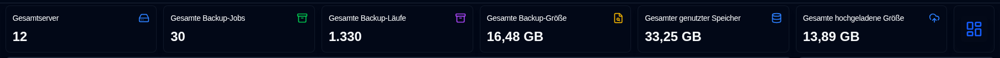
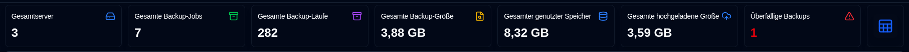
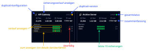
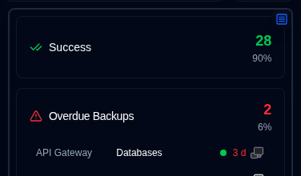
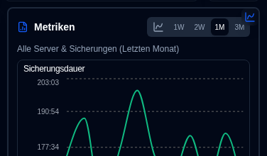
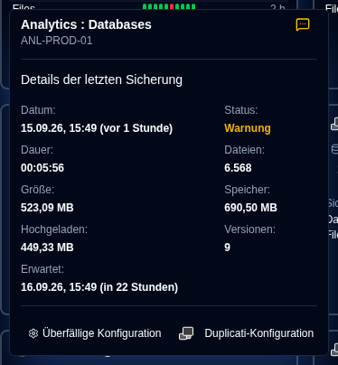
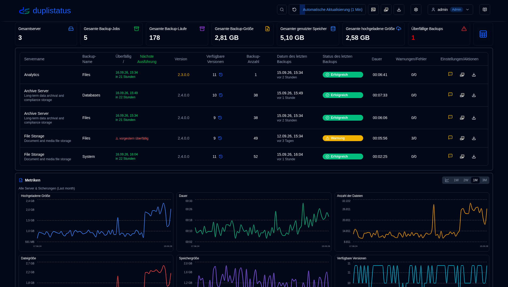
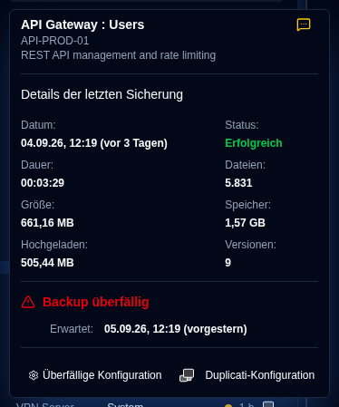
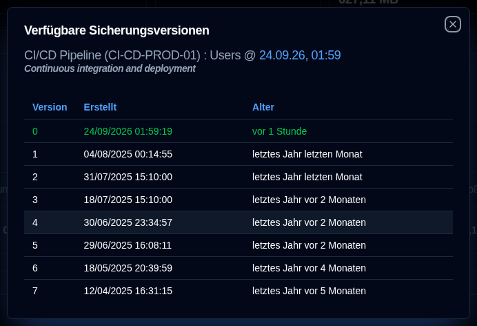

# Dashboard {#dashboard}

## Dashboard-Zusammenfassung {#dashboard-summary}

Dieser Abschnitt zeigt aggregierte Statistiken für alle Sicherungen an.

- **Gesamtanzahl Server**: Die Anzahl der überwachten Server.                                                                                                             
- **Gesamtanzahl Sicherungsaufträge**: Die Gesamtanzahl konfigurierter Sicherungsaufträge (Typen) für alle Server.                                                                                
- **Gesamtanzahl Sicherungsläufe**: Die Gesamtanzahl empfangener oder gesammelter Sicherungsprotokolle für alle Server.                                                                   
- **Gesamte Sicherungsgröße**: Die kombinierte Größe aller Quelldaten basierend auf den zuletzt empfangenen Sicherungsprotokollen.                                                                    
- **Gesamter genutzter Speicher**: Der gesamte Speicherplatz, der von Sicherungen am Sicherungsziel (z. B. Cloud-Speicher, FTP-Server, lokales Laufwerk) genutzt wird, basierend auf den letzten empfangenen Sicherungsprotokollen. 
- **Gesamte hochgeladene Größe**: Die gesamte Datenmenge, die vom Duplicati-Server zum Ziel (z. B. lokaler Speicher, FTP, Cloud-Anbieter) hochgeladen wurde.                       
- **Überfällige Sicherungen** (Tabelle): Die Anzahl der überfälligen Sicherungen. Siehe [Einstellungen für Sicherungshinweise](settings/backup-notifications-settings.md)                          
- **Layout-Umschaltung**: Wechselt zwischen der Kartenansicht (Standard) und der Tabellenansicht.

:::tip Doppelte Server sichtbar?
Wenn derselbe Server mehr als einmal im Dashboard erscheint, verwenden Sie [Einstellungen → Datenbankverwaltung → Doppelte Server zusammenführen](settings/database-maintenance.md#merge-duplicate-servers), um diese zu konsolidieren. Duplikate können auftreten, wenn Sie Duplicati neu installieren oder aktualisieren, da sich die `machine_id` des Servers ändern kann und **duplistatus** diesen dann als neuen Server behandelt.
:::

## Server-Filterung {#server-filtering}

Sie können die auf dem Dashboard angezeigten Server und Backups mithilfe des Suchfelds in der Anwendungsleiste filtern. Klicken Sie auf das Filtersymbol <IconButton icon="lucide:search" />, um das Suchfeld einzublenden.

**Filterergebnisse:**
- Server-ID
- Server-URL
- Namen von Backup-Jobs

**Umfang:**
- Filtert sowohl Karten- als auch Tabellenansichten auf dem Dashboard
- Sitzungszustand wird über den Dashboard-Server-Filterprovider beibehalten
- Wird gelöscht, wenn Sie das Dashboard aktualisieren oder verlassen

Dies erleichtert das schnelle Auffinden bestimmter Server oder Backups unter vielen überwachten Systemen.

## Kartenlayout {#cards-layout}

Das Kartenlayout zeigt den Status des zuletzt empfangenen Sicherungsprotokolls für jede Sicherung.

- **Servername**: Name des Duplicati-Servers (oder der Alias)
  - Beim Bewegen des Mauszeigers über den **Servernamen** werden der Servername und eine Notiz angezeigt
- **Gesamtstatus**: Der Status des Servers. Überfällige Sicherungen werden als **Warnung** angezeigt
- **Version**: Die Duplicati-Version aus dem neuesten Backup-Protokoll, links neben der Statusanzeige. Siehe [Duplicati Server Version](#duplicati-server-version).
- **Zusammenfassende Informationen**: Die konsolidierte Anzahl der Dateien, die Größe und der verwendete Speicher für alle Sicherungen dieses Servers. Zeigt auch die vergangene Zeit der letzten empfangenen Sicherung an (fahren Sie mit der Maus darüber, um den Zeitstempel anzuzeigen)
- **Backups-Liste**: Eine Tabelle mit allen für diesen Server konfigurierten Sicherungen, mit 3 Spalten:
  - **Backup-Name**: Name des Backups im Duplicati-Server
  - **Statusverlauf**: Status der letzten 10 empfangenen Sicherungen.
  - **Zuletzt empfangene Sicherung**: Die vergangene Zeit seit dem aktuellen Zeitpunkt des zuletzt empfangenen Protokolls. Ein Warnsymbol wird angezeigt, wenn das Backup überfällig ist.
    - Die Zeit wird im abgekürzten Format angezeigt: `m` für Minuten, `h` für Stunden, `d` für Tage, `w` für Wochen, `mo` für Monate, `y` für Jahre.

Die Kartensortierreihenfolge und andere Konfigurationen können in den [Anzeigeeinstellungen](settings/display-settings.md) festgelegt werden.

Die Panelansicht bietet zwei Informationsanzeigen, auf die durch Klicken auf die Schaltfläche oben rechts im Seitenpanel zugegriffen werden kann:

- Status: Einblenden von Statistiken der Sicherungsaufträge pro Status, mit einer Liste von überfälligen Sicherungen und Sicherungsaufträgen mit Warnungen/Fehler-Status.

- Metriken: Einblenden von Diagrammen mit Dauer, Dateigröße und Speichergröße über die Zeit für den aggregierten oder ausgewählten Server.

### Sicherungsdetails {#backup-details}

Wenn Sie den Mauszeiger über eine Sicherung in der Liste bewegen, werden Details des zuletzt empfangenen Sicherungsprotokolls und alle überfälligen Informationen angezeigt.

- **Servername : Sicherung**: Der Name oder Alias des Duplicati-Servers und der Sicherung; zeigt auch den Servernamen und die Notiz an.
  - Der Alias und die Notiz können unter [Einstellungen → Servereinstellungen](settings/server-settings.md) konfiguriert werden.
- **Benachrichtigungen**: Ein Symbol, das die [konfigurierte Benachrichtigung](#notifications-icons) für neue Sicherungsprotokolle anzeigt.
- **Datum**: Der Zeitstempel der Sicherung und die verstrichene Zeit seit der letzten Bildschirmaktualisierung.
- **Status**: Der Status der zuletzt empfangenen Sicherung (Erfolg, Warnung, Fehler, Schwerwiegend).
- **Dauer, Anzahl der Dateien, Dateigröße, Speichergröße, Hochgeladene Größe**: Werte, wie vom Duplicati-Server gemeldet.
- **Verfügbare Versionen**: Die Anzahl der Sicherungsversionen, die zum Zeitpunkt der Sicherung am Sicherungsziel gespeichert sind.

Wenn diese Sicherung überfällig ist, zeigt der Tooltip auch:

- **Erwartete Sicherung**: Der Zeitpunkt, zu dem die Sicherung erwartet wurde, einschließlich der konfigurierten Kulanzfrist (zusätzliche Zeit, bevor sie als überfällig markiert wird).

Sie können auch auf die Schaltflächen unten klicken, um [Einstellungen → Backup-Benachrichtigungen](settings/backup-notifications-settings.md) zu öffnen und die Überwachungseinstellungen zu konfigurieren oder die Weboberfläche des Duplicati-Servers zu öffnen.

## Tabellenlayout {#table-layout}

Die Tabellenlayout listet die neuesten empfangenen Sicherungsprotokolle für alle Server und Sicherungen auf.

- **Servername**: Der Name des Duplicati-Servers (oder Alias)
  - Unter dem Namen befindet sich die Servernotiz
- **Backup-Name**: Der Name des Backups im Duplicati-Server.
- **Version**: Die Duplicati-Version aus dem neuesten Backup-Protokoll für diesen Backup-Job. Siehe [Duplicati Server Version](#duplicati-server-version).
- **Verfügbare Versionen**: Die Anzahl der auf dem Backup-Ziel gespeicherten Backup-Versionen. Wenn das Symbol ausgegraut ist, wurden keine detaillierten Informationen im Protokoll empfangen. Weitere Details finden Sie in der [Duplicati-Konfigurationsanleitung](../installation/duplicati-server-configuration.md).
- **Backup-Anzahl**: Die vom Duplicati-Server gemeldete Anzahl der Sicherungen.
- **Datum des letzten Backups**: Der Zeitstempel des zuletzt empfangenen Backup-Protokolls und die vergangene Zeit seit der letzten Aktualisierung des Bildschirms.
- **Status des letzten Backups**: Der Status der letzten empfangenen Sicherung (Erfolgreich, Warnung, Fehler, Fatal).
- **Dauer**: Die Dauer des Backups in HH:MM:SS.
- **Warnungen/Fehler**: Die Anzahl der im Backup-Protokoll gemeldeten Warnungen und Fehler, angezeigt als `warnings/errors` (zum Beispiel `0/0`).
- **Einstellungen**:
  - **Benachrichtigung**: Ein Symbol, das die konfigurierte Benachrichtigungseinstellung für neue Backup-Protokolle anzeigt.
  - **Duplicati-Konfiguration**: Eine Schaltfläche zum Öffnen der Weboberfläche des Duplicati-Servers

Sie können die [Anzeigeeinstellungen](settings/display-settings.md) verwenden, um die Tabellengröße und andere Konfigurationen zu konfigurieren.

### Benachrichtigungssymbole {#notifications-icons}

| Symbol                                                                                                                               | Benachrichtigungsoption | Beschreibung                                                                                         |
|------------------------------------------------------------------------------------------------------------------------------------|---------------------|-----------------------------------------------------------------------------------------------------|
| <IconButton icon="lucide:message-square-off" style={{border: 'none', padding: 0, color: '#9ca3af', background: 'transparent'}} />  | Aus                 | Es werden keine Benachrichtigungen gesendet, wenn ein neues Sicherungsprotokoll empfangen wird                                     |
| <IconButton icon="lucide:message-square-more" style={{border: 'none', padding: 0, color: '#60a5fa', background: 'transparent'}} /> | Alle                 | Es werden Benachrichtigungen für jedes neue Sicherungsprotokoll gesendet, unabhängig von seinem Status.                      |
| <IconButton icon="lucide:message-square-more" style={{border: 'none', padding: 0, color: '#fbbf24', background: 'transparent'}} /> | Warnungen            | Es werden nur Benachrichtigungen für Sicherungsprotokolle mit dem Status Warnung, Unbekannt, Fehler oder Schwerwiegend gesendet. |
| <IconButton icon="lucide:message-square-more" style={{border: 'none', padding: 0, color: '#f87171', background: 'transparent'}} /> | Fehler              | Es werden nur Benachrichtigungen für Sicherungsprotokolle mit dem Status Fehler oder Schwerwiegend gesendet.                    |

:::note
Diese Benachrichtigungseinstellung gilt nur, wenn **duplistatus** ein neues Sicherungsprotokoll von einem Duplicati-Server erhält. Benachrichtigungen für überfällige Sicherungen werden separat konfiguriert und werden unabhängig von dieser Einstellung gesendet.
:::

### Überfälligkeitsdetails {#overdue-details}

Wenn Sie den Mauszeiger über das Symbol für die Überfällige-Sicherungs-Warnung bewegen, werden Details zur überfälligen Sicherung angezeigt.

- **Geprüft**: Wann die letzte überfällige Prüfung durchgeführt wurde. Konfigurieren Sie die Häufigkeit in [Backup-Benachrichtigungen Einstellungen](settings/backup-notifications-settings.md).
- **Letzte Sicherung**: Wann das letzte Sicherungsprotokoll empfangen wurde.
- **Erwartete Sicherung**: Der Zeitpunkt, zu dem die Sicherung erwartet wurde, einschließlich der konfigurierten Kulanzfrist (zusätzliche Zeit, bevor sie als überfällig markiert wird).
- **Letzte Benachrichtigung**: Wann die letzte überfällige Benachrichtigung gesendet wurde.

## Duplicati Server Version {#duplicati-server-version}

Das Dashboard zeigt die Duplicati-Version an, die im neuesten Backup-Protokoll für jeden Server (Kartenansicht) oder Backup-Job (Tabellenansicht) gemeldet wurde.

- **Wo es erscheint**: Links neben dem Statusindikator auf den Karten und in der **Version**-Spalte der Tabelle (nach **Überfällig / Nächste Ausführung**). Sie können das Kartensymbol in den [Anzeigeeinstellungen](settings/display-settings.md) oder unter [Duplicati-Versionen](settings/duplicati-versions.md) ausblenden. Die Tabellenspalte bleibt immer sichtbar.
- **Farbe**: Abgedunkelte Schrift bedeutet, dass die Version der neuesten Veröffentlichung für diesen Kanal entspricht (oder die Vergleich ist nicht verfügbar). Warnungsgelb bedeutet, dass die Version älter ist als die neueste Veröffentlichung für diesen Kanal.
- **Tooltip**: Bewegen Sie den Mauszeiger über oder klicken Sie auf die Versionsnummer, um den Update-Kanal (`stable`, `beta`, `experimental`, oder `canary`), die Serverversion und die neueste verfügbare Version für diesen Kanal anzuzeigen.

**duplistatus** vergleicht die Version aus dem Sicherungsprotokoll mit den neuesten Duplicati-Veröffentlichungen auf GitHub. Administratoren können die zwischengespeicherten Kanalversionen anzeigen und das Intervall für die Prüfung sowie die Startzeit in den [Einstellungen → Duplicati-Versionen](settings/duplicati-versions.md) konfigurieren. Der Cache wird auch beim Start aktualisiert, wenn er älter ist als das ausgewählte Intervall. Erfolgreiche und fehlgeschlagene GitHub-Updates werden im [Audit-Protokoll](settings/audit-logs-viewer.md) als `duplicati_version_refresh` (gestartet durch `startup`, `cron`, oder `manual`) aufgezeichnet.

:::important
**duplistatus** fragt den Duplicati-Server nicht nach der aktuell laufenden Version ab. Es verwendet die in der letzten empfangenen oder [gesammelten](collect-backup-logs.md) Backup-Protokoll gespeicherte Version. Nachdem Sie Duplicati aktualisiert haben, zeigt das Dashboard weiterhin die vorherige Version an, bis ein neues Backup-Protokoll eintrifft.
:::

### Verfügbare Sicherungsversionen {#available-backup-versions}

Wenn Sie auf das blaue Uhrsymbol klicken, wird eine Liste der verfügbaren Sicherungsversionen zum Zeitpunkt der Sicherung angezeigt, wie vom Duplicati-Server gemeldet.

- **Sicherungsdetails**: Zeigt den Servernamen und Alias, Serverhinweis, Sicherungsnamen und an, wann die Sicherung ausgeführt wurde.
- **Versionsdetails**: Zeigt die Versionsnummer, das Erstellungsdatum und das Alter an.

:::note
Wenn das Symbol ausgegraut ist, bedeutet dies, dass keine detaillierten Informationen in den Nachrichtenprotokollen empfangen wurden.
Weitere Informationen finden Sie in der [Duplicati-Konfigurationsanleitung](../installation/duplicati-server-configuration.md).
:::
