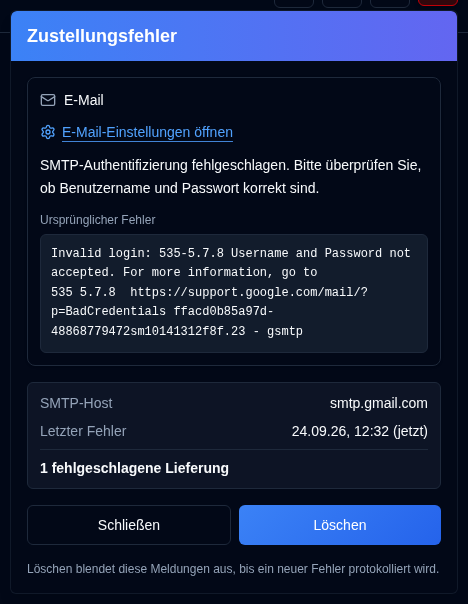

# Zustellungsfehler {/* #delivery-failures */}

Eine <IconButton icon="lucide:siren" tone="alert" />-Schaltfläche mit einem sanften Rotton erscheint für Administratoren in der [Anwendungssymbolleiste](overview.md#application-toolbar), während die E-Mail- oder NTFY-Zustellung fehlschlägt. Sie bleibt verborgen, wenn beide Kanäle fehlerfrei sind, und wird auf der Anmeldeseite nicht angezeigt. Normale Benutzer sehen sie nicht.

Öffnen Sie den Button, um eine Karte pro fehlschlagendem Kanal (E-Mail, NTFY) anzuzeigen, nicht eine Zeile für jeden Audit-Eintrag. Jede Karte zeigt:

- Der Fehler und ein **Ursprünglicher Fehler** in Monospace, wenn die SMTP-Antwort protokolliert wurde
- Der SMTP-Host oder das NTFY-Thema
- Die Zeit des letzten Fehlers
- Wie viele Zustellungen seit dem letzten Erfolg oder seit dem letzten Löschen dieses Kanals fehlgeschlagen sind

**E-Mail-Einstellungen öffnen** führt zu [Einstellungen → E-Mail](settings/email-settings.md). **NTFY-Einstellungen öffnen** führt zu [Einstellungen → NTFY](settings/ntfy-settings.md).

**Schließen** blendet nur das Panel aus. **Löschen** blendet die aufgelisteten Kanäle aus, bis ein neuerer Fehler protokolliert wird, selbst wenn der Fehlertext derselbe ist. Eine spätere erfolgreiche Zustellung hält den Button ausgeblendet. Dazu gehören `email_sent`, `notification_sent` und eine erfolgreiche Zustellung der [Tägliche Zusammenfassung](settings/daily-summary-settings.md) für diesen Kanal.
