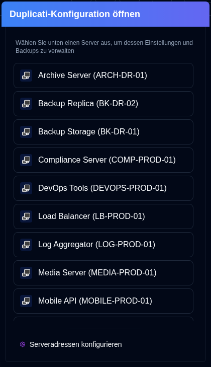

# Duplicati-Konfiguration {#duplicati-configuration}

Die Schaltfläche <SvgButton svgFilename="duplicati_logo.svg" /> in der [Anwendungssymbolleiste](overview#application-toolbar) öffnet die Weboberfläche des Duplicati-Servers in einem neuen Tab.

Sie können einen Server aus der Dropdown-Liste auswählen. Wenn Sie bereits einen Server ausgewählt haben (durch Klicken auf seine Karte) oder dessen Details anzeigen, öffnet die Schaltfläche die Duplicati-Konfiguration dieses spezifischen Servers direkt.

- Die Serverliste zeigt den `Servernamen` oder `Alias (Servername)`.
- Server-Adressen werden in [`Einstellungen → Server`](settings/server-settings.md) konfiguriert.
- Die Anwendung speichert die URL eines Servers automatisch, wenn Sie die Funktion <IconButton icon="lucide:download" height="16" href="collect-backup-logs" /> [`Sicherungsprotokolle sammeln`](collect-backup-logs.md) verwenden.
- Server werden nicht in der Serverliste angezeigt, wenn ihre Adresse nicht konfiguriert wurde.

## Zugriff auf die alte Duplicati-Benutzeroberfläche {#accessing-the-old-duplicati-ui}

Wenn Sie Probleme beim Anmelden mit der neuen Duplicati-Weboberfläche (`/ngclient/`) haben, können Sie mit der rechten Maustaste auf die <SvgButton svgFilename="duplicati_logo.svg" /> Schaltfläche oder auf ein beliebiges Server-Element im Server-Auswahlmenü klicken, um die alte Duplicati-Benutzeroberfläche (`/ngax/`) in einem neuen Tab zu öffnen.

  

:::note
Alle Produktnamen, Logos und Marken sind Eigentum ihrer jeweiligen Eigentümer. Symbole und Namen werden ausschließlich zu Identifikationszwecken verwendet und implizieren keine Billigung.
:::
