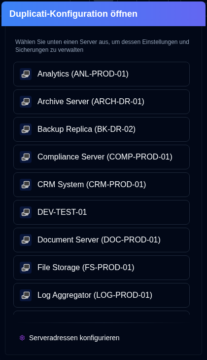

# Duplicati-Konfiguration {/* #duplicati-configuration */}

Die <SvgButton svgFilename="duplicati_logo.svg" /> Schaltfläche in der [Anwendungssymbolleiste](overview.md#application-toolbar) öffnet die Webschnittstelle des Duplicati-Servers in einem neuen Tab.

Sie können einen Server aus der Dropdown-Liste auswählen. Wenn Sie bereits einen Server ausgewählt haben (indem Sie auf seine Karte geklickt haben) oder dessen Details anzeigen, öffnet die Schaltfläche direkt die Duplicati-Konfiguration dieses bestimmten Servers.

- Die Liste der Server zeigt den `server name` oder `server alias (server name)`.
- Serveradressen werden in [Einstellungen → Server](settings/server-settings.md) konfiguriert.
- Die Anwendung speichert automatisch die URL eines Servers, wenn Sie die <IconButton icon="lucide:download" height="16" href="collect-backup-logs" /> [Backup-Protokolle sammeln](collect-backup-logs.md) Funktion verwenden.
- Server erscheinen nicht in der Serverliste, wenn ihre Adresse nicht konfiguriert wurde.

## Zugriff auf die alte Duplicati-Benutzeroberfläche {/* #accessing-the-old-duplicati-ui */}

Wenn Sie Anmeldeprobleme mit der neuen Duplicati-Webschnittstelle (`/ngclient/`) haben, können Sie mit der rechten Maustaste auf die <SvgButton svgFilename="duplicati_logo.svg" /> Schaltfläche oder auf einen beliebigen Server in der Serverauswahlliste klicken, um die alte Duplicati-Benutzeroberfläche (`/ngax/`) in einem neuen Tab zu öffnen.

  

:::note
 Alle Produktnamen, Logos und Markenzeichen sind Eigentum ihrer jeweiligen Inhaber. Symbole und Namen werden ausschließlich zur Identifikation verwendet und implizieren keine Unterstützung.
:::
