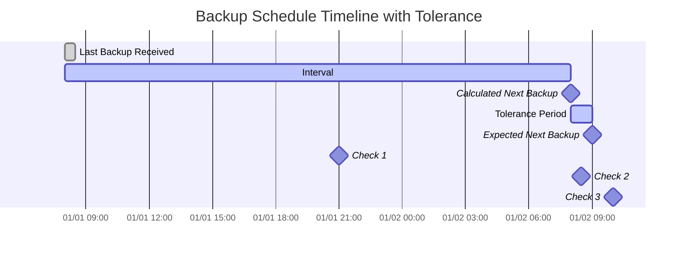

import { ZoomMermaid } from '@site/src/components/ZoomMermaid';

# Überwachung überfälliger Sicherungen {#overdue-monitoring}

Die Funktion zur Überwachung überfälliger Sicherungen ermöglicht es Ihnen, Sicherungen zu verfolgen und Benachrichtigungen für überfällige Sicherungen zu erhalten. Die Benachrichtigungen können über NTFY oder E-Mail erfolgen.

In der Benutzeroberfläche werden überfällige Sicherungen mit einem Warnsymbol angezeigt. Wenn Sie den Mauszeiger über das Symbol bewegen, werden die Details der überfälligen Sicherung angezeigt, einschließlich der letzten Sicherungszeit, der erwarteten Sicherungszeit, der Toleranzperiode und der erwarteten nächsten Sicherungszeit.

## Überfällig Prüfen Prozess {#overdue-check-process}

**Funktionsweise:**

| **Schritt** | **Wert**                     | **Beschreibung**                                        | **Beispiel**       |
|:----------:|:----------------------------|:--------------------------------------------------------|:-------------------|
|     1      | **Letzte Sicherung**        | Der Zeitstempel der letzten erfolgreichen Sicherung.   | `2024-01-01 08:00` |
|     2      | **Erwartetes Intervall**    | Die konfigurierte Sicherungshäufigkeit.                | `1 day`            |
|     3      | **Berechnete nächste Sicherung** | `Letzte Sicherung` + `Erwartetes Intervall`            | `2024-01-02 08:00` |
|     4      | **Toleranz**                | Der konfigurierte Kulanzbereich (zusätzlich gewährte Zeit). | `1 hour`           |
|     5      | **Erwartete nächste Sicherung** | `Berechnete nächste Sicherung` + `Toleranz`            | `2024-01-02 09:00` |

Eine Sicherung wird als **überfällig** betrachtet, wenn die aktuelle Zeit später als die `Expected Next Backup`-Zeit liegt.

<ZoomMermaid>

</ZoomMermaid>

**Beispiele basierend auf der obigen Zeitleiste:**

- Um `2024-01-01 21:00` (🔹Check 1) ist die Sicherung **pünktlich**.
- Um `2024-01-02 08:30` (🔹Check 2) ist die Sicherung **pünktlich**, da sie sich noch innerhalb der Toleranzperiode befindet.
- Um `2024-01-02 10:00` (🔹Check 3) ist die Sicherung **überfällig**, da dies nach der `Expected Weiter Backup`-Zeit liegt.

## Periodische Überprüfungen {#periodic-checks}

**duplistatus** führt in konfigurierbaren Intervallen regelmäßige Überprüfungen auf überfällige Sicherungen durch. Das Standard-Intervall beträgt 20 Minuten, aber Sie können es in [Einstellungen → Überwachung überfälliger Sicherungen](settings/overdue-settings.md) konfigurieren.

## Automatische Konfiguration {#automatic-configuration}

Wenn Sie Backup-Protokolle von einem Duplicati-Server sammeln, führt **duplistatus** automatisch folgende Aktionen durch:

- Extrahiert den Sicherungszeitplan aus der Duplicati-Konfiguration
- Aktualisiert die Überwachungsintervalle überfälliger Sicherungen, um genau übereinzustimmen
- Synchronisiert erlaubte Wochentage und geplante Zeiten
- Behält Ihre Benachrichtigungseinstellungen bei

:::tip
Sammeln Sie Backup-Protokolle, nachdem Sie die Intervalle für Sicherungsaufträge auf Ihrem Duplicati-Server geändert haben, um optimale Ergebnisse zu erzielen. Dies stellt sicher, dass **duplistatus** mit Ihrer aktuellen Konfiguration synchronisiert bleibt.
:::

Lesen Sie den Abschnitt [Einstellungen für überfällige Elemente](settings/overdue-settings.md) für detaillierte Konfigurationsoptionen.
