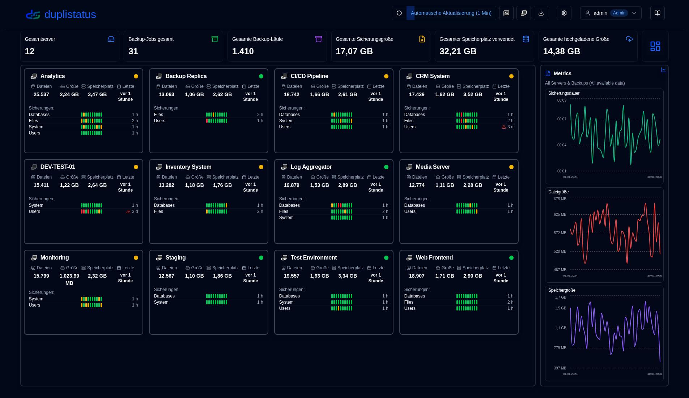
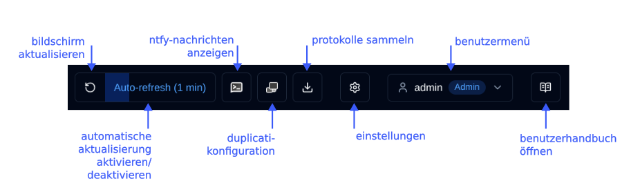
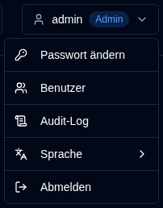
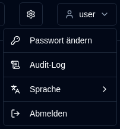

# Übersicht {#overview}

Willkommen zum duplistatus-Benutzerhandbuch. Dieses umfassende Dokument bietet detaillierte Anweisungen zur Verwendung von duplistatus zur Überwachung und Verwaltung Ihrer Duplicati-Sicherungsvorgänge auf mehreren Servern.

## Was ist duplistatus? {#what-is-duplistatus}

duplistatus ist ein leistungsstarkes Monitoring-Dashboard, das speziell für Duplicati-Sicherungssysteme entwickelt wurde. Es bietet:

- Zentralisierte Überwachung mehrerer Duplicati-Server über eine einzige Benutzeroberfläche
- Echtzeit-Statusverfolgung aller Sicherungsoperationen
- Automatische Erkennung überfälliger Sicherungen mit konfigurierbaren Warnungen
- Umfassende Metriken und Visualisierung der Sicherungsleistung
- Flexibles Benachrichtigungssystem über NTFY und E-Mail
- Mehrsprachige Unterstützung (Englisch, Französisch, Deutsch, Spanisch und Brasilianisches Portugiesisch).

## Installation {#installation}

Für Voraussetzungen und detaillierte Installationsanweisungen verweisen wir Sie bitte auf das [Installationshandbuch](../installation/installation.md).

## Zugriff auf das Dashboard {#accessing-the-dashboard}

Nach erfolgreicher Installation greifen Sie auf die duplistatus-Weboberfläche folgendermaßen zu:

1. Öffnen Sie Ihren bevorzugten Webbrowser
2. Navigieren Sie zu `http://ihre-server-ip:9666`
   - Ersetzen Sie `ihre-server-ip` durch die tatsächliche IP-Adresse oder den Hostnamen Ihres duplistatus-Servers
   - Der Standardport ist `9666`
3. Sie gelangen auf eine Anmeldeseite. Sie können die Schnittstellensprache in der oberen rechten Ecke der Anmeldeseite oder nach der Anmeldung über das Benutzermenü auswählen (klicken Sie auf Ihren Benutzernamen → Sprache).
   Verwenden Sie diese Anmeldedaten für die erste Verwendung (oder nach einem Upgrade von Versionen vor 0.9.x):
    - Benutzername: `admin`
    - Passwort: `Duplistatus09` 
4. Nach der Anmeldung wird automatisch das Hauptdashboard angezeigt (beim ersten Aufruf ohne Daten)

## Benutzer-Oberfläche Übersicht {#user-interface-overview}

duplistatus bietet ein intuitives Dashboard zur Überwachung von Duplicati-Sicherungsvorgängen in Ihrer gesamten Infrastruktur.

Die Benutzeroberfläche ist in mehrere Schlüsselbereiche unterteilt, um ein klares und umfassendes Überwachungserlebnis zu bieten:

1. [Application Toolbar](#application-toolbar): Schnellzugriff auf wesentliche Funktionen und Konfigurationen
2. [Dashboard Summary](dashboard.md#dashboard-summary): Übersichtsstatistiken für alle überwachten Server
3. Servers Overview: [Cards layout](dashboard.md#cards-layout) oder [table layout](dashboard.md#table-layout) mit dem aktuellen Status aller Sicherungen
4. [Überfälligkeitsdetails](dashboard.md#overdue-details): Visuelle Warnungen für überfällige Sicherungen mit detaillierten Informationen beim Hover
5. [Verfügbare Sicherungsversionen](dashboard.md#available-backup-versions): Klicken Sie auf das blaue Symbol, um die am Ziel verfügbaren Sicherungsversionen anzuzeigen
6. [Backup Metrics](backup-metrics.md): Interaktive Diagramme zur Anzeige der Sicherungsleistung im Zeitverlauf
7. [Server Details](server-details.md): Umfassende Liste der aufgezeichneten Sicherungen für bestimmte Server, einschließlich detaillierter Statistiken
8. [Sicherungsdetails](server-details.md#backup-details): Ausführliche Informationen für einzelne Sicherungen, einschließlich Ausführungsprotokolle, Warnungen und Fehler

## Anwendungssymbolleiste {#application-toolbar}

Die Anwendungssymbolleiste bietet bequemen Zugriff auf wichtige Funktionen und Einstellungen, organisiert für einen effizienten Arbeitsablauf.

| Schaltfläche | Beschreibung |
|--------------------------------------------------------------------------------------------------------------------------------------------------|------------------------------------------------------------------------------------------------------------------------------------------------------------------------------|
| <IconButton icon="lucide:rotate-ccw" /> &nbsp; Bildschirm aktualisieren | Sofortige manuelle Aktualisierung aller Daten |
| <IconButton label="Auto-Aktualisierung" /> | Automatische Aktualisierungsfunktion aktivieren oder deaktivieren. Konfigurieren in [Anzeigeeinstellungen](settings/display-settings.md)   _Rechtsklick_ zum Öffnen der Anzeigeeinstellungsseite |
| <SvgButton svgFilename="ntfy.svg" /> &nbsp; NTFY öffnen | Zugriff auf die ntfy.sh-Website für Ihr konfiguriertes Benachrichtigungsthema.   _Rechtsklick_ zum Anzeigen eines QR-Codes zur Gerätekonfiguration für Benachrichtigungen von duplistatus. |
| <SvgButton svgFilename="duplicati_logo.svg" href="duplicati-configuration" /> &nbsp; [Duplicati-Konfiguration](duplicati-configuration.md) | Öffnen der Weboberfläche des ausgewählten Duplicati-Servers   _Rechtsklick_ zum Öffnen der Duplicati-Legacy-UI (`/ngax`) in einem neuen Tab |
| <IconButton icon="lucide:download" href="collect-backup-logs" /> &nbsp; [Protokolle sammeln](collect-backup-logs.md) | Verbindung zu Duplicati-Servern und Abrufen von Sicherungsprotokollen   _Rechtsklick_ zum Sammeln von Protokollen für alle konfigurierten Server |
| <IconButton icon="lucide:settings" href="settings/backup-notifications-settings" /> &nbsp; [Einstellungen](settings/backup-notifications-settings.md) | Benachrichtigungen, Überwachung, SMTP-Server und Benachrichtigungsvorlagen konfigurieren |
| <IconButton icon="lucide:user" label="Benutzername" /> | Zeigt den verbundenen Benutzer, Benutzertyp (`Admin`, `Benutzer`), Klicken für Benutzermenü (einschließlich Sprachauswahl). Weitere Informationen in [Benutzerverwaltung](settings/user-management-settings.md) |
| <IconButton icon="lucide:book-open-text" href="overview" /> &nbsp; Benutzerhandbuch | Öffnet das [Benutzerhandbuch](overview.md) zum Abschnitt, der der aktuell angezeigten Seite entspricht. Der Tooltip zeigt „Hilfe für [Seitenname]" an, um anzuzeigen, welche Dokumentation geöffnet wird. |

### Benutzermenü {#user-menu}

Durch Klicken auf die Benutzerschaltfläche wird ein Dropdown-Menü mit benutzerspezifischen Optionen geöffnet. Die Menüoptionen unterscheiden sich je nachdem, ob Sie als Administrator oder als normaler Benutzer angemeldet sind. Beide Rollen können die Schnittstellensprache über das Untermenü **Sprache** ändern. Unterstützte Sprachen: Englisch, Französisch, Deutsch, Spanisch und Brasilianisches Portugiesisch.

<table>
  <tr>
    <th>Admin</th>
    <th>Normaler Benutzer</th>
  </tr>
  <tr>
    <td style={{verticalAlign: 'top'}}></td>
    <td style={{verticalAlign: 'top'}}></td>
  </tr>
</table>

## Wesentliche Konfiguration {#essential-configuration}

1. Konfigurieren Sie Ihre [Duplicati-Server](../installation/duplicati-server-configuration.md) so, dass sie Sicherungsprotokolle an duplistatus senden (erforderlich).
2. Sammeln Sie erste Sicherungsprotokolle – verwenden Sie die Funktion [Backup-Protokolle sammeln](collect-backup-logs.md), um die Datenbank mit historischen Sicherungsdaten von allen Ihren Duplicati-Servern zu füllen. Dies aktualisiert auch automatisch die Überwachungsintervalle überfälliger Sicherungen basierend auf der Konfiguration jedes Servers.
3. Konfigurieren Sie Server-Einstellungen – richten Sie Server-Aliase und Notizen in [Einstellungen → Server](settings/server-settings.md) ein, um Ihr Dashboard informativer zu gestalten.
4. Konfigurieren Sie NTFY-Einstellungen – richten Sie Benachrichtigungen über NTFY in [Einstellungen → NTFY](settings/ntfy-settings.md) ein.
5. Konfigurieren Sie E-Mail-Einstellungen – richten Sie E-Mail-Benachrichtigungen in [Einstellungen → E-Mail](settings/email-settings.md) ein.
6. Konfigurieren Sie Backup-Benachrichtigungen – richten Sie Benachrichtigungen pro Sicherung oder pro Server in [Einstellungen → Backup-Benachrichtigungen](settings/backup-notifications-settings.md) ein.

 

:::info[WICHTIG]
Denken Sie daran, die Duplicati-Server so zu konfigurieren, dass sie Sicherungsprotokolle an duplistatus senden, wie im Abschnitt [Duplicati-Konfiguration](../installation/duplicati-server-configuration.md) beschrieben.
:::

 

:::note
Alle Produktnamen, Logos und Marken sind Eigentum ihrer jeweiligen Eigentümer. Symbole und Namen werden ausschließlich zu Identifikationszwecken verwendet und implizieren keine Billigung.
:::
