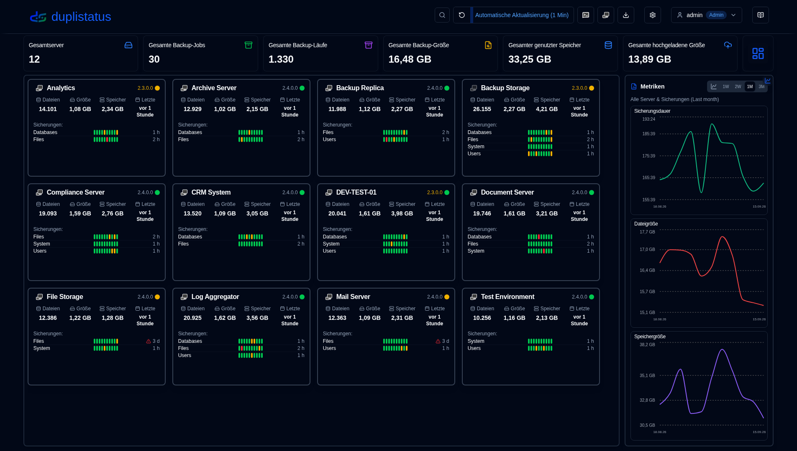
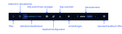
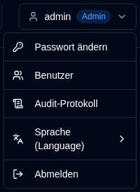
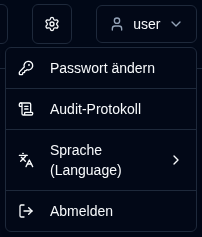

# Übersicht {/* #overview */}

Willkommen zum duplistatus-Benutzerhandbuch. Dieses umfassende Dokument enthält detaillierte Anweisungen zur Verwendung von duplistatus für die Überwachung und Verwaltung Ihrer Duplicati-Sicherungsvorgänge auf mehreren Servern.

## Was ist duplistatus? {/* #what-is-duplistatus */}

duplistatus ist ein leistungsstarkes Überwachungsdashboard, das speziell für Duplicati-Sicherungssysteme entwickelt wurde. Es bietet Folgendes:

- Zentrale Überwachung mehrerer Duplicati-Server über eine einzige Schnittstelle
- Echtzeit-Statusverfolgung aller Sicherungsvorgänge
- Automatische Erkennung überfälliger Sicherungen mit konfigurierbaren Warnungen
- Umfassende Metriken und Visualisierung der Sicherungsleistung
- Flexibles Benachrichtigungssystem über NTFY und E-Mail
- Optionale Funktionen zur [Sicherheitskonfiguration](../installation/security-configuration.md)
- Mehrsprachige Unterstützung (Englisch, Französisch, Deutsch, Spanisch, brasilianisches Portugiesisch, Hindi und vereinfachtes Chinesisch).

## Installation {/* #installation */}

Für Voraussetzungen und detaillierte Installationsanweisungen lesen Sie bitte den [Installationsleitfaden](../installation/installation.md).

## Zugriff auf das Dashboard {/* #accessing-the-dashboard */}

Nach erfolgreicher Installation greifen Sie wie folgt auf die duplistatus-Weboberfläche zu:

1. Öffnen Sie Ihren bevorzugten Webbrowser
2. Navigieren Sie zu `http://your-server-ip:9666`
   - Ersetzen Sie `your-server-ip` durch die tatsächliche IP-Adresse oder den Hostnamen Ihres duplistatus-Servers
   - Der Standardport ist `9666`
3. Sie erhalten eine Anmeldeseite angezeigt.

Verwenden Sie diese Anmeldeinformationen für die erste Verwendung (oder nach einem Upgrade von Versionen vor 0.9.x):
    - Benutzername: `admin`
    - Passwort: `Duplistatus09`

Wählen Sie die Sprache der Benutzeroberfläche in der oberen rechten Ecke <IconButton icon="lucide:languages" label="Sprache" /> oder in <IconButton icon="lucide:user" label="Benutzername" /> nach der Anmeldung aus (siehe unten).

4. Nach der Anmeldung wird das Hauptdashboard automatisch angezeigt (ohne Daten bei erster Verwendung)

## Übersicht über die Benutzeroberfläche {/* #user-interface-overview */}

duplistatus bietet ein intuitives Dashboard zur Überwachung von Duplicati-Sicherungsvorgängen in Ihrer gesamten Infrastruktur.

Die Benutzeroberfläche ist in mehrere wichtige Abschnitte unterteilt, um ein klares und umfassendes Monitoring-Erlebnis zu bieten:

1. [Anwendungs-Toolbar](#application-toolbar): Schneller Zugriff auf wesentliche Funktionen und Konfigurationen
2. [Dashboard-Zusammenfassung](dashboard.md#dashboard-summary): Übersichtsstatistiken für alle überwachten Server
3. Server-Übersicht: [Kartenlayout](dashboard.md#cards-layout) oder [Tabellenlayout](dashboard.md#table-layout), das den neuesten Status aller Sicherungen zeigt, einschließlich der [Duplicati-Serverversion](dashboard.md#duplicati-server-version) aus dem letzten empfangenen Sicherungsprotokoll
4. [Details zu überfälligen Sicherungen](dashboard.md#overdue-details): Visuelle Warnungen für überfällige Sicherungen mit detaillierten Informationen beim Hovern
5. [Verfügbare Sicherungsversionen](dashboard.md#available-backup-versions): Klicken Sie auf das blaue Symbol, um verfügbare Sicherungsversionen am Zielort anzuzeigen
6. [Sicherungsmetriken](backup-metrics.md): Interaktive Diagramme, die die Sicherungsleistung im Laufe der Zeit anzeigen
7. [Serverdetails](server-details.md): Umfassende Liste der aufgezeichneten Sicherungen für bestimmte Server, einschließlich detaillierter Statistiken
8. [Sicherungsdetails](server-details.md#backup-details): Ausführliche Informationen zu einzelnen Sicherungen, einschließlich Ausführungsprotokollen, Warnungen und Fehlern

## Anwendungs-Toolbar {/* #application-toolbar */}

Die Anwendungssymbolleiste bietet bequemen Zugriff auf wichtige Funktionen und Einstellungen, die für einen effizienten Workflow organisiert sind.

| Taste                                                                                                                                            | Beschreibung                                                                                                                                                                               |
|--------------------------------------------------------------------------------------------------------------------------------------------------|--------------------------------------------------------------------------------------------------------------------------------------------------------------------------------------------|
| <IconButton icon="lucide:search" /> &nbsp; Filter                                                                                          | Server nach ID, URL oder Name des Sicherungsauftrags suchen und filtern.                                                        |
| <IconButton icon="lucide:rotate-ccw" /> &nbsp; Bildschirm aktualisieren                                                                               | Sofortige manuelle Aktualisierung aller Daten durchführen                                                                                                                                |
| <IconButton label="Auto-Aktualisierung" />                                                                                                              | Automatische Aktualisierungsfunktion aktivieren oder deaktivieren. Konfigurieren in [Anzeigeeinstellungen](settings/display-settings.md)   _Rechtsklick_, um die Seite mit den Anzeigeeinstellungen zu öffnen |
| <SvgButton svgFilename="ntfy.svg" /> &nbsp; NTFY öffnen                                                                                           | Auf die Website ntfy.sh für Ihr konfiguriertes Benachrichtigungsthema zugreifen.   _Rechtsklick_, um einen QR-Code anzuzeigen, mit dem Sie Ihr Gerät zur Empfang von Benachrichtigungen von duplistatus einrichten können. |
| <SvgButton svgFilename="duplicati_logo.svg" href="duplicati-configuration" /> &nbsp; [Duplicati-Konfiguration](duplicati-configuration.md)      | Öffnet die Web-Oberfläche des ausgewählten Duplicati-Servers   _Rechtsklick_, um die Duplicati-Legacy-Benutzeroberfläche (`/ngax`) in einem neuen Tab zu öffnen                                                         |
| <IconButton icon="lucide:download" href="collect-backup-logs" /> &nbsp; [Protokolle sammeln](collect-backup-logs.md)                                  | Verbindung zu Duplicati-Servern herstellen und Sicherungsprotokolle abrufen   _Rechtsklick_, um Protokolle für alle konfigurierten Server zu sammeln                                                                      |
| <IconButton icon="lucide:siren" tone="alert" /> &nbsp; [Zustellungsfehler](#delivery-failures)                                                   | Wird Administratoren angezeigt, während die E-Mail- oder NTFY-Zustellung fehlschlägt. Siehe [Zustellungsfehler](#delivery-failures).                                                                              |
| <IconButton icon="lucide:settings" href="settings/backup-notifications-settings" /> &nbsp; [Einstellungen](settings/backup-notifications-settings.md) | Benachrichtigungen, Überwachung, SMTP-Server und Benachrichtigungsvorlagen konfigurieren                                                                                                              |
| <IconButton icon="lucide:user" label="Benutzername" />                                                                                              | Den verbundenen Benutzer anzeigen, Benutzertyp (`Admin`, `User`), klicken Sie für das Benutzermenü (enthält Sprachauswahl). Weitere Informationen finden Sie unter [Benutzerverwaltung](settings/user-management-settings.md)              |
| <IconButton icon="lucide:book-open-text" href="overview" /> &nbsp; Benutzerhandbuch                                                                   | Öffnen Sie das [Benutzerhandbuch](overview.md) zum Abschnitt, der für die aktuell angezeigte Seite relevant ist. Die QuickInfo zeigt "Hilfe für [Seitenname]" an, um anzugeben, welche Dokumentation geöffnet wird. |

### Zustellungsfehler {/* #delivery-failures */}

Eine <IconButton icon="lucide:siren" tone="alert" />-Schaltfläche mit einem leichten Rotton erscheint in der Symbolleiste für Administratoren, während die E-Mail- oder NTFY-Zustellung fehlschlägt. Sie bleibt ausgeblendet, wenn beide Kanäle fehlerfrei sind, und wird auf der Anmeldeseite nicht angezeigt. Standardbenutzer sehen sie nicht.

Öffnen Sie den Button, um eine Karte pro fehlschlagendem Kanal (E-Mail, NTFY) anzuzeigen, nicht eine Zeile für jeden Audit-Eintrag. Jede Karte zeigt:

- Der Fehler und ein **Ursprünglicher Fehler** in Monospace, wenn die SMTP-Antwort protokolliert wurde
- Der SMTP-Host oder das NTFY-Thema
- Die Zeit des letzten Fehlers
- Wie viele Zustellungen seit dem letzten Erfolg oder seit dem letzten Löschen dieses Kanals fehlgeschlagen sind

**E-Mail-Einstellungen öffnen** führt zu [Einstellungen → E-Mail](settings/email-settings.md). **NTFY-Einstellungen öffnen** führt zu [Einstellungen → NTFY](settings/ntfy-settings.md).

**Schließen** blendet nur das Panel aus. **Löschen** blendet die aufgelisteten Kanäle aus, bis ein neuerer Fehler protokolliert wird, selbst wenn der Fehlertext derselbe ist. Eine spätere erfolgreiche Zustellung hält den Button ausgeblendet. Dazu gehören `email_sent`, `notification_sent` und eine erfolgreiche Zustellung der [Tägliche Zusammenfassung](settings/daily-summary-settings.md) für diesen Kanal.

Die Liste wird mit der Seite geladen und etwa einmal pro Minute aktualisiert, solange der Browser-Tab sichtbar ist.

### Benutzermenü {/* #user-menu */}

Wenn Sie auf die Benutzerschaltfläche klicken, wird ein Dropdown-Menü mit benutzerspezifischen Optionen geöffnet. Die Menüoptionen unterscheiden sich je nachdem, ob Sie als Administrator oder als regulärer Benutzer angemeldet sind. Beide Rollen können die Oberflächensprache über das Untermenü **Sprache** ändern. Die ausgewählte Sprache wird pro Benutzer in diesem Browser gespeichert (nicht als systemweite Einstellung), sodass verschiedene Konten unterschiedliche Sprachen verwenden können. Unterstützte Sprachen: Englisch, Französisch, Deutsch, Spanisch, Brasilianisches Portugiesisch, Hindi und Vereinfachtes Chinesisch.

<table>
  <tr>
    <th>Administrator</th>
    <th>Regulärer Benutzer</th>
  </tr>
  <tr>
    <td style={{verticalAlign: 'top'}}></td>
    <td style={{verticalAlign: 'top'}}></td>
  </tr>
</table>

## Wesentliche Konfiguration {/* #essential-configuration */}

1. Konfigurieren Sie Ihre [Duplicati-Server](../installation/duplicati-server-configuration.md), um Sicherungsprotokollnachrichten an duplistatus zu senden (erforderlich).
2. Sammeln Sie erste Sicherungsprotokolle – verwenden Sie die Funktion [Backup-Protokolle sammeln](collect-backup-logs.md), um die Datenbank mit historischen Sicherungsdaten von all Ihren Duplicati-Servern zu füllen. Dies aktualisiert auch automatisch die Intervalle der Backup-Überwachung basierend auf der Konfiguration jedes Servers.
3. Konfigurieren Sie die Servereinstellungen – richten Sie Server-Aliase und Notizen unter [Einstellungen → Server](settings/server-settings.md) ein, um Ihr Dashboard informativer zu gestalten.
4. Konfigurieren Sie die NTFY-Einstellungen – richten Sie Benachrichtigungen über NTFY unter [Einstellungen → NTFY](settings/ntfy-settings.md) ein.
5. Konfigurieren Sie die E-Mail-Einstellungen – richten Sie E-Mail-Benachrichtigungen unter [Einstellungen → E-Mail](settings/email-settings.md) ein.
6. Konfigurieren Sie die Backup-Benachrichtigungen – richten Sie pro Sicherung oder pro Server Benachrichtigungen unter [Einstellungen → Backup-Benachrichtigungen](settings/backup-notifications-settings.md) ein.
7. Optional Zugriff beschränken – erstellen Sie [API-Schlüssel](settings/api-keys-settings.md) und/oder [IP-Allowlisten](settings/ip-allowlist-settings.md), wenn Sie `/api/upload` und das Administrationsinterface schützen möchten. Beide sind standardmäßig ausgeschaltet.

 

:::info[WICHTIG]
Denken Sie daran, die Duplicati-Server so zu konfigurieren, dass sie Sicherungsprotokolle an duplistatus senden, wie im Abschnitt [Duplicati-Konfiguration](../installation/duplicati-server-configuration.md) beschrieben.
:::

 

:::note
 Alle Produktnamen, Logos und Marken sind Eigentum ihrer jeweiligen Inhaber. Symbole und Namen werden nur zu Identifikationszwecken verwendet und implizieren keine Billigung.
:::

<small>

> **Hinweis zu UI- und Dokumentationsübersetzungen:** Alle Oberflächen- und Dokumentationssprachen außer Englisch (UK) wurden mit KI mithilfe von [ai-i18n-tools](https://wsj-br.github.io/ai-i18n-tools/) übersetzt; die Formulierungen können ungenau sein oder Fehler enthalten.

</small>
