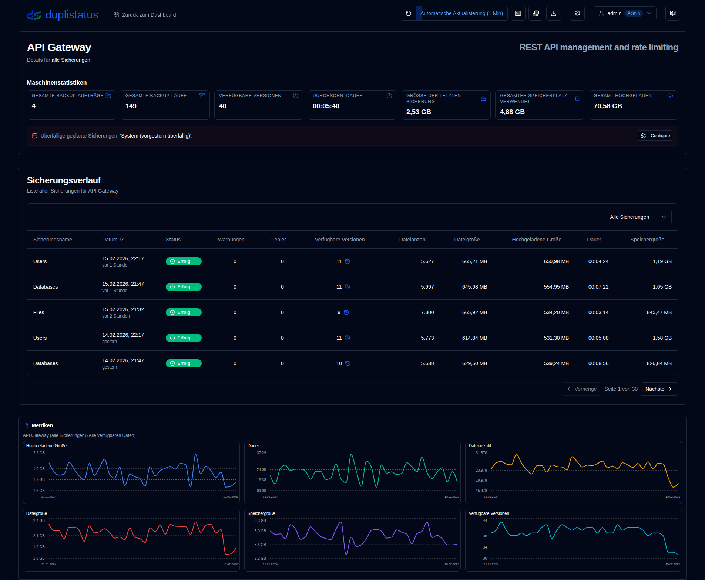
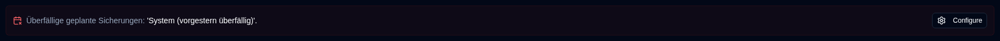
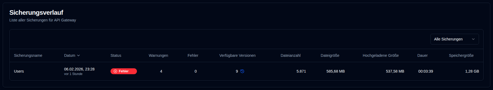
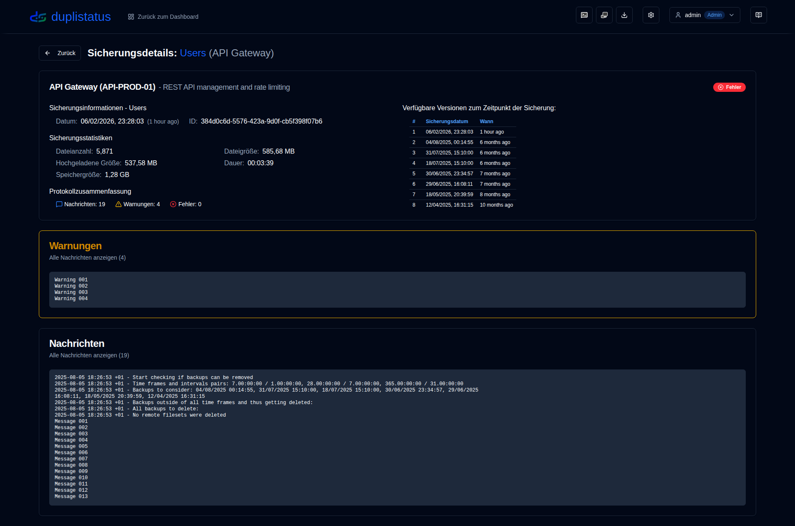

# Server Details {#server-details}

Wenn Sie auf einen Server im Dashboard klicken, wird eine Seite mit einer Liste von Sicherungen für diesen Server geöffnet. Sie können alle Sicherungen anzeigen oder eine bestimmte auswählen, wenn der Server mehrere Sicherungen konfiguriert hat.

## Server/Backup-Sicherungsstatistiken {#serverbackup-statistics}

Dieser Abschnitt zeigt Statistiken für alle Sicherungen auf dem Server oder eine einzelne ausgewählte Sicherung.

- **BACKUP-JOBS GESAMT**: Gesamtzahl der auf diesem Server konfigurierten Sicherungs-Jobs.
- **GESAMTE BACKUP-LÄUFE**: Gesamtzahl der ausgeführten Sicherungs-Läufe (wie vom Duplicati-Server gemeldet).
- **VERFÜGBARE VERSIONEN**: Anzahl der verfügbaren Versionen (wie vom Duplicati-Server gemeldet).
- **DURCHSCHNITTLICHE DAUER**: Durchschnittliche (mittlere) Dauer von Sicherungen, die in der **duplistatus**-Datenbank aufgezeichnet sind.
- **GRÖSSE DER LETZTEN SICHERUNG**: Größe der Quelldateien aus dem letzten empfangenen Sicherungsprotokoll.
- **GESAMTER SPEICHERPLATZ VERWENDET**: Speicherplatz, der am Sicherungsziel verwendet wird, wie im letzten Sicherungsprotokoll gemeldet.
- **GESAMT HOCHGELADEN**: Summe aller hochgeladenen Daten, die in der **duplistatus**-Datenbank aufgezeichnet sind.

Wenn diese Sicherung oder eine der Sicherungen auf dem Server (wenn **Alle Sicherungen** ausgewählt ist) überfällig ist, wird eine Meldung unter der Zusammenfassung angezeigt.

Klicken Sie auf <IconButton icon="lucide:settings" href="settings/backup-monitoring-settings" label="Konfigurieren"/>, um zu [Einstellungen → Sicherungsüberwachung](settings/backup-monitoring-settings.md) zu wechseln. Oder klicken Sie auf <SvgButton SvgButton svgFilename="duplicati_logo.svg" href="duplicati-configuration" /> in der Symbolleiste, um die Weboberfläche des Duplicati-Servers zu öffnen und die Protokolle zu prüfen.

 

## Sicherungsverlauf {#backup-history}

Diese Tabelle listet die Sicherungsprotokolle für den ausgewählten Server auf.

- **Sicherungsname**: Name der Sicherung im Duplicati-Server.
- **Datum**: Zeitstempel der Sicherung und verstrichene Zeit seit der letzten Aktualisierung des Bildschirms.
- **Status**: Status der Sicherung (Erfolg, Warnung, Fehler, Kritisch).
- **Warnungen/Fehler**: Anzahl der Warnungen/Fehler, die im Sicherungsprotokoll gemeldet wurden.
- **Verfügbare Versionen**: Anzahl der verfügbaren Sicherungsversionen am Sicherungsziel. Wenn das Symbol ausgegraut ist, wurden detaillierte Informationen nicht empfangen.
- **Dateianzahl, Dateigröße, Hochgeladene Größe, Dauer, Speichergröße**: Werte wie vom Duplicati-Server gemeldet.

:::tip Tips
• Verwenden Sie das Dropdown-Menü im Abschnitt **Sicherungsverlauf**, um **Alle Sicherungen** oder eine bestimmte Sicherung für diesen Server auszuwählen.

• Sie können jede Spalte sortieren, indem Sie auf ihre Kopfzeile klicken. Klicken Sie erneut, um die Sortierreihenfolge umzukehren.
 
• Klicken Sie auf eine beliebige Stelle in einer Zeile, um die [Sicherungsdetails](#backup-details) anzuzeigen.

:::

:::note
Wenn **Alle Sicherungen** ausgewählt ist, zeigt die Liste alle Sicherungen standardmäßig von neuesten zu ältesten geordnet an.
:::

 

## Sicherungsdetails {#backup-details}

Das Klicken auf ein Status-Badge im Dashboard (Tabellenansicht) oder auf eine beliebige Zeile in der Sicherungsverlauf-Tabelle zeigt die detaillierten Sicherungsinformationen an.

- **Serverdetails**: Servername, Alias und Hinweis.
- **Sicherungsinformationen**: Der Zeitstempel der Sicherung und ihre ID.
- **Sicherungsstatistiken**: Eine Zusammenfassung der gemeldeten Zähler, Größen und Dauer.
- **Protokollzusammenfassung**: Die Anzahl der gemeldeten Nachrichten.
- **Verfügbare Versionen**: Eine Liste der verfügbaren Versionen (wird nur angezeigt, wenn die Informationen in den Protokollen empfangen wurden).
- **Nachrichten/Warnungen/Fehler**: Die vollständigen Ausführungsprotokolle. Der Untertitel zeigt an, ob das Protokoll vom Duplicati-Server gekürzt wurde.

 

:::note
Weitere Informationen zur Konfiguration des Duplicati-Servers zum Senden vollständiger Ausführungsprotokolle und zur Vermeidung von Kürzungen finden Sie in den [Duplicati-Konfigurationsanweisungen](../installation/duplicati-server-configuration.md).
:::
