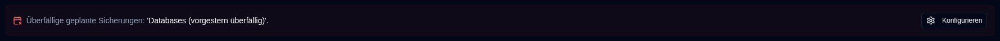
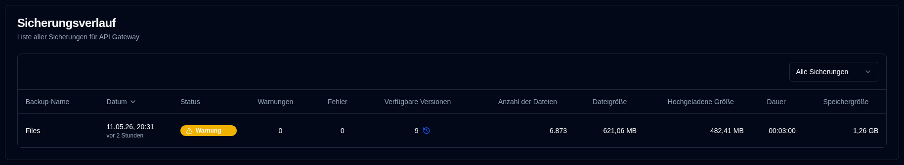

# Server Details {#server-details}

Wenn Sie auf einen Server im Dashboard klicken, wird eine Seite mit einer Liste von Sicherungen für diesen Server geöffnet. Sie können alle Sicherungen anzeigen oder eine bestimmte auswählen, wenn der Server mehrere Sicherungen konfiguriert hat.

## Server/Backup-Sicherungsstatistiken {#serverbackup-statistics}

Dieser Abschnitt zeigt Statistiken für alle Sicherungen auf dem Server oder eine einzelne ausgewählte Sicherung.

- **GESAMTANZAHL SICHERUNGSAUFTRÄGE**: Gesamtanzahl der auf diesem Server konfigurierten Sicherungsaufträge.
- **GESAMTANZAHL SICHERUNGSLÄUFE**: Gesamtanzahl der ausgeführten Sicherungsläufe (wie vom Duplicati-Server gemeldet).
- **VERFÜGBARE VERSIONEN**: Anzahl der verfügbaren Versionen (wie vom Duplicati-Server gemeldet).
- **DURCHSCHNITTLICHE DAUER**: Durchschnittliche (arithmetisches Mittel) Dauer der Sicherungen, aufgezeichnet in der **duplistatus**-Datenbank.
- **LETZTE SICHERUNGSGRÖSSE**: Größe der Quelldateien aus dem letzten empfangenen Sicherungsprotokoll.
- **GESAMTER GENUTZTER SPEICHER**: Auf dem Sicherungsziel verwendeter Speicher, wie im letzten Sicherungsprotokoll angegeben.
- **INSGESAMT HOCHGELADEN**: Summe aller in der **duplistatus**-Datenbank erfassten hochgeladenen Daten.

Wenn diese Sicherung oder eine der Sicherungen auf dem Server (wenn **Alle Sicherungen** ausgewählt ist) überfällig ist, wird eine Meldung unter der Zusammenfassung angezeigt.

Klicken Sie auf <IconButton icon="lucide:settings" href="settings/backup-monitoring-settings" label="Konfigurieren"/>, um zu [Einstellungen → Sicherungsüberwachung](settings/backup-monitoring-settings.md) zu wechseln. Oder klicken Sie auf <SvgButton SvgButton svgFilename="duplicati_logo.svg" href="duplicati-configuration" /> in der Symbolleiste, um die Weboberfläche des Duplicati-Servers zu öffnen und die Protokolle zu prüfen.

 

## Sicherungsverlauf {#backup-history}

Diese Tabelle listet die Sicherungsprotokolle für den ausgewählten Server auf.

- **Sicherungsname**: Der Name des Backups auf dem Duplicati-Server.
- **Datum**: Der Zeitstempel der Sicherung und die verstrichene Zeit seit der letzten Bildschirmaktualisierung.
- **Status**: Der Status der Sicherung (Erfolg, Warnung, Fehler, Schwerwiegend).
- **Warnungen/Fehler**: Die Anzahl der im Sicherungsprotokoll gemeldeten Warnungen/Fehler.
- **Verfügbare Versionen**: Die Anzahl der verfügbaren Sicherungsversionen auf dem Sicherungsziel. Ist das Symbol ausgegraut, wurden keine detaillierten Informationen empfangen.
- **Anzahl der Dateien, Dateigröße, Hochgeladene Größe, Dauer, Speichergröße**: Werte, wie vom Duplicati-Server gemeldet.

:::tip Tips
• Verwenden Sie das Dropdown-Menü im Abschnitt **Sicherungsverlauf**, um **Alle Sicherungen** oder eine bestimmte Sicherung für diesen Server auszuwählen.

• Sie können jede Spalte sortieren, indem Sie auf ihre Kopfzeile klicken. Klicken Sie erneut, um die Sortierreihenfolge umzukehren.
 
• Klicken Sie auf eine beliebige Stelle in einer Zeile, um die [Sicherungsdetails](#backup-details) anzuzeigen.

:::

:::note
Wenn **Alle Sicherungen** ausgewählt ist, zeigt die Liste alle Sicherungen standardmäßig von neuesten zu ältesten geordnet an.
:::

 

## Sicherungsdetails {#backup-details}

Das Klicken auf ein Status-Badge im Dashboard (Tabellenansicht) oder auf eine beliebige Zeile in der Sicherungsverlauf-Tabelle zeigt die detaillierten Sicherungsinformationen an.

- **Serverdetails**: Servername, Alias und Hinweis.
- **Backup-Informationen**: Der Zeitstempel der Sicherung und ihre ID.
- **Backup-Statistik**: Eine Zusammenfassung der gemeldeten Zähler, Größen und der Dauer.
- **Protokollübersicht**: Die Anzahl der gemeldeten Nachrichten.
- **Verfügbare Versionen**: Eine Liste der verfügbaren Versionen (wird nur angezeigt, wenn die Informationen in den Protokollen enthalten waren).
- **Nachrichten/Warnungen/Fehler**: Die vollständigen Ausführungsprotokolle. Die Zwischenüberschrift zeigt an, ob das Protokoll vom Duplicati-Server abgeschnitten wurde.

 

:::note
Weitere Informationen zur Konfiguration des Duplicati-Servers zum Senden vollständiger Ausführungsprotokolle und zur Vermeidung von Kürzungen finden Sie in den [Duplicati-Konfigurationsanweisungen](../installation/duplicati-server-configuration.md).
:::
