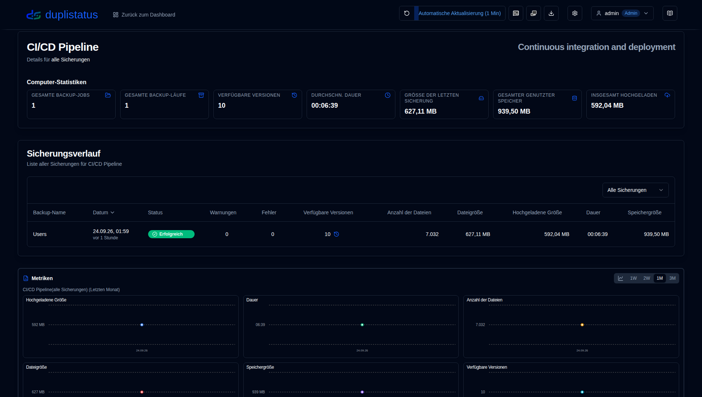
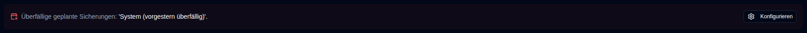
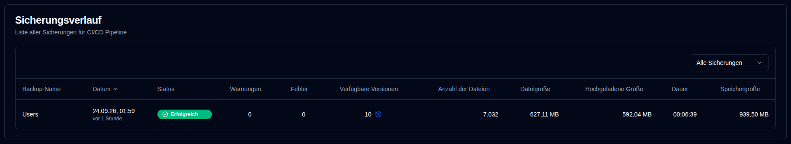

# Server-Details {/* #server-details */}

Wenn Sie auf einen Server im Dashboard klicken, öffnet sich eine Seite mit einer Liste der Sicherungen für diesen Server. Sie können alle Sicherungen anzeigen lassen oder eine bestimmte auswählen, wenn der Server mehrere konfigurierte Sicherungen hat.

## Server/Sicherungsstatistiken {/* #serverbackup-statistics */}

Dieser Abschnitt zeigt Statistiken entweder für alle Sicherungen auf dem Server oder für eine einzelne ausgewählte Sicherung.

- **GESAMTE SICHERUNGSJOBS**: Gesamtzahl der auf diesem Server konfigurierten Sicherungsjobs.
- **GESAMTE SICHERUNGSLÄUFE**: Gesamtzahl der ausgeführten Sicherungsläufe (wie vom Duplicati-Server gemeldet).
- **VERFÜGBARE VERSIONEN**: Anzahl der verfügbaren Versionen (wie vom Duplicati-Server gemeldet).
- **DURCHSCHNITTLICHE DAUER**: Durchschnittliche (mittlere) Dauer der in der **duplistatus**-Datenbank aufgezeichneten Sicherungen.
- **GRÖSSE DER LETZTEN SICHERUNG**: Größe der Quelldateien aus dem letzten empfangenen Sicherungsprotokoll.
- **GESAMTER GENUTZTER SPEICHER**: Auf dem Sicherungsziel genutzter Speicherplatz, wie im letzten Sicherungsprotokoll angegeben.
- **INSGESAMT HOCHGELADEN**: Summe aller in der **duplistatus**-Datenbank aufgezeichneten hochgeladenen Daten.

Wenn diese Sicherung oder eine der Sicherungen auf dem Server (wenn **Alle Sicherungen** ausgewählt ist) überfällig ist, erscheint unterhalb der Zusammenfassung eine Meldung.

Klicken Sie auf <IconButton icon="lucide:settings" href="settings/backup-monitoring-settings" label="Konfigurieren"/>, um zu [Einstellungen → Backup-Überwachung](settings/backup-monitoring-settings.md) zu gelangen. Oder klicken Sie auf <SvgButton SvgButton svgFilename="duplicati_logo.svg" href="duplicati-configuration" /> in der Symbolleiste, um die Web-Oberfläche des Duplicati-Servers zu öffnen und die Protokolle zu prüfen.

 

## Sicherungsverlauf {/* #backup-history */}

Diese Tabelle listet die Sicherungsprotokolle für den ausgewählten Server auf.

- **Sicherungsname**: Der Name der Sicherung im Duplicati-Server.
- **Datum**: Der Zeitstempel der Sicherung und die vergangene Zeit seit der letzten Bildschirmaktualisierung.
- **Status**: Der Status der Sicherung (Erfolgreich, Warnung, Fehler, Fatal).
- **Warnungen/Fehler**: Die Anzahl der in dem Sicherungsprotokoll gemeldeten Warnungen/-fehler.
- **Verfügbare Versionen**: Die Anzahl der verfügbaren Sicherungsversionen am Sicherungsziel. Wenn das Symbol ausgegraut ist, wurden keine detaillierten Informationen empfangen.
- **Anzahl der Dateien, Dateigröße, Hochgeladene Größe, Dauer, Speichergröße**: Werte wie vom Duplicati-Server gemeldet.

:::tip Tipps
• Verwenden Sie das Dropdown-Menü im Abschnitt **Sicherungsverlauf**, um **Alle Sicherungen** oder eine bestimmte Sicherung für diesen Server auszuwählen.

• Sie können jede Spalte sortieren, indem Sie auf deren Kopfzeile klicken, klicken Sie erneut, um die Sortierreihenfolge umzukehren.
 
• Klicken Sie irgendwo in eine Zeile, um die [Sicherungsdetails](#backup-details) anzuzeigen.

:::

:::note
Wenn **Alle Sicherungen** ausgewählt ist, zeigt die Liste standardmäßig alle Sicherungen in absteigender Reihenfolge nach Alter an.
:::

 

## Sicherungsdetails {/* #backup-details */}

Wenn Sie auf ein Statusfeld im Dashboard (Tabellenansicht) oder auf eine beliebige Zeile in der Sicherungsverlaufs-Tabelle klicken, werden die detaillierten Sicherungsinformationen angezeigt.

- **Serverdetails**: Servername, Alias und Notiz.
- **Backup-Informationen**: Der Zeitstempel der Sicherung und deren ID.
- **Backup-Statistiken**: Eine Zusammenfassung der gemeldeten Zähler, Größen und Dauer.
- **Protokollzusammenfassung**: Die Anzahl der gemeldeten Nachrichten.
- **Verfügbare Versionen**: Eine Liste verfügbarer Versionen (wird nur angezeigt, wenn die Informationen in den Protokollen empfangen wurden).
- **Nachrichten/Warnungen/Fehler**: Die vollständigen Ausführungsprotokolle. Der Untertitel zeigt an, ob das Protokoll vom Duplicati-Server gekürzt wurde.

 

:::note
Weitere Informationen zum Konfigurieren des Duplicati-Servers zum Senden vollständiger Ausführungsprotokolle und zum Vermeiden von Kürzungen finden Sie in den [Duplicati-Konfigurationsanweisungen](../installation/duplicati-server-configuration.md).
:::
