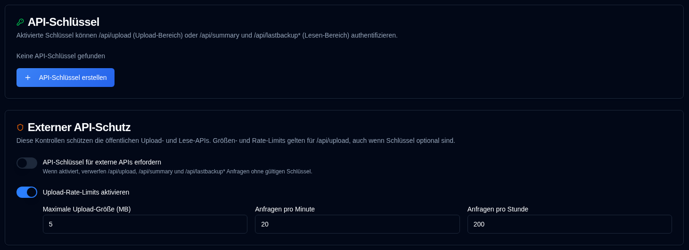

# API-Schlüssel {/* #api-keys */}

Administratoren können bereichsspezifische API-Schlüssel für die externen HTTP-APIs erstellen, die Duplicati und Homepage verwenden. Schlüssel sind standardmäßig optional, sodass bestehende Duplicati-Jobs weiter funktionieren.



## Bereiche {/* #scopes */}

| Bereich | Endpunkte |
|--------|-----------|
| Upload | `POST /api/upload` |
| Lesen | `GET /api/summary`, `GET /api/lastbackup/:id`, `GET /api/lastbackups/:id` |

Ein Upload-Schlüssel kann die Lese-APIs nicht aufrufen, und ein Lese-Schlüssel kann keine Berichte hochladen.

## Schlüssel erstellen {/* #creating-a-key */}

1. Öffnen Sie **Einstellungen → API-Schlüssel**.
2. Klicken Sie auf **API-Schlüssel erstellen** am unteren Rand der API-Schlüssel-Karte.
3. Geben Sie einen Namen ein, wählen Sie einen Bereich aus und optional ein Ablaufdatum (`YYYY-MM-DD`).
4. Generieren Sie den Schlüssel und kopieren Sie das Geheimnis sofort. Es wird nur einmal im Dialog angezeigt.
5. Die Liste zeigt danach einen Fingerabdruck wie `Qk7v…3xTa` (ersten und letzten vier Zeichen), das Ablaufdatum und den Status an. Der gleiche Fingerabdruck erscheint im Audit-Protokoll.

### Deaktivieren oder löschen {/* #disable-or-delete */}

Verwenden Sie das Kontrollkästchen in der **Aktionen**-Spalte, um einen Schlüssel zu deaktivieren, ohne ihn zu löschen. Deaktivierte Schlüssel können sich nicht authentifizieren. Aktivieren Sie das Kontrollkästchen erneut, um den Schlüssel wieder zu aktivieren. Abgelaufene Schlüssel können nicht aktiviert werden; erstellen Sie stattdessen einen neuen Schlüssel. Löschen entfernt den Schlüssel dauerhaft.

### Ablauf {/* #expiry */}

Ein optionales Ablaufdatum ist der letzte Kalendertag, an dem der Schlüssel noch gültig ist. Er läuft am **23:59:59 an diesem Tag in der lokalen Zeitzone des Browsers** ab, nicht um Mitternacht am Anfang des Tages.

Die Auswahl von `2026-12-01` erstellt `2026-12-01T23:59:59` lokal, speichert dann diesen Zeitpunkt als UTC. Für einen Browser in UTC+1 ist dies `2026-12-01T22:59:59.000Z`. Der Schlüssel bleibt bis zum 1. Dezember gültig und wird ab 23:59:59 Uhr lokal als abgelaufen behandelt (`expires_at <= now`). Die API-Schlüssel-Tabelle zeigt das Ablaufdatum an (oder **Niemals**, wenn keines gesetzt wurde). Nach diesem Zeitpunkt ändert sich das Status-Badge zu **Abgelaufen** (grau); abgelaufene Schlüssel können sich nicht authentifizieren, auch wenn sie aktiviert blieben.

## Schlüssel verwenden {/* #using-a-key */}

Duplicati kann keine benutzerdefinierten Header festlegen. Fügen Sie den Schlüssel in die Berichts-URL ein:

```bash
--send-http-json-urls=https://your-host/api/upload?api_key=YOUR_KEY
```

Homepage-Widgets können denselben Abfrageparameter verwenden:

```yaml
url: http://your-host/api/summary?api_key=YOUR_READ_KEY
```

Clients, die Header senden können, können stattdessen `X-Api-Key` oder `Authorization: Bearer` verwenden. Abfrageparameter-Schlüssel erscheinen in den Zugriffsprotokollen des Reverse-Proxys.

## Schlüssel erfordern {/* #require-keys */}

Der Schalter **API-Schlüssel für externe APIs erfordern** ist standardmäßig aus. Solange er aus ist, sind Anfragen ohne Schlüssel erlaubt. Wenn ein Client trotzdem einen Schlüssel sendet, wird ein gültiger Schlüssel mit passendem Bereich akzeptiert und aufgezeichnet; ein ungültiger, deaktivierter, abgelaufener oder falsch bereicherter Schlüssel wird ignoriert und die Anfrage ist trotzdem erlaubt. Wenn Sie den Schalter anschalten, geben die vier externen Daten-APIs `401` ohne gültigen Schlüssel zurück (und lehnen schlechte Schlüssel ab). Aktivieren Sie mindestens einen Upload-Schlüssel und einen Lese-Schlüssel, oder Duplicati-Uploads und Homepage-Widgets werden aufhören. Änderungen werden automatisch gespeichert.

## Externer API-Schutz {/* #external-api-protection */}

Die gleiche Seite kann API-Schlüssel für die öffentlichen Hochladen- und Lesen-APIs erfordern und konfiguriert eine maximale Körpergröße (Standard 5 MB) und pro-IP-Ratenlimits für `/api/upload`. Größe und Ratenlimits gelten auch dann, wenn Schlüssel optional sind und sind der Hauptschutz gegen Überschwemmungen. Schalter und Begrenzungsfelder speichern automatisch; es gibt keine separate Speichern-Schaltfläche.

Siehe auch [IP-Zulassungsliste](ip-allowlist-settings.md). IP-Zulassungsliste und API-Schlüssel sind unabhängige Funktionen; Sie können entweder eine oder beide zusammen verwenden. Beide zu aktivieren erhöht die Sicherheit, indem der Zugriff basierend auf der IP-Adresse eingeschränkt wird und ein API-Schlüssel erforderlich ist.
