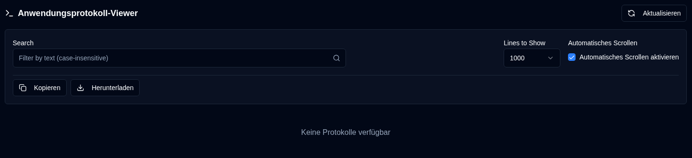

# Anwendungsprotokolle {#application-logs}

Der Anwendungsprotokoll-Viewer ermöglicht Administratoren, alle Anwendungsprotokolle an einem Ort zu überwachen, mit Filterung, Exportieren und Echtzeit-Updates direkt über die Weboberfläche.

 

## Verfügbare Aktionen {#available-actions}

| Button                                                              | Beschreibung                                                                                         |
|:--------------------------------------------------------------------|:----------------------------------------------------------------------------------------------------|
| <IconButton icon="lucide:refresh-cw" label="Refresh" />            | Protokolle aus der ausgewählten Datei manuell neu laden. Zeigt einen Lade-Spinner während der Aktualisierung an und setzt die Verfolgung für die Erkennung neuer Zeilen zurück. |
| <IconButton icon="lucide:copy" label="Copy to clipboard" />         | Alle gefilterten Protokollzeilen in die Zwischenablage kopieren. Berücksichtigt den aktuellen Suchfilter. Nützlich zum schnellen Teilen oder Einfügen in andere Tools. |
| <IconButton icon="lucide:download" label="Export" />               | Protokolle als Textdatei herunterladen. Exportiert aus der aktuell ausgewählten Dateiversion und wendet den aktuellen Suchfilter an (falls vorhanden). Dateinamenformat: `duplistatus-logs-YYYY-MM-DD.txt` (Datum im ISO-Format). |
| <IconButton icon="lucide:arrow-down-from-line" />                   | Schnell zum Anfang der angezeigten Protokolle springen. Nützlich, wenn das automatische Scrollen deaktiviert ist oder beim Navigieren durch lange Protokolldateien. |
| <IconButton icon="lucide:arrow-down-to-line" />                    | Schnell zum Ende der angezeigten Protokolle springen. Nützlich, wenn das automatische Scrollen deaktiviert ist oder beim Navigieren durch lange Protokolldateien. |

 

## Steuerelemente und Filter {#controls-and-filters}

| Steuerelement | Beschreibung |
|:--------|:-----------|
| **Dateiversion** | Wählen Sie aus, welche Protokolldatei angezeigt werden soll: **Aktuell** (aktive Datei) oder rotierte Dateien (`.1`, `.2` usw., wobei höhere Nummern älter sind). |
| **Anzuzeigende Zeilen** | Zeigen Sie die letzten **100**, **500**, **1000** (Standard), **5000** oder **10000** Zeilen aus der ausgewählten Datei an. |
| **Automatisches Scrollen** | Wenn aktiviert (Standard für aktuelle Datei), wird automatisch zu neuen Protokolleinträgen gescrollt und alle 2 Sekunden aktualisiert. Funktioniert nur für die **Aktuelle** Dateiversion. |
| **Suchen** | Filtern Sie Protokollzeilen nach Text (Groß-/Kleinschreibung wird nicht beachtet). Filter gelten für die derzeit angezeigten Zeilen. |

 

Die Kopfzeile der Protokollanzeige zeigt die gefilterte Zeilenanzahl, die Gesamtzeilenanzahl, die Dateigröße und den Zeitstempel der letzten Änderung an.

 
