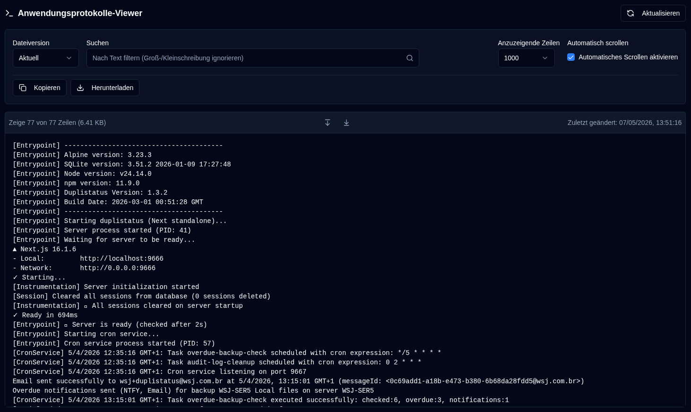

# Anwendungsprotokolle {#application-logs}

Der Anwendungsprotokoll-Viewer ermöglicht Administratoren, alle Anwendungsprotokolle an einem Ort zu überwachen, mit Filterung, Exportieren und Echtzeit-Updates direkt über die Weboberfläche.

 

## Verfügbare Aktionen {#available-actions}

| Button                                                              | Beschreibung                                                                                         |
|:--------------------------------------------------------------------|:----------------------------------------------------------------------------------------------------|
| <IconButton icon="lucide:refresh-cw" label="Aktualisieren" />            | Lädt Protokolle aus der ausgewählten Datei manuell neu. Zeigt während des Aktualisierens einen Ladeindikator an und setzt die Verfolgung neuer Zeilen zurück. |
| <IconButton icon="lucide:copy" label="In Zwischenablage kopieren" />         | Kopiert alle gefilterten Protokollzeilen in die Zwischenablage. Berücksichtigt den aktuellen Suchfilter. Nützlich zum schnellen Teilen oder Einfügen in andere Tools. |
| <IconButton icon="lucide:download" label="Exportieren" />               | Lädt Protokolle als Textdatei herunter. Exportiert aus der aktuell ausgewählten Dateiversion und wendet den aktuellen Suchfilter (falls vorhanden) an. Dateinamenformat: `duplistatus-logs-YYYY-MM-DD.txt` (Datum im ISO-Format). |
| <IconButton icon="lucide:arrow-down-from-line" />                   | Springt schnell zum Anfang der angezeigten Protokolle. Nützlich, wenn das automatische Scrollen deaktiviert ist oder bei der Navigation durch lange Protokolldateien. |
| <IconButton icon="lucide:arrow-down-to-line" />                    | Springt schnell zum Ende der angezeigten Protokolle. Nützlich, wenn das automatische Scrollen deaktiviert ist oder bei der Navigation durch lange Protokolldateien. |

 

## Steuerelemente und Filter {#controls-and-filters}

| Steuerelement | Beschreibung |
|:--------|:-----------|
| **Dateiversion** | Wählen Sie, welche Protokolldatei angezeigt werden soll: **Aktuell** (aktive Datei) oder rotierte Dateien (`.1`, `.2`, usw., wobei höhere Zahlen älter sind). |
| **Anzuzeigende Zeilen** | Zeigt die neuesten **100**, **500**, **1000** (Standard), **5000** oder **10000** Zeilen aus der ausgewählten Datei an. |
| **Automatisch scrollen** | Wenn aktiviert (Standard für aktuelle Datei), scrollt automatisch zu neuen Protokolleinträgen und aktualisiert alle 2 Sekunden. Funktioniert nur für die **Aktuell**-Dateiversion. |
| **Suchen** | Filtert Protokollzeilen nach Text (nicht beachtungssensitiv). Filter werden auf die aktuell angezeigten Zeilen angewendet. |

 

Die Kopfzeile der Protokollanzeige zeigt die gefilterte Zeilenanzahl, die Gesamtzeilenanzahl, die Dateigröße und den Zeitstempel der letzten Änderung an.

 
