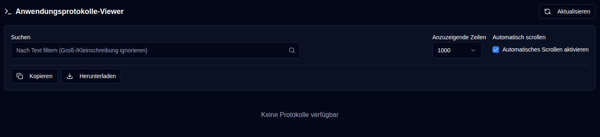

# Anwendungsprotokolle {/* #application-logs */}

Der Anwendungsprotokolle-Viewer ermöglicht es Administratoren, alle Anwendungsprotokolle an einem Ort zu überwachen, mit Filterung, Export und Echtzeitaktualisierungen direkt aus der Web-Oberfläche heraus.

 

## Verfügbare Aktionen {/* #available-actions */}

| Schaltfläche                                                       | Beschreibung                                                                                        |
|:--------------------------------------------------------------------|:----------------------------------------------------------------------------------------------------|
| <IconButton icon="lucide:refresh-cw" label="Aktualisieren" />            | Protokolle manuell aus der ausgewählten Datei neu laden. Zeigt einen Ladevorgang an und setzt die Verfolgung für neue Zeilenerkennung zurück. |
| <IconButton icon="lucide:copy" label="In Zwischenablage kopieren" />         | Alle gefilterten Protokollzeilen in Ihre Zwischenablage kopieren. Berücksichtigt den aktuellen Suchfilter. Nützlich für schnelles Teilen oder Einfügen in andere Tools. |
| <IconButton icon="lucide:download" label="Exportieren" />               | Protokolle als Textdatei herunterladen. Exportiert aus der aktuell ausgewählten Dateiversion und wendet den aktuellen Suchfilter an (falls vorhanden). Dateinamensformat: `duplistatus-logs-YYYY-MM-DD.txt` (Datum im ISO-Format). |
| <IconButton icon="lucide:arrow-down-from-line" />                   | Schnell zum Anfang der angezeigten Protokolle springen. Nützlich, wenn das automatische Scrollen deaktiviert ist oder bei der Navigation durch lange Protokolldateien. |
| <IconButton icon="lucide:arrow-down-to-line" />                    | Schnell zum Ende der angezeigten Protokolle springen. Nützlich, wenn das automatische Scrollen deaktiviert ist oder bei der Navigation durch lange Protokolldateien. |

 

## Steuerelemente und Filter {/* #controls-and-filters */}

| Steuerelement | Beschreibung |
|:--------------|:-------------|
| **Dateiversion** | Wählen Sie aus, welche Protokolldatei angezeigt werden soll: **Aktuell** (aktive Datei) oder rotierte Dateien (`.1`, `.2`, usw., wobei höhere Zahlen älter sind). |
| **Anzuzeigende Zeilen** | Die neuesten **100**, **500**, **1000** (Standard), **5000** oder **10000** Zeilen aus der ausgewählten Datei anzeigen. |
| **Automatisch scrollen** | Wenn aktiviert (Standard für aktuelle Datei), scrollt automatisch zu neuen Protokolleinträgen und aktualisiert alle 2 Sekunden. Funktioniert nur für die **Aktuelle** Dateiversion. |
| **Suchen** | Protokollzeilen nach Text filtern (Groß-/Kleinschreibung wird ignoriert). Filter gelten für die aktuell angezeigten Zeilen. |

 

Die Kopfzeile der Protokollanzeige zeigt die Anzahl der gefilterten Zeilen, Gesamtzeilen, Dateigröße und Zeitstempel der letzten Änderung an.

 
