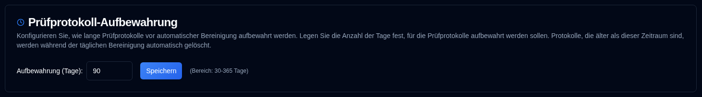

# Audit-Log-Aufbewahrung {#audit-log-retention}

Konfigurieren Sie, wie lange Audit-Protokolle vor der automatischen Bereinigung beibehalten werden.

| Einstellung | Beschreibung | Standardwert |
|:-------|:-----------|:-------------|
| **Aufbewahrung (Tage)** | Anzahl der Tage zur Aufbewahrung von Audit-Protokollen vor automatischer Löschung | **90 Tage** |

## Aufbewahrungseinstellungen {#retention-settings}

- **Zeitraum**: 30 bis 365 Tage
- **Automatische Bereinigung**: Läuft täglich um 02:00 UTC (nicht konfigurierbar)
- **Manuelle Bereinigung**: Verfügbar über die API für Administratoren (siehe [Audit-Logs bereinigen](../../api-reference/administration-apis.md#cleanup-audit-logs---apiaudit-logcleanup))
