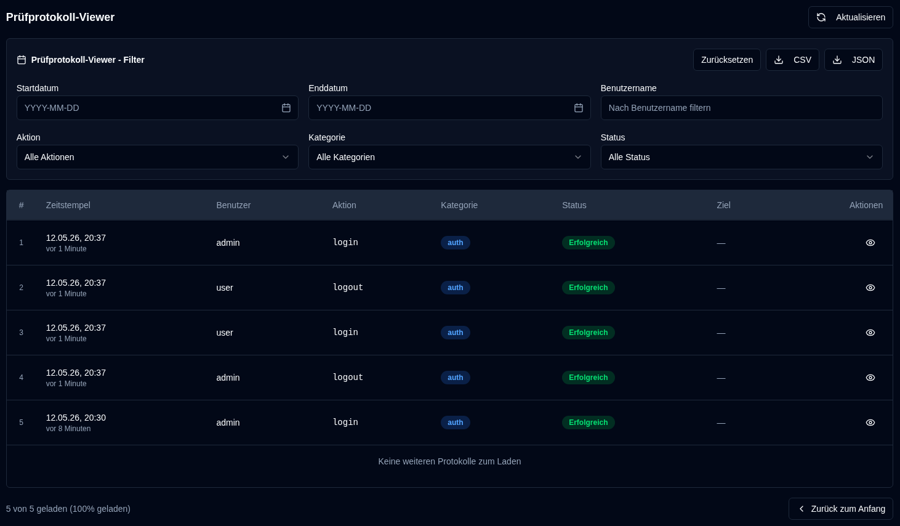

# Audit-Protokolle {#audit-logs}

Das Audit-Log bietet eine umfassende Aufzeichnung aller Systemänderungen und Benutzeraktionen in **duplistatus**. Dies hilft beim Nachverfolgen von Konfigurationsänderungen, Benutzeraktivitäten und Systemoperationen für Sicherheits- und Fehlerbehebungszwecke.

## Audit-Log-Viewer {#audit-log-viewer}

Der Audit-Log-Viewer zeigt eine chronologische Liste aller protokollierten Ereignisse mit den folgenden Informationen an:

- **Zeitstempel**: Wann das Ereignis aufgetreten ist
- **Benutzer**: Der Benutzername der Person, die die Aktion durchgeführt hat (oder "System" bei automatisierten Aktionen)
- **Aktion**: Die spezifische Aktion, die ausgeführt wurde
- **Kategorie**: Die Kategorie der Aktion (Authentifizierung, Benutzerverwaltung, Konfiguration, Sicherungsvorgänge, Serververwaltung, Systemvorgänge)
- **Status**: Ob die Aktion erfolgreich war oder fehlgeschlagen ist
- **Ziel**: Das betroffene Objekt (falls zutreffend)
- **Details**: Zusätzliche Informationen zur Aktion

### Anzeigen von Protokolldetails {#viewing-log-details}

Klicken Sie auf das <IconButton icon="lucide:eye" />-Augensymbol neben einem Protokolleintrag, um detaillierte Informationen anzuzeigen, einschließlich:
- Vollständiger Zeitstempel
- Benutzerinformationen
- Komplette Aktionsdetails (z. B.: geänderte Felder, Statistiken usw.)
- IP-Adresse und User-Agent
- Fehlermeldungen (falls die Aktion fehlgeschlagen ist)

### Exportieren von Audit-Protokollen {#exporting-audit-logs}

Sie können gefilterte Audit-Protokolle in zwei Formaten exportieren:

| Button | Beschreibung |
|:------|:-----------|
| <IconButton icon="lucide:download" label="CSV"/> | Protokolle als CSV-Datei für die Analyse in Tabellenkalkulationen exportieren |
| <IconButton icon="lucide:download" label="JSON"/> | Protokolle als JSON-Datei für die programmatische Analyse exportieren |

:::note
Exporte enthalten nur die Protokolle, die basierend auf Ihren aktiven Filtern derzeit sichtbar sind. Um alle Protokolle zu exportieren, löschen Sie zunächst alle Filter.
:::
