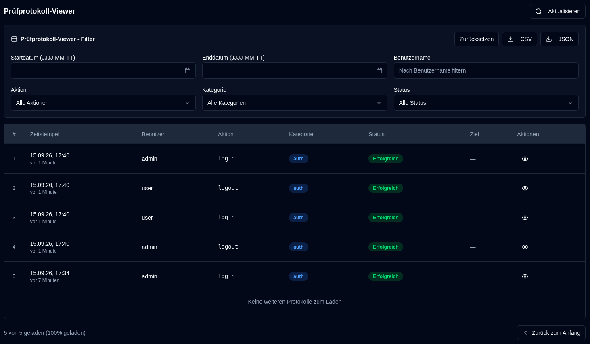

# Audit-Protokolle {/* #audit-logs */}

Das Audit-Protokoll bietet eine umfassende Aufzeichnung aller Systemänderungen und Benutzeraktionen in **duplistatus**. Dies hilft, Konfigurationsänderungen, Benutzeraktivitäten und Systemoperationen für Sicherheits- und Fehlerbehebungszwecke zu verfolgen.

## Prüfprotokoll-Viewer {/* #audit-log-viewer */}

Der Prüfprotokoll-Viewer zeigt eine chronologische Liste aller protokollierten Ereignisse mit den folgenden Informationen an:

- **Zeitstempel**: Wann das Ereignis aufgetreten ist
- **Benutzer**: Der Benutzername, der die Aktion ausgeführt hat (oder "System" für automatisierte Aktionen)
- **Aktion**: Die spezifische Aktion, die ausgeführt wurde
- **Kategorie**: Die Kategorie der Aktion (Authentifizierung, Benutzerverwaltung, Konfiguration, Sicherungsoperationen, Serververwaltung, Systemoperationen)
- **Status**: Ob die Aktion erfolgreich war oder fehlgeschlagen ist
- **Ziel**: Das betroffene Objekt (falls zutreffend)
- **Details**: Zusätzliche Informationen zur Aktion

### Anzeigen von Protokolldetails {/* #viewing-log-details */}

Klicken Sie auf das <IconButton icon="lucide:eye" /> Auge-Symbol neben einem beliebigen Protokolleintrag, um detaillierte Informationen anzuzeigen, einschließlich:
- Vollständiger Zeitstempel
- Benutzerinformationen
- Vollständige Aktionsdetails (z. B. geänderte Felder, Statistiken, etc.)
- IP-Adresse und Benutzer-Agent
- Fehlermeldungen (falls die Aktion fehlgeschlagen ist)

### Exportieren von Audit-Protokollen {/* #exporting-audit-logs */}

Sie können gefilterte Audit-Protokolle in zwei Formaten exportieren:

| Schaltfläche | Beschreibung |
|:------|:-----------|
| <IconButton icon="lucide:download" label="CSV"/> | Exportieren Sie Protokolle als CSV-Datei für die Analyse in Tabellenkalkulationen |
| <IconButton icon="lucide:download" label="JSON"/> | Exportieren Sie Protokolle als JSON-Datei für die programmatische Analyse |

:::note
Exporte umfassen nur die Protokolle, die derzeit basierend auf Ihren aktiven Filtern sichtbar sind. Um alle Protokolle zu exportieren, löschen Sie zuerst alle Filter.
:::
