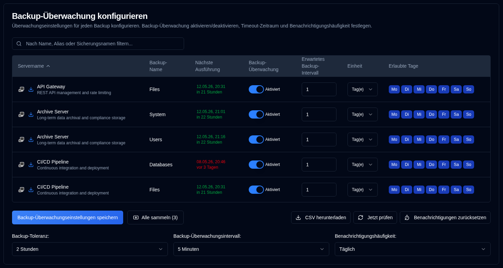

# Sicherungsüberwachung {#backup-monitoring}

## Konfigurieren Sie die Überwachungseinstellungen pro Sicherung {#configure-per-backup-monitoring-settings}

-  **Servername**: Der Name des Servers, der auf überfällige Sicherungen überwacht werden soll. 
   - Klicken Sie auf <SvgIcon svgFilename="duplicati_logo.svg" height="18"/> um die Weboberfläche des Duplicati-Servers zu öffnen
   - Klicken Sie auf <IIcon2 icon="lucide:download" height="18"/> um Backup-Protokolle von diesem Server zu sammeln.
- **Sicherungsname**: Der Name der Sicherung, die auf überfällige Sicherungen überwacht werden soll.
- **Nächster Lauf**: Die nächste geplante Sicherungszeit wird in Grün angezeigt, wenn sie in der Zukunft geplant ist, oder in Rot, wenn sie überfällig ist. Wenn Sie den Mauszeiger über den Wert „Nächster Lauf" bewegen, wird ein Tooltip angezeigt, das den letzten Sicherungs-Zeitstempel aus der Datenbank mit vollständigem Datum/Uhrzeit und relativer Zeit anzeigt.
- **Sicherungsüberwachung**: Aktivieren oder deaktivieren Sie die Sicherungsüberwachung für diese Sicherung.
- **Erwartetes Sicherungsintervall**: Das erwartete Sicherungsintervall.
- **Einheit**: Die Einheit des erwarteten Intervalls.
- **Erlaubte Tage**: Die erlaubten Wochentage für die Sicherung.

Wenn die Symbole neben dem Servernamen ausgegraut sind, ist der Server nicht in den [Einstellungen → Servereinstellungen](/user-guide/settings/server-settings) konfiguriert.

:::note
Wenn Sie Backup-Protokolle von einem Duplicati-Server sammeln, aktualisiert **duplistatus** automatisch die Sicherungsüberwachungsintervalle und Konfigurationen.
:::

:::tip
Um optimale Ergebnisse zu erzielen, sammeln Sie Backup-Protokolle, nachdem Sie die Konfiguration der Sicherungsauftragsintervalle auf Ihrem Duplicati-Server geändert haben. Dies stellt sicher, dass **duplistatus** mit Ihrer aktuellen Konfiguration synchronisiert bleibt.
:::

## Globale Konfigurationen {#global-configurations}

Diese Einstellungen gelten für alle Sicherungen:

| Setting                         | Description                                                                                                                                                                                                                                                                                                                             |
|:--------------------------------|:----------------------------------------------------------------------------------------------------------------------------------------------------------------------------------------------------------------------------------------------------------------------------------------------------------------------------------------|
| **Backup Tolerance**            | Die Nachfrist (zusätzliche Zeit), die zur erwarteten Sicherungszeit hinzugefügt wird, bevor eine Sicherung als überfällig markiert wird. Der Standardwert ist **1 Stunde**.                                                                                                                                                             |
| **Backup Monitoring Interval** | Wie oft das System auf überfällige Sicherungen überprüft wird. Der Standardwert ist **5 Minuten**.                                                                                                                                                                                                                                          |
| **Notification Frequency**      | Wie oft überfällige Benachrichtigungen gesendet werden sollen:   **Einmalig`: Send **just one** notification when the backup becomes overdue.   `Täglich`: Send **daily** notifications while overdue (default).   `Wöchentlich`: Send **weekly** notifications while overdue.   `Monatlich**: Sendet **monatlich** Benachrichtigungen, solange die Sicherung überfällig ist. |

## Verfügbare Aktionen {#available-actions}

| Schaltfläche                                                              | Beschreibung                                                                                                                           |
|:--------------------------------------------------------------------|:--------------------------------------------------------------------------------------------------------------------------------------|
| <IconButton label="Sicherungsüberwachungseinstellungen speichern" />              | Speichert die Einstellungen, löscht Timer für alle deaktivierten Sicherungen und führt eine Überprüfung auf überfällige Sicherungen durch.                                                |
| <IconButton icon="lucide:import" label="Alle sammeln (#)"/>          | Sammeln Sie Backup-Protokolle von allen konfigurierten Servern, in Klammern die Anzahl der Server, von denen gesammelt werden soll.                                   |
| <IconButton icon="lucide:download" label="CSV herunterladen"/>           | Lädt eine CSV-Datei herunter, die alle Sicherungsüberwachungseinstellungen und den „Letzten Sicherungs-Zeitstempel (DB)" aus der Datenbank enthält.               |
| <IconButton icon="lucide:refresh-cw" label="Jetzt prüfen"/>            | Führt die Überprüfung auf überfällige Sicherungen sofort aus. Dies ist nützlich nach Konfigurationsänderungen. Es löst auch eine Neuberechnung von „Nächster Lauf" aus. |
| <IconButton icon="lucide:timer-reset" label="Benachrichtigungen zurücksetzen"/> | Setzt die zuletzt gesendete Benachrichtigung über überfällige Sicherungen für alle Sicherungen zurück.                                                                            |
