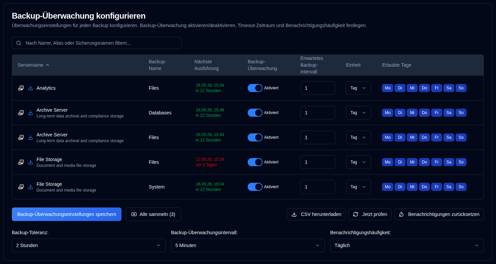

# Backup-Überwachung {/* #backup-monitoring */}

## Server-Filterung {/* #server-filtering */}

Die Serverliste auf dieser Seite kann mit dem Filterfeld gefiltert werden.

Wenn **Tägliche Zusammenfassung** aktiviert ist, wird die Überfälligkeitserkennung fortgesetzt, aber die Überfällige E-Mail an den Standard-E-Mail-Empfänger wird unterdrückt. Zusätzliche E-Mail-Ziele bleiben für übereinstimmende Ereignisse aktiv (Überfällig wird als Warnung gezählt). Siehe [Tägliche Zusammenfassung](daily-summary-settings.md).

**Filter-Ergebnisse:**
- Server-ID
- Server-URL
- Backup-Job-Namen

Dies erleichtert das schnelle Auffinden bestimmter Server oder Backups in den Überwachungseinstellungen bei der Verwaltung vieler Systeme.

## Per-Backup-Überwachungseinstellungen konfigurieren {/* #configure-per-backup-monitoring-settings */}

- **Servername**: Der Name des Servers, der auf überfällige Backups überwacht werden soll. 
   - Klicken Sie auf <SvgIcon svgFilename="duplicati_logo.svg" height="18"/>, um die Weboberfläche des Duplicati-Servers zu öffnen
   - Klicken Sie auf <IIcon2 icon="lucide:download" height="18"/>, um Backup-Protokolle von diesem Server zu sammeln.
- **Backup-Name**: Der Name des Backups, das auf überfällige Backups überwacht werden soll.
- **Nächste Ausführung**: Die nächste geplante Backup-Zeit wird grün angezeigt, wenn sie in der Zukunft liegt, oder rot, wenn sie überfällig ist. Bei der Überlagerung des "Nächste Ausführung"-Werts wird ein Tooltip angezeigt, der den letzten Backup-Zeitstempel aus der Datenbank zeigt, formatiert mit vollständigem Datum/Uhrzeit und relativer Zeit.
- **Backup-Überwachung**: Aktivieren oder deaktivieren Sie die Backup-Überwachung für dieses Backup.
- **Erwartetes Backup-Intervall**: Das erwartete Backup-Intervall.
- **Einheit**: Die Einheit des erwarteten Intervalls.
- **Erlaubte Tage**: Die erlaubten Wochentage für das Backup.

Wenn die Symbole neben dem Servernamen grau sind, ist der Server nicht in den [Einstellungen → Server-Einstellungen](/user-guide/settings/server-settings) konfiguriert.

:::note
Wenn Sie Backup-Protokolle von einem Duplicati-Server sammeln, aktualisiert **duplistatus** automatisch die Backup-Überwachungsintervalle und -konfigurationen.
:::

:::tip
Für beste Ergebnisse sammeln Sie Backup-Protokolle nach der Änderung der Backup-Job-Intervallkonfiguration in Ihrem Duplicati-Server. Dies stellt sicher, dass **duplistatus** mit Ihrer aktuellen Konfiguration synchron bleibt.
:::

## Globale Konfigurationen {/* #global-configurations */}

Diese Einstellungen gelten für alle Backups:

| Einstellung                     | Beschreibung                                                                                                                                                                                                                                                                                                                             |
|:--------------------------------|:----------------------------------------------------------------------------------------------------------------------------------------------------------------------------------------------------------------------------------------------------------------------------------------------------------------------------------------|
| **Backup-Toleranz**            | Die Nachfrist (zusätzliche Zeit, die erlaubt ist) wird zum erwarteten Backup-Zeitpunkt hinzugefügt, bevor als überfällig markiert wird. Der Standardwert ist **1 Stunde**.                                                                                                                                                                                                             |
| **Backup-Überwachungsintervall** | Wie oft das System nach überfälligen Backups prüft. Der Standardwert ist **5 Minuten**.                                                                                                                                                                                                                                                            |
| **Benachrichtigungsfrequenz**      | Wie oft Überfälligkeitsbenachrichtigungen gesendet werden:   **Einmalig`: Send **just one** notification when the backup becomes overdue.   `Täglich`: Send **daily** notifications while overdue (default).   `Wöchentlich`: Send **weekly** notifications while overdue.   `Monatlich**: Senden Sie **monatliche** Benachrichtigungen, während sie überfällig sind. |

## Verfügbare Aktionen {/* #available-actions */}

| Schaltfläche                                                              | Beschreibung                                                                                                                           |
|:--------------------------------------------------------------------|:--------------------------------------------------------------------------------------------------------------------------------------|
| <IconButton label="Backup-Überwachungseinstellungen speichern" />              | Speichert die Einstellungen, löscht Timer für alle deaktivierten Sicherungen und führt eine Überprüfung der überfälligen Sicherungen durch.                                                |
| <IconButton icon="lucide:import" label="Alle sammeln (#)"/>          | Sammelt Sicherungsprotokolle von allen konfigurierten Servern, in Klammern die Anzahl der zu sammelnden Server.                                   |
| <IconButton icon="lucide:download" label="CSV herunterladen"/>           | Lädt eine CSV-Datei herunter, die alle Backup-Überwachungseinstellungen und den "Zeitstempel der letzten Sicherung (DB)" aus der Datenbank enthält.               |
| <IconButton icon="lucide:refresh-cw" label="Jetzt prüfen"/>            | Führt die Überprüfung der überfälligen Sicherungen sofort aus. Dies ist nützlich nach Änderungen der Konfigurationen. Es löst auch eine Neuberechnung der "Nächsten Ausführung" aus. |
| <IconButton icon="lucide:timer-reset" label="Benachrichtigungen zurücksetzen"/> | Setzt die letzte gesendete Benachrichtigung über überfällige Sicherungen für alle Sicherungen zurück.                                                                            |
