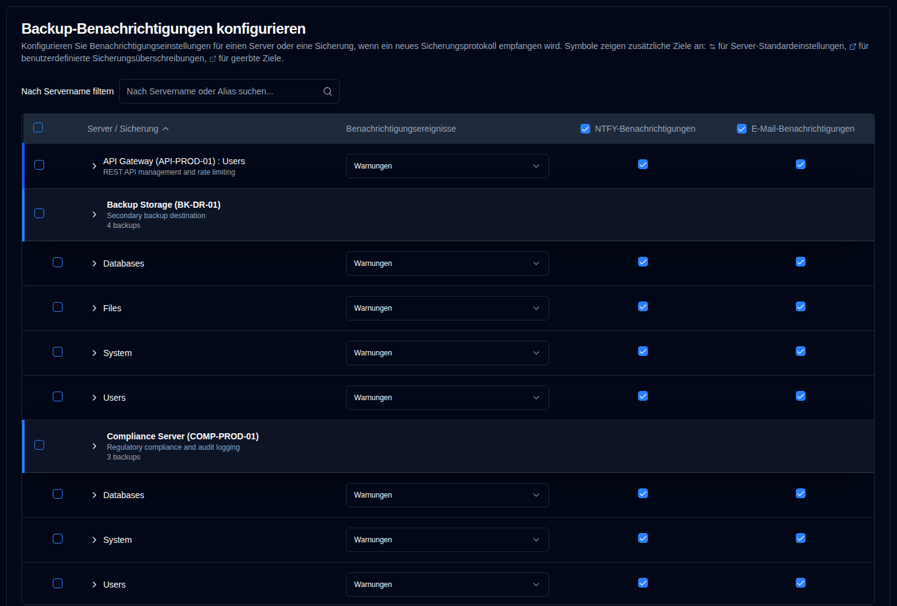
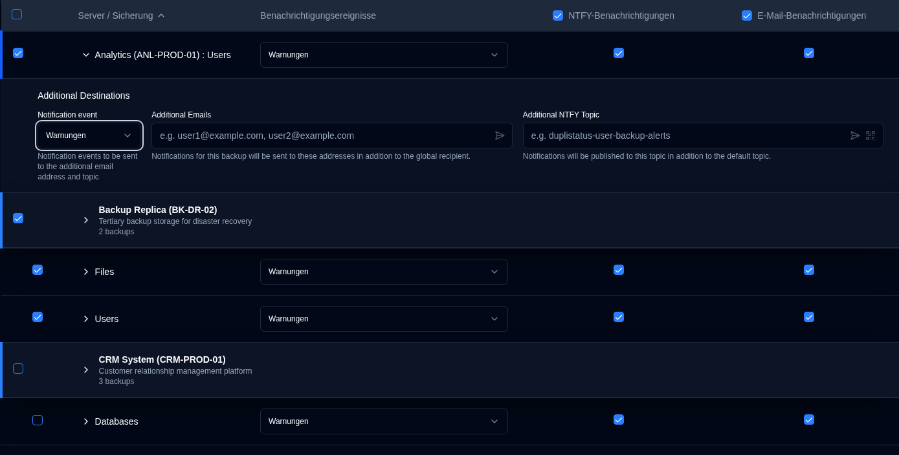

# Backup-Benachrichtigungen {#backup-notifications}

Verwenden Sie diese Einstellungen, um Benachrichtigungen zu senden, wenn ein [neues Sicherungsprotokoll empfangen wird](../../installation/duplicati-server-configuration.md).

Die Tabelle der Backup-Benachrichtigungen ist nach Server organisiert. Das Anzeigeformat hängt davon ab, wie viele Sicherungen ein Server hat:
- **Mehrere Sicherungen**: Zeigt eine Server-Header-Zeile mit einzelnen Sicherungszeilen darunter an. Klicken Sie auf die Server-Header-Zeile, um die Sicherungsliste zu erweitern oder zu reduzieren.
- **Eine Sicherung**: Zeigt eine **zusammengeführte Zeile** mit blauem linkem Rand an, die folgende Informationen anzeigt:
  -  **Servername : Sicherungsname**, wenn kein Server-Alias konfiguriert ist, oder
  - **Server-Alias (Servername) : Sicherungsname**, wenn dieser konfiguriert ist.

Diese Seite verfügt über eine automatische Speicherungsfunktion. Alle Änderungen, die Sie vornehmen, werden automatisch gespeichert.

 

## Filtern und Suchen {#filter-and-search}

Verwenden Sie das Feld **Nach Servername filtern** oben auf der Seite, um schnell bestimmte Sicherungen nach Servername oder Alias zu finden. Die Tabelle wird automatisch gefiltert, um nur übereinstimmende Einträge anzuzeigen.

 

## Konfigurieren Sie Benachrichtigungseinstellungen pro Sicherung {#configure-per-backup-notification-settings}

| Einstellung                   | Beschreibung                                                    | Standardwert |
| :---------------------------- | :-------------------------------------------------------------- | :----------- |
| **Benachrichtigungsereignisse** | Konfigurieren Sie, wann Benachrichtigungen für neue Sicherungsprotokolle gesendet werden sollen. | `Warnings`    |
| **NTFY**                      | Aktivieren oder deaktivieren Sie NTFY-Benachrichtigungen für diese Sicherung.     | `Enabled`     |
| **E-Mail**                     | Aktivieren oder deaktivieren Sie E-Mail-Benachrichtigungen für diese Sicherung.    | `Enabled`    |

**Optionen für Benachrichtigungsereignisse:**

- `all`: Benachrichtigungen für alle Sicherungsereignisse senden.
- `warnings`: Benachrichtigungen nur für Warnungen und Fehler senden (Standard).
- `errors`: Benachrichtigungen nur für Fehler senden.
- `off`: Benachrichtigungen für neue Sicherungsprotokolle für diese Sicherung deaktivieren.

 

## Zusätzliche Ziele {#additional-destinations}

Zusätzliche Benachrichtigungsziele ermöglichen es Ihnen, Benachrichtigungen an bestimmte E-Mail-Adressen oder NTFY-Themen über die globalen Einstellungen hinaus zu versenden. Das System verwendet ein hierarchisches Vererbungsmodell, bei dem Sicherungen Standard-Einstellungen von ihrem Server erben können oder diese mit sicherungsspezifischen Werten überschreiben können.

Zusätzliche Zielkonfiguration wird durch kontextabhängige Symbole neben Server- und Sicherungsnamen angezeigt:

- **Server-Symbol** <IconButton icon="lucide:settings-2" style={{border: 'none', padding: 0, color: 'inherit', background: 'transparent'}} />: Wird neben Servernamen angezeigt, wenn Standard-Zusätzliche Ziele auf der Serverebene konfiguriert sind.

- **Sicherungssymbol** <IconButton icon="lucide:external-link" style={{border: 'none', padding: 0, color: '#60a5fa', background: 'transparent'}} /> (blau): Wird neben Sicherungsnamen angezeigt, wenn benutzerdefinierte Zusätzliche Ziele konfiguriert sind (wodurch Server-Standardeinstellungen überschrieben werden).

- **Sicherungssymbol** <IconButton icon="lucide:external-link" style={{border: 'none', padding: 0, color: '#64748b', background: 'transparent'}} /> (grau): Wird neben Sicherungsnamen angezeigt, wenn die Sicherung zusätzliche Ziele von den Server-Standardeinstellungen erbt.

Wenn kein Symbol angezeigt wird, verfügt der Server oder die Sicherung nicht über konfigurierte zusätzliche Ziele.

### Server-Level Defaults {#server-level-defaults}

Sie können Standard-Zusätzliche Ziele auf der Server-Ebene konfigurieren, die alle Sicherungen auf diesem Server automatisch erben.

1. Navigieren Sie zu `Einstellungen → Benachrichtigungen zu Sicherungen`.
2. Die Tabelle ist nach Server gruppiert, mit unterschiedlichen Server-Header-Zeilen, die den Servernamen, den Alias und die Anzahl der Sicherungen anzeigen.
   - **Hinweis**: Bei Servern mit nur einer Sicherung wird eine zusammengefasste Zeile angezeigt, anstatt einer separaten Server-Header-Zeile. Server-Standardeinstellungen können nicht direkt aus zusammengefassten Zeilen konfiguriert werden. Wenn Sie Server-Standardeinstellungen für einen Server mit einer einzelnen Sicherung konfigurieren müssen, können Sie dies tun, indem Sie vorübergehend eine weitere Sicherung zu diesem Server hinzufügen, oder die Zusätzliche Ziele der Sicherung erben automatisch von vorhandenen Server-Standardeinstellungen.
3. Klicken Sie auf eine beliebige Stelle in einer Server-Zeile, um den Abschnitt **Standardmäßige Zusätzliche Ziele für diesen Server** zu erweitern.
4. Konfigurieren Sie die folgenden Standardeinstellungen:
   - **Benachrichtigungsereignis**: Wählen Sie, welche Ereignisse Benachrichtigungen auslösen zu den zusätzlichen Zielen (`alle`, `Warnungen`, `Fehler` oder `aus`).
   - **Zusätzliche E-Mails**: Geben Sie eine oder mehrere E-Mail-Adressen (durch Kommas getrennt) ein, die Benachrichtigungen für alle Sicherungen auf diesem Server erhalten. Klicken Sie auf die Schaltfläche <IconButton icon="lucide:send-horizontal" style={{border: 'none', padding: 0, color: 'inherit', background: 'transparent'}} />, um eine Test-E-Mail an die Adressen im Feld zu senden.
   - **Zusätzliches NTFY-Thema**: Geben Sie einen benutzerdefinierten NTFY-Themennamen ein, in dem Benachrichtigungen für alle Sicherungen auf diesem Server veröffentlicht werden. Klicken Sie auf die Schaltfläche <IconButton icon="lucide:send-horizontal" style={{border: 'none', padding: 0, color: 'inherit', background: 'transparent'}} />, um eine Test-Benachrichtigung an das Thema zu senden, oder klicken Sie auf die Schaltfläche <IconButton icon="lucide:qr-code" style={{border: 'none', padding: 0, color: 'inherit', background: 'transparent'}} />, um einen QR-Code für das Thema anzuzeigen, um Ihr Gerät zu konfigurieren, damit es Benachrichtigungen empfängt.

**Server-Standardverwaltung:**

- **Sync to All**: Löscht alle Sicherungsüberschreibungen, sodass alle Sicherungen die Serverstandards erben.
- **Clear All**: Löscht alle zusätzlichen Ziele sowohl aus den Serverstandards als auch aus allen Sicherungen, während die Vererbungsstruktur beibehalten wird.

### Pro-Sicherungs-Konfiguration {#per-backup-configuration}

Einzelne Sicherungen erben automatisch die Serverstandards, aber Sie können diese für bestimmte Sicherungsaufträge überschreiben.

1. Klicken Sie auf eine beliebige Stelle in einer Sicherungszeile, um den Abschnitt **Zusätzliche Ziele** zu erweitern.
2. Konfigurieren Sie die folgenden Einstellungen:
   - **Benachrichtigungsereignis**: Wählen Sie, welche Ereignisse Benachrichtigungen auslösen zu den zusätzlichen Zielen (`all`, `warnings`, `errors` oder `off`).
   - **Zusätzliche E-Mails**: Geben Sie eine oder mehrere E-Mail-Adressen (durch Kommas getrennt) ein, die zusätzlich zum globalen Empfänger Benachrichtigungen erhalten. Klicken Sie auf die Schaltfläche <IconButton icon="lucide:send-horizontal" style={{border: 'none', padding: 0, color: 'inherit', background: 'transparent'}} />, um eine Test-E-Mail an die Adressen im Feld zu senden.
   - **Zusätzliches NTFY-Thema**: Geben Sie einen benutzerdefinierten NTFY-Themennamen ein, in dem Benachrichtigungen zusätzlich zum Standard-Thema veröffentlicht werden. Klicken Sie auf die Schaltfläche <IconButton icon="lucide:send-horizontal" style={{border: 'none', padding: 0, color: 'inherit', background: 'transparent'}} />, um eine Test-Benachrichtigung an das Thema zu senden, oder klicken Sie auf die Schaltfläche <IconButton icon="lucide:qr-code" style={{border: 'none', padding: 0, color: 'inherit', background: 'transparent'}} />, um einen QR-Code für das Thema anzuzeigen und Ihr Gerät zu konfigurieren, um Benachrichtigungen zu empfangen.

**Vererbungsindikatoren:**

- **Link-Symbol** <IconButton icon="lucide:link" style={{border: 'none', padding: 0, color: '#3b82f6', background: 'transparent'}} /> in Blau: Zeigt an, dass der Wert von den Server-Standardeinstellungen geerbt wird. Durch Klicken auf das Feld wird eine Außerkraftsetzung zum Bearbeiten erstellt.
- **Unterbrochenes Link-Symbol** <IconButton icon="lucide:link-2-off" style={{border: 'none', padding: 0, color: '#3b82f6', background: 'transparent'}} /> in Blau: Zeigt an, dass der Wert außer Kraft gesetzt wurde. Klicken Sie auf das Symbol, um zur Vererbung zurückzukehren.

**Verhalten zusätzlicher Ziele:**

- Benachrichtigungen werden sowohl an die globalen Einstellungen als auch an die Zusätzlichen Ziele gesendet, wenn diese konfiguriert sind.
- Die Benachrichtigungsereigniseinstellung für Zusätzliche Ziele ist unabhängig von der Hauptbenachrichtigungsereigniseinstellung.
- Wenn Zusätzliche Ziele auf `off` gesetzt sind, werden keine Benachrichtigungen an diese Ziele gesendet, aber die Hauptbenachrichtigungen funktionieren weiterhin gemäß den primären Einstellungen.
- Wenn eine Sicherung von Server-Standardwerten erbt, werden alle Änderungen an den Server-Standardwerten automatisch auf diese Sicherung angewendet (sofern sie nicht überschrieben wurden).

 

## Massenbearbeitung {#bulk-edit}

Sie können Einstellungen für zusätzliche Ziele für mehrere Sicherungen gleichzeitig mithilfe der Massenbearbeitungsfunktion bearbeiten. Dies ist besonders nützlich, wenn Sie dieselben zusätzlichen Ziele auf viele Sicherungsaufträge anwenden müssen.

1. Navigieren Sie zu `Einstellungen → Sicherungsbenachrichtigungen`.
2. Verwenden Sie die Kontrollkästchen in der ersten Spalte, um die Sicherungen oder Server auszuwählen, die Sie bearbeiten möchten.
   - Verwenden Sie das Kontrollkästchen in der Kopfzeile, um alle sichtbaren Sicherungen auszuwählen oder abzuwählen.
   - Sie können den Filter verwenden, um die Liste vor der Auswahl einzugrenzen.
3. Sobald Sicherungen ausgewählt sind, wird eine Massenbearbeitungsleiste angezeigt, die die Anzahl der ausgewählten Sicherungen zeigt.
4. Klicken Sie auf `Massenbearbeitung`, um das Bearbeitungsdialogfeld zu öffnen.
5. Konfigurieren Sie die zusätzlichen Zieleinstellungen:
   - **Benachrichtigungsereignis**: Legen Sie das Benachrichtigungsereignis für alle ausgewählten Sicherungen fest.
   - **Zusätzliche E-Mails**: Geben Sie E-Mail-Adressen (durch Kommas getrennt) ein, um sie auf alle ausgewählten Sicherungen anzuwenden.
   - **Zusätzliches NTFY-Thema**: Geben Sie einen NTFY-Themanamen ein, um ihn auf alle ausgewählten Sicherungen anzuwenden.
   - Schaltflächen zum Testen sind im Massenbearbeitungsdialogfeld verfügbar, um E-Mail-Adressen und NTFY-Themen vor der Anwendung auf mehrere Sicherungen zu bestätigen.
6. Klicken Sie auf `Speichern`, um die Einstellungen auf alle ausgewählten Sicherungen anzuwenden.

**Massenlöschung:**

Um alle zusätzlichen Zieleinstellungen aus ausgewählten Sicherungen zu entfernen:

1. Auswählen Sie die Sicherungen, die Sie löschen möchten.
2. Klicken Sie auf `Bulk Clear` in der Bulk-Action-Leiste.
3. Bestätigen Sie die Aktion im Dialogfeld.

Dies entfernt alle zusätzlichen E-Mail-Adressen, NTFY-Themen und Benachrichtigungsereignisse für die ausgewählten Sicherungen. Nach dem Löschen erben die Sicherungen wieder von den Server-Standardeinstellungen (falls konfiguriert).

 
