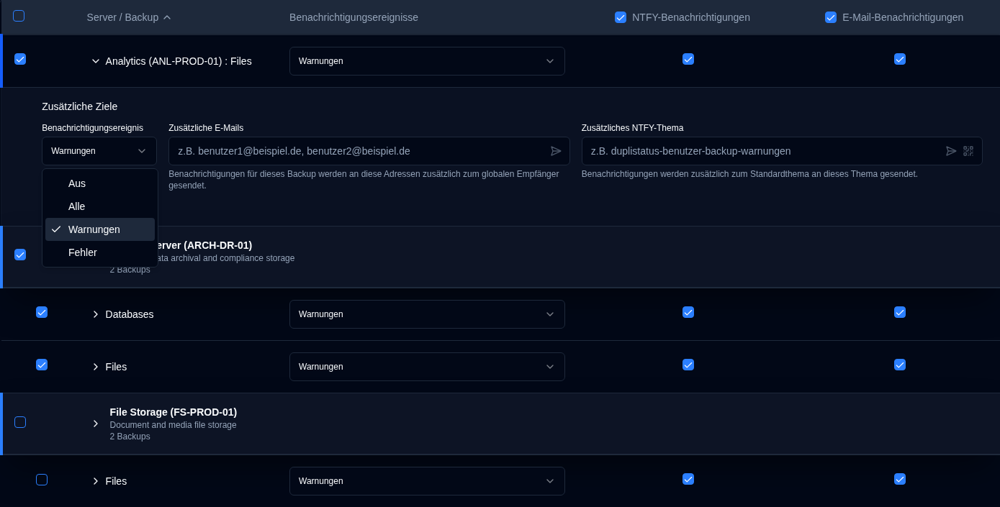

# Backup-Benachrichtigungen {/* #backup-notifications */}

Verwenden Sie diese Einstellungen, um Benachrichtigungen zu senden, wenn ein [neues Sicherungsprotokoll empfangen wird](../../installation/duplicati-server-configuration.md).

Die Tabelle für Backup-Benachrichtigungen ist nach Servern organisiert. Das Anzeigeformat hängt davon ab, wie viele Backups ein Server hat:
- **Mehrere Backups**: Zeigt eine Serverkopfzeile mit einzelnen Backup-Zeilen darunter. Klicken Sie auf die Serverkopfzeile, um die Backup-Liste zu erweitern oder zu reduzieren.
- **Einzelnes Backup**: Zeigt eine **zusammengeführte Zeile** mit blauer linker Randfarbe an, die Folgendes anzeigt:
  -  **Servername : Backup-Name**, wenn kein Server-Alias konfiguriert ist,  oder
  - **Server-Alias (Servername) : Backup-Name**, wenn dieser konfiguriert ist.

Diese Seite verfügt über eine automatische Speicherfunktion. Alle von Ihnen vorgenommenen Änderungen werden automatisch gespeichert.

Wenn **Tägliche Zusammenfassung** aktiviert ist, werden E-Mails an den Standard-Empfänger unterdrückt. Zusätzliche E-Mail-Zieladressen auf dieser Seite erhalten weiterhin passende Ereignisse. Die Einstellungen auf dieser Seite werden beibehalten und werden wieder aktiv, wenn die tägliche Zusammenfassung ausgeschaltet wird. Siehe [Tägliche Zusammenfassung](daily-summary-settings.md).

 

## Filter {/* #filter */}

Verwenden Sie das Feld **Nach Servernamen filtern** am oberen Rand der Seite, um bestimmte Backups schnell nach Servernamen oder Alias zu finden. Die Tabelle wird automatisch gefiltert, um nur passende Einträge anzuzeigen.

 

## Konfigurieren Sie benutzerspezifische Backup-Benachrichtigungseinstellungen {/* #configure-per-backup-notification-settings */}

| Einstellung                   | Beschreibung                                            | Standardwert    |
| :---------------------------- | :------------------------------------------------------ | :-------------- |
| **Benachrichtigungsereignisse** | Konfigurieren Sie, wann Benachrichtigungen für neue Sicherungsprotokolle gesendet werden sollen. | **Warnungen**   |
| **NTFY**                      | Aktivieren oder deaktivieren Sie NTFY-Benachrichtigungen für dieses Backup. | **Aktiviert**     |
| **E-Mail**                    | Aktivieren oder deaktivieren Sie E-Mail-Benachrichtigungen für dieses Backup. | **Aktiviert**    |

**Optionen für Benachrichtigungsereignisse:**

- **alle**: Sende Benachrichtigungen für alle Backup-Ereignisse.
- **Warnungen**: Sende Benachrichtigungen nur für Warnungen und Fehler (Standard).
- **Fehler**: Sende Benachrichtigungen nur für Fehler.
- **aus**: Deaktiviere Benachrichtigungen für neue Sicherungsprotokolle für dieses Backup.

 

## Zusätzliche Ziele {/* #additional-destinations */}

Zusätzliche Benachrichtigungsziele ermöglichen es Ihnen, Benachrichtigungen an spezifische E-Mail-Adressen oder NTFY-Themen jenseits der globalen Einstellungen zu senden. Das System verwendet ein hierarchisches Vererbungsmodell, bei dem Backups Standardeinstellungen vom Server erben können oder diese durch sicherungsspezifische Werte überschreiben können.

Die zusätzliche Zielkonfiguration wird durch kontextbezogene Symbole neben Server- und Backup-Namen angezeigt:

- **Serversymbol** <IconButton icon="lucide:settings-2" style={{border: 'none', padding: 0, color: 'inherit', background: 'transparent'}} />: Erscheint neben Servernamen, wenn zusätzliche Standardziele auf Serverebene konfiguriert sind.

- **Backupsymbol** <IconButton icon="lucide:external-link" style={{border: 'none', padding: 0, color: '#60a5fa', background: 'transparent'}} /> (blau): Erscheint neben Backup-Namen, wenn benutzerdefinierte zusätzliche Ziele konfiguriert sind (Serverstandards überschreiben).

- **Backupsymbol** <IconButton icon="lucide:external-link" style={{border: 'none', padding: 0, color: '#64748b', background: 'transparent'}} /> (grau): Erscheint neben Backup-Namen, wenn das Backup zusätzliche Ziele von den Serverstandards erbt.

Wenn kein Symbol angezeigt wird, sind für den Server oder das Backup keine zusätzlichen Ziele konfiguriert.

### Server-Standardwerte {/* #server-level-defaults */}

Sie können standardmäßige zusätzliche Ziele auf Serverebene konfigurieren, die alle Sicherungen auf diesem Server automatisch erben werden.

1. Navigieren Sie zu [Einstellungen → Backup-Benachrichtigungen](backup-notifications-settings.md).
2. Die Tabelle ist nach Servern gruppiert, mit separaten Kopfzeilen für jeden Server, die den Servernamen, Alias und die Anzahl der Sicherungen anzeigen.
   - **Hinweis**: Für Server mit nur einer Sicherung wird eine zusammengeführte Zeile anstelle einer separaten Serverkopfzeile angezeigt. Server-Standardwerte können nicht direkt aus zusammengeführten Zeilen heraus konfiguriert werden. Wenn Sie Standardwerte für einen Einzel-Sicherungs-Server konfigurieren müssen, können Sie dies tun, indem Sie vorübergehend eine weitere Sicherung zu diesem Server hinzufügen, oder die zusätzlichen Ziele der Sicherung erben automatisch von vorhandenen Server-Standards.
3. Klicken Sie irgendwo in eine Serverzeile, um den Abschnitt **Standard-zusätzliche Ziele für diesen Server** zu erweitern.
4. Konfigurieren Sie folgende Standardeinstellungen:
   - **Benachrichtigungsereignis**: Wählen Sie aus, welche Ereignisse Benachrichtigungen an die zusätzlichen Ziele auslösen (**alle**, **Warnungen**, **Fehler** oder **aus**).
   - **Zusätzliche E-Mails**: Geben Sie eine oder mehrere E-Mail-Adressen (durch Kommas getrennt) ein, die Benachrichtigungen für alle Sicherungen auf diesem Server erhalten sollen. Klicken Sie auf die <IconButton icon="lucide:send-horizontal" style={{border: 'none', padding: 0, color: 'inherit', background: 'transparent'}} /> Symbol-Schaltfläche, um eine Test-E-Mail an die Adressen im Feld zu senden.
   - **Zusätzliches NTFY-Thema**: Geben Sie einen benutzerdefinierten NTFY-Themennamen ein, an den Benachrichtigungen für alle Sicherungen auf diesem Server veröffentlicht werden. Klicken Sie auf die <IconButton icon="lucide:send-horizontal" style={{border: 'none', padding: 0, color: 'inherit', background: 'transparent'}} /> Symbol-Schaltfläche, um eine Test-Benachrichtigung an das Thema zu senden, oder klicken Sie auf die <IconButton icon="lucide:qr-code" style={{border: 'none', padding: 0, color: 'inherit', background: 'transparent'}} /> Symbol-Schaltfläche, um einen QR-Code für das Thema anzuzeigen, um Ihr Gerät zur Empfangsbenachrichtigung zu konfigurieren.

**Server-Standardverwaltung:**

- **Zu allen synchronisieren**: Löscht alle Sicherungs-Überschreibungen, sodass alle Sicherungen von den Server-Standards erben.
- **Alle löschen**: Löscht alle zusätzlichen Ziele sowohl von den Server-Standards als auch von allen Sicherungen, wobei die Vererbungsstruktur erhalten bleibt.

### Konfiguration pro Sicherung {/* #per-backup-configuration */}

Einzelne Sicherungen erben automatisch die Server-Standards, aber Sie können diese für bestimmte Sicherungsaufträge überschreiben.

1. Klicken Sie irgendwo in eine Sicherungszeile, um ihren Abschnitt **Zusätzliche Ziele** zu erweitern.
2. Konfigurieren Sie folgende Einstellungen:
   - **Benachrichtigungsereignis**: Wählen Sie aus, welche Ereignisse Benachrichtigungen an die zusätzlichen Ziele auslösen (**alle**, **Warnungen**, **Fehler** oder **aus**).
   - **Zusätzliche E-Mails**: Geben Sie eine oder mehrere E-Mail-Adressen (durch Kommas getrennt) ein, die zusätzlich zum globalen Empfänger Benachrichtigungen erhalten sollen. Klicken Sie auf die <IconButton icon="lucide:send-horizontal" style={{border: 'none', padding: 0, color: 'inherit', background: 'transparent'}} /> Symbol-Schaltfläche, um eine Test-E-Mail an die Adressen im Feld zu senden.
   - **Zusätzliches NTFY-Thema**: Geben Sie einen benutzerdefinierten NTFY-Themennamen ein, an den Benachrichtigungen zusätzlich zum Standardthema veröffentlicht werden. Klicken Sie auf die <IconButton icon="lucide:send-horizontal" style={{border: 'none', padding: 0, color: 'inherit', background: 'transparent'}} /> Symbol-Schaltfläche, um eine Test-Benachrichtigung an das Thema zu senden, oder klicken Sie auf die <IconButton icon="lucide:qr-code" style={{border: 'none', padding: 0, color: 'inherit', background: 'transparent'}} /> Symbol-Schaltfläche, um einen QR-Code für das Thema anzuzeigen, um Ihr Gerät zur Empfangsbenachrichtigung zu konfigurieren.

**Vererbungsindikatoren:**

- **Link-Symbol** <IconButton icon="lucide:link" style={{border: 'none', padding: 0, color: '#3b82f6', background: 'transparent'}} /> in blau: Zeigt an, dass der Wert vom Server-Standard geerbt wird. Durch Klicken auf das Feld wird eine Überschreibung zum Bearbeiten erstellt.
- **Unterbrochenes Link-Symbol** <IconButton icon="lucide:link-2-off" style={{border: 'none', padding: 0, color: '#3b82f6', background: 'transparent'}} /> in blau: Zeigt an, dass der Wert überschrieben wurde. Klicken Sie auf das Symbol, um zur Vererbung zurückzukehren.

**Verhalten zusätzlicher Ziele:**

- Benachrichtigungen werden sowohl an die globalen Einstellungen als auch an die zusätzlichen Ziele gesendet, wenn konfiguriert.
- Die Einstellung des Benachrichtigungsereignisses für zusätzliche Ziele ist unabhängig von der Hauptbenachrichtigungseinstellung.
- Wenn zusätzliche Ziele auf **aus** gesetzt sind, werden keine Benachrichtigungen an diese Ziele gesendet, aber die Hauptbenachrichtigungen funktionieren weiterhin gemäß den primären Einstellungen.
- **Überfällig**-Alarme zählen als **Warnung** für den zusätzlichen Benachrichtigungsereignisfilter: Sie werden gesendet, wenn das Ereignis **alle** oder **Warnungen** ist, und nicht, wenn es **Fehler** oder **aus** ist. Derselbe Filter gilt für zusätzliche NTFY-Themen.
- Wenn eine Sicherung von den Server-Standardeinstellungen erbt, werden alle Änderungen an den Server-Standardeinstellungen automatisch auf diese Sicherung angewendet (sofern sie nicht überschrieben wurde).
- Solange die [Tägliche Zusammenfassung](daily-summary-settings.md) aktiviert ist, erhalten zusätzliche E-Mail-Ziele weiterhin passende Ereignisse; nur der Standard-E-Mail-Empfänger wird unterdrückt.

 

## Sammelbearbeitung {/* #bulk-edit */}

Sie können zusätzliche Ziel-Einstellungen für mehrere Sicherungen gleichzeitig mithilfe der Sammelbearbeitungsfunktion bearbeiten. Dies ist besonders nützlich, wenn Sie dieselben zusätzlichen Ziele auf viele Sicherungsaufträge anwenden müssen.

1. Navigieren Sie zu [Einstellungen → Backup-Benachrichtigungen](backup-notifications-settings.md).
2. Verwenden Sie die Kontrollkästchen in der ersten Spalte, um die Sicherungen oder Server auszuwählen, die Sie bearbeiten möchten.
   - Verwenden Sie das Kontrollkästchen in der Kopfzeile, um alle sichtbaren Sicherungen auszuwählen oder die Auswahl aufzuheben.
   - Sie können den Filter verwenden, um die Liste vor der Auswahl einzugrenzen.
3. Sobald Sicherungen ausgewählt sind, erscheint eine Sammelaktionsleiste mit der Anzahl der ausgewählten Sicherungen.
4. Klicken Sie auf **Sammelbearbeitung**, um den Bearbeitungsdialog zu öffnen.
5. Konfigurieren Sie die zusätzlichen Ziel-Einstellungen:
   - **Benachrichtigungsereignis**: Legen Sie das Benachrichtigungsereignis für alle ausgewählten Sicherungen fest.
   - **Zusätzliche E-Mails**: Geben Sie E-Mail-Adressen (durch Kommas getrennt) ein, die auf alle ausgewählten Sicherungen angewendet werden sollen.
   - **Zusätzliches NTFY-Thema**: Geben Sie einen NTFY-Themennamen ein, der auf alle ausgewählten Sicherungen angewendet werden soll.
   - Testschaltflächen sind im Sammelbearbeitungsdialog verfügbar, um E-Mail-Adressen und NTFY-Themen zu überprüfen, bevor sie auf mehrere Sicherungen angewendet werden.
6. Klicken Sie auf **Speichern**, um die Einstellungen auf alle ausgewählten Sicherungen anzuwenden.

**Sammel-Löschen:**

So entfernen Sie alle zusätzlichen Ziel-Einstellungen von den ausgewählten Sicherungen:

1. Wählen Sie die Sicherungen aus, die Sie löschen möchten.
2. Klicken Sie in der Sammelaktionsleiste auf **Sammel-Löschen**.
3. Bestätigen Sie die Aktion im Dialogfeld.

Dadurch werden alle zusätzlichen E-Mail-Adressen, NTFY-Themen und Benachrichtigungsereignisse für die ausgewählten Sicherungen entfernt. Nach dem Löschen kehren die Sicherungen zur Vererbung von den Server-Standardeinstellungen zurück (falls solche konfiguriert sind).

 
