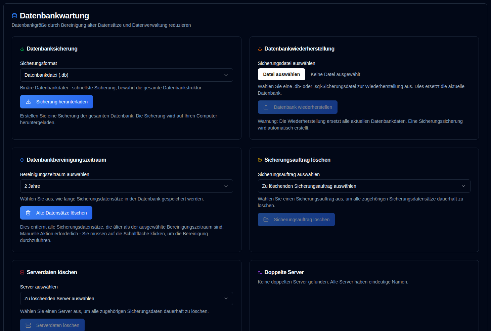

# Datenbankwartung {#database-maintenance}

Verwalten Sie Ihre Sicherungsdaten und optimieren Sie die Leistung durch Datenbankwartungsvorgänge.

 

## Datenbanksicherung {#database-backup}

Erstellen Sie eine Sicherung Ihrer gesamten Datenbank zum Schutz oder für Migrationszwecke.

1.  Navigieren Sie zu `Settings → Database Maintenance`.
2.  Wählen Sie im Bereich **Datenbanksicherung** ein Sicherungsformat aus:
    - **Datenbankdatei (.db)**: Binärformat - schnellste Sicherung, erhält alle Datenbankstrukturen exakt
    - **SQL-Dump (.sql)**: Textformat - lesbare SQL-Anweisungen, können vor der Wiederherstellung bearbeitet werden
3.  Klicken Sie auf <IconButton icon="lucide:download" label="Sicherung herunterladen" />.
4.  Die Sicherungsdatei wird mit einem Zeitstempel-Dateinamen auf Ihren Computer heruntergeladen.

**Sicherungsformate:**

- **.db format**: Empfohlen für regelmäßige Sicherungen. Erstellt eine exakte Kopie der Datenbankdatei mit SQLites Sicherungs-API und gewährleistet Konsistenz auch während die Datenbank in Verwendung ist.
- **.sql format**: Nützlich für Migration, Inspektion oder wenn Sie die Daten vor der Wiederherstellung bearbeiten müssen. Enthält alle SQL-Anweisungen, die erforderlich sind, um die Datenbank neu zu erstellen.

**Best Practices:**

- Erstellen Sie regelmäßig Sicherungen vor größeren Operationen (Bereinigung, Zusammenführung usw.)
- Speichern Sie Sicherungen an einem sicheren Ort, der von der Anwendung getrennt ist
- Testen Sie Wiederherstellungsverfahren regelmäßig, um sicherzustellen, dass Sicherungen gültig sind

 

## Datenbankwiederherstellung {#database-restore}

Stellen Sie Ihre Datenbank aus einer zuvor erstellten Sicherungsdatei wieder her.

1.  Navigieren Sie zu `Settings → Database Maintenance`.
2.  Klicken Sie im Bereich **Datenbankwiederherstellung** auf die Dateieingabe und wählen Sie eine Sicherungsdatei aus:
    - Unterstützte Formate: `.db`, `.sql`, `.sqlite`, `.sqlite3`
    - Maximum Dateigröße: 100MB
3.  Klicken Sie auf <IconButton icon="lucide:upload" label="Datenbank wiederherstellen" />.
4.  Bestätigen Sie die Aktion im Dialogfeld.

**Wiederherstellungsprozess:**

- Eine Sicherungskopie der aktuellen Datenbank wird automatisch vor der Wiederherstellung erstellt
- Die aktuelle Datenbank wird durch die Sicherungsdatei ersetzt
- Alle Sitzungen werden aus Sicherheitsgründen gelöscht (Benutzer müssen sich erneut anmelden)
- Die Datenbankintegrität wird nach der Wiederherstellung überprüft
- Alle Caches werden geleert, um sicherzustellen, dass frische Daten vorhanden sind

**Wiederherstellungsformate:**

- **.db files**: Die Datenbankdatei wird direkt ersetzt. Schnellste Wiederherstellungsmethode.
- **.sql files**: SQL-Anweisungen werden ausgeführt, um die Datenbank wiederherzustellen. Ermöglicht bei Bedarf eine selektive Wiederherstellung.

:::warning
Das Wiederherstellen einer Datenbank wird **alle aktuellen Daten ersetzen**. Diese Aktion kann nicht rückgängig gemacht werden.  
Eine Sicherungssicherung wird automatisch erstellt, aber es wird empfohlen, vor der Wiederherstellung eine eigene Sicherung zu erstellen.
 
**Wichtig:** Nach der Wiederherstellung werden alle Benutzersitzungen aus Sicherheitsgründen gelöscht. Sie müssen sich erneut anmelden.
:::

**Fehlerbehebung:**

- Falls die Wiederherstellung fehlschlägt, wird die ursprüngliche Datenbank automatisch aus der Sicherungskopie wiederhergestellt
- Stellen Sie sicher, dass die Sicherungsdatei nicht beschädigt ist und dem erwarteten Format entspricht
- Bei großen Datenbanken kann der Wiederherstellungsprozess mehrere Minuten dauern

 

---

 

:::note
Dies gilt für alle nachfolgenden Wartungsfunktionen: Alle Statistiken auf dem Dashboard, Detailseiten und Diagrammen werden anhand von Daten aus der **duplistatus**-Datenbank berechnet. Das Löschen alter Informationen wirkt sich auf diese Berechnungen aus.
 
Falls Sie versehentlich Daten löschen, können Sie diese mithilfe der Funktion [Backup-Protokolle sammeln](../collect-backup-logs.md) wiederherstellen.
:::

 

## Datenbereinigungszeitraum {#data-cleanup-period}

Entfernen Sie veraltete Sicherungsdatensätze, um Speicherplatz freizugeben und die Systemleistung zu verbessern.

1.  Navigieren Sie zu `Einstellungen → Datenbankwartung`.
2.  Wählen Sie einen Aufbewahrungszeitraum:
    - **6 Monate**: Datensätze der letzten 6 Monate beibehalten.
    - **1 Jahr**: Datensätze des letzten Jahres beibehalten.
    - **2 Jahre**: Datensätze der letzten 2 Jahre beibehalten (Standard).
    - **Alle Daten löschen**: Alle Sicherungsdatensätze und Server entfernen. 
3.  Klicken Sie auf <IconButton icon="lucide:trash-2" label="Alte Datensätze löschen" />.
4.  Bestätigen Sie die Aktion im Dialogfeld.

**Bereinigungseffekte:**

- Löscht Sicherungsdatensätze, die älter als der ausgewählte Zeitraum sind
- Aktualisiert alle zugehörigen Statistiken und Metriken

:::warning

Die Auswahl der Option „Alle Daten löschen" wird **alle Sicherungsdatensätze und Konfigurationseinstellungen dauerhaft aus dem System entfernen**.

Es wird dringend empfohlen, eine Datenbanksicherung zu erstellen, bevor Sie mit dieser Aktion fortfahren.

:::

 

## Sicherungsauftrag löschen {#delete-backup-job-data}

Entfernen Sie spezifische Sicherungsauftrag (Typ)-Daten.

1.  Navigieren Sie zu `Settings → Database Maintenance`.
2.  Wählen Sie einen Sicherungsauftrag aus der Dropdown-Liste aus.
    - Die Sicherungen werden nach Server-Alias oder Name und dann nach Sicherungsname sortiert.
3.  Klicken Sie auf <IconButton icon="lucide:folder-open" label="Sicherungsauftrag löschen" />.
4.  Bestätigen Sie die Aktion im Dialogfeld.

**Löschungseffekte:**

- Löscht alle Daten, die dieser Sicherungsaufgabe / diesem Server zugeordnet sind, dauerhaft.
- Bereinigt zugehörige Konfigurationseinstellungen.
- Aktualisiert die Dashboard-Statistiken entsprechend.

 

## Serverdaten löschen {#delete-server-data}

Entfernen Sie einen bestimmten Server und alle zugehörigen Sicherungsdaten.

1.  Navigieren Sie zu `Settings → Database Maintenance`.
2.  Wählen Sie einen Server aus der Dropdown-Liste aus.
3.  Klicken Sie auf <IconButton icon="lucide:server" label="Serverdaten löschen" />.
4.  Bestätigen Sie die Aktion im Dialogfeld.

**Löschungseffekte:**

- Löscht den ausgewählten Server und alle zugehörigen Sicherungsdatensätze dauerhaft
- Bereinigt zugehörige Konfigurationseinstellungen
- Aktualisiert die Dashboard-Statistiken entsprechend

 

## Doppelte Server zusammenführen {#merge-duplicate-servers}

Erkennen und führen Sie doppelte Server zusammen, die denselben Namen, aber unterschiedliche IDs haben. Verwenden Sie diese Funktion, um sie in einem einzelnen Servereintrag zu konsolidieren.

Dies kann auftreten, wenn sich die `machine-id` von Duplicati nach einem Upgrade oder einer Neuinstallation ändert. Doppelte Server werden nur angezeigt, wenn sie vorhanden sind. Wenn keine Duplikate erkannt werden, zeigt der Bereich eine Meldung an, die angibt, dass alle Server eindeutige Namen haben.

1.  Navigieren Sie zu `Settings → Database Maintenance`.
2.  Wenn doppelte Server erkannt werden, wird ein Abschnitt **Doppelte Server zusammenführen** angezeigt.
3.  Überprüfen Sie die Liste der doppelten Server-Gruppen:
    - Jede Gruppe zeigt Server mit demselben Namen, aber unterschiedlichen IDs
    - Der **Ziel-Server** (neuester nach Erstellungsdatum) ist hervorgehoben
    - **Alte Server-IDs**, die zusammengeführt werden, sind separat aufgelistet
4.  Wählen Sie die Server-Gruppen aus, die Sie zusammenführen möchten, indem Sie das Kontrollkästchen neben jeder Gruppe aktivieren.
5.  Klicken Sie auf <IconButton icon="lucide:git-merge" label="Ausgewählte Server zusammenführen" />.
6.  Bestätigen Sie die Aktion im Dialogfeld.

**Merge-Prozess:**

- Alle alten Server-IDs werden in den Ziel-Server zusammengeführt (neuester nach Erstellungsdatum)
- Alle Sicherungsdatensätze und Konfigurationen werden auf den Ziel-Server übertragen
- Die alten Server-Einträge werden gelöscht
- Dashboard-Statistiken werden automatisch aktualisiert

:::info[WICHTIG]
Diese Aktion kann nicht rückgängig gemacht werden. Eine Datenbanksicherung wird vor der Bestätigung empfohlen.  
:::

 
