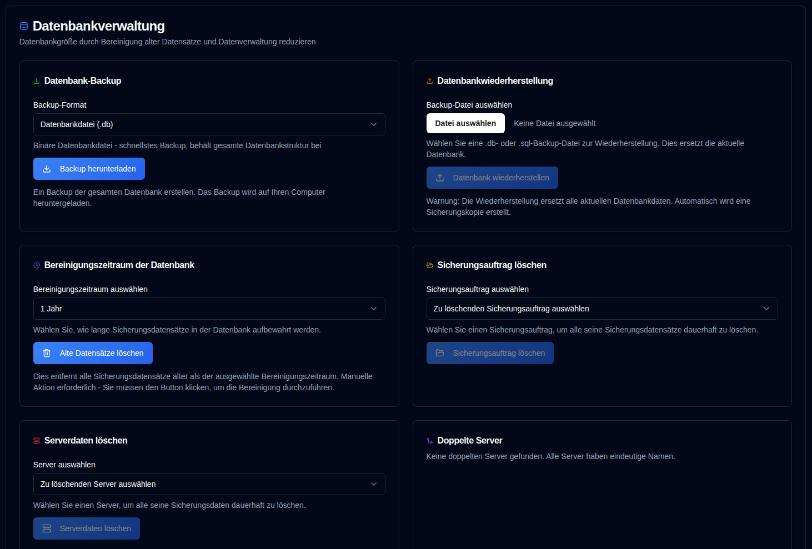

# Datenbankverwaltung {/* #database-maintenance */}

Verwalten Sie Ihre Sicherungsdaten und optimieren Sie die Leistung durch Datenbankwartungsoperationen.

 

## Datenbank-Backup {/* #database-backup */}

Erstellen Sie eine Sicherung Ihrer gesamten Datenbank für die Aufbewahrung oder zur Migration.

1.  Gehen Sie zu [Einstellungen → Datenbankverwaltung](database-maintenance.md).
2.  Wählen Sie im Abschnitt **Datenbank-Backup** ein Sicherungsformat aus:
    - **Datenbankdatei (.db)**: Binärformat - schnellste Sicherung, bewahrt die gesamte Datenbankstruktur exakt
    - **SQL-Dump (.sql)**: Textformat - menschlich lesbare SQL-Anweisungen, können vor der Wiederherstellung bearbeitet werden
3.  Klicken Sie auf <IconButton icon="lucide:download" label="Sicherung herunterladen" />.
4.  Die Sicherungsdatei wird auf Ihren Computer heruntergeladen und erhält einen Zeitstempel im Dateinamen.

**Sicherungsformate:**

- **.db-Format**: Empfohlen für regelmäßige Sicherungen. Erstellt eine exakte Kopie der Datenbankdatei mithilfe der SQLite-Sicherungs-API und stellt die Konsistenz sicher, auch wenn die Datenbank in Verwendung ist.
- **.sql-Format**: Nützlich für Migrationen, Inspektionen oder wenn Sie die Daten vor der Wiederherstellung bearbeiten müssen. Enthält alle SQL-Anweisungen zum Neuaufbau der Datenbank.

**Beste Praktiken:**

- Erstellen Sie regelmäßige Sicherungen vor größeren Operationen (Bereinigung, Zusammenführung, etc.)
- Speichern Sie Sicherungen an einem sicheren Ort, der sich von der Anwendung unterscheidet
- Testen Sie regelmäßig die Wiederherstellungsverfahren, um sicherzustellen, dass die Sicherungen gültig sind

 

## Datenbankwiederherstellung {/* #database-restore */}

Stellen Sie Ihre Datenbank aus einer zuvor erstellten Sicherungsdatei wieder her.

1.  Gehen Sie zu [Einstellungen → Datenbankverwaltung](database-maintenance.md).
2.  Wählen Sie im Abschnitt **Datenbankwiederherstellung** die Dateieingabe aus und wählen Sie eine Sicherungsdatei aus:
    - Unterstützte Formate: `.db`, `.sql`, `.sqlite`, `.sqlite3`
    - Maximale Dateigröße: 100MB
3.  Klicken Sie auf <IconButton icon="lucide:upload" label="Datenbank wiederherstellen" />.
4.  Bestätigen Sie die Aktion im Dialogfeld.

**Wiederherstellungsprozess:**

- Eine Sicherheitskopie der aktuellen Datenbank wird automatisch erstellt, bevor die Wiederherstellung beginnt
- Die aktuelle Datenbank wird durch die Sicherungsdatei ersetzt
- Alle Sitzungen werden aus Sicherheitsgründen gelöscht (Benutzer müssen sich erneut anmelden)
- Die Datenbankintegrität wird nach der Wiederherstellung überprüft
- Alle Caches werden gelöscht, um sicherzustellen, dass die Daten frisch sind

**Wiederherstellungsformate:**

- **.db-Dateien**: Die Datenbankdatei wird direkt ersetzt. Schnellste Wiederherstellungsmethode.
- **.sql-Dateien**: SQL-Anweisungen werden ausgeführt, um die Datenbank neu zu erstellen. Erlaubt eine selektive Wiederherstellung, falls erforderlich.

:::warning
Die Wiederherstellung einer Datenbank **ersetzt alle aktuellen Daten**. Diese Aktion kann nicht rückgängig gemacht werden.  
Eine Sicherheitskopie wird automatisch erstellt, es wird jedoch empfohlen, Ihre eigene Sicherung vor der Wiederherstellung zu erstellen.
 
**Wichtig:** Nach der Wiederherstellung werden alle Benutzersitzungen aus Sicherheitsgründen gelöscht. Sie müssen sich erneut anmelden.
:::

**Fehlerbehebung:**

- Wenn die Wiederherstellung fehlschlägt, wird die ursprüngliche Datenbank automatisch aus dem Sicherheits-Backup wiederhergestellt
- Stellen Sie sicher, dass die Sicherungsdatei nicht beschädigt ist und das erwartete Format entspricht
- Bei großen Datenbanken kann der Wiederherstellungsprozess mehrere Minuten dauern

 

---

 

:::note
Dies gilt für alle Wartungsfunktionen unten: alle Statistiken auf dem Dashboard, Detailseiten und Diagramme werden mit Daten aus der **duplistatus** Datenbank berechnet. Das Löschen alter Informationen wirkt sich auf diese Berechnungen aus.
 
Wenn Sie Daten versehentlich gelöscht haben, können Sie sie mit der Funktion [Backup-Protokolle sammeln](../collect-backup-logs.md) wiederherstellen.
:::

Der cron-Dienst **komprimiert** die Datenbank auch jeden Sonntag um 04:00 UTC. Dieser Durchlauf löscht Sicherungszeilen, deren Server nicht mehr existiert, Serverzeilen ohne verbleibende Sicherungsberichte, verbleibende Backup-Überwachung und überfällige Benachrichtigungseinstellungen, alte Zeilen der täglichen Zusammenfassung und führt SQLite `VACUUM` aus, um Speicherplatz wiederzugewinnen. Das Löschen eines Servers oder eines Sicherungsauftrags bereinigt die entsprechenden Einstellungen sofort.

 

## Datenbereinigung Zeitraum {/* #data-cleanup-period */}

Entfernen Sie veraltete Sicherungsdatensätze, um Speicherplatz freizugeben und die Systemleistung zu verbessern.

1.  Gehen Sie zu [Einstellungen → Datenbankverwaltung](database-maintenance.md).
2.  Wählen Sie einen Aufbewahrungszeitraum:
    - **6 Monate**: Behalten Sie Datensätze der letzten 6 Monate.
    - **1 Jahr**: Behalten Sie Datensätze des letzten Jahres.
    - **2 Jahre**: Behalten Sie Datensätze der letzten 2 Jahre (Standard).
    - **Alle Daten löschen**: Entfernen Sie alle Sicherungsdatensätze und Server. 
3.  Klicken Sie auf <IconButton icon="lucide:trash-2" label="Alte Datensätze löschen" />.
4.  Bestätigen Sie die Aktion im Dialogfeld.

**Bereinigungseffekte:**

- Löscht Sicherungsdatensätze älter als der ausgewählte Zeitraum
- Aktualisiert alle zugehörigen Statistiken und Metriken

:::warning

Die Auswahl der Option "Alle Daten löschen" entfernt **alle Sicherungsdatensätze und Konfigurationseinstellungen dauerhaft** aus dem System.

Es wird dringend empfohlen, eine Datenbanksicherung zu erstellen, bevor Sie diese Aktion ausführen.

:::

 

## Sicherungsauftragsdaten löschen {/* #delete-backup-job-data */}

Entfernen Sie die Daten eines bestimmten Sicherungsauftrags (Typ).

1.  Gehen Sie zu [Einstellungen → Datenbankverwaltung](database-maintenance.md).
2.  Wählen Sie einen Sicherungsauftrag aus der Dropdown-Liste.
    - Die Sicherungen werden nach Server-Alias oder Name und dann nach Sicherungsname geordnet.
3.  Klicken Sie auf <IconButton icon="lucide:folder-open" label="Sicherungsauftrag löschen" />.
4.  Bestätigen Sie die Aktion im Dialogfeld.

**Löschungseffekte:**

- Löscht dauerhaft alle Daten, die mit diesem Sicherungsauftrag / Server verbunden sind.
- Bereinigt zugehörige Konfigurationseinstellungen.
- Aktualisiert die Dashboard-Statistiken entsprechend.

 

## Serverdaten löschen {/* #delete-server-data */}

Entfernen Sie einen bestimmten Server und alle zugehörigen Sicherungsdaten.

1.  Gehen Sie zu [Einstellungen → Datenbankverwaltung](database-maintenance.md).
2.  Wählen Sie einen Server aus der Dropdown-Liste.
3.  Klicken Sie auf <IconButton icon="lucide:server" label="Serverdaten löschen" />.
4.  Bestätigen Sie die Aktion im Dialogfeld.

**Löschungseffekte:**

- Löscht dauerhaft den ausgewählten Server und alle seine Sicherungsdatensätze
- Bereinigt zugehörige Konfigurationseinstellungen
- Aktualisiert die Dashboard-Statistiken entsprechend

 

## Doppelte Server zusammenführen {/* #merge-duplicate-servers */}

Erkennen und Zusammenführen von doppelten Servern, die denselben Namen, aber unterschiedliche IDs haben. Verwenden Sie diese Funktion, um sie in einen einzigen Server-Eintrag zu konsolidieren.

Dies kann auftreten, wenn sich Duplicatis `machine-id` nach einem Upgrade oder einer Neuinstallation ändert. Doppelte Server werden nur angezeigt, wenn sie existieren. Wenn keine Duplikate erkannt werden, zeigt der Abschnitt eine Nachricht an, dass alle Server eindeutige Namen haben.

1.  Gehen Sie zu [Einstellungen → Datenbankverwaltung](database-maintenance.md).
2.  Wenn doppelte Server erkannt werden, erscheint ein Abschnitt **Doppelte Server zusammenführen**.
3.  Überprüfen Sie die Liste der Gruppen doppelter Server:
    - Jede Gruppe zeigt Server mit demselben Namen, aber unterschiedlichen IDs an
    - Der **Ziel-Server** (neuester nach Erstellungsdatum) ist hervorgehoben
    - Die **alten Server-IDs**, die zusammengeführt werden, werden separat aufgelistet
4.  Wählen Sie die Servergruppen aus, die Sie zusammenführen möchten, indem Sie das Kontrollkästchen neben jeder Gruppe aktivieren.
5.  Klicken Sie auf <IconButton icon="lucide:git-merge" label="Ausgewählte Server zusammenführen" />.
6.  Bestätigen Sie die Aktion im Dialogfeld.

**Zusammenführungsprozess:**

- Alle alten Server-IDs werden in den Ziel-Server (neuester nach Erstellungsdatum) zusammengeführt
- Alle Backup-Datensätze und Konfigurationen werden auf den Ziel-Server übertragen
- Doppelte `backup_id` Werte für denselben Backup-Namen werden zu einer einzigen ID konsolidiert (die neueste Backup-Zeile gewinnt)
- Die alten Server-Einträge werden gelöscht
- Die Dashboard-Statistiken werden automatisch aktualisiert

:::info[WICHTIG]
Diese Aktion kann nicht rückgängig gemacht werden. Es wird empfohlen, vor der Bestätigung ein Datenbank-Backup durchzuführen.  
:::

 
